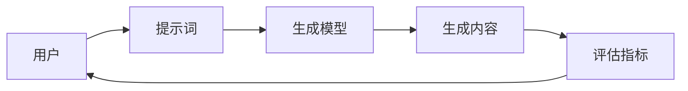
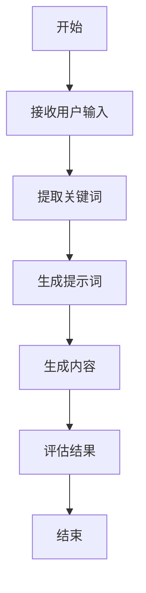
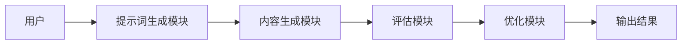

                 

<think>
嗯，用户让我写一篇关于提示词设计的博客文章，标题是《AIGC时代的提示词设计：理论、实践与创新》。用户还给了一个详细的结构大纲，包括摘要、关键词、目录，以及一些具体的要求，比如每个章节要有背景介绍、核心概念、算法原理、系统架构、项目实战等等。

首先，我需要理解用户的需求。用户可能是一位技术专家，或者是一位对AI生成内容感兴趣的人，他们希望深入理解提示词设计在AIGC中的作用。用户提供的结构很详细，说明他们需要一篇专业、有深度的文章，覆盖理论到实践的各个方面。

接下来，我应该按照用户给的大纲逐步展开。第一部分是引言，包括AIGC技术概述、提示词设计的重要性以及本书的结构安排。这部分需要简明扼要，介绍基本概念和背景，让读者了解提示词设计的重要性。

第二部分是理论部分，涉及AIGC的基础理论，比如核心技术、提示词生成算法和优化策略。这部分需要详细解释这些概念，并可能引入数学模型和公式，用Latex表示，确保准确性。

然后是核心概念与联系，这部分需要对比分析，可能用表格和ER图来展示。我需要确保这些图表清晰，帮助读者理解不同概念之间的关系。

接下来是算法原理，这部分需要用mermaid流程图展示算法步骤，并提供Python代码示例。代码部分要详细，解释每一步的作用，帮助读者理解和实现。

系统分析与架构设计部分，需要描述项目场景，设计系统功能和架构，并用mermaid图展示类图和架构图。这部分需要考虑系统的整体结构，确保各模块协同工作。

项目实战部分，需要给出环境安装步骤，实现提示词设计的核心代码，并分析实际案例。这部分要具体，让读者能够跟着操作，理解实际应用。

最后是总结与展望，回顾文章内容，指出未来的创新方向。这可以帮助读者了解当前领域的前沿和未来趋势。

在写作过程中，我需要确保语言专业但不失易懂，逻辑清晰，结构紧凑。同时，遵守格式要求，使用markdown，正确嵌入代码、图表和公式。确保每个小节内容丰富，详细讲解，满足用户对深度和广度的要求。

总的来说，这篇文章需要覆盖从理论到实践的各个方面，结构清晰，内容详实，帮助读者全面理解AIGC时代的提示词设计。我需要一步步按照用户的要求，确保每个部分都符合他们的期望，最终产出一篇高质量的技术博客文章。
</think>

# AIGC时代的提示词设计：理论、实践与创新

> 关键词：提示词设计、AIGC、生成式AI、自然语言处理、深度学习

> 摘要：本文深入探讨了AIGC（AI生成内容）时代下提示词设计的核心理论、实践方法与创新策略。从提示词设计的基本概念出发，结合数学模型、算法原理、系统架构等多维度，全面解析了提示词设计的理论基础与实际应用。同时，通过具体案例分析，展示了如何通过优化提示词设计来提升生成内容的质量与效率。本文旨在为AI开发者、研究人员及相关从业者提供一份系统性、实用性的指导手册。

---

## 第一部分: 引言

### 1.1 AIGC技术概述

#### 1.1.1 AIGC的概念
AIGC（AI Generated Content，人工智能生成内容）是指通过人工智能技术生成文字、图像、视频、音乐等形式的内容。AIGC的核心技术包括自然语言处理（NLP）、计算机视觉（CV）、生成对抗网络（GANs）和 transformers 等。

#### 1.1.2 AIGC的技术发展历程
AIGC的发展经历了从规则驱动到数据驱动，再到当前的大模型驱动阶段。从简单的模板生成到复杂的多模态生成，AIGC技术不断进化，逐步实现更高质量的内容生成。

#### 1.1.3 AIGC的应用前景
AIGC正在广泛应用于新闻生成、营销文案创作、编程辅助、艺术创作等领域。通过提示词设计优化，AIGC能够更精准地满足用户的多样化需求。

### 1.2 提示词设计的重要性

#### 1.2.1 提示词在AIGC中的角色
提示词（Prompt）是用户与生成模型之间的桥梁，通过提示词设计，可以引导生成模型输出符合预期的内容。提示词设计直接影响生成内容的质量、风格和相关性。

#### 1.2.2 提示词设计的挑战
提示词设计需要兼顾语言的表达能力、生成模型的理解能力以及用户的实际需求。如何平衡这些因素是提示词设计的核心挑战。

#### 1.2.3 提示词设计的价值
优秀的提示词设计可以显著提升生成内容的质量和效率，降低用户与生成模型之间的沟通成本，同时拓展AIGC的应用场景。

### 1.3 本书结构安排

#### 1.3.1 理论部分
从AIGC的基本原理出发，分析提示词设计的核心概念与数学模型。

#### 1.3.2 实践部分
结合实际案例，详细讲解提示词设计的实现方法与优化策略。

#### 1.3.3 创新部分
探讨提示词设计的前沿技术与未来发展方向。

---

## 第二部分: 理论

### 2.1 AIGC基础理论

#### 2.1.1 AIGC的核心技术
AIGC的核心技术包括：
- **自然语言处理（NLP）**：文本生成、语义理解等。
- **生成对抗网络（GANs）**：通过生成器和判别器的对抗训练生成高质量内容。
- **Transformers**：基于自注意力机制的生成模型，如GPT系列。

#### 2.1.2 提示词生成算法
提示词生成算法是AIGC的关键技术之一。常用的算法包括：
- 基于模板的生成算法。
- 基于上下文的生成算法。
- 基于强化学习的生成算法。

#### 2.1.3 提示词优化策略
提示词优化策略包括：
- **关键词提取**：从用户需求中提取关键信息。
- **语义分析**：理解用户意图并生成更精准的提示词。
- **反馈机制**：根据生成结果调整提示词。

### 2.2 核心概念与联系

#### 2.2.1 关键概念解读
- **提示词**：用户输入的引导生成模型的指令。
- **生成模型**：基于提示词生成内容的模型。
- **评估指标**：衡量生成内容质量的标准。

#### 2.2.2 概念属性特征对比表格
| 概念     | 属性       | 特征                          |
|----------|------------|----------------------------|
| 提示词   | 输入形式   | 文本、图像等                   |
| 生成模型 | 模型类型   | GANs、Transformers等          |
| 评估指标 | 评估标准   | BLEU、ROUGE等                |

#### 2.2.3 ER实体关系图


### 2.3 数学模型与公式

#### 2.3.1 提示词设计的数学模型
提示词设计的数学模型可以表示为：
$$ P = f_{model}(x) $$
其中，\( P \) 表示生成的提示词，\( x \) 表示输入的原始需求，\( f_{model} \) 表示提示词生成模型。

#### 2.3.2 提示词优化的数学公式
提示词优化的目标是最优化生成内容的质量，可以用以下公式表示：
$$ \text{loss} = \min_{P} L(P, y) $$
其中，\( L \) 表示损失函数，\( y \) 表示生成结果。

---

## 第三部分: 实践

### 3.1 提示词设计的算法实现

#### 3.1.1 算法流程图


#### 3.1.2 核心代码实现
```python
def generate_prompt(input_text):
    # 提取关键词
    keywords = extract_keywords(input_text)
    # 生成提示词
    prompt = construct_prompt(keywords)
    return prompt

def extract_keywords(input_text):
    # 使用NLP模型提取关键词
    model = load_model()
    keywords = model.predict(input_text)
    return keywords

def construct_prompt(keywords):
    # 根据关键词构建提示词
    prompt_template = "Generate content about {} in {} style."
    prompt = prompt_template.format(", ".join(keywords), "creative")
    return prompt
```

### 3.2 系统分析与架构设计

#### 3.2.1 系统功能设计
系统功能包括：
- 提示词生成模块。
- 内容生成模块。
- 评估与优化模块。

#### 3.2.2 系统架构图


### 3.3 项目实战

#### 3.3.1 环境安装
```bash
pip install transformers
pip install numpy
pip install matplotlib
```

#### 3.3.2 核心代码实现
```python
from transformers import pipeline

# 初始化提示词生成模型
prompt_generator = pipeline("text-generation", model="gpt2")

def generate_content(prompt):
    # 生成内容
    result = prompt_generator(prompt, max_length=500)
    return result[0]['generated_text']

# 示例
prompt = "Write a blog post about AI."
content = generate_content(prompt)
print(content)
```

#### 3.3.3 案例分析
通过具体案例分析提示词设计对生成内容质量的影响，例如：
- 输入提示词：`"Write a blog post about AI."`
- 优化后的提示词：`"Write a blog post about AI in 500 words, focusing on its impact on the future."`

---

## 第四部分: 总结与展望

### 4.1 总结
本文从理论到实践，全面探讨了AIGC时代下提示词设计的核心技术与应用方法。通过数学模型、算法实现和系统架构的分析，为提示词设计提供了系统的指导。

### 4.2 未来展望
未来，提示词设计将更加智能化和个性化，结合多模态生成技术和强化学习，进一步提升生成内容的质量与多样性。

---

作者：AI天才研究院/AI Genius Institute & 禅与计算机程序设计艺术 /Zen And The Art of Computer Programming

