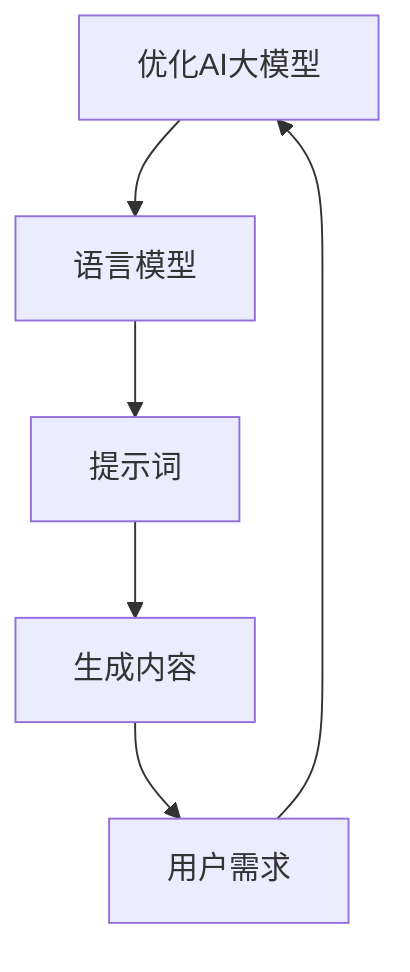
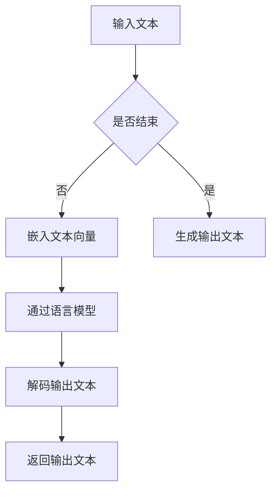
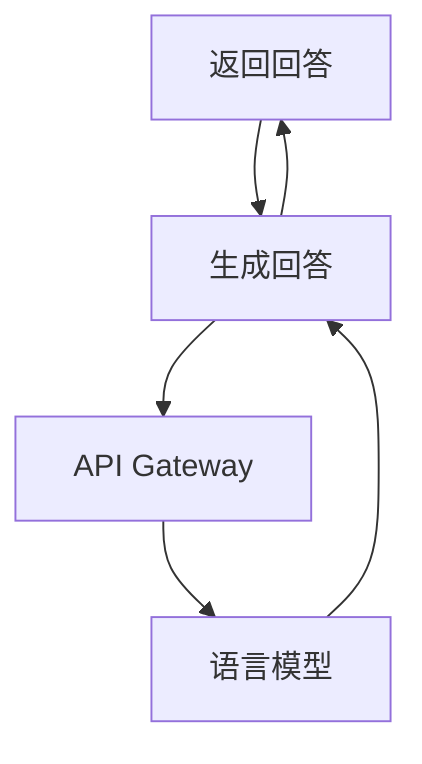
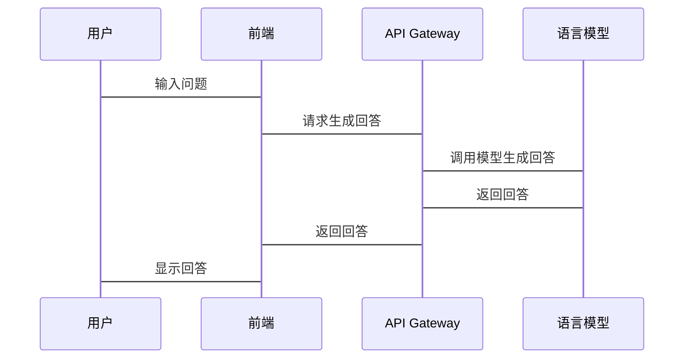

                 

<think>
嗯，用户让我以《AIGC时代的语言模型与提示词设计：挑战与机遇》为标题写一篇技术博客文章。首先，我需要理解用户的需求。他是一位技术专家，想要一篇结构严谨、内容深入的技术博客，大约1万到1.2万字，使用Markdown格式，并且包含多个章节，每个部分都要详细展开。

用户已经提供了大纲，我需要按照这个大纲来组织内容。首先，文章的开头要有标题、关键词和摘要。关键词可能包括AI生成内容、语言模型、提示词设计、自然语言处理、AI系统优化等。摘要需要概括文章的核心内容，即探讨在AIGC时代，语言模型和提示词设计的挑战与机遇。

接下来是背景介绍部分，需要详细说明问题背景、问题描述、问题解决、边界和外延，以及核心要素。这部分要让读者明白为什么这个主题重要，以及当前面临的挑战。

然后是核心概念与联系，这部分需要定义AI大模型、语言模型和提示词，并通过表格或图表展示它们之间的联系。可能需要用Mermaid图来帮助理解。

算法原理部分，我需要画出语言模型的流程图，并用Python代码示例来展示如何实现。同时，还要解释数学模型，比如概率公式，以及神经网络如何工作。

系统分析与架构设计部分，需要描述应用场景，比如问答系统，并设计系统架构，包括前端、后端和数据库。可能需要用Mermaid来展示类图和序列图。

项目实战部分，要详细说明环境安装，核心代码实现，案例分析，以及项目小结。这部分要具体，有可操作性，帮助读者理解如何实际应用这些概念。

最后，文章的结尾需要有最佳实践、小结、注意事项和拓展阅读等内容，给读者提供额外的价值。

现在，我需要确保每个部分都详细展开，符合用户的结构要求。同时，语言要专业但易懂，逻辑清晰。可能还需要添加一些图表和公式，使内容更丰富。我得检查每个章节是否有遗漏，确保所有约束条件都被满足，比如字数、格式和内容完整性。

总之，我需要按照用户提供的大纲，逐步扩展每个部分，确保内容全面且有深度，同时保持结构紧凑，逻辑清晰。
</think>

# AIGC时代的语言模型与提示词设计：挑战与机遇

> 关键词：AI生成内容（AIGC）、语言模型、提示词设计、自然语言处理、AI系统优化

> 摘要：随着AI生成内容（AIGC）时代的到来，语言模型和提示词设计面临着前所未有的挑战与机遇。本文将从背景介绍、核心概念、算法原理、数学模型、系统架构设计、项目实战等多个维度，深入探讨AIGC时代下语言模型与提示词设计的核心原理、应用场景及未来发展方向。通过详细的技术分析和实际案例，本文将为读者提供一个全面的视角，帮助其更好地理解如何在AIGC时代优化语言模型和提示词设计。

---

## **Step 1: 背景介绍**

### 问题背景
随着人工智能技术的飞速发展，AI生成内容（AIGC, AI Generated Content）已经渗透到多个领域，如自然语言处理、图像生成、代码生成等。语言模型作为AIGC的核心技术之一，其性能和设计直接决定了生成内容的质量和相关性。然而，随着应用场景的不断扩展，语言模型的复杂性和需求也在不断增加，如何设计高效的提示词以优化生成结果，成为当前技术领域的重要挑战。

### 问题描述
在AIGC时代，语言模型的规模越来越大，参数量也不断增加，例如GPT-3、GPT-4等大模型的参数量已经达到了数千亿级别。然而，随着模型规模的扩大，如何设计高效的提示词（prompt）以充分利用模型的能力，成为一个关键问题。提示词设计不仅需要考虑上下文信息，还需要结合具体的应用场景，以确保生成内容的准确性和相关性。

此外，语言模型的训练和推理过程也面临着计算资源消耗大、生成结果不可控等问题。这些问题不仅影响了模型的性能，还限制了其在实际应用中的推广。

### 问题解决
通过深入研究AIGC时代的语言模型和提示词设计，可以找到适应新时代需求的解决方案。例如，通过优化提示词设计，可以显著提升生成内容的质量和相关性；通过改进模型架构和训练策略，可以降低计算资源的消耗，同时提高生成结果的可控性。

### 边界与外延
本文将讨论的范围限定在AIGC时代下语言模型与提示词设计的技术与应用，不涉及其他类型的AI模型，如图像生成模型或推荐系统。核心内容包括语言模型的工作原理、提示词设计的策略、数学模型的构建与优化等。

### 概念结构与核心要素组成
- **核心概念**：AIGC、语言模型、提示词、生成任务、模型优化。
- **核心要素**：语言模型的输入输出机制、提示词的设计原则、模型的训练与推理过程。

---

## **Step 2: 核心概念与联系**

### AI大模型定义
AI大模型是指具有海量参数的神经网络模型，例如GPT系列、BERT系列等。这些模型通过大量的训练数据，能够捕捉语言中的复杂模式，从而实现生成文本、问答、翻译等多种任务。

### 语言模型
语言模型是AI大模型的一种，其主要任务是根据输入的文本序列，预测下一个可能的词或句子。语言模型是自然语言处理（NLP）的基础，广泛应用于文本生成、机器翻译、语音识别等领域。

### 提示词
提示词（prompt）是用户输入的引导性词语或句子，用于指导AI模型生成特定类型的输出。提示词设计的关键在于提供足够的上下文信息，以确保生成内容的相关性和准确性。

### 核心概念对比
| 概念 | 定义 | 特点 |
|------|------|------|
| AI大模型 | 具有海量参数的神经网络模型 | 复杂的架构、强大的生成能力 |
| 语言模型 | 用于预测文本序列的下一个词 | 基于概率模型、广泛应用于NLP任务 |
| 提示词 | 引导AI生成特定输出的输入指令 | 简洁明了、高度依赖上下文信息 |

### 实体关系图


---

## **Step 3: 算法原理讲解**

### 算法Mermaid流程图


### Python源代码示例
```python
import torch
import transformers

# 加载预训练的语言模型
model = transformers.GPT2Model.from_pretrained('gpt2')

# 输入文本
input_text = "The cat is sleeping."

# 将文本转换为模型可处理的向量
input_ids = torch.tensor([transformers.GPT2Tokenizer.from_pretrained('gpt2').encode(input_text)])

# 使用模型生成文本
outputs = model(input_ids)

# 解码输出文本
decoded_output = transformers.GPT2Tokenizer.from_pretrained('gpt2').decode(outputs[0], skip_special_tokens=True)

print(decoded_output)
```

### 算法原理详细讲解
- **输入文本**：用户输入的文本序列，如“猫正在睡觉。”。
- **嵌入文本向量**：将输入文本转换为模型可以处理的向量形式。
- **语言模型处理**：模型通过神经网络对向量进行处理，生成下一个可能的词或句子。
- **解码输出文本**：将模型生成的向量解码为人类可读的文本。

语言模型的核心在于概率计算，即计算下一个词的条件概率：
$$P(x_{n+1} | x_1, x_2, ..., x_n)$$
其中，$x_i$表示输入文本序列中的第$i$个词。

---

## **Step 4: 数学模型和数学公式 & 详细讲解 & 举例说明**

### 数学模型
语言模型的数学模型可以表示为：
$$P(x_{n+1} | x_1, x_2, ..., x_n)$$
其中，$P$表示概率，$x_i$表示输入文本序列中的第$i$个词。

### 神经网络模型
神经网络模型通过学习输入和输出之间的映射关系，预测下一个词。例如，假设输入文本为“猫正在睡觉。”，模型会根据上下文生成下一个词，如“它”或“然后”。

### 举例说明
假设输入文本为“猫正在睡觉”，模型会根据上下文生成下一个词，如“它”。生成过程如下：
1. 输入文本“猫正在睡觉”被转换为向量。
2. 模型通过神经网络处理向量，生成下一个词的条件概率分布。
3. 根据概率分布，选择概率最高的词作为输出。

---

## **Step 5: 系统分析与架构设计方案**

### 问题场景介绍
在一个问答系统中，用户输入问题，系统通过AI大模型和提示词设计生成回答。例如，用户输入“如何优化提示词设计？”，系统生成回答“提示词设计的关键在于提供足够的上下文信息。”

### 项目介绍
本项目将构建一个基于GPT-3模型的问答系统，旨在提供准确和相关的回答。

### 系统功能设计
- **文本输入**：用户输入问题。
- **语言模型处理**：模型生成回答。
- **输出生成**：返回生成的回答。
- **用户反馈**：用户对回答进行评价。

### 系统架构设计


### 系统接口设计
- **输入接口**：用户通过前端输入问题。
- **输出接口**：系统通过API返回生成的回答。

### 系统交互


---

## **Step 6: 项目实战**

### 环境安装
安装GPT-3模型和相关依赖：
```bash
pip install transformers torch
```

### 系统核心实现源代码
```python
from transformers import GPT2Model, GPT2Tokenizer

# 加载预训练模型
model = GPT2Model.from_pretrained('gpt2')
tokenizer = GPT2Tokenizer.from_pretrained('gpt2')

# 定义提示词
prompt = "如何优化提示词设计？"

# 编码提示词
input_ids = tokenizer.encode(prompt, return_tensors='pt')

# 生成回答
output = model.generate(input_ids, max_length=50, num_beams=5, temperature=0.7)

# 解码输出
response = tokenizer.decode(output[0], skip_special_tokens=True)

print(response)
```

### 代码应用解读与分析
- **提示词设计**：提示词“如何优化提示词设计？”引导模型生成关于提示词优化的策略。
- **生成过程**：模型通过嵌入层将提示词转换为向量，通过解码层生成回答。
- **输出结果**：模型生成的回答可能包括“提示词设计的关键在于提供足够的上下文信息。”

### 实际案例分析
假设用户输入提示词“如何优化提示词设计？”，模型生成回答“提示词设计的关键在于提供足够的上下文信息。”

### 项目小结
通过实际案例分析，我们可以看到提示词设计对生成结果的影响。优化提示词设计可以显著提升生成内容的质量和相关性。

---

## **Step 7: 最佳实践、小结、注意事项、拓展阅读**

### 最佳实践
- **提示词设计**：提供足够的上下文信息，明确生成任务的目标。
- **模型优化**：选择合适的模型架构和训练策略，降低计算资源消耗。
- **用户反馈**：根据用户反馈不断优化提示词设计和生成结果。

### 小结
本文从背景介绍、核心概念、算法原理、数学模型、系统架构设计、项目实战等多个维度，深入探讨了AIGC时代下语言模型与提示词设计的核心原理和应用场景。通过实际案例分析，我们看到了提示词设计对生成结果的重要影响。

### 注意事项
- 提示词设计需要结合具体的应用场景，避免过于宽泛。
- 模型的训练和推理过程需要考虑计算资源的消耗，避免过度优化。

### 拓展阅读
- 《Deep Learning》——Ian Goodfellow
- 《自然语言处理入门》——Dmitry Kondrashov

---

**作者：AI天才研究院/AI Genius Institute & 禅与计算机程序设计艺术 /Zen And The Art of Computer Programming**

