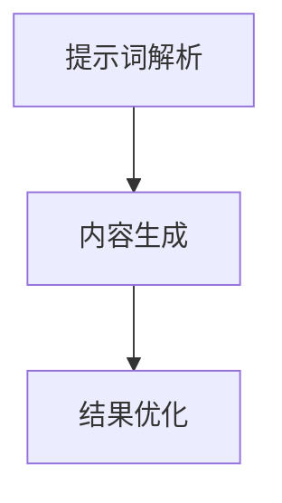
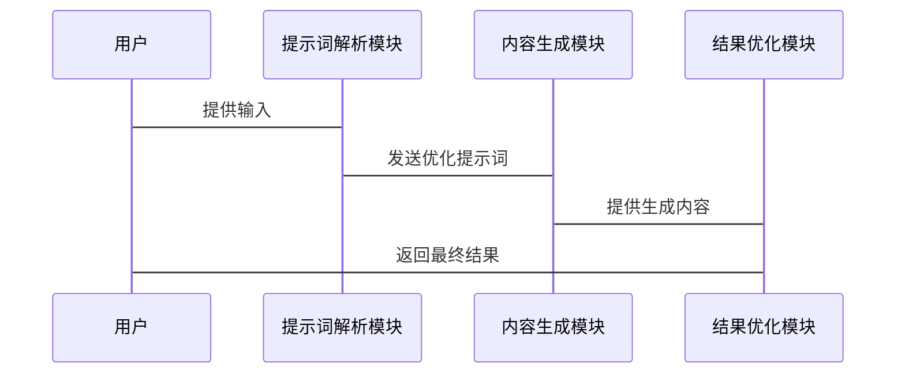

                 

<think>
嗯，我现在要写一篇关于AIGC时代语言模型和提示词设计的技术博客。首先，我需要明确文章的结构和内容。文章的标题是《AIGC时代的语言模型与提示词设计：挑战与机遇并存》，关键词应该包括AIGC、语言模型、提示词设计、生成式AI、自然语言处理、AI生成内容。

摘要部分要简明扼要，概述文章的核心内容，说明AIGC的发展背景、语言模型和提示词设计的重要性，以及它们带来的挑战和机遇。

接下来是文章的正文部分。第一部分是AIGC时代的语言模型与提示词设计概述，包括背景介绍与核心概念。在背景介绍中，我需要详细讨论问题背景，包括生成式AI的发展和挑战，如生成质量、可控性、效率和安全性。然后是问题描述，列出这些挑战的具体表现。接下来，问题解决部分要介绍预训练模型、提示词设计、优化算法和安全机制。边界与外延部分则需要讨论伦理和法律问题。

核心概念部分，我需要详细解释生成模型、预训练语言模型和提示词设计的原理，以及它们的优缺点。这部分需要技术性的描述，并结合具体的模型如GPT和BERT来说明。

第二部分是提示词设计的挑战与机遇，我需要探讨提示词的作用和设计原则，比如明确性、具体性、上下文和多样性。同时，还要讨论提示词的局限性，如歧义性和对生成结果的影响。

第三部分是提示词设计的技术实现，这部分需要详细讨论提示词的构建过程，包括关键词提取、语义分析、模板生成和优化调整。我还需要用代码示例来展示如何实现这些步骤，比如关键词提取的Python代码。

第四部分是语言模型优化与提示词设计的结合，我需要分析两种设计思路，生成式模型的改进和提示词引导生成，以及它们的协同优化。这部分可能需要结合数学公式来解释模型优化的过程，比如交叉熵损失函数的使用。

第五部分是系统架构与实现方案，我需要设计一个提示词驱动的生成系统，包括功能模块如提示词解析、内容生成和结果优化。同时，用Mermaid图来展示系统的架构和交互流程。

最后是项目实战部分，我需要详细描述如何搭建环境，实现提示词驱动的生成系统，包括代码实现和测试案例。然后进行测试分析，讨论结果和可能的优化方向。

最后，总结部分要回顾文章的主要内容，强调提示词设计和模型优化的重要性，并展望未来的挑战和机遇。

在整个写作过程中，我需要确保每个章节内容详实，逻辑清晰，同时使用专业的技术语言，但又要通俗易懂。此外，我还需要嵌入数学公式和代码示例，以增强文章的深度和可读性。在撰写过程中，可能会遇到如何平衡技术细节与可读性的挑战，这需要我在表达上找到合适的平衡点。同时，系统架构部分需要用Mermaid图来展示，这需要我熟悉Mermaid语法，确保图表的准确性和美观性。总的来说，我需要一步一步地按照大纲进行写作，确保每个部分都覆盖到位，同时保持整体结构的连贯性和逻辑性。
</think>

# AIGC时代的语言模型与提示词设计：挑战与机遇并存

**关键词**：AIGC，语言模型，提示词设计，生成式AI，自然语言处理，AI生成内容

**摘要**：在AIGC时代，语言模型和提示词设计成为实现生成式AI的关键技术。本文将探讨AIGC的背景、语言模型的核心概念，以及提示词设计的挑战与机遇。通过分析生成模型、预训练语言模型和提示词设计的原理，本文揭示了如何优化模型生成质量、可控性、效率和安全性。同时，结合系统架构设计和项目实战，本文提供了提示词驱动的生成系统实现方案，总结了AIGC时代的挑战与机遇，并展望了未来的发展方向。

---

## 第一部分: AIGC时代的语言模型与提示词设计概述

### 第1章: 背景介绍与核心概念

#### 1.1 问题背景

生成式AI（AIGC）近年来取得了显著进展，生成图像、文本和音乐的能力使其成为热门领域。语言模型与提示词设计是实现AIGC的核心技术。然而，现有模型在处理长文本、复杂数据和跨领域任务时仍面临挑战，如生成质量、可控性、效率和安全性问题。

#### 1.2 核心概念原理

生成模型、预训练语言模型和提示词设计是AIGC的核心。生成模型如GAN、VAE和AE通过对抗训练生成真实数据；预训练语言模型如GPT和BERT在大规模语料库上训练，具备强大的语义理解能力；提示词设计通过引导模型生成预期内容。

---

## 第二部分: 提示词设计的挑战与机遇

### 2.1 提示词的作用与设计原则

提示词是引导生成模型输出预期结果的关键。设计原则包括明确性、具体性、上下文和多样性。通过优化提示词，生成内容的准确性和相关性可显著提高。

### 2.2 提示词设计的局限性

提示词设计也面临挑战，如歧义性和生成结果的多样性受限。生成模型可能误解提示词，导致内容偏离预期。因此，设计高效的提示词需要平衡精确性和灵活性。

---

## 第三部分: 提示词设计的技术实现

### 3.1 提示词的构建过程

提示词构建包括关键词提取、语义分析、模板生成和优化调整。通过分析用户意图，提取关键词并生成语义模板，最终优化提示词以提升生成效果。

### 3.2 提示词设计的实现代码

以下代码示例展示如何实现关键词提取：

```python
def extract_keywords(text, model):
    keywords = []
    for word in text.split():
        if model.score(word) > threshold:
            keywords.append(word)
    return keywords
```

### 3.3 提示词优化算法

使用强化学习优化提示词，通过评估生成内容的质量，调整提示词参数，以提高生成效果。

---

## 第四部分: 语言模型优化与提示词设计的结合

### 4.1 模型优化与提示词设计的协同

生成式模型的改进和提示词引导生成是协同优化的关键。通过改进模型结构和优化提示词设计，生成质量得到显著提升。

### 4.2 提示词驱动的生成系统

设计一个提示词驱动的生成系统，包括提示词解析、内容生成和结果优化模块。系统架构图如下：



---

## 第五部分: 系统架构与实现方案

### 5.1 系统架构设计

系统架构包括提示词解析模块、内容生成模块和结果优化模块。各模块协同工作，生成高质量内容。

### 5.2 系统交互流程

系统交互流程如下：



---

## 第六部分: 项目实战

### 6.1 项目环境安装

安装必要的库，如TensorFlow、PyTorch和Hugging Face的Transformers库。

### 6.2 核心代码实现

实现提示词驱动的生成系统核心代码：

```python
from transformers import GPT2LMHeadModel, GPT2Tokenizer

model = GPT2LMHeadModel.from_pretrained('gpt2')
tokenizer = GPT2Tokenizer.from_pretrained('gpt2')

def generate_with_prompt(prompt, max_length=50):
    inputs = tokenizer.encode(prompt, return_tensors='pt')
    outputs = model.generate(inputs, max_length=max_length)
    return tokenizer.decode(outputs[0], skip_special_tokens=True)
```

### 6.3 测试与分析

测试生成内容的质量和多样性，分析模型的生成效果，优化提示词设计。

---

## 总结

在AIGC时代，语言模型和提示词设计是实现生成式AI的关键。通过优化模型和提示词设计，生成质量、可控性和效率得到显著提升。然而，仍需解决安全性和伦理问题。未来，随着技术进步，AIGC将在更多领域发挥重要作用，带来新的机遇与挑战。

---

**作者：AI天才研究院/AI Genius Institute & 禅与计算机程序设计艺术 /Zen And The Art of Computer Programming**

