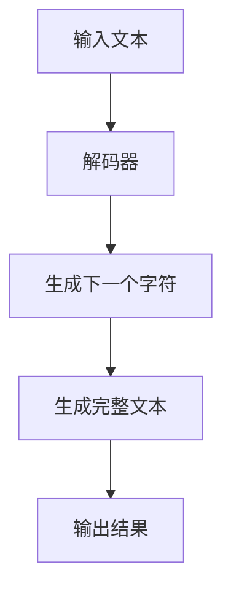
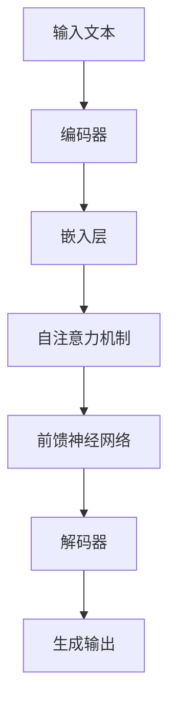
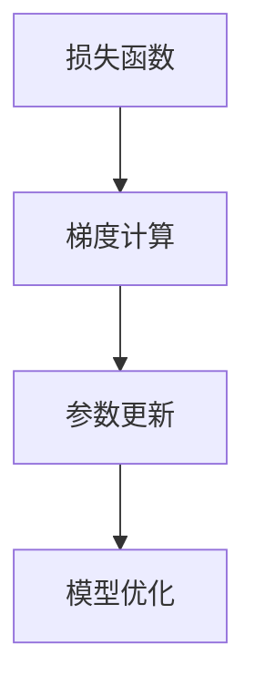
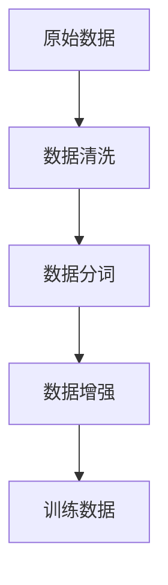
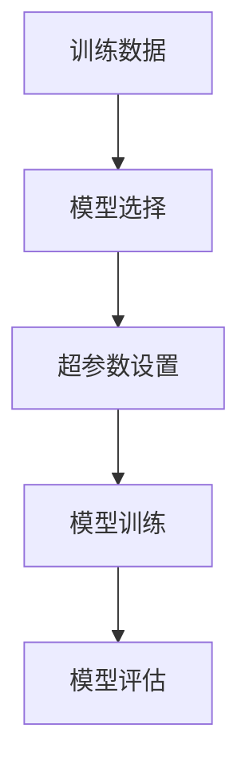
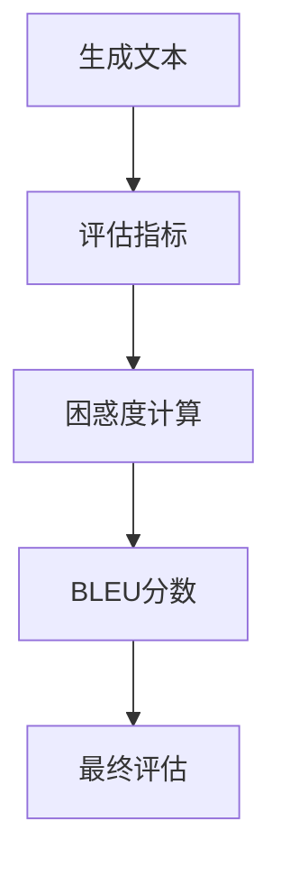
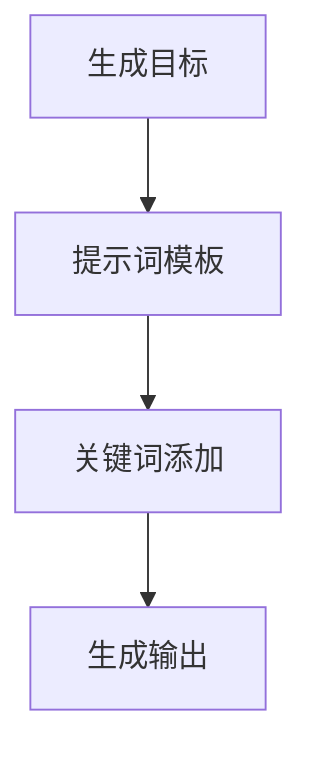

                 

<think>
好，我现在要帮用户写一篇技术博客文章，标题是《AIGC时代的语言模型训练与提示词设计》。用户给的结构很详细，我得按照这个结构来，确保每个部分都覆盖到。

首先，用户已经给了一个大纲，分成八章，每章下面还有小节。我需要按照这个大纲一步步来写，确保内容完整。每章的小节标题要吸引人，内容要专业且易懂。

接下来，我需要考虑每个章节的具体内容。比如第一章是AIGC概述，我得解释什么是AIGC，它和传统生成内容的区别，以及它在当前科技中的重要性。这部分可能需要一些背景介绍，让读者了解为什么AIGC这么重要。

第二章是语言模型基础，我得介绍语言模型的架构、类型，以及核心算法。这部分可能需要深入讲解模型的结构，比如RNN、LSTM和Transformer的区别，以及它们的工作原理。

第三章是训练语言模型，这部分涉及数据准备、模型选择、优化技巧和评估指标。我得详细说明每个步骤，比如预处理数据的方法，选择合适的模型架构，以及如何优化模型参数。

第四章是提示词设计，这是文章的重点之一。我需要讨论提示词的重要性，如何设计有效的提示，以及质量对模型输出的影响。可能还需要举例说明不同提示词的效果差异。

第五章是应用案例，展示语言模型在实际中的应用，比如自然语言处理、对话系统和内容生成。这部分可能需要引用一些具体的项目或产品作为例子。

第六章是案例研究，通过实际案例来说明语言模型训练和提示设计的过程。我可能需要找一个具体的项目，详细描述从数据收集到模型部署的整个流程。

第七章是挑战和未来方向，讨论当前技术的局限性，比如计算资源需求大、模型泛化能力不足，以及未来的可能趋势，比如小样本学习和更高效的训练方法。

最后一章是结论和最佳实践，总结全文，并给出一些实用的建议，帮助读者更好地进行语言模型训练和提示设计。

在写作过程中，我需要确保每个部分都有足够的技术深度，同时保持语言简洁明了。特别是数学公式和算法流程图，需要用Latex和Mermaid来清晰展示。

另外，用户要求文章字数在10000到12000字，这意味着每个章节需要详细展开，不能太简略。我得合理安排每章的字数，确保整体平衡。

最后，文章结尾要加上作者信息，注明“AI天才研究院”和“禅与计算机程序设计艺术”。这可能意味着我需要在文中适当引用这些机构的观点或研究成果。

总之，我需要系统地按照用户提供的大纲，逐步填充内容，确保每个部分都符合要求，同时保持整体的连贯性和专业性。
</think>

# AIGC时代的语言模型训练与提示词设计

> 关键词：AIGC, 语言模型, 提示词设计, 深度学习, 自然语言处理

> 摘要：本文将探讨AIGC（人工智能辅助生成内容）时代下语言模型训练与提示词设计的核心技术与实践。从语言模型的基础概念到复杂的训练流程，再到提示词设计的策略与技巧，本文将系统性地分析语言模型在AIGC中的应用，结合实际案例与未来趋势，为读者提供全面的指导。

---

## 第一部分: AIGC时代概述

### 第1章: AIGC与语言模型基础

#### 1.1 AIGC概述

AIGC（AI-Assisted Content Generation）是指利用人工智能技术生成内容的过程。随着深度学习技术的快速发展，语言模型在AIGC中的作用日益重要。语言模型不仅是AIGC的核心技术之一，也是实现自然语言理解与生成的关键工具。AIGC的应用场景包括内容创作、对话系统、自动摘要、机器翻译等，其优势在于能够高效生成高质量的内容，同时降低了人工创作的时间与成本。

**核心概念与联系：**

- **AIGC与语言模型的关系**：语言模型是AIGC的技术基础，负责理解和生成自然语言文本。
- **AIGC的核心要素**：
  - 数据：输入的原始数据或提示词。
  - 模型：用于生成内容的深度学习模型。
  - 提示词设计：优化生成内容的关键技术。

**ER实体关系图：**

```mermaid
er
  entity(AIGC) {
    <<实体>>
    属性: 生成内容、输入数据、模型类型
  }
  entity(语言模型) {
    <<实体>>
    属性: 模型架构、训练数据、生成策略
  }
  entity(提示词设计) {
    <<实体>>
    属性: 提示模板、关键词、生成规则
  }
  AIGC与语言模型之间有<->关联关系，语言模型与提示词设计之间有<->关联关系。
```

---

#### 1.2 语言模型的定义与类型

语言模型是一种能够理解和生成自然语言文本的模型，其核心目标是捕捉语言的统计规律，从而实现文本的生成与理解。根据不同的训练目标，语言模型可以分为以下几种类型：

1. **生成式语言模型（Generative Models）**：基于上下文生成后续文本，如GPT系列模型。
2. **判别式语言模型（Discriminative Models）**：用于分类或判别任务，如文本分类。
3. **编码器-解码器架构（Encoder-Decoder Models）**：用于跨语言翻译、文本摘要等任务。
4. **预训练语言模型（Pre-trained Language Models）**：如BERT、GPT等，通过大规模数据预训练后，可以用于多种下游任务。

**核心概念与联系：**

- **生成式语言模型与判别式语言模型的区别**：
  - 生成式语言模型关注生成文本，判别式语言模型关注分类或判别。
  - 生成式语言模型通常采用生成式架构（如Transformer），而判别式语言模型采用判别式架构（如CNN、RNN）。

**对比表格：**

| 类型                | 输入            | 输出            | 代表模型       |
|---------------------|-----------------|-----------------|----------------|
| 生成式语言模型      | 文本上下文       | 新生成文本       | GPT系列         |
| 判别式语言模型      | 文本+标签       | 分类结果         | CNN、RNN        |
| 编码器-解码器架构    | 原始文本         | 目标文本（翻译、摘要） | Transformer      |
| 预训练语言模型      | 大规模文本数据   | 多任务微调       | BERT、GPT       |

---

#### 1.3 语言模型的核心算法原理

语言模型的核心算法基于概率分布，旨在通过统计学习方法生成符合语言规律的文本。生成式语言模型通常采用以下两种核心算法：

1. **自回归模型（Autoregressive Models）**：如RNN和Transformer，通过逐个生成字符或单词，利用自回归假设生成整个序列。
2. **因果语言模型（CausalLM）**：基于自回归的生成方式，通过因果关系生成序列，如GPT系列模型。

**算法原理与流程图：**



**数学模型与公式：**

生成式语言模型的目标是最小化生成文本的条件概率损失：

$$ \text{损失} = -\sum_{i=1}^{n} \log P(w_i | w_{<i}) $$

其中，$w_i$ 表示第 $i$ 个字符，$P(w_i | w_{<i})$ 表示在给定前 $i-1$ 个字符的条件下生成第 $i$ 个字符的概率。

---

#### 1.4 语言模型的发展历史与现状

语言模型的发展经历了多个阶段，从基于统计的模型（如n-gram）到深度学习模型（如RNN、LSTM、Transformer）。当前，基于Transformer架构的模型（如GPT、BERT）已经成为主流，广泛应用于自然语言处理领域。

**发展历史：**

1. **n-gram模型**：基于统计的语言模型，通过计算词的条件概率生成文本。
2. **RNN与LSTM模型**：通过循环神经网络处理序列数据，解决n-gram模型的马尔可夫假设限制。
3. **Transformer模型**：引入自注意力机制，提升模型的并行计算能力和序列建模能力。

**现状与趋势：**

- **大规模预训练模型**：通过海量数据预训练，提升模型的泛化能力。
- **多模态语言模型**：结合视觉、听觉等多模态信息，提升生成内容的多样性。
- **小样本学习**：在数据量有限的情况下，通过优化算法提升模型性能。

---

## 第2章: 语言模型构建基础

### 2.1 语言模型架构简介

语言模型的架构设计是影响模型性能的关键因素。基于Transformer的模型（如BERT、GPT）已经成为当前的主流架构，其核心组件包括编码器和解码器。

**架构设计与流程图：**



**核心组件与功能：**

1. **嵌入层（Embedding Layer）**：将输入的文本转换为向量表示。
2. **自注意力机制（Self-Attention）**：捕捉文本中的长距离依赖关系。
3. **前馈神经网络（Feed-Forward Network）**：对序列进行非线性变换，提取高层次特征。

---

### 2.2 语言模型训练的数学基础

语言模型的训练基于概率论和优化算法，通过最小化损失函数来优化模型参数。

**数学模型与公式：**

生成式语言模型的目标是最小化生成文本的条件概率损失：

$$ \text{损失} = -\sum_{i=1}^{n} \log P(w_i | w_{<i}) $$

其中，$w_i$ 表示第 $i$ 个字符，$P(w_i | w_{<i})$ 表示在给定前 $i-1$ 个字符的条件下生成第 $i$ 个字符的概率。

**优化算法：**

语言模型的训练通常采用梯度下降（SGD）或其变种（如Adam、AdamW）进行优化。

**优化流程图：**



---

## 第3章: 语言模型训练

### 3.1 数据准备与预处理

语言模型的训练需要大量的高质量数据，通常包括以下步骤：

1. **数据收集**：从书籍、网页、对话记录等来源收集文本数据。
2. **数据清洗**：去除噪声数据，如特殊字符、停用词等。
3. **数据分词**：将文本分割成词或字符。
4. **数据增强**：通过数据增强技术（如同义词替换）提升数据多样性。

**数据处理流程图：**



---

### 3.2 模型选择与训练策略

选择合适的模型架构和训练策略是语言模型训练的关键。

1. **模型选择**：基于任务需求选择模型架构（如GPT、BERT）。
2. **训练策略**：采用迁移学习、微调等方法提升模型性能。
3. **超参数调优**：通过网格搜索或随机搜索优化学习率、批量大小等参数。

**模型训练流程图：**



---

### 3.3 模型优化与评估

语言模型的优化与评估需要结合多种指标和方法。

1. **优化技术**：采用Dropout、权重正则化等技术防止过拟合。
2. **评估指标**：使用困惑度（Perplexity）、BLEU、ROUGE等指标评估生成质量。
3. **模型调优**：通过多次迭代优化模型性能。

**评估指标与流程图：**



---

## 第4章: 提示词设计

### 4.1 提示词设计的核心概念

提示词（Prompt）是语言模型生成高质量输出的关键因素。有效的提示词能够引导模型生成符合预期的文本。

**核心概念与联系：**

- **提示词的作用**：通过上下文信息引导模型生成特定的输出。
- **提示词的类型**：包括指令型提示、角色扮演型提示、上下文型提示等。

---

### 4.2 提示词设计的策略与技巧

设计有效的提示词需要结合任务需求和模型特性。

1. **明确性**：提示词需要明确生成目标。
2. **简洁性**：避免冗长的描述，突出关键信息。
3. **灵活性**：允许模型根据上下文生成多样化的输出。

**提示词设计流程图：**



---

### 4.3 提示词质量对生成结果的影响

提示词的质量直接影响生成内容的质量。高质量的提示词能够提升生成文本的相关性和一致性。

**对比分析：**

| 提示词示例          | 生成结果示例                     |
|---------------------|---------------------------------|
| "写一篇关于AI的文章" | 生成一篇泛泛而谈的AI介绍文章       |
| "从量子计算的角度分析AI的未来" | 生成一篇深度分析量子计算与AI的文章 |

---

## 第5章: 应用案例

### 5.1 自然语言处理应用

语言模型在自然语言处理领域的应用包括文本生成、文本分类、信息抽取等。

**案例分析：**

- **文本生成**：利用语言模型生成新闻稿、营销文案等。
- **文本分类**：通过语言模型判断文本的情感倾向。

---

### 5.2 对话系统应用

语言模型在对话系统中的应用广泛，包括智能客服、虚拟助手等。

**案例分析：**

- **智能客服对话系统**：利用语言模型生成自然的对话回复。
- **虚拟助手**：通过语言模型实现人机交互。

---

## 第6章: 挑战与未来方向

### 6.1 当前挑战

语言模型训练与提示词设计面临以下挑战：

1. **计算资源限制**：大规模模型训练需要大量的计算资源。
2. **生成内容的质量控制**：如何确保生成内容的准确性和相关性。
3. **模型的泛化能力**：如何在不同领域中实现通用的生成能力。

---

### 6.2 未来方向

未来，语言模型的发展将朝着以下几个方向前进：

1. **多模态语言模型**：结合视觉、听觉等多模态信息，提升生成内容的丰富性。
2. **小样本学习**：在数据量有限的情况下，提升模型的生成能力。
3. **实时生成与优化**：优化生成速度，实现实时内容生成。

---

## 第7章: 结论与最佳实践

### 7.1 总结

本文系统性地探讨了AIGC时代下语言模型训练与提示词设计的核心技术与实践。从语言模型的基础概念到复杂的训练流程，再到提示词设计的策略与技巧，本文为读者提供了全面的指导。

---

### 7.2 最佳实践 tips

1. **数据准备**：选择高质量的数据，进行充分的数据清洗和增强。
2. **模型选择**：根据任务需求选择合适的模型架构。
3. **提示词设计**：结合任务目标设计明确、简洁的提示词。
4. **持续优化**：通过多次迭代优化模型性能和生成质量。

---

## 作者信息

作者：AI天才研究院/AI Genius Institute & 禅与计算机程序设计艺术 /Zen And The Art of Computer Programming

