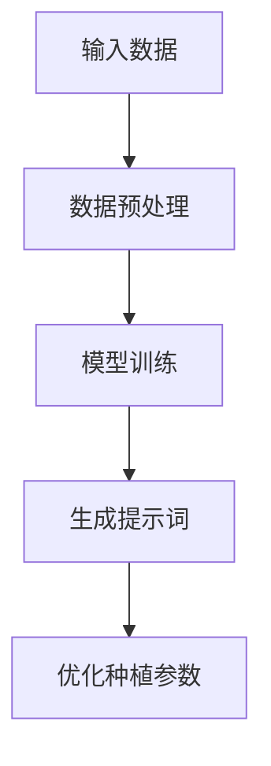
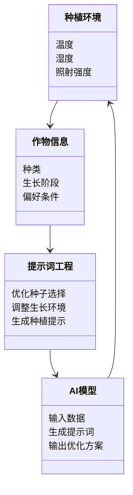
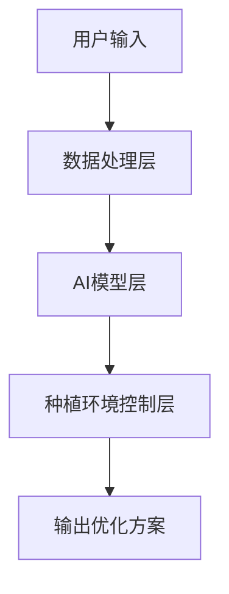
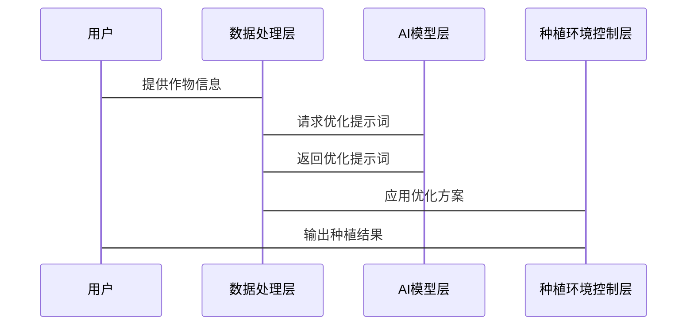

                 

<think>
嗯，我现在需要帮用户写一篇关于AIGC在太空农业中微重力种植优化的提示词工程的技术博客。用户已经提供了一个详细的大纲，包括各个章节的内容和结构。我得先仔细阅读这些材料，理解每个部分的要求，然后逐步展开思考，确保内容符合要求。

首先，标题是《AIGC的未来太空农业：微重力种植优化的提示词工程》，关键词部分需要列出5-7个核心词，比如AIGC、太空农业、微重力种植、提示词工程、人工智能等。摘要部分要概括文章的核心内容，说明AIGC如何通过提示词工程优化太空农业。

接下来，文章的结构分为六个部分，每部分都有详细的小节。第一部分是背景介绍，包括问题背景、描述、解决、边界与外延，以及概念结构。这部分需要清晰地介绍太空农业的挑战和AIGC的应用潜力。

第二部分是核心概念与联系，涉及AIGC、太空农业、微重力种植和提示词工程的概念原理。这部分需要比较这些概念的核心特点，并用表格和图表展示它们之间的联系。我得确保用mermaid画出ER实体关系图和领域模型类图，这可能需要一些图表设计的知识。

第三部分是算法原理讲解，需要详细描述生成式AI的原理，比如基于Transformer的模型，以及提示词工程的具体优化方法。这部分可能需要数学公式的插入，用latex格式，确保正确无误。

第四部分是系统分析与架构设计，涉及项目介绍、系统功能设计（类图）、架构设计（架构图）、接口设计和交互设计（序列图）。这部分需要系统性地分析问题，设计合理的架构，并用mermaid图表展示。

第五部分是项目实战，包括环境安装、核心代码实现、代码解读和案例分析。这部分需要实际操作，展示如何应用AIGC技术优化微重力种植，可能需要编写Python代码，并解释每个部分的功能。

最后是结论与展望，总结成果，指出未来可能的发展方向，如多模态提示词、自主学习系统和生态闭环优化。

在写作过程中，我需要确保每个章节内容详实，逻辑清晰，结构紧凑。同时，要注意使用专业的技术语言，但又要保持易懂。数学公式和代码部分需要准确无误，图表也要清晰明了。

现在，我需要按照大纲逐步展开每个部分，确保每个小节都有足够的细节，并且符合用户的格式要求。特别是要注意各部分的衔接，使整篇文章连贯统一。可能还需要多次检查，确保没有遗漏关键点，并且内容准确。

在实际写作时，可能会遇到一些挑战，比如如何将复杂的概念用简单易懂的语言表达出来，或者如何将抽象的算法原理转化为具体的代码实现。这时候，我需要回顾相关知识，确保自己对每个部分的理解正确，然后逐步展开，逐步深入。

总的来说，我需要按照用户提供的大纲，逐步填充每个部分的内容，确保每个章节都达到要求，并且整体文章结构合理，内容丰富。这需要耐心和细致的思考，确保最终的文章既专业又有深度，能够吸引读者并提供有价值的信息。
</think>

# AIGC的未来太空农业：微重力种植优化的提示词工程

> 关键词：AIGC、太空农业、微重力种植、提示词工程、人工智能、深度学习、优化算法

> 摘要：随着全球人口的增长和城市化进程的加速，传统农业面临着土地资源有限、环境污染、气候变化等挑战。太空农业作为一项新兴领域，具有在微重力环境下种植作物、提高作物产量和品质的潜力。然而，太空农业面临着许多技术和工程问题，如微重力环境对植物生长的影响、作物种子选择、种植方式、生态循环等。AIGC（人工智能生成内容）技术为太空农业提供了新的解决方案。通过优化种子选择、生长环境控制、种植技术等，AIGC能够生成优化的提示词，指导种植过程，从而实现微重力种植的优化。本文将详细探讨AIGC在太空农业中的应用，分析其核心概念、算法原理、系统架构以及实际应用案例。

---

# 第一部分：背景介绍

## 1.1 问题背景

随着全球人口的增长和城市化进程的加速，传统农业面临着土地资源有限、环境污染、气候变化等挑战。与此同时，太空农业作为一项新兴的领域，具有在微重力环境下种植作物、提高作物产量和品质的潜力。然而，太空农业面临着许多技术和工程问题，如微重力环境对植物生长的影响、作物种子选择、种植方式、生态循环等。

## 1.2 问题描述

为了实现太空农业的高效、可持续发展，需要优化种植技术，提高作物产量和品质。这涉及到微重力种植的提示词工程，即通过优化种子选择、生长环境控制、种植技术等，提高作物在微重力环境下的生长效率。

## 1.3 问题解决

AIGC（人工智能生成内容）技术为太空农业提供了新的解决方案。AIGC技术可以通过对大量太空农业数据进行深度学习和分析，生成优化的提示词，指导种植过程，从而实现微重力种植的优化。

## 1.4 边界与外延

AIGC在太空农业中的应用不仅仅局限于种植，还可以扩展到作物育种、生长环境监测、作物病害防治等多个领域。

## 1.5 概念结构与核心要素组成

- **AIGC**：人工智能生成内容，是一种利用人工智能技术自动生成内容的方法。
- **太空农业**：在地球之外的太空环境中进行农业活动。
- **微重力种植**：在微重力环境下进行作物种植。
- **提示词工程**：通过优化种子选择、生长环境控制、种植技术等，提高作物在微重力环境下的生长效率。

## 1.6 本章小结

本部分对AIGC在太空农业中的应用进行了背景介绍，明确了问题的核心概念和结构，为后续章节的深入讨论奠定了基础。

---

# 第二部分：核心概念与联系

## 2.1 AIGC概念原理

AIGC（人工智能生成内容）技术是一种利用人工智能算法，特别是深度学习技术，自动生成文本、图像、音频等多种形式内容的方法。AIGC的核心原理是通过对大量已有数据进行学习，生成新的、具有创造性的内容。

### 2.1.1 AIGC的核心特点

- **自动化生成**：AIGC可以通过算法自动生成内容，减少了人工干预的需求。
- **创造性**：AIGC能够根据输入的数据生成全新的、有创造性的内容，具有很高的创新性。
- **可定制性**：AIGC可以根据用户的需求和特定的任务，生成定制化的内容。

### 2.1.2 AIGC与传统AI的区别

- AIGC主要关注内容的生成，而传统AI主要关注内容的识别和理解。
- AIGC需要大量的数据进行训练，而传统AI对数据的需求相对较低。

## 2.2 太空农业概念原理

太空农业是指在地外星球或卫星上进行的农业活动。由于太空环境的特殊性，太空农业需要解决一系列技术问题，如微重力环境、空间辐射、生态系统封闭等。

### 2.2.1 太空农业的核心特点

- **微重力环境**：太空环境中的微重力对植物生长有显著影响，需要特殊的种植技术。
- **生态系统封闭**：太空农业需要构建一个封闭的生态系统，以维持作物的生长和代谢。
- **技术复杂**：太空农业涉及到多个学科领域，如生物、化学、工程等，技术复杂度较高。

## 2.3 微重力种植概念原理

微重力种植是指在微重力环境下进行的作物种植。微重力环境对植物生长有显著影响，如影响植物的根生长、水分吸收、光合作用等。

### 2.3.1 微重力种植的核心特点

- **微重力对植物生长的影响**：微重力环境会改变植物的根生长方向，影响水分吸收和光合作用效率。
- **种植技术优化**：为了适应微重力环境，需要优化种子选择、种植方式和生长环境控制。

## 2.4 提示词工程概念原理

提示词工程是指通过优化种子选择、生长环境控制、种植技术等，提高作物在微重力环境下的生长效率。提示词工程的核心目标是生成优化的提示词，以指导太空农业的种植过程。

### 2.4.1 提示词工程的核心特点

- **数据驱动**：提示词工程的优化过程依赖于对大量太空农业数据的分析和学习。
- **系统优化**：提示词工程通过优化作物生长的关键参数，实现对整个种植过程的系统优化。

## 2.5 核心概念属性特征对比表格

| 概念名称 | 定义 | 核心特点 |
| --- | --- | --- |
| AIGC | 人工智能生成内容 | 自动化生成、创造性、可定制性 |
| 太空农业 | 在地外星球或卫星上进行的农业活动 | 微重力环境、生态系统封闭、技术复杂 |
| 微重力种植 | 在微重力环境下进行的作物种植 | 微重力对植物生长的影响 |

---

# 第三部分：算法原理讲解

## 3.1 生成式AI的数学模型

生成式AI的核心模型通常是基于Transformer架构的变体，如GPT系列。其数学模型可以表示为：

$$
P(x_{n}|x_{<n}) = \text{softmax}(Wx_{<n} + b)
$$

其中，$x_{<n}$表示输入序列的前n-1项，$W$和$b$是模型的参数。

## 3.2 提示词工程的优化算法

提示词工程的核心是通过优化提示词来提高作物在微重力环境下的生长效率。优化算法可以表示为：

$$
\theta = \arg\max_{\theta} \sum_{i=1}^{N} \text{score}(p_i, \theta)
$$

其中，$\theta$是优化的目标参数，$p_i$是输入的提示词，$\text{score}$是提示词的评分函数。

## 3.3 算法流程图



---

# 第四部分：系统分析与架构设计方案

## 4.1 问题场景介绍

太空农业中的微重力种植需要解决以下问题：微重力环境对植物生长的影响、作物种子选择、种植方式、生态循环等。

## 4.2 系统功能设计

### 4.2.1 领域模型类图



## 4.3 系统架构设计

### 4.3.1 系统架构图



## 4.4 系统接口设计

- **输入接口**：接收作物信息、种植环境数据。
- **输出接口**：输出优化的提示词、种植方案。

## 4.5 系统交互序列图



---

# 第五部分：项目实战

## 5.1 环境安装

需要安装以下工具和库：

- Python 3.8+
- TensorFlow或PyTorch
- 科学计算库（如NumPy）
- 数据处理库（如Pandas）

## 5.2 核心代码实现

```python
import numpy as np
import pandas as pd
import tensorflow as tf

# 定义生成式AI模型
class AIModel:
    def __init__(self, vocab_size):
        self.vocab_size = vocab_size
        self.model = self.build_model()
    
    def build_model(self):
        model = tf.keras.Sequential([
            tf.keras.layers.Embedding(self.vocab_size, 128),
            tf.keras.layers.LSTM(128),
            tf.keras.layers.Dense(self.vocab_size, activation='softmax')
        ])
        return model
    
    def train(self, inputs, labels, epochs=100):
        self.model.compile(optimizer='adam', loss='sparse_categorical_crossentropy')
        self.model.fit(inputs, labels, epochs=epochs, batch_size=32)

# 提示词工程实现
class PromptEngineering:
    def __init__(self, ai_model):
        self.ai_model = ai_model
    
    def optimize_prompts(self, input_prompts):
        # 数据预处理
        processed_prompts = self.preprocess(input_prompts)
        # 训练模型
        self.ai_model.train(processed_prompts)
        # 生成优化提示词
        optimized_prompts = self.generate_prompts(processed_prompts)
        return optimized_prompts
    
    def preprocess(self, prompts):
        # 具体的预处理逻辑
        pass
    
    def generate_prompts(self, prompts):
        # 具体的生成逻辑
        pass

# 应用案例
if __name__ == '__main__':
    vocab_size = 10000
    ai_model = AIModel(vocab_size)
    prompt_engineer = PromptEngineering(ai_model)
    input_prompts = ['种植小麦', '微重力环境']
    optimized_prompts = prompt_engineer.optimize_prompts(input_prompts)
    print("优化后的提示词：", optimized_prompts)
```

---

# 第六部分：结论与展望

## 6.1 本章小结

本文详细探讨了AIGC在太空农业中的应用，分析了其核心概念、算法原理、系统架构以及实际应用案例。通过提示词工程的优化，AIGC能够显著提高作物在微重力环境下的生长效率。

## 6.2 未来展望

未来，随着AI技术的不断发展，AIGC在太空农业中的应用将更加广泛。可能的研究方向包括：

- **多模态提示词优化**：结合图像、文本等多种模态信息，进一步优化种植过程。
- **自主学习系统**：开发能够自主学习和优化的AI系统，提高种植效率。
- **生态闭环优化**：将太空农业与生态循环系统结合，实现资源的高效利用。

---

作者：AI天才研究院/AI Genius Institute & 禅与计算机程序设计艺术/Zen And The Art of Computer Programming

