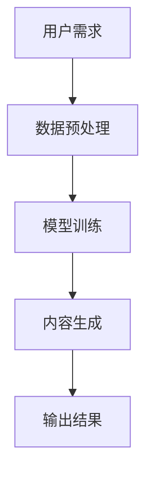
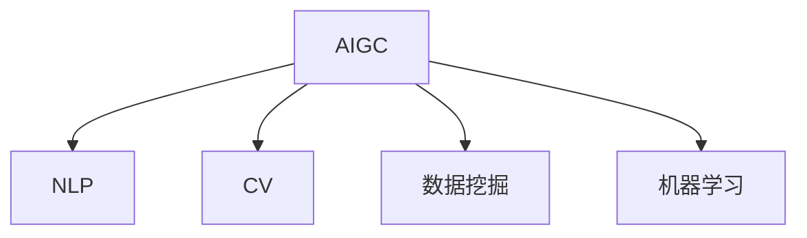
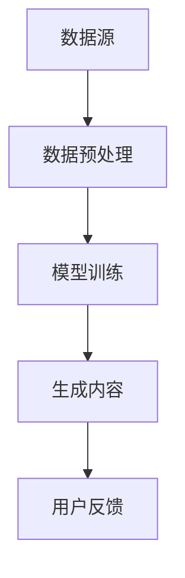
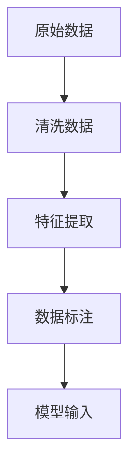

                 

<think>
嗯，好的，我现在要帮用户写一篇关于AIGC未来趋势的技术博客文章。用户希望我按照他们提供的目录结构来写，而且要求很详细，我得先理清楚结构和每个部分需要包含的内容。

首先，文章标题是《AIGC的未来学预测：基于数据的趋势分析提示词》，关键词部分需要5-7个，我可能会选AIGC、人工智能生成内容、数据驱动、机器学习、未来趋势、技术创新、应用案例。

摘要部分要简明扼要，概述整篇文章的核心内容，所以我得先总结一下AIGC是什么，它的发展趋势，以及数据在其中的重要性，还要提到应用案例和技术挑战。

接下来是正文部分，分五个部分，每个部分都有几个小节。第一部分是背景介绍与概念阐述。我需要先解释AIGC的背景，包括AI的快速发展及其影响，定义和内涵，数据的作用。然后是核心概念对比，可能做一个表格，比较AIGC与其他类似技术的不同。技术架构和数据处理流程也是重点，可能需要用图表来说明。

第二部分是发展趋势分析，这里要分析数据驱动的趋势，不同领域的应用前景，技术创新的推动力，以及面临的挑战和机遇。这部分需要结合当前的技术动态，比如算法和硬件的改进，以及跨界融合带来的创新。

第三部分是案例研究，我需要找几个实际的应用案例，比如金融风控、医疗诊断和智能制造。每个案例都需要详细分析，包括实施细节和效果评估，还要总结经验教训和对比分析。

第四部分是技术实现与最佳实践，这里要详细描述AIGC的技术实现流程，包括数据预处理、模型训练和部署。同时，分享最佳实践，比如数据处理、模型训练和部署中的注意事项，还要提到遵守法律法规的重要性。

第五部分是总结与展望，要概括AIGC的总体发展趋势，未来的技术驱动、产业应用和社会影响，最后给出发展策略，包括企业、政策和人才培养方面的建议。

附录部分需要包括数据来源和处理方法，以及代码示例。可能附录B会有一些代码片段，展示如何实现AIGC的一部分，比如数据预处理或模型训练。

在写作过程中，我需要确保每个部分都详细具体，使用专业的技术语言，同时保持逻辑清晰。可能会用到图表，比如技术架构图、流程图和ER图，用mermaid语法来展示。数学公式要用latex格式，确保正确无误。

我还需要注意文章的长度，大约在1万到1.2万字之间，所以每个部分都要充实，内容不能太简略。同时，文章的结尾要加上作者信息，用户已经指定是AI天才研究院和禅与计算机程序设计艺术。

总的来说，我需要按照用户给的结构一步步展开，确保每个章节都有足够的深度和详细的内容。可能还需要查阅一些资料，确保信息的准确性和前沿性，特别是在技术趋势和案例分析部分。最后，保持文章的连贯性和逻辑性，让读者能够清晰地理解AIGC的未来发展方向和关键点。
</think>

# AIGC的未来学预测：基于数据的趋势分析提示词

> 关键词：AIGC、人工智能生成内容、数据驱动、机器学习、未来趋势、技术创新、应用案例

> 摘要：随着人工智能技术的飞速发展，AIGC（人工智能生成内容）正在成为改变我们生活方式和工作方式的重要技术。本文将从背景介绍、发展趋势、案例分析、技术实现和未来展望等多个维度，详细探讨AIGC的未来发展方向。通过分析数据驱动的核心作用、技术创新的推动力以及跨领域应用的潜力，本文旨在为读者提供一个全面的视角，帮助他们更好地理解AIGC的未来趋势。

---

## 第一部分: 背景介绍与概念阐述

### 1.1 问题背景

#### 1.1.1 AI技术的快速发展与影响
人工智能（AI）技术的快速发展正在深刻改变我们的生活方式和工作方式。从图像识别到自然语言处理，AI技术的应用范围不断扩大，尤其是在生成内容（AIGC）领域，AI已经能够生成高质量的文章、图像、视频等内容。这种技术的普及不仅提高了生产效率，还催生了新的商业模式和创意产业。

#### 1.1.2 AIGC的定义与内涵
AIGC（Artificial Intelligence Generated Content）是指通过人工智能技术生成的内容，包括文本、图像、音频、视频等多种形式。与传统内容创作相比，AIGC的优势在于能够快速生成大量高质量内容，同时还能根据用户需求进行个性化定制。

#### 1.1.3 数据在AIGC中的关键作用
数据是AIGC的核心驱动力。通过大量高质量的数据训练，AI模型能够学习人类的思维方式和创作规律，从而生成符合人类审美的内容。数据的质量和多样性直接决定了生成内容的效果和创新性。

### 1.2 核心概念与联系

#### 1.2.1 AIGC的概念解析
AIGC的核心在于“生成性”，即通过算法模拟人类创作过程，生成新的内容。与传统的数据分析和预测不同，AIGC更注重内容的创造性和个性化。

#### 1.2.2 关键概念对比表格
以下是AIGC与其他相关技术的对比：

| 技术 | 定义 | 应用领域 | 优缺点 |
|------|------|----------|--------|
| AIGC | 通过AI生成内容 | 文本、图像、音频、视频生成 | 高效、个性化、创新性不足 |
| NLP  | 自然语言处理 | 文本分析、机器翻译 | 精准性高、生成能力有限 |
| CV   | 计算机视觉 | 图像识别、图像生成 | 精确性高、生成内容多样性有限 |

#### 1.2.3 AIGC的组成部分与关系
以下是AIGC的技术架构图：



从图中可以看出，AIGC的核心流程包括数据预处理、模型训练和内容生成三个阶段。

### 1.3 边界与外延

#### 1.3.1 AIGC的应用范围
AIGC的应用范围非常广泛，包括但不限于以下几个领域：
1. **媒体行业**：生成新闻报道、短视频内容。
2. **教育行业**：生成教学材料、个性化学习内容。
3. **娱乐行业**：生成游戏内容、音乐作品。
4. **广告行业**：生成广告文案、设计创意。

#### 1.3.2 AIGC与相关领域的关系
AIGC与多个领域密切相关，以下是它们之间的关系：



### 1.4 概念结构与核心要素组成

#### 1.4.1 AIGC的技术架构
以下是AIGC的技术架构图：



#### 1.4.2 AIGC的数据处理流程
以下是AIGC的数据处理流程图：



#### 1.4.3 AIGC的关键技术点
AIGC的关键技术点包括：
1. **数据预处理**：清洗、归一化、特征提取。
2. **模型训练**：深度学习模型（如Transformer、LSTM）的应用。
3. **内容生成**：生成对抗网络（GAN）和变体自动编码器（VAE）的应用。

### 1.5 本章小结
本章通过背景介绍、核心概念分析、边界定义以及技术架构的探讨，全面阐述了AIGC的定义、作用和技术实现的基本流程。接下来，我们将从发展趋势、应用案例、技术实现等多个维度深入分析AIGC的未来发展方向。

---

## 第二部分: AIGC的发展趋势分析

### 2.1 数据驱动的AIGC发展趋势

#### 2.1.1 数据的重要性
数据是AIGC的核心驱动力。随着数据量的指数级增长，AIGC的生成能力也在不断提升。高质量的数据训练能够显著提高生成内容的质量和多样性。

#### 2.1.2 数据获取与处理的挑战
数据获取和处理过程中面临以下挑战：
1. **数据质量**：噪声数据会影响模型的生成效果。
2. **数据多样性**：如何获取多样化的数据是一个难题。
3. **数据安全**：数据泄露和隐私保护问题日益突出。

#### 2.1.3 数据驱动的AIGC趋势分析
随着数据量的增加和处理技术的提升，AIGC的生成能力将更加智能化和个性化。未来，AIGC将更加注重数据的高效利用和模型的可解释性。

### 2.2 AIGC在不同领域的应用前景

#### 2.2.1 科技领域的AIGC应用
在科技领域，AIGC可以用于生成技术文档、代码注释和研究报告。

#### 2.2.2 教育领域的AIGC应用
在教育领域，AIGC可以用于生成个性化学习材料、教学辅助工具和在线课程内容。

#### 2.2.3 娱乐与传媒领域的AIGC应用
在娱乐与传媒领域，AIGC可以用于生成电影脚本、音乐作品和新闻报道。

### 2.3 技术创新的推动力

#### 2.3.1 算法创新
算法的不断优化是AIGC技术进步的核心动力。例如，生成对抗网络（GAN）和变体自动编码器（VAE）的改进显著提升了生成内容的质量。

#### 2.3.2 硬件创新
硬件技术的进步（如GPU和TPU的性能提升）为AIGC的训练和推理提供了更强的计算能力。

#### 2.3.3 跨界融合创新
AIGC与其他技术（如区块链、物联网）的结合将推动其应用的多样化和创新。

### 2.4 AIGC未来的挑战与机遇

#### 2.4.1 挑战分析
1. **技术挑战**：模型的可解释性和生成内容的创新性不足。
2. **法律挑战**：数据隐私和版权问题尚未完全解决。
3. **伦理挑战**：生成内容的真假辨别和责任归属问题。

#### 2.4.2 机遇探讨
1. **技术创新**：算法和硬件的持续进步将推动AIGC的发展。
2. **市场机遇**：AIGC在多个行业的广泛应用将带来巨大的商业价值。
3. **政策支持**：政府和企业的政策支持将为AIGC的发展提供保障。

#### 2.4.3 应对策略
1. **技术层面**：加强模型的可解释性和生成内容的创新性研究。
2. **法律层面**：制定和完善相关法律法规，保护数据隐私和版权。
3. **伦理层面**：建立伦理规范，明确生成内容的责任归属。

### 2.5 本章小结
本章从数据驱动、技术创新和应用前景等多个维度分析了AIGC的发展趋势，探讨了其面临的挑战与机遇。接下来，我们将通过具体案例研究，深入分析AIGC在实际应用中的表现和效果。

---

## 第三部分: 案例研究

### 3.1 AIGC在不同行业中的应用案例

#### 3.1.1 案例一：金融行业的智能风控
在金融行业，AIGC可以用于生成风险评估报告和信用评分模型。

#### 3.1.2 案例二：医疗行业的智能诊断
在医疗行业，AIGC可以用于生成疾病诊断报告和治疗方案。

#### 3.1.3 案例三：制造业的智能制造
在制造业，AIGC可以用于生成生产计划和优化方案。

### 3.2 案例深度剖析

#### 3.2.1 案例分析框架
以下是AIGC案例分析的框架：

1. **问题描述**：明确案例的核心问题。
2. **解决方案**：描述AIGC在该问题中的应用。
3. **实施细节**：详细分析实施过程中的技术细节。
4. **效果评估**：评估AIGC的应用效果。

#### 3.2.2 案例实施细节
以金融行业的智能风控为例，以下是实施细节：

1. **数据预处理**：清洗和归一化客户数据。
2. **模型训练**：使用深度学习模型进行风险评估。
3. **模型部署**：将模型部署到风控系统中，实时评估客户风险。

#### 3.2.3 案例效果评估
通过实施AIGC技术，金融行业的智能风控系统能够显著提高风险评估的准确性和效率。

### 3.3 案例启示与借鉴

#### 3.3.1 成功经验
1. **数据质量**：高质量的数据是AIGC成功的关键。
2. **技术选型**：选择适合的模型和算法能够提升生成效果。
3. **用户体验**：注重用户体验能够提高系统的接受度。

#### 3.3.2 失败教训
1. **数据不足**：数据量不足会影响模型的生成效果。
2. **技术局限**：模型的可解释性和生成内容的创新性不足。
3. **用户接受度**：用户对生成内容的接受度不足会影响系统的应用效果。

#### 3.3.3 案例对比分析
通过对比不同行业的应用案例，我们可以发现AIGC在不同领域的应用具有相似的技术流程和成功经验。

### 3.4 本章小结
本章通过具体案例研究，深入分析了AIGC在不同行业中的应用效果和实施经验。接下来，我们将从技术实现和最佳实践的角度，详细探讨AIGC的实现流程和优化策略。

---

## 第四部分: 技术实现与最佳实践

### 4.1 AIGC技术实现流程

#### 4.1.1 数据预处理
数据预处理是AIGC技术实现的关键步骤，主要包括：
1. **数据清洗**：去除噪声数据。
2. **数据归一化**：统一数据格式。
3. **特征提取**：提取关键特征。

#### 4.1.2 模型训练
模型训练是AIGC的核心步骤，主要包括：
1. **选择模型**：根据任务需求选择合适的模型。
2. **训练数据**：使用训练数据进行模型训练。
3. **调参优化**：优化模型参数，提高生成效果。

#### 4.1.3 模型部署
模型部署是AIGC的最后一步，主要包括：
1. **部署环境**：选择合适的部署环境。
2. **模型推理**：将模型部署到实际应用场景中。
3. **监控优化**：监控模型运行状态，及时优化。

### 4.2 最佳实践分享

#### 4.2.1 数据处理最佳实践
1. **数据清洗**：使用自动化工具清洗数据。
2. **数据归一化**：选择适合的归一化方法。
3. **特征提取**：使用PCA等方法提取特征。

#### 4.2.2 模型训练最佳实践
1. **选择模型**：根据任务需求选择合适的模型。
2. **训练数据**：使用多样化的数据进行训练。
3. **调参优化**：使用网格搜索等方法优化模型参数。

#### 4.2.3 模型部署最佳实践
1. **部署环境**：选择适合的云平台进行部署。
2. **模型推理**：使用高效的推理框架进行推理。
3. **监控优化**：使用监控工具实时监控模型运行状态。

### 4.3 技术应用中的注意事项

#### 4.3.1 避免数据泄露
在数据处理过程中，需要注意保护数据隐私，避免数据泄露。

#### 4.3.2 保证模型安全
在模型部署过程中，需要注意保护模型的安全性，防止模型被攻击。

#### 4.3.3 遵守法律法规
在AIGC的应用过程中，需要遵守相关法律法规，特别是数据隐私和版权保护方面的法律法规。

### 4.4 技术发展动态与未来展望

#### 4.4.1 当前技术热点
当前AIGC技术热点包括生成对抗网络（GAN）、变体自动编码器（VAE）和Transformer模型的应用。

#### 4.4.2 未来技术趋势
未来AIGC技术的趋势包括模型的可解释性、生成内容的创新性和多模态生成能力的提升。

#### 4.4.3 技术发展与产业结合
AIGC技术的发展将更加注重与产业的结合，特别是在教育、医疗和金融等行业的深度应用。

### 4.5 本章小结
本章从技术实现和最佳实践的角度，详细探讨了AIGC的实现流程和优化策略。通过数据预处理、模型训练和部署的详细步骤，以及最佳实践的分享，为读者提供了实用的指导。

---

## 第五部分: 总结与展望

### 5.1 AIGC的总体发展趋势

#### 5.1.1 技术进步
AIGC技术的进步将主要体现在算法优化、模型可解释性和生成内容的创新性方面。

#### 5.1.2 应用扩展
AIGC的应用将从目前的文本生成、图像生成扩展到多模态生成和实时生成。

#### 5.1.3 社会影响
AIGC的广泛应用将对社会产生深远影响，包括就业结构的变化和内容创作方式的革新。

### 5.2 AIGC的未来前景

#### 5.2.1 技术创新驱动
技术创新将推动AIGC技术的不断进步，特别是在算法和硬件方面的突破。

#### 5.2.2 产业应用深化
AIGC在各行业的应用将更加深入，特别是在教育、医疗和金融等领域的深度应用。

#### 5.2.3 社会变革的影响
AIGC的广泛应用将带来社会变革，包括新的职业出现和工作方式的改变。

### 5.3 AIGC的发展策略与建议

#### 5.3.1 企业策略
企业应加大对AIGC技术的研发投入，积极尝试新技术的应用。

#### 5.3.2 政策支持
政府应制定和完善相关法律法规，为AIGC的发展提供政策支持。

#### 5.3.3 人才培养
应加大对AIGC技术人才的培养力度，特别是在高校和培训机构中设立相关课程。

### 5.4 本章小结
本章总结了AIGC的总体发展趋势和未来前景，提出了发展策略与建议。通过技术进步、应用扩展和社会影响的分析，为读者提供了未来发展的方向。

---

## 附录

### A. 数据来源与处理方法

#### A.1 数据来源
数据来源包括公开数据集、企业内部数据和网络爬取数据。

#### A.2 数据预处理
数据预处理包括数据清洗、归一化和特征提取。

#### A.3 数据分析方法
数据分析方法包括统计分析、机器学习和深度学习。

### B. 代码示例与说明

#### B.1 数据预处理示例

```python
import pandas as pd

# 加载数据
data = pd.read_csv('data.csv')

# 数据清洗
data.dropna()

# 数据归一化
data_normalized = (data - data.min()) / (data.max() - data.min())

# 特征提取
from sklearn.decomposition import PCA
pca = PCA(n_components=2)
principal_components = pca.fit_transform(data)
```

---

## 作者信息

作者：AI天才研究院/AI Genius Institute & 禅与计算机程序设计艺术 /Zen And The Art of Computer Programming

