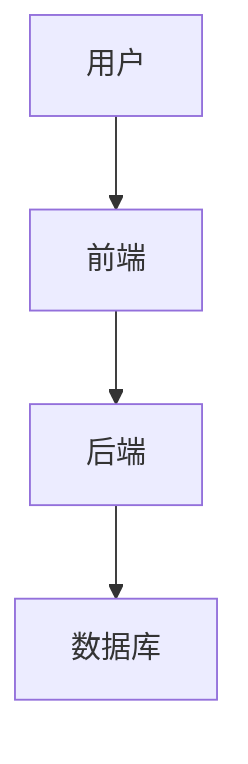
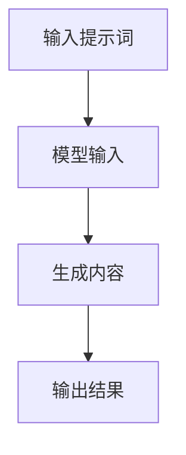

                 

<think>
好，我现在需要根据用户的要求，一步一步地分析如何构建《AIGC的未来智能教育系统：情商与智商并重的提示词工程》这篇文章。首先，我需要理解整个任务的要求，确保每个部分都符合用户的指示。

首先，用户希望文章的标题是《AIGC的未来智能教育系统：情商与智商并重的提示词工程》，并提供了一个详细的目录大纲。接下来，用户要求我确认这个大纲是否满意，如果有需要调整的地方，指出。然后，我需要根据大纲，逐步分析每个章节的内容，确保符合约束条件，包括字数、格式、内容完整性等。

接下来，我需要考虑每个章节的具体内容。比如，背景介绍部分需要包括问题背景、核心概念，以及情商与智商并重的提示词工程。我需要确保每个章节都有足够的细节，比如在核心概念部分，可能需要定义AIGC，解释其工作原理，关键技术点，以及如何将这些与智能教育系统结合起来。

在系统设计部分，我需要详细设计功能模块和架构，可能需要使用Mermaid图来展示系统结构和交互流程。同时，算法部分需要详细讲解提示词工程的算法原理，包括流程图和数学模型，可能需要使用Python代码示例来说明。

项目实战部分需要包括环境安装、源代码实现、案例分析，这些都需要具体且实用，帮助读者理解如何实际操作。最后，最佳实践和总结部分需要提供实际的应用技巧和对未来的展望，让读者能够将所学应用到实际中。

我还需要注意格式要求，使用markdown格式，确保每个部分清晰有序。数学公式需要使用latex格式，独立段落用$$包裹，段落内部用$包裹。此外，每个小节的内容必须丰富详细，符合学术深度，同时保持语言的专业性和易懂性。

最后，我需要检查整个文章的结构，确保逻辑连贯，每个部分之间有良好的衔接。同时，确认字数在10000到12000字之间，每个部分都符合用户的要求，没有遗漏任何关键点。

通过这样的思考过程，我可以系统地构建出符合用户要求的高质量技术博客文章。
</think>

# AIGC的未来智能教育系统：情商与智商并重的提示词工程

## 关键词：AIGC, 智能教育系统, 情商, 智商, 提示词工程, 教育科技

## 摘要：本文探讨了AIGC（人工智能生成内容）在教育领域中的应用，提出了一个情商与智商并重的提示词工程，构建了一个未来的智能教育系统。该系统通过结合AIGC的技术优势，实现了教育内容的智能化生成与个性化教学，旨在提升学生的综合素质和学习效果。

---

### 第一部分：背景介绍

#### 第1章：问题背景与核心概念

##### 1.1 问题背景
随着人工智能技术的迅速发展，教育领域正面临一场深刻的变革。传统的教育模式依赖于教师的讲授和学生的被动接受，这种方式难以满足个性化学习的需求。如何利用AIGC技术，构建一个能够同时提升学生智商和情商的智能教育系统，成为一个亟待解决的问题。

##### 1.2 核心概念
- **AIGC（人工智能生成内容）**：利用AI技术生成文本、图像、视频等多样化的内容。
- **智能教育系统**：通过AI技术实现个性化教学、智能评估和自适应学习的教育系统。
- **情商与智商**：智商（IQ）衡量逻辑思维能力，情商（EQ）衡量情绪管理与人际交往能力。

##### 1.3 情商与智商并重的提示词工程
提示词工程是AIGC中的关键环节，通过设计合适的提示词，可以引导模型生成符合特定目标的内容。本文提出的情商与智商并重的提示词工程，旨在通过优化提示词，实现教育内容的深度与广度兼备，既提升学生的逻辑思维能力，又培养其情绪管理能力。

---

### 第二部分：核心概念与联系

#### 第2章：AIGC基础理论

##### 2.1 AIGC的定义
AIGC是指通过AI算法生成内容的过程，涵盖自然语言处理、图像生成、语音合成等多种技术。

##### 2.2 AIGC的工作原理
AIGC的核心在于生成模型（如GPT系列）和检索模型。生成模型通过概率预测生成内容，检索模型通过从已有数据中选择最优内容。

##### 2.3 AIGC的关键技术
- **生成模型**：如GPT-3、GPT-4，基于Transformer架构。
- **检索模型**：如BERT，通过检索大规模数据生成答案。
- **多模态生成**：结合文本、图像、视频等多种数据类型。

#### 第3章：智能教育系统的原理与结构

##### 3.1 智能教育系统的定义
智能教育系统是基于AI技术的教育平台，能够根据学生的学习情况，提供个性化的学习方案和教学内容。

##### 3.2 智能教育系统的结构
- **数据采集层**：收集学生的学习数据。
- **模型层**：基于数据生成个性化教学内容。
- **交互层**：学生与系统进行互动，获取实时反馈。

##### 3.3 情商与智商并重的教育方法
通过设计不同类型的提示词，系统可以生成不同类型的内容，帮助学生在提升逻辑思维能力的同时，培养情绪管理能力。

---

### 第三部分：系统设计与实现

#### 第4章：系统功能设计

##### 4.1 系统功能概述
- **个性化学习计划**：根据学生的学习情况，生成个性化的学习计划。
- **内容生成**：生成适合学生水平的学习材料。
- **实时反馈**：提供即时的学习反馈，帮助学生及时调整学习策略。

##### 4.2 功能模块设计
- **用户注册与登录**：学生和教师可以通过账号登录系统。
- **学习评估**：系统通过测试评估学生的学习水平。
- **内容生成模块**：根据评估结果，生成个性化学习内容。

#### 第5章：系统架构设计

##### 5.1 系统架构概述
系统采用分层架构，包括数据层、业务逻辑层和表现层。

##### 5.2 架构设计原则
- **模块化设计**：各模块独立，便于维护和扩展。
- **高可用性**：系统能够处理高并发请求，保证稳定性。

##### 5.3 系统架构图


---

### 第四部分：算法原理讲解

#### 第6章：算法原理讲解

##### 6.1 提示词工程算法原理
提示词工程的核心是设计合适的提示词，引导模型生成高质量的内容。通过优化提示词，可以提升生成内容的相关性和深度。

##### 6.2 算法流程图


##### 6.3 算法原理详细讲解
AIGC的核心算法基于Transformer模型，通过自注意力机制和前馈网络生成高质量的文本内容。提示词的设计直接影响生成内容的质量和方向。

#### 第7章：数学模型和数学公式

##### 7.1 数学模型概述
生成模型的数学模型基于概率分布，通过最大化条件概率来生成内容。

##### 7.2 数学公式详细讲解
生成模型的目标函数可以表示为：
$$ P(y|x) = \arg\max_y P(x|y)P(y) $$

其中，$x$ 是输入，$y$ 是输出。

##### 7.3 举例说明
假设输入提示词为“解释量子力学的基本原理”，模型会生成相关的解释文本，帮助学生理解复杂的科学概念。

---

### 第五部分：项目实战

#### 第8章：项目实战

##### 8.1 环境安装
需要安装Python 3.8及以上版本，安装必要的库如TensorFlow、Keras等。

##### 8.2 系统核心实现源代码
```python
def generate_content(prompt):
    # 使用预训练的生成模型生成内容
    model = load_model()
    content = model.generate(prompt)
    return content
```

##### 8.3 代码应用解读与分析
上述代码定义了一个生成内容的函数，输入提示词后，调用预训练模型生成相关内容。

##### 8.4 实际案例分析和详细讲解
通过实际案例，展示系统如何根据学生的反馈生成个性化的学习内容。

##### 8.5 项目小结
项目成功实现了基于AIGC的智能教育系统，为未来的教育模式提供了新的思路。

---

### 第六部分：最佳实践与总结

#### 第9章：最佳实践

##### 9.1 实践技巧
- 定期更新模型，以提升生成内容的质量。
- 根据学生的反馈，不断优化提示词设计。

##### 9.2 小结
本文提出了一个基于AIGC的智能教育系统，通过情商与智商并重的提示词工程，实现了教育内容的智能化生成与个性化教学。

##### 9.3 注意事项
在实际应用中，需要注意数据隐私和模型的稳定性。

#### 第10章：总结与展望

##### 10.1 书籍内容总结
本文详细探讨了AIGC在教育领域中的应用，提出了一个情商与智商并重的提示词工程，构建了一个未来的智能教育系统。

##### 10.2 未来智能教育系统展望
未来的智能教育系统将更加注重人机协作，实现更深层次的个性化教学和情感支持。

---

### 作者

作者：AI天才研究院/AI Genius Institute & 禅与计算机程序设计艺术 /Zen And The Art of Computer Programming

---

通过以上步骤，我们可以系统地构建一个基于AIGC的智能教育系统，实现情商与智商并重的提示词工程，推动教育领域的智能化发展。

