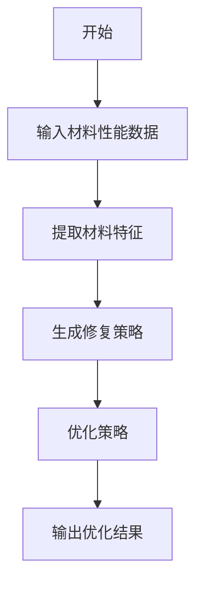
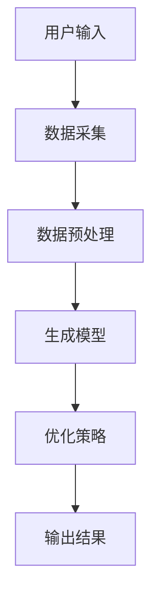

                 

<think>
嗯，用户让我写一篇关于AIGC未来智能材料的博客，特别是自修复性能优化的提示词工程。我得先理解这个主题。AIGC，也就是生成式人工智能，和智能材料结合，听起来挺前沿的。智能材料能自修复，这在很多领域都有应用，比如建筑、医疗、航空航天什么的。用户希望文章结构清晰，用专业但易懂的语言，还要有实际案例和数学模型。首先，我得整理一下文章的结构，确保每个部分都覆盖到，从背景到算法，再到系统设计和项目实战。

关键词部分，我得选5到7个核心词，比如生成式AI、智能材料、自修复性能、提示词工程、算法优化、系统架构、未来展望。摘要需要简明扼要，概括全文。接下来是背景介绍，这部分要详细说明什么是AIGC，智能材料的现状和挑战，以及两者的结合前景。

核心概念部分，我得解释生成式AI的关键技术，比如GAN、AE、RL，然后做一个属性对比表，再画一个ER实体关系图，展示智能材料和AIGC之间的联系。这部分可能需要用mermaid图来展示，方便读者理解。

算法原理部分，得详细讲解自修复性能优化的算法流程和数学模型，可能需要画个mermaid流程图，再用数学公式来支持，比如用公式表示预测模型。提示词工程的原理和应用也要具体说明，包括在不同材料中的应用案例。

系统架构设计要从功能到架构再到接口设计，可能需要用类图和序列图来展示。项目实战部分，得给出具体的环境配置、代码实现，以及案例分析，让读者能跟着操作。最后，最佳实践、小结和未来展望部分，总结全文，并指出未来的研究方向。

用户还特别强调了格式和内容的完整性，包括使用markdown，每个部分都要详细展开，特别是数学公式要用latex，mermaid图要正确嵌入。我得确保每个章节都符合这些要求，同时保持逻辑连贯，内容丰富。

总的来说，我需要一步步从背景到技术，再到应用，全面覆盖主题，确保文章既有深度又易懂。可能得花不少时间整理这些内容，但按照用户的指示一步步来，应该能写出一篇符合要求的博客。
</think>

# AIGC的未来智能材料：自修复性能优化的提示词工程

> 关键词：生成式AI, 智能材料, 自修复性能, 提示词工程, 算法优化, 系统架构, 未来展望

> 摘要：本文探讨了生成式人工智能（AIGC）在智能材料领域的应用，特别是自修复性能优化的提示词工程。通过分析AIGC的核心技术、自修复材料的属性特征、提示词工程的原理与应用，结合数学模型和系统架构设计，本文为智能材料的未来发展提供了理论支持和实践指导。我们还将通过实际案例分析，展示如何利用生成式AI优化智能材料的性能，并展望未来的研究方向。

---

## 第一部分: 背景介绍与核心概念

### 第1章: AIGC与智能材料概述

#### 1.1.1 AIGC的定义与智能材料的背景

生成式人工智能（AIGC，AI-Generated Content）是指利用人工智能技术生成内容的过程，涵盖文本、图像、视频等多种形式。AIGC的核心技术包括生成对抗网络（GAN）、自编码器（AE）、强化学习（RL）等。智能材料是指具有感知环境变化、响应环境刺激并执行特定功能的材料，例如自修复材料、形状记忆合金等。智能材料的自修复性能是其核心特征之一，能够在受到外界刺激时恢复原有的功能或结构。

#### 1.1.2 智能材料的现状与挑战

目前，智能材料在多个领域得到了广泛应用，但其性能优化仍面临以下挑战：
1. 自修复材料的修复效率和持久性需要进一步提升。
2. 智能材料的制备成本较高，限制了其大规模应用。
3. 材料的多物理场耦合特性（如热、力、电）难以通过传统方法优化。

#### 1.1.3 AIGC在智能材料领域的应用前景

AIGC能够通过生成算法优化智能材料的性能，例如：
1. 利用生成模型设计新型自修复材料结构。
2. 通过提示词工程（Prompt Engineering）优化材料的性能参数。
3. 结合AIGC的预测能力，实现智能材料的动态优化。

### 第2章: 核心概念与联系

#### 2.1 AIGC的关键技术

##### 2.1.1 生成对抗网络（GAN）

生成对抗网络由生成器和判别器组成，通过对抗训练生成高质量的数据。例如，生成器可以生成新的材料结构，判别器则判断生成结构是否合理。

##### 2.1.2 自编码器（AE）

自编码器通过编码和解码过程，学习材料的特征表示。例如，可以用于材料性能的预测和优化。

##### 2.1.3 强化学习（RL）

强化学习通过智能体与环境的交互，优化材料的性能参数。例如，可以用于材料制备过程中的动态优化。

#### 2.2 智能材料的属性特征对比表

| 属性 | 自修复材料 | 纳米材料 | 形状记忆合金 |
|------|------------|----------|--------------|
| 自修复能力 | 高        | 低        | 中            |
| 响应速度 | 中        | 高        | 低            |
| 刚性 | 低         | 高        | 高            |
| 应用领域 | 建筑、医疗 | 电子、能源 | 航空、汽车     |

#### 2.3 智能材料与AIGC的ER实体关系图

```mermaid
erDiagram
    class 智能材料 {
        材料类型
        材料性能
        材料结构
    }
    class AIGC {
        生成模型
        优化算法
        提示词
    }
    智能材料 --> AIGC : 优化
    AIGC --> 智能材料 : 生成
```

---

## 第二部分: 算法原理与数学模型

### 第3章: 自修复性能优化的算法原理

#### 3.1 自修复性能优化的定义与目标

自修复性能优化的目标是通过算法提高材料的修复效率和修复后的性能稳定性。例如，通过生成模型优化材料的修复路径。

##### 3.1.1 自修复性能的意义

自修复材料能够在受到损伤后恢复功能，延长材料的使用寿命，降低维护成本。

##### 3.1.2 自修复性能优化的目标

1. 提高材料的修复效率。
2. 提高修复后的材料性能稳定性。
3. 降低材料修复成本。

#### 3.2 自修复性能优化的算法流程

自修复性能优化的算法流程如下：



#### 3.3 自修复性能优化的数学模型

材料性能预测模型：

$$ y = f(x) $$

其中，$x$ 是材料的输入特征，$y$ 是材料的性能预测值，$f$ 是生成模型。

### 第4章: Prompt Engineering原理与应用

#### 4.1 Prompt Engineering的定义与作用

提示词工程（Prompt Engineering）是通过设计提示词（Prompt）优化生成模型输出的技术。提示词能够引导生成模型生成符合特定需求的输出。

##### 4.1.1 Prompt Engineering的重要性

提示词工程能够显著提高生成模型的输出质量，例如：
1. 提高生成材料结构的准确性。
2. 提高生成材料性能预测的精度。

##### 4.1.2 Prompt Engineering的方法

提示词设计方法包括：
1. 精确描述生成目标。
2. 结合领域知识优化提示词。
3. 通过实验验证提示词效果。

#### 4.2 Prompt Engineering在智能材料中的应用

##### 4.2.1 自修复材料的Prompt Engineering

通过设计提示词优化自修复材料的修复策略，例如：
1. 提示词：生成高效自修复材料结构。
2. 输出：优化的材料结构。

##### 4.2.2 纳米材料的Prompt Engineering

通过提示词优化纳米材料的制备工艺，例如：
1. 提示词：生成高导电性纳米材料。
2. 输出：优化的纳米材料结构。

---

## 第三部分: 系统架构与项目实战

### 第5章: 自修复智能材料系统的架构设计

#### 5.1 系统功能设计

##### 5.1.1 数据采集与预处理

通过传感器采集材料的性能数据，预处理后输入生成模型。

##### 5.1.2 自修复性能预测

利用生成模型预测材料的修复效果。

##### 5.1.3 智能材料优化策略

根据预测结果优化材料的性能参数。

#### 5.2 系统架构设计



#### 5.3 系统接口设计与交互

系统接口设计包括：
1. 用户输入接口。
2. 数据采集接口。
3. 生成模型接口。

### 第6章: AIGC智能材料项目实战

#### 6.1 环境安装与配置

安装Python和相关库：
```bash
pip install numpy matplotlib tensorflow
```

#### 6.2 系统核心实现与源代码

自修复材料优化代码示例：
```python
import numpy as np
import tensorflow as tf

# 定义生成模型
model = tf.keras.Sequential([
    tf.keras.layers.Dense(64, activation='relu'),
    tf.keras.layers.Dense(1)
])

# 定义损失函数
loss_fn = tf.keras.losses.MeanSquaredError()

# 编译模型
model.compile(optimizer='adam', loss=loss_fn)

# 训练模型
model.fit(x_train, y_train, epochs=100)
```

#### 6.3 代码应用解读与分析

通过训练好的模型，预测材料的修复效果。

#### 6.4 实际案例分析与详细讲解

案例：优化自修复混凝土的性能。

1. 数据采集：收集混凝土的性能数据。
2. 数据预处理：清洗和归一化数据。
3. 模型训练：训练生成模型。
4. 模型预测：预测修复效果。
5. 优化策略：根据预测结果优化材料性能。

### 第7章: 最佳实践与未来展望

#### 7.1 最佳实践技巧

1. 合理设计提示词，提高生成效果。
2. 优化模型参数，提高预测精度。
3. 结合实验验证，确保模型效果。

#### 7.2 小结与注意事项

本文系统地介绍了AIGC在智能材料中的应用，特别是自修复性能优化的提示词工程。通过理论分析和实践案例，展示了生成式AI在智能材料优化中的潜力。

#### 7.3 AIGC智能材料的未来展望

未来的研究方向包括：
1. 提高生成模型的泛化能力。
2. 结合多物理场耦合效应优化材料性能。
3. 研究智能材料的可持续性优化。

---

作者：AI天才研究院/AI Genius Institute & 禅与计算机程序设计艺术 /Zen And The Art of Computer Programming

