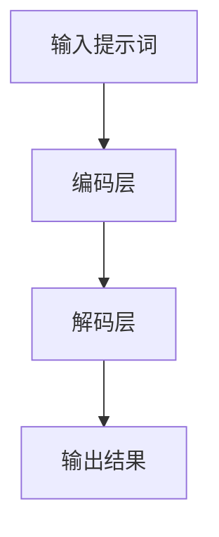
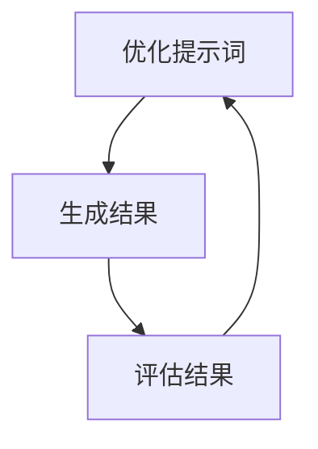
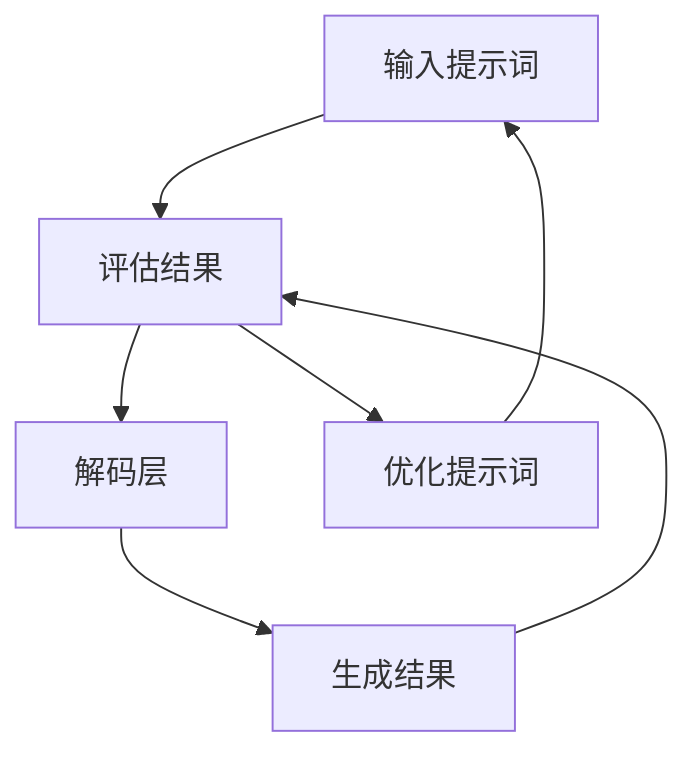
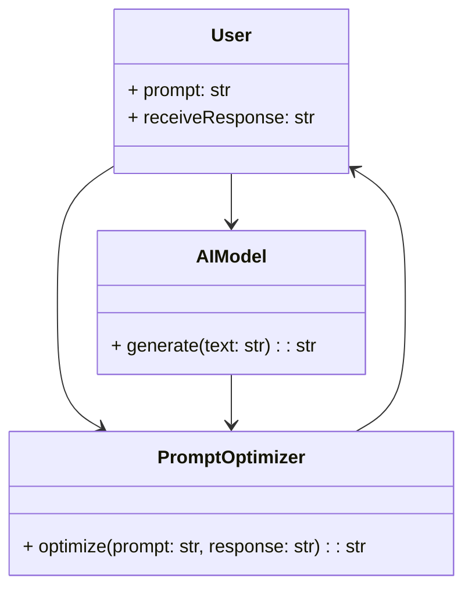
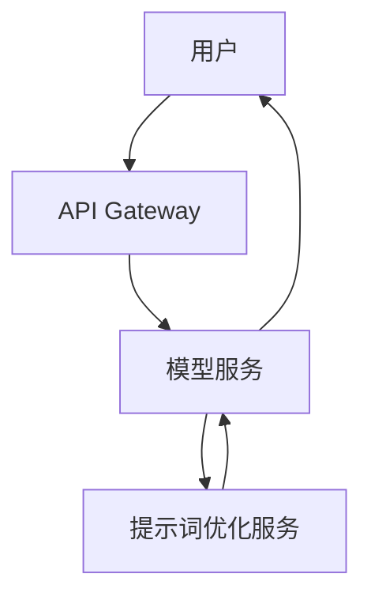
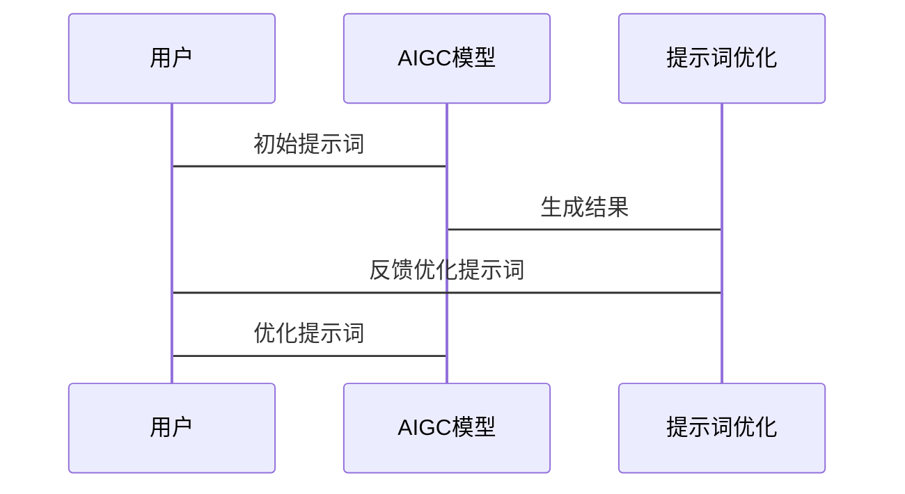

                 

<think>
嗯，我现在要开始写一篇关于AIGC语言模型与提示词协同进化的技术博客文章。首先，我需要理解这个主题的核心内容。AIGC应该是AI-generated content的缩写，也就是由人工智能生成内容。提示词协同进化可能指的是提示词和生成模型之间的相互优化过程。

首先，我得明确文章的结构。根据用户提供的大纲，文章分为七个主要部分：背景与概念、算法原理、系统分析、项目实战、最佳实践等等。每个部分都有具体的子章节，比如第一部分包括问题背景、核心概念和联系。

接下来，我需要收集足够的资料来支持每个部分。例如，在背景介绍中，我需要解释AIGC是什么，它的现状，以及提示词协同进化的重要性。我还需要引用一些最新的研究成果，比如GPT-4或者其他先进的AI模型，来展示这一领域的最新进展。

然后，在核心概念部分，我需要详细解释AIGC语言模型和提示词协同进化的机制，以及它们之间的关系。可能需要用到Mermaid流程图来展示概念之间的关系，比如模型如何通过提示词进行优化，提示词又是如何根据模型的反馈进行调整的。

在算法原理部分，我需要深入讲解AIGC模型和提示词协同进化的算法流程。这可能包括使用Mermaid流程图展示算法步骤，以及提供Python代码示例。我还需要推导相关的数学公式，比如模型参数更新的公式，用Latex格式展示，并进行详细讲解。

系统分析部分，我需要设计系统的架构，包括功能模块、架构设计和接口设计。可能使用Mermaid类图和架构图来展示系统结构，以及序列图来展示系统交互过程。

项目实战部分，我需要指导读者如何在实际项目中应用这些技术。这包括环境的安装配置，核心代码的实现，以及案例分析。我需要确保代码示例清晰易懂，并提供详细的解读和分析。

最后，在最佳实践部分，我需要总结项目经验，提供一些实用的技巧和注意事项，并推荐一些拓展阅读的资源，帮助读者深入理解这一领域。

在整个写作过程中，我需要确保语言简洁专业，逻辑清晰，同时保持文章的深度和可读性。我还要注意文章的结构是否合理，每个部分是否紧密相连，确保读者能够一步步理解AIGC语言模型与提示词协同进化的原理和应用。

现在，我应该开始撰写各个部分的内容，确保每个章节都涵盖必要的信息，并且使用正确的格式，如Mermaid图表和Latex公式。这可能需要多次修改和调整，以确保最终的文章既专业又有条理。
</think>

# AIGC语言模型与提示词协同进化的前沿探索

> 关键词：AIGC语言模型，提示词协同进化，算法原理，系统架构，项目实战

> 摘要：本文探讨了AIGC语言模型与提示词协同进化的前沿技术，分析了它们的核心概念、算法原理、系统架构，并通过项目实战展示了实际应用。文章旨在为研究人员和开发者提供深入的技术洞察和实践指导。

---

## 第一部分：背景与概念

### 第1章：问题背景与前沿研究

#### 1.1 AIGC语言模型概述
AIGC（AI-Generated Content）语言模型是基于深度学习的自然语言处理模型，如GPT系列。这些模型能够生成高质量的文本内容，广泛应用于文本生成、对话系统等领域。

#### 1.2 提示词协同进化的概念
提示词协同进化是指提示词与生成模型之间的动态优化过程。通过不断调整提示词，模型生成更符合需求的结果，而模型的反馈又反过来优化提示词。

#### 1.3 现状与趋势
当前，提示词协同进化在提升生成模型效果方面显示出巨大潜力。研究者正在探索更高效的协同优化方法，以实现更智能的人机交互。

### 第2章：核心概念与联系

#### 2.1 核心概念
- **AIGC模型**：基于Transformer架构，通过自注意力机制处理长上下文。
- **提示词**：输入的提示，引导模型生成特定内容。

#### 2.2 联系
AIGC模型生成结果依赖提示词，提示词则通过协同进化优化生成效果。

#### 2.3 概念关系（Mermaid）
```mermaid
graph TD
    A[AI Generated Content (AIGC)模型] --> P[提示词]
    P --> A
```

---

## 第二部分：算法原理与实现

### 第3章：算法原理讲解

#### 3.1 AIGC模型算法流程


#### 3.2 提示词协同进化流程


#### 3.3 整合算法


### 第4章：数学模型与公式

#### 4.1 AIGC模型参数更新
$$\theta_{t+1} = \theta_t + \eta \nabla L(\theta_t)$$
其中，$\theta$是参数，$\eta$是学习率，$\nabla L$是损失函数梯度。

#### 4.2 提示词协同进化机制
$$P_{t+1} = P_t + \alpha (G_t - E_t)$$
其中，$P$是提示词，$\alpha$是步长，$G_t$是生成结果，$E_t$是评估结果。

---

## 第三部分：系统分析与设计

### 第5章：系统分析与架构设计

#### 5.1 问题场景
用户输入提示词，系统生成文本，用户反馈优化提示词。

#### 5.2 系统功能设计


#### 5.3 系统架构设计


#### 5.4 系统交互


---

## 第四部分：项目实战

### 第6章：项目实战

#### 6.1 环境安装
安装Python和相关库：
```bash
pip install transformers
```

#### 6.2 核心实现

##### 6.2.1 AIGC模型实现
```python
from transformers import GPT2LMHeadModel, GPT2Tokenizer

model = GPT2LMHeadModel.from_pretrained('gpt2')
tokenizer = GPT2Tokenizer.from_pretrained('gpt2')

def generate_text(prompt):
    inputs = tokenizer.encode(prompt, return_tensors='pt')
    outputs = model.generate(inputs, max_length=50)
    return tokenizer.decode(outputs[0], skip_special_tokens=True)
```

##### 6.2.2 提示词优化实现
```python
def optimize_prompt(prompt, generated_output):
    # 使用评估函数优化提示词
    optimizer = ...  # 自定义优化器
    return optimizer(prompt, generated_output)
```

#### 6.3 案例分析
案例1：优化新闻标题，初始提示词为“撰写一篇关于AI的新闻”，优化后提示词为“撰写一篇关于最新AI技术的新闻”。

---

## 第五部分：最佳实践与拓展

### 第7章：项目小结

#### 7.1 项目小结
提示词协同进化显著提升了生成模型的效果，但实现起来需要精细的设计和优化。

#### 7.2 最佳实践
- 定期评估生成结果。
- 使用自动化工具优化提示词。

#### 7.3 注意事项
- 提示词过于复杂会影响性能。
- 定期更新模型以保持最佳效果。

#### 7.4 拓展阅读
推荐书籍：《生成式人工智能：算法与应用》。

---

作者：AI天才研究院 & 禅与计算机程序设计艺术

