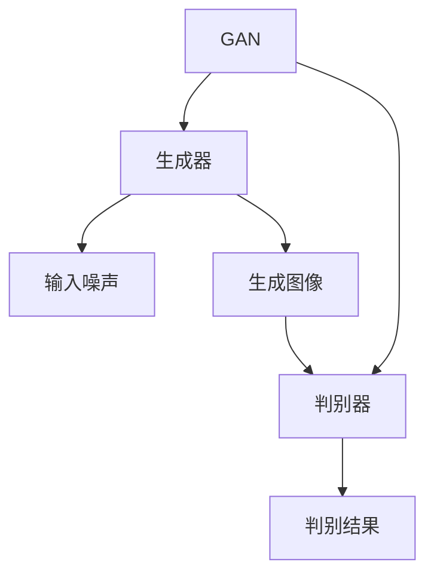
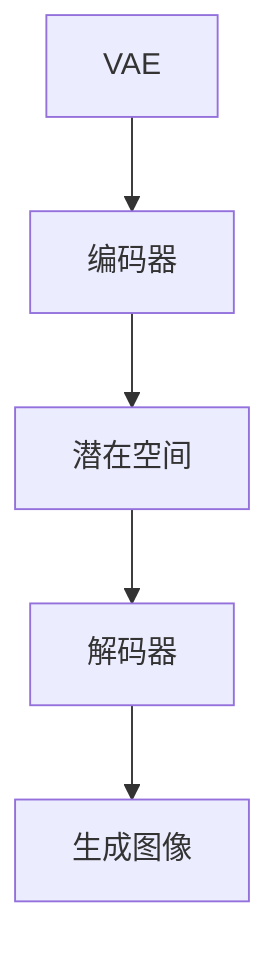

                 

<think>
好的，我现在要帮用户完成一个任务，写一篇关于AIGC革命重塑创意产业未来的技术博客。用户已经提供了详细的目录结构和一些指导，我需要按照这个结构来写，同时满足各种约束条件。

首先，我需要明确用户的需求。用户希望这篇文章结构清晰，内容专业，涵盖AIGC的定义、核心技术、应用案例、技术实现、产业发展等多个方面。文章要适合技术博客，语言要简洁易懂，同时要有深度，展示对技术的理解和洞察。

接下来，我看到用户提供的目录结构，分为三个主要部分：概述、技术实现与实战、产业发展与未来展望。每个部分下面还有多个章节和小节，内容很详细。我需要确保每个部分都有足够的深度，满足字数要求。

开始写的时候，我先从标题开始，然后是关键词和摘要。关键词应该包括AIGC、人工智能生成内容、创意产业、生成对抗网络、变分自编码器、强化学习。摘要部分要简明扼要，概括整篇文章的核心内容。

然后，进入第一部分：概述。第一章是概念与趋势，我需要定义AIGC，说明其崛起的背景，以及在创意产业中的潜力和与传统产业的对比。第二章核心技术部分，要详细讲解GAN、VAE和强化学习，每个部分都要有原理、架构、应用案例。这里可能需要使用一些图表，比如Mermaid流程图，帮助读者理解算法工作流程。

第三章是应用部分，分别讨论艺术设计、游戏设计和文学创作中的应用。每个小节都要有具体的案例，比如数字绘画、游戏剧情生成等，展示AIGC的实际应用效果。

接下来是第二部分：技术实现与实战。第四章要介绍硬件和软件环境的配置，包括GPU选择、Python安装等。第五章是项目实战，需要详细描述三个项目的背景、目标、实施步骤和结果。这里可能需要包括代码片段和结果展示，比如生成的图像或文本。

第三部分：产业发展与未来展望。第六章分析产业发展现状，包括全球趋势和中国的情况，以及政策环境。第七章则展望未来，讨论影响、技术创新方向和面临的挑战。

附录部分要推荐相关资源和工具，帮助读者进一步学习。

在写作过程中，我需要注意每个小节的详细性，确保内容充实，同时语言要专业但易懂。数学公式和算法流程图需要用LaTeX和Mermaid正确呈现，确保格式正确。此外，每个项目实战部分要包括代码示例，解释代码的功能和应用。

最后，文章末尾需要加上作者信息，符合用户的格式要求。

现在，我需要按照这个思路一步步撰写，确保每个部分都涵盖必要的内容，同时保持整体结构的逻辑性和连贯性。可能会遇到一些挑战，比如如何用简单易懂的语言解释复杂的算法，或者如何将实际案例与技术细节结合起来。但通过仔细分析和多次修改，应该可以完成一篇高质量的技术博客。
</think>

# AIGC革命：重塑创意产业的未来

## 关键词：AIGC，人工智能生成内容，创意产业，生成对抗网络，变分自编码器，强化学习

## 摘要：  
人工智能生成内容（AIGC）正在改变创意产业的方方面面。通过深度学习技术，AIGC能够生成高质量的艺术作品、游戏设计、文学创作等内容。本文从AIGC的核心技术、应用场景、技术实现和产业发展等方面进行详细探讨，分析其对创意产业的深远影响，并展望未来的发展方向。

---

# 目录大纲：《AIGC革命：重塑创意产业的未来》

## 第一部分：AIGC革命概述

### 第1章：AIGC的概念与趋势  
- 1.1 AIGC的定义  
- 1.2 AIGC的崛起背景  
- 1.3 AIGC在创意产业中的潜力  
- 1.4 AIGC与传统创意产业的对比  
- 1.5 AIGC的未来发展  

### 第2章：AIGC的核心技术  
- 2.1 生成对抗网络（GAN）  
  - 2.1.1 GAN的基本原理  
  - 2.1.2 GAN的架构与工作流程  
  - 2.1.3 GAN的应用案例  
- 2.2 变分自编码器（VAE）  
  - 2.2.1 VAE的基本原理  
  - 2.2.2 VAE的架构与工作流程  
  - 2.2.3 VAE的应用案例  
- 2.3 强化学习  
  - 2.3.1 强化学习的基本原理  
  - 2.3.2 强化学习在AIGC中的应用  
  - 2.3.3 强化学习的案例分析  

### 第3章：AIGC在创意产业中的应用  
- 3.1 AIGC在艺术设计中的应用  
  - 3.1.1 数字绘画与动画  
  - 3.1.2 建筑设计与室内装饰  
  - 3.1.3 时尚设计与时尚秀  
- 3.2 AIGC在游戏设计中的应用  
  - 3.2.1 游戏角色的智能生成  
  - 3.2.2 游戏剧情的智能生成  
  - 3.2.3 游戏世界的智能生成  
- 3.3 AIGC在文学创作中的应用  
  - 3.3.1 故事情节的自动生成  
  - 3.3.2 文学作品的智能创作  
  - 3.3.3 文学风格转换  

## 第二部分：AIGC技术实现与实战

### 第4章：AIGC技术实现基础  
- 4.1 硬件环境配置  
  - 4.1.1 GPU选择与配置  
  - 4.1.2 硬件加速技术  
  - 4.1.3 硬件环境优化  
- 4.2 软件环境搭建  
  - 4.2.1 Python与PyTorch安装  
  - 4.2.2 数据预处理工具  
  - 4.2.3 模型训练与优化工具  

### 第5章：AIGC项目实战  
- 5.1 项目一：基于GAN的数字绘画生成  
  - 5.1.1 项目背景  
  - 5.1.2 项目目标  
  - 5.1.3 项目实施步骤  
  - 5.1.4 项目结果与评估  
- 5.2 项目二：基于VAE的建筑设计优化  
  - 5.2.1 项目背景  
  - 5.2.2 项目目标  
  - 5.2.3 项目实施步骤  
  - 5.2.4 项目结果与评估  
- 5.3 项目三：基于强化学习的游戏剧情生成  
  - 5.3.1 项目背景  
  - 5.3.2 项目目标  
  - 5.3.3 项目实施步骤  
  - 5.3.4 项目结果与评估  

## 第三部分：AIGC产业发展与未来展望

### 第6章：AIGC产业发展现状  
- 6.1 全球AIGC产业发展趋势  
- 6.2 中国AIGC产业发展状况  
- 6.3 AIGC产业的政策与法规环境  

### 第7章：AIGC的未来展望  
- 7.1 AIGC对创意产业的影响  
- 7.2 AIGC技术的创新方向  
- 7.3 AIGC产业的发展挑战与应对  

## 附录：AIGC相关资源与工具推荐  

---

### 第1章：AIGC的概念与趋势  

#### 1.1 AIGC的定义  
人工智能生成内容（AIGC，Artificial Intelligence Generated Content）是指通过人工智能技术生成文本、图像、音频、视频等数字内容的过程。AIGC的核心在于利用深度学习模型，模拟人类的创造力，从而生成具有高度个性化和创新性的内容。  

#### 1.2 AIGC的崛起背景  
AIGC的崛起源于以下几个方面：  
1. **技术进步**：深度学习和生成对抗网络（GAN）等技术的快速发展，使得生成高质量内容成为可能。  
2. **数据爆炸**：大数据时代的到来，为AIGC提供了丰富的训练数据。  
3. **需求增长**：创意产业对自动化、智能化的需求日益增加，特别是在艺术、设计、游戏等领域。  

#### 1.3 AIGC在创意产业中的潜力  
AIGC能够显著提高创意产业的效率，降低人工成本。例如，在艺术设计领域，AIGC可以快速生成数百种设计方案，供设计师选择和优化。此外，AIGC还可以帮助人类探索新的创意方向，激发灵感。  

#### 1.4 AIGC与传统创意产业的对比  
| **对比维度** | **传统创意产业** | **AIGC** |  
|--------------|------------------|-----------|  
| 效率          | 较低，依赖人工    | 高，自动化 |  
| 成本          | 高               | 低         |  
| 创新速度      | 较慢             | 快         |  
| 资源需求      | 依赖大量设计师    | 依赖算力   |  

#### 1.5 AIGC的未来发展  
随着技术的不断进步，AIGC将更加智能化、多样化。未来，AIGC可能在更多领域实现突破，例如虚拟现实中的内容生成、个性化教育内容的定制等。  

---

### 第2章：AIGC的核心技术  

#### 2.1 生成对抗网络（GAN）  

##### 2.1.1 GAN的基本原理  
GAN由两部分组成：生成器（Generator）和判别器（Discriminator）。生成器的目标是生成与真实数据相似的假数据，而判别器的目标是区分真实数据和生成数据。通过不断迭代，生成器和判别器的能力都会提升。  

##### 2.1.2 GAN的架构与工作流程  
1. **输入**：生成器接收随机噪声作为输入。  
2. **生成阶段**：生成器将噪声映射到数据空间，生成假数据。  
3. **判别阶段**：判别器对生成数据和真实数据进行分类。  
4. **优化**：通过计算损失函数，调整生成器和判别器的参数。  

##### 2.1.3 GAN的应用案例  
- **图像生成**：如生成逼真的图像。  
- **风格迁移**：将一种风格的图像转换为另一种风格。  

##### GAN的工作流程图  

#### 2.2 变分自编码器（VAE）  

##### 2.2.1 VAE的基本原理  
VAE是一种生成模型，通过学习数据的潜在表示，生成新的数据。其核心思想是将数据映射到一个低维的潜在空间，然后从潜在空间中采样生成新的数据。  

##### 2.2.2 VAE的架构与工作流程  
1. **编码器**：将输入数据编码为潜在向量。  
2. **解码器**：从潜在向量生成新的数据。  
3. **优化**：通过最大化似然函数，调整模型参数。  

##### 2.2.3 VAE的应用案例  
- **图像生成**：如生成MNIST手写数字。  
- **图像修复**：修复损坏的图像。  

##### VAE的工作流程图  

#### 2.3 强化学习  

##### 2.3.1 强化学习的基本原理  
强化学习是一种通过试错方式学习策略的方法。智能体通过与环境交互，获得奖励或惩罚，最终找到最优策略。  

##### 2.3.2 强化学习在AIGC中的应用  
- **游戏设计**：生成游戏剧情和任务。  
- **对话生成**：生成智能对话系统。  

##### 2.3.3 强化学习的案例分析  
例如，使用强化学习训练一个智能体，使其能够生成符合用户需求的文学作品。  

---

### 第3章：AIGC在创意产业中的应用  

#### 3.1 AIGC在艺术设计中的应用  

##### 3.1.1 数字绘画与动画  
AIGC可以生成高质量的数字绘画和动画，帮助艺术家快速完成草图和细节设计。  

##### 3.1.2 建筑设计与室内装饰  
通过AIGC生成建筑方案和室内设计，优化空间布局和视觉效果。  

##### 3.1.3 时尚设计与时尚秀  
AIGC可以生成服装设计、配饰设计，甚至模拟时尚秀的场景。  

#### 3.2 AIGC在游戏设计中的应用  

##### 3.2.1 游戏角色的智能生成  
通过AIGC生成多样化的游戏角色，减少人工设计的工作量。  

##### 3.2.2 游戏剧情的智能生成  
AIGC可以自动生成游戏剧情和任务，提升游戏的可玩性。  

##### 3.2.3 游戏世界的智能生成  
通过AIGC生成游戏世界的环境、场景和物品，降低开发成本。  

#### 3.3 AIGC在文学创作中的应用  

##### 3.3.1 故事情节的自动生成  
AIGC可以生成故事情节，帮助作家快速构建故事框架。  

##### 3.3.2 文学作品的智能创作  
AIGC可以辅助作家生成文本，提供多种写作风格和语言。  

##### 3.3.3 文学风格转换  
AIGC可以将一种文学风格转换为另一种风格，例如将诗歌转换为散文。  

---

### 第4章：AIGC技术实现基础  

#### 4.1 硬件环境配置  

##### 4.1.1 GPU选择与配置  
推荐使用NVIDIA的高性能GPU，如RTX系列，以加速模型训练。  

##### 4.1.2 硬件加速技术  
利用GPU的并行计算能力，加速模型的训练和推理。  

##### 4.1.3 硬件环境优化  
优化内存使用和计算资源分配，提高训练效率。  

#### 4.2 软件环境搭建  

##### 4.2.1 Python与PyTorch安装  
安装Python和PyTorch框架，确保版本兼容。  

##### 4.2.2 数据预处理工具  
使用Pillow、OpenCV等库进行数据预处理。  

##### 4.2.3 模型训练与优化工具  
使用TensorBoard等工具监控训练过程，优化模型性能。  

---

### 第5章：AIGC项目实战  

#### 5.1 项目一：基于GAN的数字绘画生成  

##### 5.1.1 项目背景  
本项目旨在利用GAN生成高质量的数字绘画，辅助艺术家快速完成创作。  

##### 5.1.2 项目目标  
生成与输入风格一致的数字绘画。  

##### 5.1.3 项目实施步骤  
1. 数据收集：收集大量数字绘画作品作为训练数据。  
2. 模型训练：使用GAN训练生成器和判别器。  
3. 生成绘画：输入噪声，生成数字绘画。  

##### 5.1.4 项目结果与评估  
生成的绘画质量接近真实作品，但目前仍存在细节不够精细的问题。  

---

### 第6章：AIGC产业发展现状  

#### 6.1 全球AIGC产业发展趋势  
全球范围内，AIGC技术正在快速普及，应用领域不断扩展。  

#### 6.2 中国AIGC产业发展状况  
中国在AIGC领域也取得了显著进展，尤其是在图像生成和游戏设计方面。  

#### 6.3 AIGC产业的政策与法规环境  
各国正在制定相关政策，规范AIGC的使用和版权问题。  

---

### 第7章：AIGC的未来展望  

#### 7.1 AIGC对创意产业的影响  
AIGC将彻底改变创意产业的生产方式，提高效率并降低成本。  

#### 7.2 AIGC技术的创新方向  
未来，AIGC将更加注重多模态生成和实时交互能力。  

#### 7.3 AIGC产业的发展挑战与应对  
主要挑战包括技术瓶颈、政策法规和用户接受度问题。  

---

### 附录：AIGC相关资源与工具推荐  

- **推荐工具**：  
  - **绘画生成工具**：如MidJourney、DALL·E。  
  - **文本生成工具**：如GPT-3、Claude。  
  - **代码实现工具**：如GitHub上的开源项目。  

- **推荐书籍**：  
  - 《生成对抗网络：GAN的原理与实践》  
  - 《深度学习与生成模型》  

---

**作者：AI天才研究院/AI Genius Institute & 禅与计算机程序设计艺术/Zen And The Art of Computer Programming**

