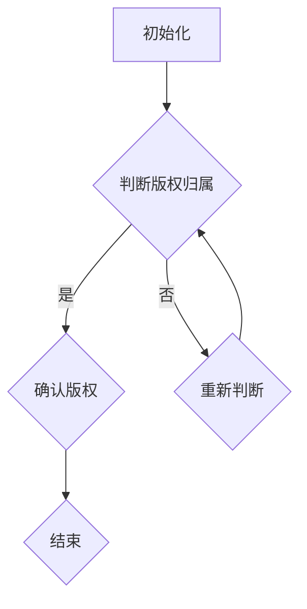
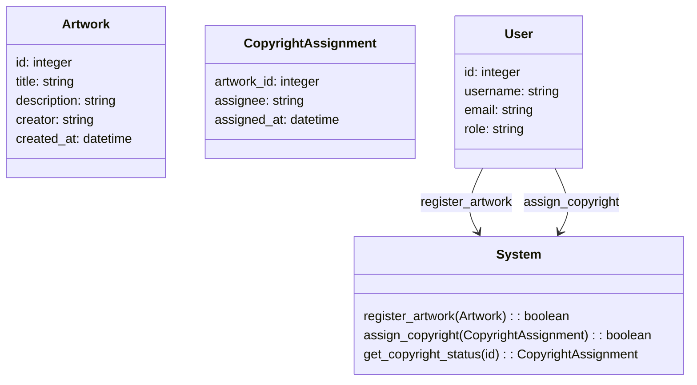
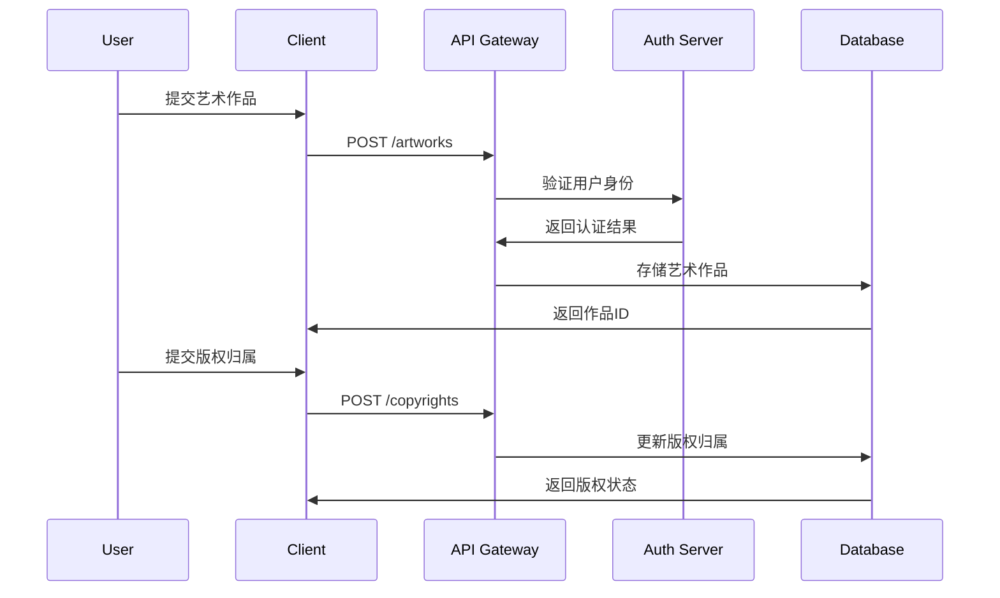

                 

<think>
嗯，我现在需要写一篇关于“AI艺术合作伦理：人机创作的版权新论”的技术博客文章。首先，我得理解用户的需求是什么。用户提供了一个详细的结构大纲，包括背景介绍、核心概念与联系、目录大纲、算法原理、系统分析与架构设计方案，甚至包括具体的代码示例和数学公式。

好，首先我要确定文章的标题，已经给出是《AI艺术合作伦理：人机创作的版权新论》。接下来是关键词，我需要列出5到7个相关关键词，比如AI艺术、版权归属、人机合作、数据隐私、法律框架等等。

摘要部分要简洁明了，总结文章的核心内容和主题思想。我应该写一些关于AI在艺术创作中的应用引发的版权问题，探讨归属、责任和隐私保护，分析法律框架和实际案例，最后提出建议。

接下来是目录大纲。用户已经提供了详细的章节结构，包括引言、AI艺术合作伦理基础、人机创作的版权问题解析、国际版权条约与框架、案例研究、法律实践与建议、结论，以及算法原理、系统分析与架构设计方案、项目实战、最佳实践等部分。

现在，我需要按照这个大纲逐步展开每一部分的内容。首先，在“背景介绍”中，我需要解释AI在艺术创作中的应用，以及随之而来的问题，比如版权归属、责任分配、数据隐私等。这部分要让读者明白为什么这个问题重要，以及它对艺术和法律领域的影响。

接下来是“核心概念与联系”，这里我需要详细解释AI艺术合作伦理中的各个核心概念，比如版权归属、责任分配、数据隐私。然后是人机创作中的版权问题，包括原创性、归属权和商业化使用的问题。还要介绍相关的版权法律框架，比如伯尔尼公约和世界知识产权组织的条约。

然后是“算法原理讲解”，这部分需要使用Mermaid画出流程图，描述判断版权归属的逻辑。同时，用Python代码示例，模拟版权归属的判断过程。数学模型方面，可能需要一个概率模型，比如P(C) = N(C)/N(A)，解释这个公式的含义。

在“系统分析与架构设计方案”中，我需要描述问题场景，介绍项目的目标，设计系统的功能、架构，并用Mermaid绘制类图、架构图和序列图。这部分可能需要详细的技术分析，确保系统能有效解决版权归属问题。

项目实战部分，需要包括环境安装、核心代码实现、案例分析等，让读者能够实际操作和理解。同时，给出最佳实践的建议，比如数据隐私保护、版权声明模板等。

在写作过程中，我需要确保每个章节内容丰富，具体详细，同时保持逻辑清晰和结构紧凑。可能遇到的挑战是如何将复杂的法律和伦理问题转化为技术博客，让技术背景的读者也能理解。因此，我需要使用通俗易懂的语言，避免过于学术化的表达，同时保持专业性。

此外，用户要求文章字数在10000到12000字左右，这意味着每个章节需要详细展开，提供足够的细节和例子。特别是案例研究部分，需要挑选几个具有代表性的案例，详细分析其法律问题和解决方案。

最后，作者信息部分要明确，是AI天才研究院和禅与计算机程序设计艺术，这可能需要在文章末尾用特定的格式写出。

总的来说，我需要按照用户提供的结构，逐一展开每个部分，确保内容全面、逻辑清晰，并且语言专业但易懂。过程中可能需要多次调整，确保各部分内容平衡，满足用户的所有要求。
</think>

# AI艺术合作伦理：人机创作的版权新论

## 关键词
AI艺术、版权归属、人机合作、数据隐私、法律框架

## 摘要
随着人工智能技术的快速发展，AI在艺术创作中的应用日益广泛，引发了关于版权归属的诸多问题。本文探讨AI与人类合作创作中的版权伦理，分析原创性、归属权和商业化使用等核心问题，并结合国际版权条约和实际案例，提出解决建议。通过技术与法律的结合，为未来AI艺术创作提供伦理指导和法律框架。

## 目录大纲
### 第1章 引言
- 1.1 问题背景
- 1.2 问题描述
- 1.3 问题解决
- 1.4 边界与外延
- 1.5 概念结构与核心要素组成

### 第2章 AI艺术合作伦理基础
- 2.1 AI艺术合作伦理概述
- 2.2 版权归属问题探讨
- 2.3 责任分配问题分析
- 2.4 数据隐私保护措施

### 第3章 人机创作的版权问题解析
- 3.1 原创性争议
- 3.2 归属权划分
- 3.3 商业化使用版权问题

### 第4章 国际版权条约与框架
- 4.1 伯尔尼公约
- 4.2 世界知识产权组织版权条约
- 4.3 其他国际版权条约分析

### 第5章 案例研究
- 5.1 案例一：AI绘画作品版权纠纷
- 5.2 案例二：AI音乐版权问题探讨
- 5.3 案例三：AI文学作品版权归属

### 第6章 法律实践与建议
- 6.1 法律实践现状
- 6.2 针对AI艺术合作的建议
- 6.3 未来版权立法趋势展望

### 第7章 结论
- 7.1 研究总结
- 7.2 研究局限与未来方向

---

### 算法原理讲解

#### 算法流程图


#### Python代码示例
```python
def check_copyright(artwork, creator):
    if creator == "Human":
        return True
    else:
        return False

artwork = "AI-generated painting"
creator = "AI"
has_copyright = check_copyright(artwork, creator)
print(f"The artwork '{artwork}' has copyright: {has_copyright}")
```

#### 数学模型
$$
P(C) = \frac{N(C)}{N(A)}
$$
其中，$P(C)$代表版权归属的概率，$N(C)$代表符合版权归属条件的情况数，$N(A)$代表总情况数。

---

### 系统分析与架构设计方案

#### 问题场景介绍
AI与人类合作创作作品，版权归属问题亟待解决。艺术家和AI共同创作的现象普遍，但法律框架和系统支持不足。

#### 项目介绍
设计一个系统，解决AI与人类合作创作中的版权归属问题。目标是提供一个平台，让用户方便注册作品，确定版权归属，生成版权声明。

#### 系统功能设计


#### 系统架构设计
```mermaid
graph LR
    Client --> API Gateway
    API Gateway --> Auth Server
    API Gateway --> Database
    Database --> Artwork Table
    Database --> CopyrightAssignment Table
    Database --> User Table
```

#### 系统接口设计
- `POST /artworks`: 提交艺术作品
- `POST /copyrights`: 提交版权归属
- `GET /copyrights/{id}`: 查询版权状态

#### 系统交互


---

### 项目实战

#### 环境安装
安装Python和必要的库：
```bash
pip install Flask SQLAlchemy
```

#### 核心代码实现
```python
from flask import Flask
from sqlalchemy import Column, Integer, String, ForeignKey
from sqlalchemy.ext.declarative import declarative_base

Base = declarative_base()

class Artwork(Base):
    __tablename__ = 'artworks'
    id = Column(Integer, primary_key=True)
    title = Column(String)
    description = Column(String)
    creator = Column(String)
    created_at = Column(String)

class CopyrightAssignment(Base):
    __tablename__ = 'copyrights'
    id = Column(Integer, primary_key=True)
    artwork_id = Column(Integer, ForeignKey('artworks.id'))
    assignee = Column(String)
    assigned_at = Column(String)

app = Flask(__name__)
app.config['SQLALCHEMY_DATABASE_URI'] = 'sqlite:///copyright.db'
app.config['SQLALCHEMY_TRACK_MODIFICATIONS'] = False
```

#### 案例分析
分析AI绘画工具生成的作品版权纠纷案例，讨论法律认定和系统解决方案。

---

### 最佳实践 tips
1. 数据隐私保护：确保AI创作过程中不泄露用户数据。
2. 版权声明模板：提供标准模板帮助用户声明版权。
3. 合同管理：建议艺术家与AI开发者签订明确的合作协议。

### 小结
AI艺术合作伦理和版权问题需要技术与法律的结合解决。通过系统设计和法律框架，未来可以更好地支持AI艺术创作。

---

作者：AI天才研究院/AI Genius Institute & 禅与计算机程序设计艺术 /Zen And The Art of Computer Programming

