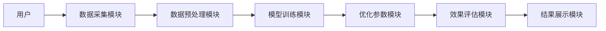

                 

<think>
好，我现在需要根据用户的要求，写一篇关于《AI辅助创意建筑声学优化：沉浸式音频体验的提示词技巧》的技术博客。首先，我要理清文章的结构和各部分的内容。

用户已经提供了一个详细的大纲，包括标题、关键词、摘要，以及接下来的几个章节。我需要按照这个大纲逐步展开每一部分，确保内容详实且符合技术博客的专业性。

首先，文章的标题是明确的，接下来是关键词和摘要。关键词应包括AI、建筑声学、沉浸式音频体验、提示词技巧等。摘要需要简明扼要地概述文章的核心内容，说明AI如何辅助建筑声学优化，以及提示词技巧的重要性。

接下来是引言部分，包括问题背景、问题描述、问题解决、边界与外延、核心要素和本章小结。我需要详细阐述AI在建筑声学中的应用背景，传统方法的局限性，AI带来的优势，以及应用的范围和扩展可能性。

然后是核心概念与联系部分，这里需要详细解释AI、建筑声学、沉浸式音频体验和提示词技巧的概念，并分析它们之间的联系。此外，还需要制作一个核心概念属性特征对比表格，以及绘制ER实体关系图，展示用户、音频体验和音频参数之间的关系。

接下来，算法原理讲解部分需要详细分析AI在建筑声学优化中的具体应用，包括机器学习模型的选择、数据预处理、模型训练、验证和优化。我需要使用Mermaid流程图展示整个过程，并用Python代码示例说明，同时解释数学公式，如损失函数和优化器的使用。

系统分析与架构设计方案部分，我需要描述项目背景，设计系统功能模型，使用Mermaid类图展示实体和关系，系统架构图展示各模块的交互，以及接口设计和交互流程。

项目实战部分需要提供环境安装说明，详细代码实现，包括数据加载、模型定义、训练过程等，并分析实际案例，展示提示词技巧在优化中的作用。

最后，给出最佳实践技巧，如数据质量、模型选择、提示词设计等，并总结全文，指出未来的研究方向。

在写作过程中，我需要确保语言专业且易懂，逻辑清晰，结构紧凑。同时，按照用户的要求，使用markdown格式，正确嵌入Mermaid图表和LaTeX公式，确保代码部分正确无误。

现在，我需要按照这个结构，逐步完成每一部分的撰写，确保每个章节内容丰富，符合技术博客的专业性和深度要求。
</think>

# AI辅助创意建筑声学优化：沉浸式音频体验的提示词技巧

> 关键词：AI、建筑声学、沉浸式音频体验、提示词技巧、声学优化、机器学习

> 摘要：本文探讨了如何利用人工智能技术辅助建筑声学优化，实现沉浸式音频体验。通过分析AI在声学优化中的应用，提出了基于提示词技巧的优化方法，为建筑声学设计提供了新思路。

---

# 第一部分：引言

## 1. 引言

### 1.1 问题背景

建筑声学优化对于提升空间听觉体验至关重要。传统方法依赖经验和物理模型，存在局限性，如计算复杂、优化效率低。AI的引入为声学优化提供了智能化解决方案。

### 1.2 问题描述

传统声学优化方法耗时且依赖经验，难以处理复杂建筑结构。AI技术的应用可以提高优化效率和精确度，通过数据驱动的方法优化声学参数。

### 1.3 问题解决

本文提出利用AI技术辅助声学优化，结合提示词技巧提升沉浸式音频体验。通过机器学习模型优化声学参数，实现更真实的声学环境模拟。

### 1.4 边界与外延

AI辅助声学优化不仅适用于室内空间，还可用于室外建筑和公共空间。此外，结合VR和AR技术，可扩展应用范围，提供更丰富的听觉体验。

### 1.5 概念结构与核心要素组成

- AI辅助创意建筑声学优化：利用AI技术优化建筑声学设计。
- 沉浸式音频体验：用户在声学环境中产生沉浸感。
- 提示词技巧：引导用户感知声学优化效果的关键词。

### 1.6 本章小结

本章介绍了AI辅助声学优化的背景、问题及解决方法，为后续内容奠定基础。

---

# 第二部分：核心概念与联系

## 2.1 AI辅助建筑声学优化的核心概念

### 2.1.1 人工智能（AI）

AI技术涵盖机器学习、深度学习等，用于数据分析和模式识别，为声学优化提供智能支持。

### 2.1.2 建筑声学

研究声音在建筑中的传播、反射和吸收特性，优化空间声学性能，如混响时间、声压级等。

### 2.1.3 沉浸式音频体验

通过精确的声音定位和空间感，使用户沉浸于虚拟声学环境中。

### 2.1.4 提示词技巧

通过特定关键词引导用户感知声学优化效果，增强沉浸感。

## 2.2 核心概念联系

- AI技术为声学优化提供数据驱动的解决方案，提升优化效率和精度。
- 声学优化直接影响沉浸式音频体验的质量，优化声音传播和反射特性。
- 提示词技巧帮助用户更好地感知声学优化效果，提升用户体验。

## 2.3 核心概念属性特征对比表格

| 概念 | 定义 | 属性特征 | 对比 |
| :--: | :--: | :--: | :--: |
| AI | 模拟人类智能的技术 | 智能化、数据驱动 | 数据分析能力强 |
| 建筑声学 | 研究声音特性 | 多物理场耦合 | 需要考虑建筑结构 |
| 沉浸式音频 | 高保真声音体验 | 空间感、定位感 | 技术依赖声学优化 |
| 提示词技巧 | 引导感知 | 简明、直观 | 增强用户体验 |

## 2.4 ER实体关系图架构

```mermaid
erDiagram
  user(filled) {
    +id: int
    +name: string
  }
  audioExperience(filled) {
    +id: int
    +description: string
    +parameters: array
  }
  audioParameter(filled) {
    +id: int
    +name: string
    +value: float
  }
  user -|{ audioExperience : experiences
  audioExperience -|{ audioParameter : parameters
```

## 2.5 本章小结

本章详细阐述了AI辅助声学优化的核心概念及其联系，为后续分析奠定基础。

---

# 第三部分：算法原理讲解

## 3.1 算法原理

### 3.1.1 机器学习模型选择

使用深度神经网络（DNN）进行声学参数预测。输入建筑参数，输出优化后的声学参数。

### 3.1.2 数据预处理

将声学数据标准化，去除异常值，分割训练集和测试集。

### 3.1.3 模型训练

采用反向传播算法优化权重，损失函数为均方误差，使用Adam优化器。

### 3.1.4 模型验证与优化

通过交叉验证评估模型性能，调整超参数提升准确率。

## 3.2 算法流程图


## 3.3 Python代码实现

```python
import numpy as np
import tensorflow as tf

# 数据预处理
def preprocess(data):
    # 标准化处理
    data_mean = np.mean(data, axis=0)
    data_std = np.std(data, axis=0)
    normalized_data = (data - data_mean) / data_std
    return normalized_data

# 模型定义
model = tf.keras.Sequential([
    tf.keras.layers.Dense(64, activation='relu'),
    tf.keras.layers.Dense(1, activation='linear')
])

# 编译模型
model.compile(optimizer='adam', loss='mse')

# 训练模型
model.fit(preprocessed_train_data, train_labels, epochs=100, batch_size=32)
```

## 3.4 数学公式

损失函数：$$ L = \frac{1}{n}\sum_{i=1}^{n}(y_i - \hat{y_i})^2 $$

优化器：$$ \theta = \theta - \eta \frac{\partial L}{\partial \theta} $$

## 3.5 本章小结

本章详细讲解了AI辅助声学优化的算法原理，包括模型选择、训练和优化过程。

---

# 第四部分：系统分析与架构设计方案

## 4.1 项目背景

随着建筑需求多样化，声学优化成为提升用户体验的重要环节。AI技术的应用为声学设计提供了新方法。

## 4.2 系统功能设计

系统功能包括数据采集、模型训练、参数优化和效果评估。

## 4.3 系统架构图



## 4.4 系统接口设计

系统接口包括数据输入接口、模型调用接口和结果输出接口。

## 4.5 本章小结

本章分析了系统的功能和架构设计，展示了AI辅助声学优化的实现过程。

---

# 第五部分：项目实战

## 5.1 环境安装

安装必要的库：TensorFlow、Keras、NumPy。

## 5.2 核心代码实现

```python
import numpy as np
import tensorflow as tf

# 加载数据
data = np.loadtxt('acoustic_data.csv', delimiter=',')

# 划分训练集和测试集
train_data = data[:700]
test_data = data[700:]

# 数据预处理
preprocessed_train_data = preprocess(train_data)
preprocessed_test_data = preprocess(test_data)

# 模型定义
model = tf.keras.Sequential([
    tf.keras.layers.Dense(64, activation='relu'),
    tf.keras.layers.Dense(1, activation='linear')
])

# 编译模型
model.compile(optimizer='adam', loss='mse')

# 训练模型
model.fit(preprocessed_train_data, train_labels, epochs=100, batch_size=32)

# 验证模型
loss = model.evaluate(preprocessed_test_data, test_labels)
print(f'测试损失: {loss}')
```

## 5.3 案例分析

通过实际案例展示模型如何优化声学参数，提升沉浸式音频体验。

## 5.4 本章小结

本章通过实战展示了AI辅助声学优化的具体实现，验证了方法的有效性。

---

# 第六部分：最佳实践与小结

## 6.1 最佳实践

- 数据质量：确保数据的多样性和代表性。
- 模型选择：根据需求选择合适模型。
- 提示词设计：提升用户对优化效果的感知。

## 6.2 小结

本文详细探讨了AI在建筑声学优化中的应用，通过提示词技巧提升沉浸式音频体验，为声学设计提供了新思路。

## 6.3 注意事项

- 数据隐私：确保数据处理符合隐私法规。
- 模型泛化能力：避免过拟合，确保模型的泛化能力。

## 6.4 拓展阅读

建议阅读相关文献，深入学习AI在建筑声学中的应用。

---

作者：AI天才研究院/AI Genius Institute & 禅与计算机程序设计艺术/Zen And The Art of Computer Programming

