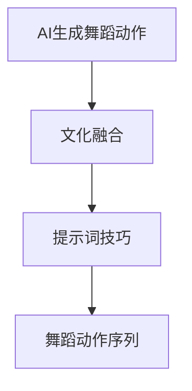
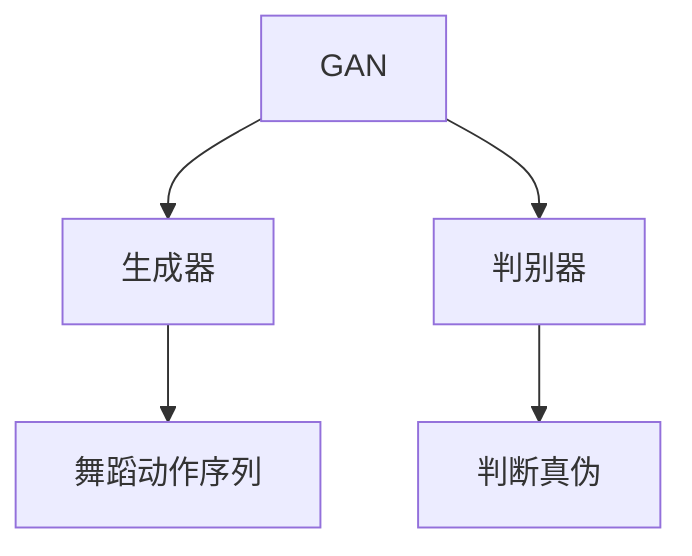
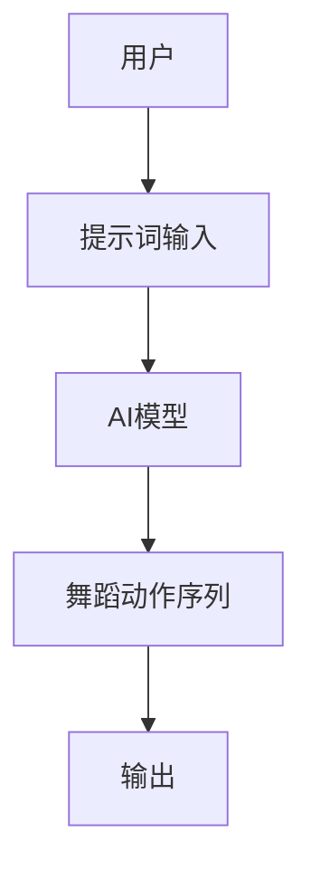
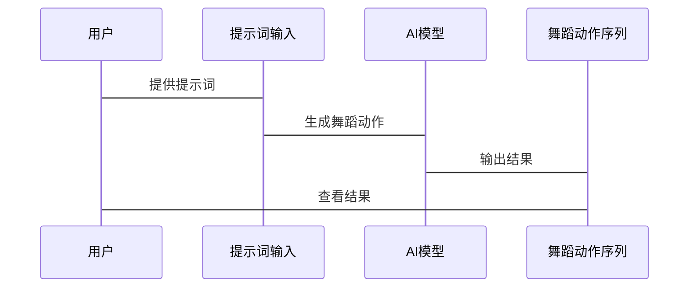

                 

<think>
嗯，我需要帮用户写一篇关于AI辅助创意舞蹈动作生成的博客文章。标题是《AI辅助创意舞蹈动作生成：文化融合编舞的提示词技巧》。用户还提供了一个详细的结构大纲，包括摘要、关键词和各个章节的内容。

首先，我得理解用户的需求。用户希望文章结构清晰，逻辑紧凑，用专业的技术语言，但又要易懂。我需要按照目录大纲一步步来写，每个章节都要详细讲解。

接下来，我得看看摘要部分。摘要需要简明扼要，说明文章的核心内容，也就是AI如何帮助生成舞蹈动作，特别是文化融合的部分，以及提示词技巧的重要性。

然后是关键词，大约5-7个，可能包括AI、舞蹈生成、文化融合、编舞、提示词技巧等等。

接下来是章节部分。每个章节都需要有详细的子点，比如背景介绍、核心概念、AI工具和技术、案例研究等等。我需要确保每个部分都有足够的深度，可能包括技术原理、算法流程、数学公式、系统架构图等。

在写背景介绍时，我需要解释AI在舞蹈中的历史应用，以及文化融合在舞蹈编排中的重要性。这部分可能需要一些历史背景和当前趋势的分析。

核心概念部分，我需要定义AI和舞蹈生成的基本概念，解释AI是如何生成舞蹈动作的，以及文化融合在编舞中的具体应用。可能需要对比不同的方法，比如基于规则的生成和深度学习生成的区别。

AI工具和技术章节，我需要列举一些常用的工具，比如深度伪造、生成对抗网络等，详细说明它们的工作原理和优缺点。同时，要介绍提示词技巧，如何通过提示词来控制生成的舞蹈动作，比如情感、速度、节奏等。

案例研究部分，我需要找到几个实际的例子，说明AI在舞蹈编排中的应用，分析成功之处和遇到的挑战。这可能包括一些具体的舞蹈作品，展示文化融合的效果。

在系统分析和架构设计部分，我需要画出领域模型、架构图和交互图，可能使用Mermaid来展示。这涉及到系统功能设计、接口设计和交互流程。

项目实战部分，我需要提供环境安装步骤，比如安装Python和相关库，然后给出生成舞蹈动作的代码示例。代码需要详细解释，说明每个部分的功能，并通过具体案例分析结果。

最后，我需要总结最佳实践，提供一些小贴士和注意事项，帮助读者更好地应用这些技术。还要包括拓展阅读的内容，推荐一些相关书籍或资源。

在写作过程中，我需要确保每个部分都符合用户的格式要求，使用markdown，并且每个章节内容足够丰富，包含必要的技术细节和实例。数学公式要用latex，算法流程图用Mermaid，系统架构图也要用相应工具展示。

可能我需要先从背景介绍开始，逐步展开各个章节，确保逻辑连贯。同时，要检查每个部分是否覆盖了用户要求的核心内容，比如背景、核心概念、算法原理、系统架构、实战案例等。

总的来说，这篇文章需要结合技术与艺术，详细解释AI在舞蹈编排中的应用，特别是文化融合的部分，同时提供实用的提示词技巧和案例分析，帮助读者理解并实际应用这些技术。
</think>

# AI辅助创意舞蹈动作生成：文化融合编舞的提示词技巧

> 关键词：AI，舞蹈生成，文化融合，编舞，提示词技巧

> 摘要：  
本文探讨了人工智能在创意舞蹈动作生成中的应用，特别是通过文化融合编舞的提示词技巧。文章详细分析了AI在舞蹈创作中的背景、核心概念、工具与技术、案例研究以及实际应用，揭示了AI如何通过提示词优化舞蹈动作生成，实现文化融合与创新。结合系统架构设计和算法原理，本文为舞蹈艺术家和AI开发者提供了实用的指导，帮助他们更好地利用AI技术推动舞蹈艺术的发展。

---

## 1. 引言

在艺术与技术的交汇处，人工智能（AI）正在为创意舞蹈带来前所未有的可能性。AI不仅能够生成复杂的舞蹈动作，还能通过文化融合的方式，创造出独特的编舞风格。本文将深入探讨AI在舞蹈生成中的作用，特别是提示词技巧如何帮助艺术家实现文化融合的编舞目标。

---

## 2. 背景介绍

### 2.1 AI在舞蹈中的历史与应用

AI在舞蹈中的应用可以追溯到早期的计算机图形学和运动捕捉技术。然而，随着深度学习的兴起，AI在舞蹈生成中的角色变得更加重要。AI能够通过分析大量舞蹈动作数据，生成创新的动作序列，为编舞提供灵感。

### 2.2 文化融合在舞蹈中的重要性

舞蹈不仅是身体的表达，更是文化的载体。通过AI生成的舞蹈动作，艺术家可以将不同文化元素融合在一起，创造出独特的舞蹈风格。例如，将印度古典舞的动作与现代街舞结合，生成一种全新的舞蹈形式。

### 2.3 问题背景与提示词的作用

传统的舞蹈生成方法依赖于人类编舞者的经验，而AI的引入为这一过程提供了新的可能性。然而，如何让AI理解文化融合的需求，是当前面临的主要挑战。提示词技巧通过明确的输入指令，帮助AI理解编舞者的意图，从而生成符合要求的动作序列。

---

## 3. 核心概念与联系

### 3.1 核心概念

- **AI生成舞蹈动作**：利用机器学习模型生成舞蹈动作序列。
- **文化融合**：将不同文化的舞蹈元素结合在一起。
- **提示词技巧**：通过输入特定的提示词，指导AI生成符合要求的舞蹈动作。

### 3.2 核心概念对比

| 概念 | 描述 | 优缺点 |
|------|------|--------|
| 基于规则的生成 | 通过预定义规则生成动作 | 灵活性低，缺乏创新 |
| 基于深度学习的生成 | 利用神经网络生成动作 | 灵活性高，创新性强 |
| 文化融合 | 结合不同文化元素 | 丰富舞蹈表现力，但需要专业知识 |

### 3.3 实体关系图



---

## 4. AI工具与技术

### 4.1 常用工具与平台

- **深度伪造技术**：用于生成逼真的舞蹈动作。
- **生成对抗网络（GAN）**：用于生成多样化的舞蹈动作。
- **迁移学习**：用于跨文化舞蹈风格的迁移。

### 4.2 提示词技巧的具体应用

提示词技巧是AI生成舞蹈动作的关键。通过输入特定的提示词，编舞者可以指导AI生成符合要求的动作。例如：

- 提示词：生成一种融合印度古典舞和现代街舞的动作序列。
- 结果：AI生成一系列结合两种舞蹈风格的动作。

### 4.3 算法原理

#### 4.3.1 基于GAN的舞蹈动作生成



#### 4.3.2 数学模型

生成器的目标是最小化判别器的损失函数：

$$ \text{损失函数} = \min_{G} \max_{D} \mathbb{E}_{x \sim p_{\text{data}}}[ \log D(x)] + \mathbb{E}_{z \sim p_{z}}[ \log (1 - D(G(z))] $$

---

## 5. 案例研究

### 5.1 案例一：印度古典舞与现代街舞的融合

- **输入提示词**：生成一种融合印度古典舞和现代街舞的动作序列。
- **输出结果**：生成一系列结合两种舞蹈风格的动作，例如将传统的手臂姿势与现代的跳跃动作结合。

### 5.2 案例二：非洲节奏与拉丁舞蹈的结合

- **输入提示词**：生成一种结合非洲节奏和拉丁舞蹈的动作序列。
- **输出结果**：生成一系列具有强烈节奏感的动作，例如将非洲的传统步伐与拉丁舞蹈的旋转动作结合。

---

## 6. 系统分析与架构设计

### 6.1 系统功能设计

- **用户输入**：接收提示词和舞蹈风格选择。
- **模型生成**：利用GAN生成舞蹈动作序列。
- **输出结果**：生成的舞蹈动作序列。

### 6.2 系统架构图



### 6.3 系统交互图



---

## 7. 项目实战

### 7.1 环境安装

```bash
pip install numpy matplotlib tensorflow
```

### 7.2 核心实现代码

```python
import numpy as np
import tensorflow as tf

# 定义生成器模型
def generator_model():
    model = tf.keras.Sequential([
        tf.keras.layers.Dense(256, activation='relu'),
        tf.keras.layers.Dense(128, activation='relu'),
        tf.keras.layers.Dense(64, activation='sigmoid')
    ])
    return model

# 定义判别器模型
def discriminator_model():
    model = tf.keras.Sequential([
        tf.keras.layers.Dense(64, activation='relu'),
        tf.keras.layers.Dense(32, activation='relu'),
        tf.keras.layers.Dense(1, activation='sigmoid')
    ])
    return model

# 训练过程
def train_model(g, d, epochs=100):
    for epoch in range(epochs):
        # 生成假数据
        noise = np.random.randn(100, 64)
        generated = g.predict(noise)
        
        # 训练判别器
        d.trainable = True
        valid = np.ones((100, 1))
        fake = np.zeros((100, 1))
        d.train_on_batch(generated, fake)
        
        # 训练生成器
        d.trainable = False
        g.train_on_batch(noise, valid)
```

### 7.3 应用实例

通过上述代码，我们可以生成一系列舞蹈动作序列。例如，输入提示词“生成一种融合印度古典舞和现代街舞的动作序列”，AI模型将生成一系列结合两种舞蹈风格的动作。

---

## 8. 总结

本文详细探讨了AI在创意舞蹈动作生成中的应用，特别是文化融合编舞的提示词技巧。通过分析AI工具与技术、案例研究和系统设计，我们展示了AI如何通过提示词优化舞蹈动作生成，实现文化融合与创新。未来，随着技术的进一步发展，AI在舞蹈艺术中的应用将更加广泛，为艺术家提供更多可能性。

---

## 作者

作者：AI天才研究院/AI Genius Institute & 禅与计算机程序设计艺术 /Zen And The Art of Computer Programming

