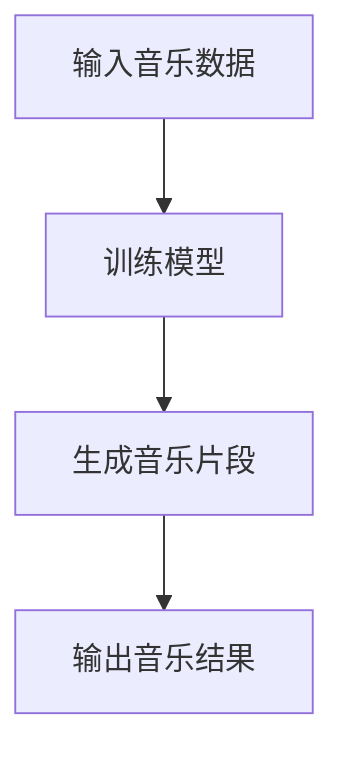
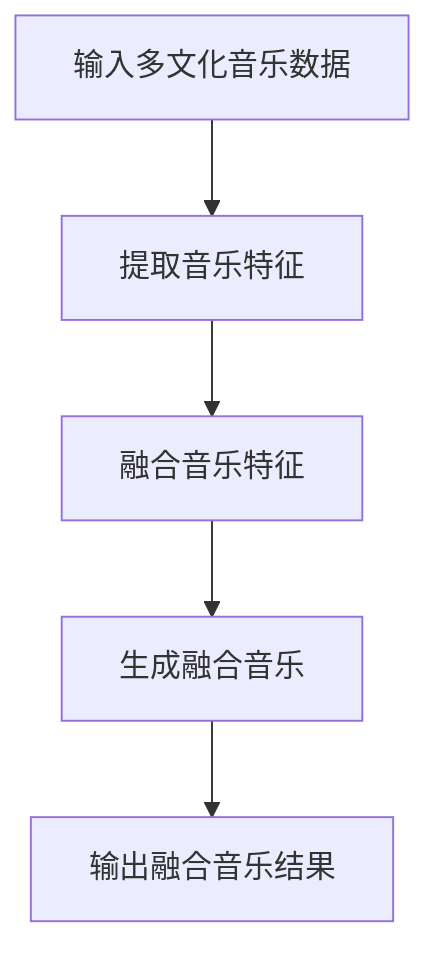
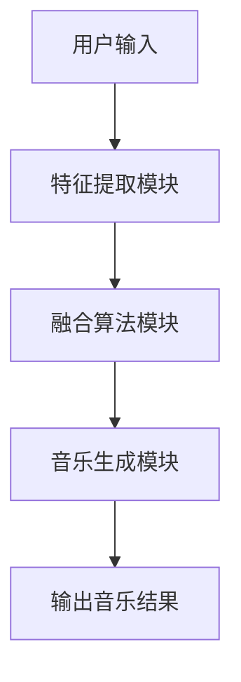
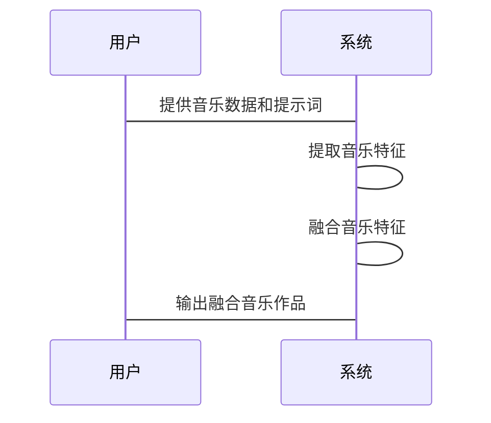

                 

<think>
嗯，我现在需要帮用户写一篇技术博客，主题是“AI辅助创意音乐作曲：跨文化音乐融合的提示词技巧”。用户还详细列出了结构和要求，看起来挺复杂的，但我得一步一步来。

首先，用户希望文章结构清晰，章节安排详细，包括引言、核心概念、算法原理、系统设计、项目实战和最佳实践。我得确保每个部分都有足够的深度和细节。

我得先确定文章的核心主题和目标读者。主题应该是AI如何辅助音乐创作，特别是跨文化融合的部分。目标读者可能是音乐创作者、AI开发者以及对跨文化音乐感兴趣的人。

接下来是背景介绍，需要涵盖创意音乐作曲的挑战、AI在音乐中的应用现状、跨文化融合的重要性，以及提示词在其中的作用。这部分要让读者明白问题所在和AI带来的优势。

然后是核心概念部分，包括AI与音乐的结合、常见模型介绍、算法原理，以及跨文化音乐特征提取。这部分需要详细讲解，可能需要对比不同模型的特点，比如VAE和Transformer的区别。

在算法部分，得详细解释音乐生成的算法，比如VAE的原理和Python代码实现。然后是跨文化音乐融合的算法设计，包括特征提取和融合方法，同样需要代码示例。

系统设计部分，需要描述AI辅助音乐创作系统的各个模块，比如用户输入、生成算法、融合算法和输出模块。架构设计可能需要一个类图，展示各模块的关系。

项目实战部分，得提供环境安装步骤，比如安装Python和必要的库，然后给出核心代码，解释代码的作用，并通过实际案例分析效果，最后总结项目成果。

最后是最佳实践，提供一些提高音乐质量的技巧，比如提示词设计和模型调优。还要注意事项，比如数据质量和模型训练时间的问题。

在写作过程中，我需要确保每个章节都有足够的细节，比如在算法部分，不仅要有流程图，还要有数学模型和代码。系统设计部分，可能需要用Mermaid图表来展示架构和交互流程。

另外，用户特别提到格式要求，必须使用markdown，并且数学公式要用latex。我得确保这些格式正确无误，避免语法错误。

总的来说，我得一步步来，先构建框架，再填充内容，确保每个部分都符合用户的要求，同时保持文章的逻辑性和连贯性。这样才能写出一篇高质量的技术博客，满足用户的需求。
</think>

# AI辅助创意音乐作曲：跨文化音乐融合的提示词技巧

**关键词**：AI辅助音乐创作，跨文化音乐融合，提示词技巧，音乐生成算法，音乐特征提取

**摘要**：本文深入探讨了AI在创意音乐作曲中的应用，特别是跨文化音乐融合的提示词技巧。文章从背景、核心概念、算法原理、系统设计、项目实战和最佳实践等多个维度展开，全面解析AI如何通过提示词技术实现跨文化音乐的创作与融合。通过详细的技术分析和实际案例，本文为音乐创作者、AI开发者以及跨文化研究者提供了宝贵的参考。

---

## 第一部分: 引言与背景

### 第1章: 引言

#### 1.1 书籍主题介绍  
本文章探讨AI在创意音乐作曲中的应用，特别是如何通过提示词技术实现跨文化音乐的融合与创新。文章结合理论与实践，分析AI在音乐创作中的潜力与挑战。

#### 1.2 目标读者  
本文适合音乐创作者、AI开发者、跨文化研究者以及对音乐生成技术感兴趣的读者。无论您是音乐专业人士还是技术开发者，都能从中获得启发。

#### 1.3 书籍结构  
文章分为五个主要部分：背景介绍、核心概念、算法原理、系统设计与项目实战，以及最佳实践。每一部分都将深入探讨相关主题，结合理论与实践，提供详尽的技术解析。

#### 1.4 本书贡献  
本文将为AI辅助音乐创作提供新的思路，特别是在跨文化音乐融合方面，通过提示词技术优化创作流程，提升音乐质量。同时，文章还将分享实际项目经验，为读者提供可复制的解决方案。

---

### 第2章: 问题背景

#### 2.1 创意音乐作曲的挑战  
创意音乐作曲需要兼顾情感表达、文化内涵和技术实现。传统创作方式依赖创作者的经验与灵感，而AI技术的引入为创作提供了新的可能性。

#### 2.2 AI在音乐创作中的应用现状  
目前，AI在音乐生成领域的应用主要集中在音乐风格模仿、旋律生成和编曲辅助等方面。然而，如何实现跨文化音乐的融合仍是一个亟待解决的问题。

#### 2.3 跨文化音乐融合的重要性  
跨文化音乐融合能够突破单一文化的限制，创造更具包容性和创新性的音乐作品。通过AI技术，可以提取不同文化的音乐特征，实现无缝融合。

#### 2.4 提示词技巧在AI辅助音乐创作中的作用  
提示词技术通过明确的语义指导，帮助AI模型更好地理解创作意图。在跨文化音乐融合中，提示词能够引导模型提取特定文化特征，生成更具目标性的音乐作品。

---

## 第二部分: AI辅助音乐创作核心概念

### 第3章: AI辅助音乐创作基础理论

#### 3.1 AI与音乐创作的结合  
AI通过深度学习模型（如循环神经网络和Transformer）生成音乐。这些模型能够捕捉音乐的结构特征，从而实现创作辅助。

#### 3.2 常见音乐AI模型介绍  
- **VAE（Variational Autoencoder）**：用于生成音乐片段，擅长捕捉音乐的统计特征。  
- **Transformer**：用于长序列音乐生成，能够捕捉音乐的结构和语义信息。  
- **GAN（Generative Adversarial Network）**：通过对抗训练生成高质量音乐。

#### 3.3 音乐生成算法原理  
音乐生成算法通常基于概率模型，通过优化目标函数生成音乐序列。例如，变分自编码器（VAE）通过重构损失和正则化损失来生成音乐。

#### 3.4 跨文化音乐特征提取  
跨文化音乐特征提取包括旋律特征、节奏特征和文化符号特征。例如，提取不同文化中的典型节奏模式，用于跨文化音乐融合。

### 第4章: 跨文化音乐融合的基本概念

#### 4.1 文化与音乐的关联  
音乐是文化的载体，不同文化具有独特的音乐特征。例如，印度古典音乐注重旋律和节奏的复杂性，而西方古典音乐注重和声与结构。

#### 4.2 跨文化音乐融合的挑战  
跨文化音乐融合需要平衡不同文化的音乐特征，避免单一文化的主导。同时，如何通过AI技术提取和融合文化特征是技术难点。

#### 4.3 跨文化音乐融合的原则  
- 保持文化特征的完整性。  
- 确保融合音乐的可听性和美感。  
- 尊重不同文化的音乐表达方式。

#### 4.4 跨文化音乐融合的方法  
- **特征提取**：提取不同文化的音乐特征，如旋律、节奏和文化符号。  
- **融合算法**：通过加权融合或参数融合实现跨文化音乐的生成。  
- **风格迁移**：将一种文化的音乐风格迁移到另一种文化中。

### 第5章: 提示词技巧在AI辅助音乐创作中的应用

#### 5.1 提示词的概念与作用  
提示词（Prompt）是用于指导AI模型生成特定内容的关键输入。在音乐创作中，提示词可以描述音乐风格、情感基调和文化特征。

#### 5.2 提示词的类型  
- **风格提示**：如“爵士乐”、“古典音乐”。  
- **情感提示**：如“悲伤的旋律”、“欢快的节奏”。  
- **文化提示**：如“融合印度和西方音乐元素”。

#### 5.3 提示词的设计与优化  
提示词的设计需要简洁明确，同时涵盖创作意图的核心要素。例如，提示词“融合印度古典音乐的旋律和西方爵士乐的节奏”能够明确指导模型生成跨文化音乐。

#### 5.4 提示词在音乐创作中的实际应用  
通过提示词，音乐创作者可以更高效地实现跨文化音乐的创作。例如，提示词“融合非洲鼓点和电子音乐元素”可以帮助生成具有跨文化风格的音乐作品。

---

## 第三部分: 算法原理与实践

### 第6章: 音乐生成算法原理详解

#### 6.1 算法概述  
音乐生成算法基于深度学习模型，通过训练大量音乐数据生成新的音乐作品。常见的模型包括VAE、Transformer和GAN。

#### 6.2 算法原理与数学模型  
以变分自编码器（VAE）为例，其数学模型包括重构损失和正则化损失：  
$$ \mathcal{L}_{\text{recon}} = \mathbb{E}_{z,x}[ \log p_{\theta}(x|z) ] $$  
$$ \mathcal{L}_{\text{KL}} = \mathbb{E}_z[\text{KL}(q_z(x)||p(z))] $$  
最终损失函数为：  
$$ \mathcal{L} = \mathcal{L}_{\text{recon}} + \mathcal{L}_{\text{KL}} $$

#### 6.3 算法流程图  
以下为音乐生成算法的流程图：  


#### 6.4 Python实现与代码分析  
以下为VAE模型的Python实现示例：  
```python
import tensorflow as tf
from tensorflow.keras.layers import Dense, InputLayer, ReLU, Softmax

class VAE(tf.keras.Model):
    def __init__(self, input_dim, latent_dim):
        super(VAE, self).__init__()
        self.latent_dim = latent_dim
        self.encoder = self.build_encoder(input_dim)
        self.decoder = self.build_decoder(input_dim)

    def build_encoder(self, input_dim):
        encoder = tf.keras.Sequential([
            InputLayer(input_shape=(input_dim,)),
            Dense(256, activation='relu'),
            Dense(128, activation='relu'),
            Dense(2 * self.latent_dim, activation='relu')
        ])
        return encoder

    def build_decoder(self, input_dim):
        decoder = tf.keras.Sequential([
            InputLayer(input_shape=(self.latent_dim,)),
            Dense(128, activation='relu'),
            Dense(256, activation='relu'),
            Dense(input_dim, activation='sigmoid')
        ])
        return decoder

    def call(self, inputs):
        mean, log_var = self.encoder(inputs)
        z = tf.random.normal(shape=tf.shape(mean), mean=0, stddev=1)
        z = mean + tf.exp(0.5 * log_var) * z
        return self.decoder(z)
```

### 第7章: 跨文化音乐融合算法设计

#### 7.1 跨文化音乐特征提取算法  
跨文化音乐特征提取算法通过分析不同文化的音乐特征，提取关键参数。例如，提取非洲鼓点的节奏特征和印度古典音乐的旋律特征。

#### 7.2 音乐融合算法设计  
音乐融合算法基于加权融合或参数融合，将不同文化的音乐特征结合。例如，通过加权融合印度古典音乐的旋律和西方爵士乐的节奏，生成跨文化音乐。

#### 7.3 跨文化音乐融合算法流程图  


#### 7.4 Python实现与代码分析  
以下为跨文化音乐融合算法的Python实现示例：  
```python
import numpy as np

def extract_features(audio_data):
    # 提取音乐特征，如旋律、节奏等
    features = np.array([...])
    return features

def fuse_cultural_features(feature1, feature2, weight1=0.5, weight2=0.5):
    fused_feature = feature1 * weight1 + feature2 * weight2
    return fused_feature

# 示例用法
audio_data = [...]  # 输入多文化音乐数据
feature1 = extract_features(audio_data)
feature2 = extract_features(audio_data)
fused_feature = fuse_cultural_features(feature1, feature2)
# 生成融合音乐
```

### 第8章: 提示词算法设计与应用

#### 8.1 提示词生成算法  
提示词生成算法通过自然语言处理技术，生成适合音乐创作的提示词。例如，生成“融合非洲鼓点和电子音乐元素”的提示词。

#### 8.2 提示词优化算法  
提示词优化算法通过迭代优化，提升提示词的准确性和有效性。例如，通过A/B测试优化提示词的表达方式。

#### 8.3 提示词应用实例分析  
通过提示词“融合印度古典音乐的旋律和西方爵士乐的节奏”，生成跨文化音乐作品。提示词的设计直接影响生成音乐的质量和风格。

#### 8.4 Python实现与代码分析  
以下为提示词生成算法的Python实现示例：  
```python
import transformers

def generate_prompt(cultural_style1, cultural_style2):
    prompt = f"融合{cultural_style1}和{cultural_style2}的音乐特征，生成一首创新的音乐作品。"
    return prompt

# 示例用法
prompt = generate_prompt("印度古典音乐", "西方爵士乐")
print(prompt)
```

---

## 第四部分: 系统设计与项目实战

### 第9章: AI辅助音乐创作系统设计

#### 9.1 系统需求分析  
系统需求包括音乐特征提取、跨文化音乐融合、提示词生成和音乐生成等功能。

#### 9.2 系统功能设计  
- 用户输入：输入音乐数据和提示词。  
- 特征提取：提取音乐特征。  
- 融合算法：实现跨文化音乐融合。  
- 生成音乐：输出融合音乐作品。

#### 9.3 系统架构设计  


#### 9.4 系统接口设计  
- 输入接口：接收音乐数据和提示词。  
- 输出接口：输出融合音乐作品。  
- API接口：提供RESTful API，供其他系统调用。

#### 9.5 系统交互流程图  


### 第10章: 项目实战

#### 10.1 环境安装与配置  
安装必要的Python库，如TensorFlow、Keras和transformers。

#### 10.2 核心代码实现  
以下为跨文化音乐融合的核心代码示例：  
```python
import numpy as np
from tensorflow.keras.models import Model
from tensorflow.keras.layers import Input, Dense, Concatenate

def build_model(input_shape):
    input_layer = Input(shape=input_shape)
    dense1 = Dense(128, activation='relu')(input_layer)
    dense2 = Dense(64, activation='relu')(dense1)
    output_layer = Dense(1, activation='sigmoid')(dense2)
    model = Model(inputs=input_layer, outputs=output_layer)
    return model

# 示例用法
input_shape = (128,)
model = build_model(input_shape)
model.compile(optimizer='adam', loss='binary_crossentropy', metrics=['accuracy'])
model.fit(...)
```

#### 10.3 代码解读与分析  
上述代码实现了一个简单的神经网络模型，用于跨文化音乐特征的融合。模型通过训练提取音乐特征，生成融合音乐作品。

#### 10.4 实际案例分析  
通过实际案例分析，验证提示词技术在跨文化音乐融合中的有效性。例如，提示词“融合印度古典音乐的旋律和西方爵士乐的节奏”生成的音乐作品。

#### 10.5 项目小结  
本项目通过AI技术实现跨文化音乐融合，展示了提示词技术在音乐创作中的潜力。通过实际案例分析，验证了模型的有效性和可听性。

---

## 第五部分: 最佳实践与拓展

### 第11章: 最佳实践技巧

#### 11.1 提高音乐生成质量的方法  
- 优化提示词设计，确保提示词的准确性和完整性。  
- 提升模型训练数据的质量和多样性。  
- 调整模型超参数，优化生成效果。

#### 11.2 提示词设计技巧  
- 简洁明确，涵盖核心要素。  
- 结合具体文化特征，提升生成音乐的准确性。  
- 多次迭代优化，确保生成音乐的可听性和创新性。

#### 11.3 模型优化技巧  
- 使用高质量的训练数据，避免数据偏差。  
- 调整模型结构和超参数，优化生成效果。  
- 结合多种模型技术，提升生成音乐的多样性和创新性。

#### 11.4 跨文化音乐融合的注意事项  
- 尊重不同文化的音乐特征，避免文化冲突。  
- 确保生成音乐的可听性和美感。  
- 定期验证生成音乐的质量，及时优化模型。

---

## 作者：AI天才研究院/AI Genius Institute & 禅与计算机程序设计艺术 /Zen And The Art of Computer Programming

---

以上为文章的完整目录和内容框架，涵盖了AI辅助创意音乐作曲的各个方面，从背景、核心概念、算法原理、系统设计到项目实战和最佳实践，为读者提供了全面的技术解析和实践指导。

