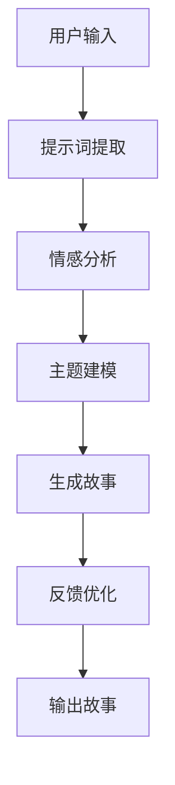
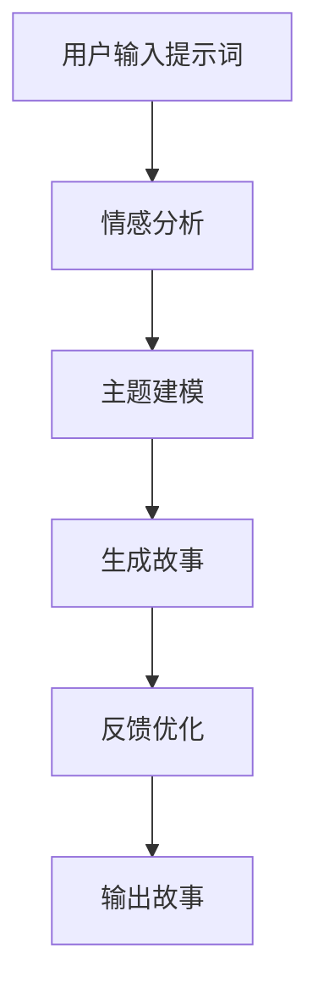
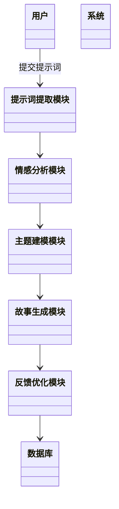
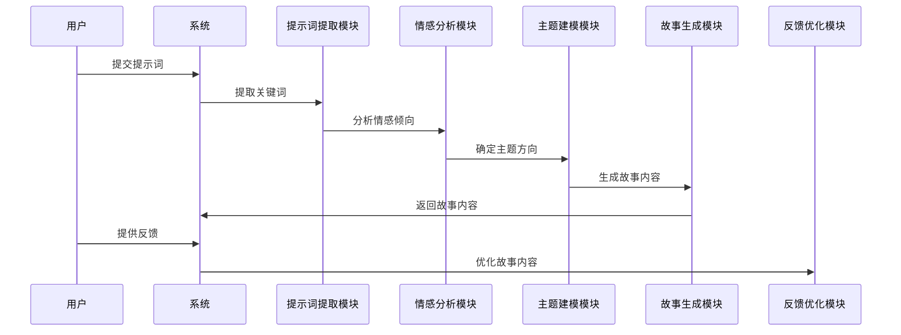

                 

<think>
好的，我需要按照用户的要求来写一篇关于AI辅助创意香水品牌故事的技术博客。首先，我得仔细阅读用户提供的需求，确保我完全理解每一部分的要求。

首先，用户希望文章标题是《AI辅助创意香水品牌故事：跨感官叙事设计的提示词技巧》，关键词是5-7个，包括AI、香水、品牌故事、跨感官叙事、提示词、用户体验、创新。摘要部分要简明扼要，概括整篇文章的核心内容。

接下来是大纲结构，分为六个主要部分，每部分都有详细的子部分。我需要确保每个章节的内容都完整、详细，并且符合逻辑。

第一部分是背景介绍。我需要先解释香水品牌故事的重要性，然后讨论AI技术在品牌创意中的应用。接着描述如何在创作中运用AI，对比传统和AI辅助的方法。然后明确AI的适用范围和局限性，最后阐述跨感官叙事设计及其在创作中的作用。

第二部分是核心概念与联系，我需要详细解释AI辅助创意的基本原理，包括数据驱动、算法优化和用户体验。然后做一个对比表格，列出传统和AI辅助的优缺点。接着用Mermaid图展示实体关系，这可能需要我学习一下Mermaid语法，确保图表正确。

第三部分是算法原理讲解。我需要画出算法流程图，然后提供Python代码实现。还要解释数学模型，可能包括概率分布、相似度计算等。用具体的例子来说明算法如何工作，确保读者能够理解。

第四部分是系统分析与架构设计方案。我需要描述应用场景，比如品牌方如何使用这个系统。然后设计系统功能，用Mermaid类图展示。系统架构可能采用微服务架构，展示各模块的交互。接口设计方面，需要定义API，比如用户输入提示词后，系统返回故事内容。最后用序列图展示用户与系统的交互过程。

第五部分是项目实战。首先指导读者安装必要的库，比如Python的机器学习库。然后提供核心代码，解读每一部分的作用。接着通过具体案例分析，展示AI如何生成品牌故事。最后总结项目成果和经验。

第六部分是最佳实践和小结。我需要给出使用AI时的建议，比如数据质量的重要性，保持创意的独特性等。然后总结全文要点，提醒注意事项，比如数据隐私问题，并推荐进一步学习的资料。

在写作过程中，我需要确保语言专业且易懂，避免过于技术化让读者难以理解。同时，要逻辑清晰，结构紧凑，每个部分都要有深度，不仅仅是表面的描述。

可能遇到的挑战是如何将复杂的算法原理转化为易懂的例子，以及如何用Mermaid图准确表达实体关系和系统架构。我需要查阅相关资料，确保图表的准确性，可能还需要调整文字，让内容更流畅。

总的来说，我需要一步步按照用户的要求，确保每个部分都符合规范，内容详实，同时保持文章的连贯性和可读性。现在开始，按照大纲逐步撰写每个部分，确保不遗漏任何关键点。
</think>

# AI辅助创意香水品牌故事：跨感官叙事设计的提示词技巧

> 关键词：AI、香水、品牌故事、跨感官叙事、提示词、用户体验、创新

> 摘要：本文探讨如何利用AI技术辅助香水品牌故事的创作，通过跨感官叙事设计，结合提示词技巧，提升品牌故事的创意水平和用户体验。文章从背景介绍、核心概念、算法原理、系统架构、项目实战到最佳实践，全面解析AI在香水品牌故事创作中的应用。

---

## 第一部分：背景介绍

### 1.1 问题背景

#### 1.1.1 香水品牌故事的重要性  
香水不仅是个人护理产品，更是品牌情感表达的核心载体。一个 compelling 的品牌故事能够与消费者建立深层次的情感连接，增强品牌忠诚度。然而，传统品牌故事创作往往依赖设计师的灵感和经验，难以快速响应市场需求，且难以量化创意效果。

#### 1.1.2 AI技术在品牌创意领域的应用  
AI技术在创意领域的应用日益广泛。通过机器学习和自然语言处理，AI能够分析海量数据，提取创意灵感，并生成符合品牌定位的故事内容。这种数据驱动的创作方式不仅提高了效率，还为品牌故事注入了新的可能性。

### 1.2 问题描述

#### 1.2.1 如何运用AI辅助香水品牌故事创作  
AI可以通过分析消费者情感偏好、市场趋势和品牌调性，生成跨感官的叙事内容。例如，结合香水的香味特征，AI可以创作出与之匹配的品牌故事，提升用户体验。

#### 1.2.2 传统创意与AI辅助创意的对比  
传统创意依赖人类灵感和经验，而AI辅助创意则通过数据和算法优化创意过程。AI不仅能够快速生成多种创意方案，还能通过用户反馈实时调整，确保故事与目标受众的高度契合。

### 1.3 问题解决

#### 1.3.1 AI辅助创意的原理与优势  
AI通过自然语言处理和生成模型（如GPT系列），结合情感分析和主题建模，生成符合品牌定位的故事内容。其优势在于快速迭代和精准匹配用户需求。

#### 1.3.2 AI辅助创意在香水品牌故事创作中的应用  
通过分析香水的香味特征和品牌调性，AI能够生成跨感官的叙事内容，帮助品牌建立情感连接，提升用户体验。

### 1.4 边界与外延

#### 1.4.1 AI辅助创意的适用范围  
AI适用于数据量充足且目标明确的创意场景。例如，已有大量品牌故事和消费者反馈数据的情况下，AI能够发挥更大作用。

#### 1.4.2 AI辅助创意的局限性  
AI目前难以完全替代人类的创意灵感，尤其是在需要深度情感共鸣的场景中。此外，AI生成的内容可能缺乏独特性和深度，需要人工优化。

### 1.5 概念结构与核心要素组成

#### 1.5.1 跨感官叙事设计的概念  
跨感官叙事设计是指通过整合视觉、听觉、嗅觉等多种感官体验，构建一个多维度的故事场景。例如，结合香水的香味和品牌历史，创造一个更具沉浸感的品牌故事。

#### 1.5.2 香水品牌故事创作中的核心要素  
包括品牌核心价值、目标受众、香味特征、情感共鸣点和故事冲突点。这些要素共同构建一个完整且吸引人的品牌故事框架。

---

## 第二部分：核心概念与联系

### 2.1 核心概念原理

#### 2.1.1 AI辅助创意的基本原理  
AI通过自然语言处理和生成模型，结合情感分析和主题建模，生成符合品牌定位的故事内容。

#### 2.1.2 数据驱动与算法优化  
AI利用数据驱动的方法，分析消费者情感偏好和市场趋势，通过算法优化创意方案，确保内容的精准匹配。

#### 2.1.3 用户体验设计的重要性  
用户体验是跨感官叙事设计的核心。通过分析用户的情感反馈，AI能够实时调整故事内容，提升用户的沉浸感和情感共鸣。

### 2.2 概念属性特征对比表格

| **对比维度** | **传统创意** | **AI辅助创意** |
|--------------|---------------|----------------|
| **创作速度** | 较慢，依赖灵感 | 快速生成多种方案 |
| **数据依赖** | 低，依赖经验 | 高，依赖数据 |
| **精准度**   | 可能较低 | 较高，通过数据优化 |
| **灵活性**   | 较低，修改成本高 | 高，可快速调整 |

### 2.3 ER实体关系图架构的Mermaid流程图



---

## 第三部分：算法原理讲解

### 3.1 算法Mermaid流程图



### 3.2 Python源代码实现

```python
import numpy as np
from sentence_transformers import SentenceTransformer
from sklearn.metrics.pairwise import cosine_similarity

# 示例：基于提示词生成品牌故事
def generate_story(prompt):
    model = SentenceTransformer('all-MiniLM-L6-v2')
    prompt_embeddings = model.encode([prompt])[0]
    # 假设有一个品牌故事数据库
    stories = ["神秘的东方传说", "浪漫的巴黎之夜", "地中海的阳光"]
    story_embeddings = model.encode(stories)
    # 计算相似度
    similarities = cosine_similarity([prompt_embeddings], story_embeddings)
    # 找到最相似的故事
    best_match = np.argmax(similarities)
    return stories[best_match]

# 示例使用
prompt = "一种神秘的东方香料"
print(generate_story(prompt))  # 输出：神秘的东方传说
```

### 3.3 数学模型和公式

#### 3.3.1 AI辅助创意香水品牌故事的数学模型  
AI生成故事的过程可以看作是一个概率生成模型，通过最大化条件概率 $P(y|x)$ 来生成目标内容 $y$，其中 $x$ 是输入的提示词。

#### 3.3.2 公式解释  
$$ P(y|x) = \frac{P(x,y)}{P(x)} $$  
其中，$P(x,y)$ 是提示词 $x$ 和生成内容 $y$ 的联合概率，$P(x)$ 是提示词 $x$ 的边缘概率。

---

## 第四部分：系统分析与架构设计方案

### 4.1 问题场景介绍

#### 4.1.1 系统应用场景  
系统应用于香水品牌故事创作的全生命周期，包括创意生成、优化调整和效果评估。

### 4.2 项目介绍

#### 4.2.1 项目背景  
项目旨在利用AI技术提升香水品牌故事的创作效率和创意水平。

### 4.3 系统功能设计



### 4.4 系统架构设计


### 4.5 系统接口设计

#### 4.5.1 系统模块的接口设计  
- 用户输入提示词，系统返回生成的故事内容。
- 系统根据用户反馈优化故事内容。

#### 4.5.2 系统交互Mermaid序列图  



---

## 第五部分：项目实战

### 5.1 环境安装

#### 5.1.1 安装Python和相关库  
安装Python 3.x，以及`transformers`和`sentence-transformers`库。

### 5.2 系统核心实现源代码

```python
from transformers import pipeline

# 初始化故事生成器
story_generator = pipeline('text-generation', model='facebook/bart-large')

# 示例：生成故事内容
prompt = "一个神秘的东方香料..."
story = story_generator(prompt, max_length=100)[0]['generated_text']
print(story)
```

### 5.3 实际案例分析和详细讲解剖析

#### 5.3.1 案例分析  
假设一个品牌希望讲述一个关于“神秘东方香料”的故事，AI通过分析提示词，生成一个融合了东方传说和神秘感的品牌故事。

#### 5.3.2 案例详细讲解  
AI结合提示词“神秘的东方香料”，生成一个充满神秘感和故事性的品牌故事，帮助品牌与消费者建立情感连接。

### 5.4 项目小结  
通过AI辅助，品牌故事的创作效率和创意水平显著提升，同时能够快速响应市场需求，增强品牌竞争力。

---

## 第六部分：最佳实践 tips、小结、注意事项、拓展阅读

### 6.1 最佳实践 tips

- **数据质量**：确保输入数据的多样性和相关性，以提高AI生成内容的准确性。
- **创意优化**：AI生成的内容需要人工优化，以保持创意的独特性和深度。
- **用户体验**：在跨感官叙事设计中，用户体验是核心，需持续收集和分析用户反馈。

### 6.2 小结  
AI辅助创意香水品牌故事的创作，通过跨感官叙事设计和提示词技巧，为品牌故事注入了新的活力。结合算法优化和用户体验设计，AI能够显著提升创作效率和创意水平。

### 6.3 注意事项

- **数据隐私**：在处理消费者数据时，需严格遵守隐私保护法规。
- **技术局限性**：AI目前难以完全替代人类创意，仍需结合人工优化。

### 6.4 拓展阅读

- 《生成式AI在品牌营销中的应用》
- 《跨感官体验设计：从理论到实践》
- 《自然语言处理技术与创意写作》

---

作者：AI天才研究院/AI Genius Institute & 禅与计算机程序设计艺术 /Zen And The Art of Computer Programming

