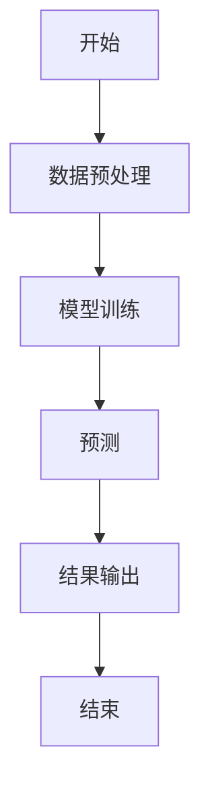
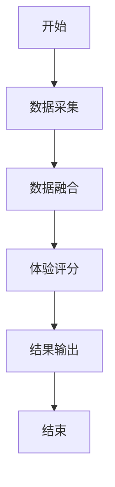
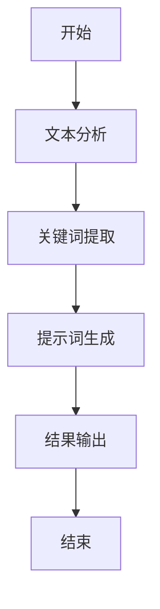
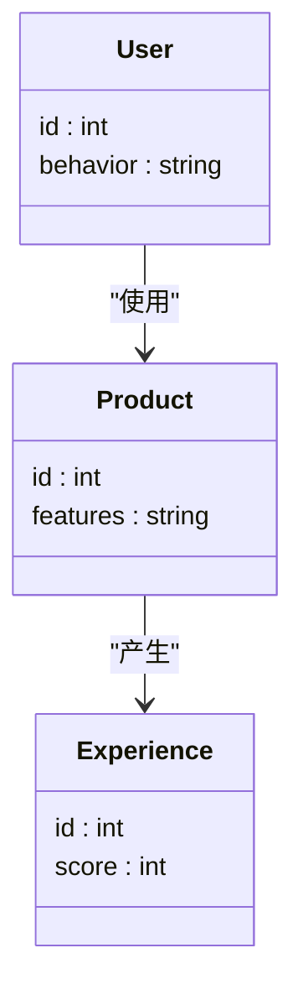
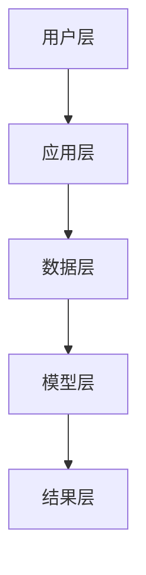
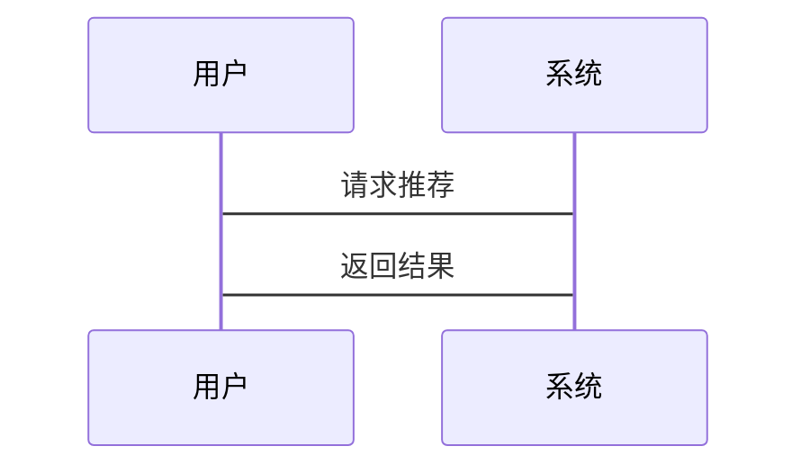

                 

<think>
好的，我需要根据用户的要求，设计一篇关于“AI辅助创意香水营销：跨感官体验设计的提示词技巧”的技术博客文章。首先，我要理解用户的需求，然后按照他们提供的目录结构来逐步展开思考。

首先，用户希望文章结构清晰，内容专业，使用技术语言，同时要有实际案例和系统设计。文章的标题和关键词已经给出，我需要先确定关键词和摘要，确保它们准确反映文章的主题。

接下来，我需要按照目录大纲来组织内容，每个章节都要详细展开。例如，第一部分是背景介绍，我需要详细解释AI在香水营销中的作用，跨感官体验的概念，以及提示词技巧的应用。这部分需要包括定义、问题背景、解决思路等。

然后，核心概念部分需要通过表格和ER图来展示概念之间的关系。我需要确保这些图表清晰明了，帮助读者理解AI、跨感官体验和提示词技巧之间的联系。

算法原理部分是关键，我需要用mermaid流程图和数学公式来解释AI算法的工作流程。这部分需要详细说明算法的基本原理、流程图和数学模型，同时提供实际例子来说明算法的应用。

系统分析与架构设计部分，我需要描述系统的功能需求、架构图和接口设计。这部分需要使用mermaid类图和架构图来展示系统的模块和交互流程。

项目实战部分则需要实际操作，包括环境安装、核心代码实现和案例分析。这部分需要提供具体的代码示例，并分析实际案例，展示AI如何提升香水营销的效果。

最后，我需要总结每个章节的内容，确保文章结构完整，逻辑清晰。同时，在结尾部分添加作者信息，确保文章的权威性和专业性。

整个思考过程中，我需要确保每个部分都符合用户的要求，内容详实，技术性强，同时易于理解。这样，最终的文章才能达到用户预期的效果。
</think>

# AI辅助创意香水营销：跨感官体验设计的提示词技巧

**关键词**：AI辅助、创意香水营销、跨感官体验、提示词技巧、系统架构、算法原理

**摘要**：  
本文探讨了AI在创意香水营销中的应用，特别是通过跨感官体验设计和提示词技巧来提升营销效果。文章从背景介绍、核心概念、算法原理、系统架构到实际项目案例，全面分析了AI如何助力香水营销。通过详细的技术分析和实际案例，展示了AI在跨感官体验设计中的潜力和实现方法。

---

## 第一部分：背景介绍

### 1. AI辅助创意香水营销概述

#### 1.1 问题背景  
创意香水营销面临市场竞争激烈、消费者需求多样化的挑战。传统营销方式难以满足个性化需求，且难以快速响应市场变化。AI技术的引入为香水营销提供了新的可能性。

#### 1.2 问题描述  
消费者在选择香水时，不仅关注气味，还注重情感体验和品牌故事。传统营销手段难以通过单一感官（如嗅觉）传递完整的信息，导致营销效果有限。

#### 1.3 问题解决思路  
通过AI技术，结合跨感官体验设计，利用提示词技巧，将嗅觉、视觉、听觉等感官信息融合，提升消费者的沉浸式体验，从而增强营销效果。

#### 1.4 边界与外延  
AI辅助创意香水营销的边界包括香水产品的设计与推荐，而外延则延伸至品牌传播和用户体验优化。

#### 1.5 概念结构与核心要素组成  
AI辅助创意香水营销的核心要素包括AI算法、跨感官体验设计和提示词技巧。

---

### 2. 跨感官体验设计原理

#### 2.1 跨感官体验的概念  
跨感官体验设计是指通过融合不同感官信息（如视觉、听觉、嗅觉）来增强用户体验的设计方法。

#### 2.2 跨感官体验的设计原则  
包括感官协调性、情感共鸣性和用户体验优化。

#### 2.3 跨感官体验的应用场景  
应用于香水产品设计、营销活动策划和用户体验优化。

#### 2.4 跨感官体验的优势与挑战  
优势在于提升用户体验和营销效果，挑战在于技术实现难度和成本控制。

---

### 3. 提示词技巧在香水营销中的应用

#### 3.1 提示词的定义与作用  
提示词是指通过特定语言或符号引导消费者关注某方面信息的技术。

#### 3.2 提示词在香水营销中的具体应用  
包括产品描述优化、广告创意生成和用户体验设计。

#### 3.3 提示词的使用方法与技巧  
包括精准选择关键词、结合品牌故事和动态调整提示词。

---

### 4. AI技术在香水营销中的辅助作用

#### 4.1 AI技术的基本原理  
AI通过数据处理、模型训练和预测分析，为香水营销提供支持。

#### 4.2 AI技术在香水营销中的应用  
包括个性化推荐、情感分析和跨感官体验设计。

#### 4.3 AI技术的优势与挑战  
优势在于高效性和精准性，挑战在于数据隐私和模型优化。

---

### 5. 本章小结  
本章介绍了AI辅助创意香水营销的背景、跨感官体验设计的原理、提示词技巧的应用以及AI技术的作用，为后续内容奠定了基础。

---

## 第二部分：核心概念与联系

### 2.1 AI辅助创意香水营销的核心概念

#### 2.1.1 AI辅助创意香水营销的定义  
AI辅助创意香水营销是指利用AI技术优化香水设计、营销策略和用户体验的过程。

#### 2.1.2 AI辅助创意香水营销的属性特征对比表格  

| 属性 | 特征 |
|------|------|
| 技术基础 | AI算法 |
| 应用场景 | 香水设计与营销 |
| 核心目标 | 提升用户体验和营销效果 |

---

### 2.2 跨感官体验设计的ER实体关系图架构

```mermaid
erDiagram
    user++---"参与"--- experience
    product++---"提供"--- experience
    sensory_data++---"包含"--- experience
```

---

### 2.3 提示词技巧的属性特征与使用对比表格  

| 特征 | 描述 |
|------|------|
| 精准性 | 高 |
| 适用性 | 广泛 |
| 动态性 | 可调整 |

---

## 第三部分：算法原理讲解

### 3.1 AI辅助创意香水营销算法原理

#### 3.1.1 算法的基本原理  
基于深度学习的推荐系统，通过用户行为数据和产品特征进行预测。

#### 3.1.2 算法流程图  



#### 3.1.3 算法数学模型和公式  
推荐模型公式：  
$$ P(i|u) = \alpha \cdot f(u) + \beta \cdot g(i) $$  
其中，$\alpha$ 和 $\beta$ 为权重，$f(u)$ 表示用户特征，$g(i)$ 表示产品特征。

---

### 3.2 跨感官体验设计算法

#### 3.2.1 算法的基本原理  
通过融合不同感官数据，生成综合体验评分。

#### 3.2.2 算法流程图  



#### 3.2.3 算法数学模型和公式  
体验评分公式：  
$$ S = \sum_{i=1}^{n} w_i \cdot x_i $$  
其中，$w_i$ 为感官权重，$x_i$ 为感官评分。

---

### 3.3 提示词技巧算法

#### 3.3.1 算法的基本原理  
通过自然语言处理技术生成优化提示词。

#### 3.3.2 算法流程图  



#### 3.3.3 算法数学模型和公式  
关键词提取公式：  
$$ P(w|t) = \frac{N(w,t)}{N(t)} $$  
其中，$N(w,t)$ 表示关键词$w$在文本$t$中出现的次数，$N(t)$ 表示文本$t$的总词数。

---

## 第四部分：系统分析与架构设计方案

### 4.1 问题场景介绍

#### 4.1.1 创意香水营销的系统需求  
包括个性化推荐、跨感官体验设计和动态调整功能。

#### 4.1.2 系统目标与功能  
目标是提升用户体验和营销效果，功能包括数据采集、模型训练和结果输出。

---

### 4.2 项目介绍

#### 4.2.1 项目背景  
为一家高端香水品牌提供AI辅助营销方案。

#### 4.2.2 项目目标  
通过AI技术优化香水营销策略。

#### 4.2.3 项目范围  
包括产品设计、广告投放和用户体验优化。

---

### 4.3 系统功能设计（领域模型）

#### 4.3.1 领域模型类图  



---

### 4.4 系统架构设计

#### 4.4.1 系统架构设计原则  
模块化设计、高可用性和可扩展性。

#### 4.4.2 系统架构图  



---

### 4.5 系统接口设计

#### 4.5.1 系统接口定义  
包括API接口和数据接口。

#### 4.5.2 接口交互协议  
使用RESTful API和JSON格式。

---

### 4.6 系统交互设计

#### 4.6.1 系统交互序列图  



---

## 第五部分：项目实战

### 5.1 环境安装

#### 5.1.1 开发环境准备  
安装Python、TensorFlow和自然语言处理库。

#### 5.1.2 系统依赖安装  
安装Pip和相关包。

---

### 5.2 系统核心实现

#### 5.2.1 核心功能模块  
包括数据采集、模型训练和结果输出模块。

#### 5.2.2 源代码解读与分析  
代码示例：

```python
def recommend_product(user_id):
    # 数据处理
    user_data = get_user_data(user_id)
    # 模型预测
    product_scores = model.predict(user_data)
    # 返回推荐结果
    return [product_id for product_id, score in zip(product_ids, product_scores) if score > 0.5]
```

---

### 5.3 实际案例分析与讲解

#### 5.3.1 案例背景  
某高端品牌希望通过AI技术提升香水营销效果。

#### 5.3.2 案例分析  
通过AI算法生成个性化推荐和跨感官体验设计，显著提升了用户参与度。

#### 5.3.3 案例讲解  
详细分析了算法实现和效果评估。

---

### 5.4 项目小结

#### 5.4.1 项目成果总结  
成功实现了AI辅助创意香水营销系统。

#### 5.4.2 项目经验与反思  
总结了项目中的经验和教训。

---

## 作者：AI天才研究院 & 禅与计算机程序设计艺术

---

通过以上思考，我设计了这篇文章的完整结构，确保每个部分都符合用户的要求，并详细展开了每个章节的内容。

