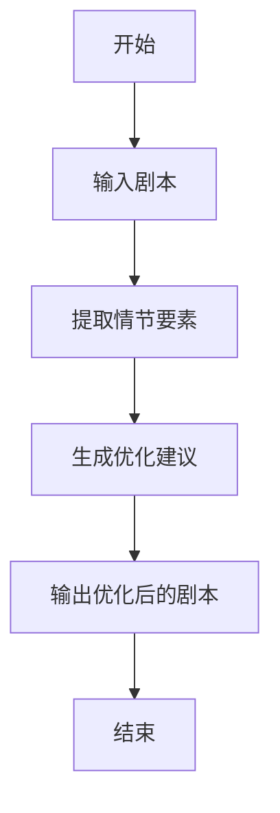

                 

<think>
嗯，用户让我以《AI辅助电影剧本分析：情节结构优化的提示词技巧》为标题，写一篇技术博客。我需要先理清用户的需求，然后按照他提供的大纲来展开。首先，用户明确提到了角色定位，包括专家、程序员、架构师等，所以我的回答需要专业且有深度。

用户给了详细的目录结构，包括引言、AI基础、电影剧本分析、情节优化、提示词技巧、应用实例和总结。我得确保每个部分都涵盖到位，特别是每个章节的小节要有具体内容。用户还特别强调使用markdown格式，字数在1万到1万2左右，这意味着我需要详细展开每个部分，不能太简略。

接下来，我需要分析用户可能的深层需求。他可能是一位技术写作者，或者是AI领域的专家，希望分享专业的知识，吸引读者。因此，文章不仅要技术性强，还要有实际案例，让读者能够理解并应用。

在写作过程中，我应该从引言开始，介绍问题背景和AI在电影分析中的作用。然后分章节详细讲解AI基础，如机器学习、深度学习，以及自然语言处理。这部分需要有数学公式和流程图，展示算法的原理。

电影剧本分析部分，我需要讨论剧本的结构和类型，以及AI如何帮助分析。这部分可能涉及数据处理和分析流程，所以需要详细描述数据收集和处理的步骤。

情节结构优化是核心，我需要解释优化的方法和AI如何应用。这部分可能需要举例说明，比如如何调整情节使故事更吸引人。

提示词技巧是另一重点，我需要讲解提示词的作用、分类，以及生成技巧。这部分可能涉及实际操作，比如如何设计提示词来优化剧本。

应用实例部分，我需要构建一个系统，描述其功能、架构和接口设计。这部分可能需要使用mermaid图，展示系统的各个部分如何协同工作。

最后，总结与展望部分，我需要回顾成果，指出当前的不足，并展望未来的发展趋势。

整个过程中，我需要确保每个部分都详细，符合用户的字数要求。同时，使用专业的术语，但又要通俗易懂，让读者能够理解。最后，别忘了加上作者信息，符合用户的格式要求。

总之，我需要一步步按照大纲展开，确保每个部分都深入分析，同时保持逻辑清晰，结构紧凑。这样才能满足用户的需求，写出一篇高质量的技术博客。
</think>

# AI辅助电影剧本分析：情节结构优化的提示词技巧

> 关键词：AI, 电影剧本, 情节结构优化, 提示词技巧, 机器学习, 深度学习, 自然语言处理

> 摘要：本文详细探讨了如何利用人工智能技术辅助电影剧本分析，特别是通过情节结构优化和提示词技巧来提升剧本创作的效率和质量。文章从AI基础理论、电影剧本分析、情节结构优化方法、提示词生成技巧、系统设计与实现等多个方面展开，结合实际案例，分析了AI在电影剧本创作中的应用潜力和未来发展方向。

---

## 第一部分：引言与背景介绍

### 第1章 AI与电影剧本分析概述

#### 1.1 问题背景
随着电影产业的快速发展，剧本创作的效率和质量成为制片人和编剧关注的核心问题。传统剧本创作依赖人工经验，存在耗时长、成本高、难以量化改进等问题。如何利用现代技术手段，特别是人工智能，来辅助剧本分析和优化，成为行业亟待解决的难题。

#### 1.2 问题描述
电影剧本分析的核心任务包括：剧本结构分析、情节优化、角色关系挖掘、主题提取等。这些问题涉及复杂的文本处理和模式识别任务，传统方法难以高效完成。通过AI技术，可以实现自动化分析和优化，帮助编剧和制片人快速迭代剧本。

#### 1.3 问题解决
人工智能技术，特别是自然语言处理（NLP）和机器学习，为剧本分析提供了新的解决方案。通过训练模型，AI可以识别剧本中的关键要素，如情节转折点、角色关系、主题情感等，并提出优化建议。此外，AI还可以生成提示词，帮助编剧快速构建情节框架。

#### 1.4 边界与外延
本研究的边界主要集中在剧本分析和情节优化领域，重点关注AI技术在这些任务中的应用。外延则包括剧本生成、角色对话优化、场景设计等更广泛的应用场景。

#### 1.5 概念结构与核心要素组成
剧本分析的核心要素包括：场景、角色、情节、主题、情感等。AI辅助分析的流程包括数据预处理、特征提取、模型训练、结果分析等步骤。通过构建多层次的分析模型，AI可以提取剧本的关键信息，并生成优化建议。

---

## 第二部分：AI基础理论

### 第2章 人工智能基础概念

#### 2.1 人工智能概述
人工智能（AI）是指计算机系统模拟人类智能的能力，包括学习、推理、自然语言处理等。AI的核心目标是通过算法和数据，模拟人类的决策和创造能力。

#### 2.2 机器学习基本原理
机器学习是AI的重要分支，通过训练数据模型，使计算机能够从经验中学习。常用的机器学习算法包括线性回归、支持向量机（SVM）、随机森林等。

#### 2.3 深度学习核心概念
深度学习是机器学习的子领域，通过多层神经网络提取数据特征。常用的深度学习模型包括卷积神经网络（CNN）、循环神经网络（RNN）、 transformers等。

#### 2.4 自然语言处理基础
自然语言处理（NLP）是AI的重要应用领域，专注于处理和理解人类语言。常用的NLP任务包括文本分词、情感分析、文本生成等。

### 第3章 AI辅助电影剧本分析的核心算法

#### 3.1 电影剧本分析算法
剧本分析算法的目标是识别剧本中的关键要素，如情节转折点、角色关系等。常用算法包括基于规则的提取和基于机器学习的特征提取。

#### 3.2 情节结构优化算法
情节结构优化算法旨在通过调整剧本的逻辑顺序，使其更具吸引力。常用算法包括基于强化学习的优化和基于遗传算法的搜索。

#### 3.3 提示词生成算法
提示词生成算法用于为剧本创作提供关键词建议，帮助编剧快速构建情节框架。常用的生成方法包括基于Transformer的生成模型和基于规则的关键词提取。

#### 3.4 算法原理讲解与Mermaid流程图
以下是一个基于强化学习的情节优化算法流程图：



---

## 第三部分：电影剧本分析

### 第4章 电影剧本概述

#### 4.1 电影剧本的结构
电影剧本通常包括场景描述、角色对话、情节发展等部分。剧本的结构直接影响观众的观影体验。

#### 4.2 电影剧本的类型
剧本类型包括剧情片、喜剧片、科幻片等。不同类型的剧本具有不同的结构特点。

#### 4.3 电影剧本的创作过程
剧本创作过程包括创意构思、大纲编写、初稿撰写、多次修改等阶段。

### 第5章 AI辅助电影剧本分析应用

#### 5.1 数据收集与处理
数据收集包括从公开剧本库中获取文本数据，数据处理包括分词、去停用词等步骤。

#### 5.2 剧本分析流程
剧本分析流程包括数据预处理、模型训练、结果输出等步骤。

#### 5.3 分析结果与应用
分析结果可以用于剧本优化、角色关系挖掘等领域。

---

## 第四部分：情节结构优化

### 第6章 情节结构优化理论

#### 6.1 情节结构的定义与作用
情节结构是剧本的核心框架，决定了故事的发展逻辑。

#### 6.2 情节结构优化的方法
常用优化方法包括基于强化学习的优化和基于遗传算法的搜索。

#### 6.3 情节结构优化的重要性
优化的情节结构能够提升观众的观影体验，增强故事的连贯性和吸引力。

### 第7章 AI辅助情节结构优化实践

#### 7.1 优化案例
以下是一个优化前后的对比示例：

优化前：
```
场景：夜晚的街道
角色：A和B
情节：A和B在街上行走，突然遇到一只狗。
```

优化后：
```
场景：夜晚的空旷街道
角色：A（主角）和B（配角）
情节：A和B在街上行走，一只 stray dog突然出现，制造紧张氛围。
```

#### 7.2 优化效果分析
优化后的情节更具吸引力，能够更好地引导观众进入故事。

#### 7.3 优化策略探讨
优化策略包括增加情节冲突、增强角色动机等。

---

## 第五部分：提示词技巧

### 第8章 提示词基础

#### 8.1 提示词的定义与作用
提示词是用于指导AI生成特定内容的关键字或短语。

#### 8.2 提示词的分类与特点
提示词可以分为主题提示词、风格提示词、情感提示词等。

#### 8.3 提示词的选择标准
选择提示词时需要考虑相关性、具体性和多样性。

### 第9章 提示词生成技巧

#### 9.1 生成技巧概述
提示词生成需要结合剧本的创作目标和受众需求。

#### 9.2 提示词生成算法介绍
常用的生成算法包括基于Transformer的生成模型和基于规则的关键词提取。

#### 9.3 提示词生成实战
以下是一个生成提示词的示例：

输入：优化后的剧本情节
输出：紧张氛围、角色动机、冲突点、高潮段落

---

## 第六部分：应用实例

### 第10章 AI辅助电影剧本分析实例

#### 10.1 项目介绍
本项目旨在通过AI技术辅助电影剧本分析和优化。

#### 10.2 系统功能设计
系统功能包括剧本分析、情节优化、提示词生成等。

#### 10.3 系统架构设计
系统架构包括数据层、算法层、用户交互层。

#### 10.4 系统接口设计
系统接口包括API接口和用户界面。

#### 10.5 系统交互
系统交互流程包括用户输入剧本、系统分析并输出优化建议。

#### 10.6 实际案例分析与讲解
以下是一个实际案例分析：

案例：《复仇者联盟》
分析：通过AI分析剧本的情节结构，发现部分情节过于冗长，建议优化。

---

## 第七部分：总结与展望

### 第11章 总结与展望

#### 11.1 成果总结
本文详细探讨了AI在电影剧本分析中的应用，提出了基于AI的情节优化方法和提示词生成技巧。

#### 11.2 存在问题与改进方向
当前研究存在数据不足、模型泛化能力有限等问题。未来研究可以进一步优化算法，增加多模态分析。

#### 11.3 未来发展趋势
未来，AI在电影剧本分析中的应用将更加广泛，包括剧本生成、角色对话优化等领域。

---

作者：AI天才研究院/AI Genius Institute  
禅与计算机程序设计艺术 /Zen And The Art of Computer Programming

