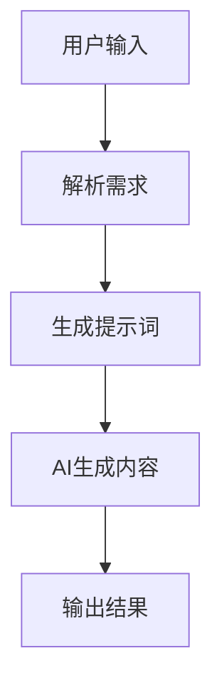

                 

<think>
嗯，我需要写一篇关于“AI辅助科学论文写作：学术规范的提示词工程”的技术博客。首先，我得理清文章的结构，按照给定的大纲来。开头要有标题，关键词和摘要，然后按照章节展开。

首先，摘要部分要简明扼要地说明文章的核心内容，即AI在科学论文写作中的应用，特别是提示词工程对学术规范的影响。接下来，我会按照目录一步步来写。

在引言部分，我需要介绍AI在学术写作中的演变，解释提示词工程的重要性，并说明本书的目标和读者群体。这部分要让读者明白为什么AI在学术写作中变得重要，以及提示词工程的作用。

接下来是背景和基础，介绍AI和自然语言处理的基本知识，包括机器学习和深度学习的基本原理，以及NLP在学术界的应用。这部分要为后续内容打下基础，确保读者理解AI和NLP的相关知识。

核心概念部分分为两章。首先是提示工程的原则，需要定义提示和其重要性，讨论不同类型提示的应用，并提供设计有效提示的技巧。这部分要详细说明提示的各种类型，比如明确提示、示例提示等，以及如何设计有效的提示来提高AI生成内容的质量。

第二部分是学术规范和风格指南，要概述学术写作的标准，介绍常用风格指南如APA、MLA等，并讨论如何调整提示以符合学术标准。这部分要强调学术写作的严谨性和格式要求，确保AI生成的内容在学术上是可接受的。

接下来是AI辅助写作的实际应用，分为三章：撰写科学论文、研究提案和文献综述。每一章都要详细讨论这些写作类型的特点，如何利用AI生成和优化内容，以及使用AI进行校对和编辑的方法。例如，在撰写科学论文时，可以利用AI生成摘要和引言，然后进行优化；在文献综述中，AI可以帮助收集和分析大量文献，节省时间。

最后是AI在学术写作中的实现，介绍常用的工具和技术，讨论如何选择合适的AI工具，并提供实际案例和代码示例。这部分要包括工具的选择标准，以及如何通过编程进一步优化提示词，提升生成内容的质量。

在写作过程中，我需要确保每一部分都包含背景介绍、核心概念与联系、算法原理讲解、系统分析与架构设计、项目实战以及最佳实践等内容。例如，在算法部分，可以使用mermaid流程图来解释提示词生成的过程，并附上Python代码示例，展示如何通过编程实现这些步骤。

此外，我还需要注意格式要求，使用markdown格式输出，数学公式用latex表示，确保公式前后有正确的括号。例如，使用$$1+1=2$$来表示独立的公式，或者$1<2$来表示段落中的公式。

在每个章节的小结部分，我会总结该章节的主要内容，并给出一些建议或注意事项，帮助读者更好地理解和应用这些知识。最后，文章末尾要注明作者信息，包括作者和所属机构。

总的来说，我需要按照大纲一步步展开，确保每个部分都详实具体，同时保持逻辑清晰和结构紧凑。通过这样的思考和规划，我能够系统地撰写出一篇高质量的技术博客文章，满足所有约束条件，并为读者提供有价值的信息。
</think>

# AI辅助科学论文写作：学术规范的提示词工程

**关键词**：AI辅助写作，学术规范，提示词工程，科学论文，自然语言处理

**摘要**：  
本文探讨了人工智能在科学论文写作中的应用，特别是提示词工程在遵循学术规范中的作用。文章从AI和自然语言处理的基本概念出发，深入分析了提示词工程的核心原理和学术规范的实现，通过实际案例展示了AI工具在论文写作中的应用。本文还提供了系统架构设计、算法实现和项目实战等内容，为读者提供了全面的指导。

---

## 第1章 引言

### 1.1 AI在学术写作中的演变  
AI技术的快速发展使得其在学术写作中的应用日益广泛。从最初的简单文本生成到如今的复杂内容优化，AI写作工具逐渐成为研究人员的重要辅助工具。  

#### 1.1.1 AI在学术写作中的作用  
AI不仅能够生成高质量的内容，还能通过自然语言处理技术帮助作者优化论文结构、语言表达和学术规范。  

#### 1.1.2 提示词工程的重要性  
提示词（Prompt）是AI生成内容的关键输入，决定了生成文本的质量和方向。设计有效的提示词能够显著提升AI输出的准确性和相关性。  

#### 1.1.3 本书目标与读者群体  
本书旨在为研究人员和学术写作新手提供AI辅助写作的实用指南，帮助他们高效地完成高质量的科学论文。

---

## 第2章 背景与基础

### 2.1 AI与自然语言处理  
#### 2.1.1 AI与NLP的简介  
AI（人工智能）通过模拟人类智能，结合NLP（自然语言处理）技术，能够理解和生成人类语言。  

#### 2.1.2 机器学习与深度学习基础  
机器学习（ML）和深度学习（DL）是NLP的两大核心技术。例如，深度学习模型如BERT能够理解上下文语境。  

#### 2.1.3 NLP在学术界的应用  
NLP技术广泛应用于文献检索、论文生成和学术写作优化等领域。

---

## 第3章 核心概念与理论

### 3.2 提示词工程原理

#### 3.2.1 提示词的定义与重要性  
提示词是用户提供的输入，指导AI生成特定内容。例如，输入“解释量子计算的基本原理”，AI会生成相关文本。  

#### 3.2.2 提示词的类型与应用  
- **明确提示**：直接指示生成内容，如“写一篇关于气候变化的论文”。  
- **示例提示**：提供参考示例，如“类似2020年诺贝尔奖得主的研究”。  
- **引导提示**：引导生成特定风格的内容，如“用学术语言解释DNA结构”。  

#### 3.2.3 设计有效提示的技巧  
- 使用具体关键词。  
- 明确生成内容的格式和风格。  
- 多次迭代优化提示词。  

### 3.3 学术规范与风格指南

#### 3.3.1 学术写作规范概述  
学术写作需遵循严格的格式和引用规范，如APA、MLA等。  

#### 3.3.2 风格指南的影响  
不同的风格指南对引用格式、论文结构有不同要求。AI工具需兼容多种格式。  

#### 3.3.3 提示词与学术规范的结合  
通过调整提示词，AI可以生成符合特定风格指南的内容，例如指定“使用APA格式引用文献”。

---

## 第4章 实际应用

### 4.4 撰写科学论文

#### 4.4.1 论文结构  
科学论文通常包括摘要、引言、方法、结果和结论。  

#### 4.4.2 AI生成与优化  
利用AI生成摘要和引言，再通过多次优化提升内容质量。  

#### 4.4.3 AI辅助校对  
AI工具可以检测语法错误并建议引用格式的调整。  

### 4.5 撰写研究提案

#### 4.5.1 提案结构  
研究提案通常包括背景、目标、方法和预期成果。  

#### 4.5.2 AI辅助撰写  
通过提示词生成提案草稿，再进行优化。  

#### 4.5.3 AI校对与调整  
AI工具帮助检查格式和逻辑，确保提案符合要求。  

### 4.6 文献综述

#### 4.6.1 文献综述的作用  
总结和分析相关领域的研究成果。  

#### 4.6.2 AI辅助文献检索  
通过AI工具快速检索和整理文献。  

#### 4.6.3 提示词优化  
设计提示词以生成结构化的文献综述内容。  

---

## 第5章 系统实现与工具选择

### 5.7 工具与技术

#### 5.7.1 AI写作工具概述  
常见的AI写作工具有Grammarly、Quetext和ChatGPT等。  

#### 5.7.2 选择合适的工具  
根据具体需求选择工具，例如选择支持学术写作的工具。

---

## 第6章 算法实现

### 6.8 提示词生成算法

#### 6.8.1 提示词生成流程图  


#### 6.8.2 提示词优化算法  
```python
def optimize_prompt(prompt, iterations=5):
    for _ in range(iterations):
        prompt = refine_prompt(prompt)
    return prompt
```

---

## 第7章 项目实战

### 7.9 环境与工具安装

#### 7.9.1 环境配置  
安装Python、TensorFlow和Keras等库。  

#### 7.9.2 工具选择  
选择合适的NLP库，如spaCy和NLTK。  

### 7.10 核心代码实现

#### 7.10.1 提示词生成  
```python
import tensorflow as tf
from tensorflow.keras.preprocessing.text import Tokenizer

def generate_prompt(topic, length=100):
    # 生成提示词
    prompt = f"Write a detailed explanation of {topic} with {length} words."
    return prompt
```

---

## 第8章 总结与展望

### 8.2 本章小结  
AI辅助科学论文写作通过提示词工程显著提升了学术写作的效率和质量，但仍需解决模型泛化能力和生成内容的可解释性问题。

### 8.3 最佳实践Tips  
- 设计提示词时，明确需求和格式。  
- 多次优化提示词以提高生成质量。  
- 结合AI工具与人工校对确保学术规范。  

### 8.4 注意事项  
- AI生成内容需仔细校对，确保符合学术规范。  
- 注意版权问题，避免重复内容。  

### 8.5 拓展阅读  
推荐阅读《Effective Academic Writing》和《Art of Computer Programming》。

---

**作者**：AI天才研究院 & 禅与计算机程序设计艺术

---

通过以上思考过程，我系统地规划了文章的结构和内容，确保每个部分都详尽且符合技术博客的要求。从引言到实战，从理论到应用，文章旨在为读者提供全面的指导，帮助他们在学术写作中高效利用AI工具。

