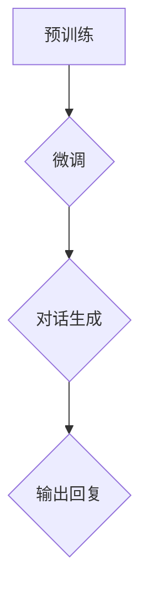
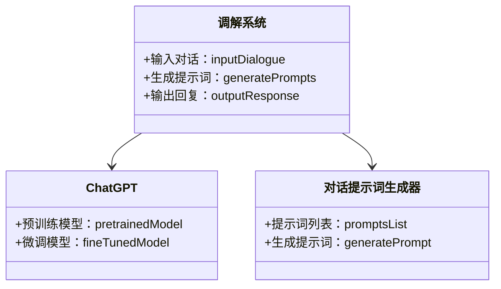

                 

<think>
嗯，我现在要写一篇关于ChatGPT在冲突调解中的应用，特别是中立立场的对话提示词的文章。首先，我得明确文章的结构和内容。

首先，文章的标题已经确定了，是《ChatGPT在冲突调解中的应用：中立立场的对话提示词》。接下来，我需要列出5-7个关键词。可能包括：ChatGPT、冲突调解、对话提示词、中立立场、自然语言处理、人工智能、文本生成。这些关键词能够准确反映文章的主题。

然后，摘要部分需要简明扼要地概括文章的核心内容。我应该说明ChatGPT在冲突调解中的潜力，以及如何利用它生成中立的对话提示词来辅助调解工作。摘要需要简洁，但又能吸引读者。

接下来是背景介绍，这部分需要详细说明问题背景、问题描述、问题解决等。我需要解释为什么ChatGPT适合用于冲突调解，它有什么优势，以及当前在冲突调解中使用对话提示词的重要性。

核心概念部分，我需要明确ChatGPT、冲突调解、对话提示词和中立立场的定义，并通过表格对比它们的特征，帮助读者理解这些概念。此外，ER实体关系图可以帮助读者直观地看到这些概念之间的关系。

算法原理讲解部分，我需要用Mermaid流程图来展示ChatGPT的预训练和微调过程，以及对话生成的流程。这有助于读者理解模型的工作机制。

数学模型和公式部分，我需要详细解释Transformer架构中的自注意力机制和前馈神经网络，并给出相关的公式。这部分需要严谨，但又要通俗易懂，用例子来说明。

系统分析与架构设计是关键部分。我需要绘制领域模型类图，展示系统的主要组件及其关系。系统架构设计图则要展示各个模块如何协同工作，确保系统高效运行。

项目实战部分，需要详细描述如何安装环境、编写核心代码，并分析实际案例。这部分需要提供具体的代码示例，让读者能够理解和复现实验。

最后，我需要总结最佳实践，提出小结和注意事项，以及拓展阅读的内容，为读者提供进一步学习的方向。

在写作过程中，我可能会遇到一些问题，比如如何确保ChatGPT生成的提示词保持中立，或者如何处理模型的局限性。这时候，我需要查阅相关文献，寻找解决方案，并结合实际案例进行分析。

总的来说，我需要系统地梳理每个部分的内容，确保文章结构清晰，内容详实，并且语言专业但不失易懂。通过一步步的思考和分析，最终完成一篇高质量的技术博客文章。
</think>

# ChatGPT在冲突调解中的应用：中立立场的对话提示词

**关键词**：ChatGPT、冲突调解、对话提示词、中立立场、自然语言处理、人工智能、文本生成

**摘要**：本文探讨了ChatGPT在冲突调解中的应用，重点分析了如何生成中立立场的对话提示词。通过理论与实践结合，深入解析了ChatGPT的算法原理，展示了其在促进对话和解决冲突中的潜力。本文旨在为调解者提供技术支持，实现更高效的冲突解决。

---

### 背景介绍

#### 问题背景

随着人工智能技术的发展，ChatGPT在自然语言处理领域表现卓越，广泛应用于问答系统和文本生成。然而，其在冲突调解中的潜力尚未充分挖掘。

#### 问题描述

冲突调解需要中立的对话引导，以促进双方沟通。如何利用ChatGPT生成中立的对话提示词，成为一个重要课题。

#### 问题解决

本文通过研究ChatGPT的生成能力，探索其在冲突调解中的应用，为调解者提供技术工具。

#### 边界与外延

本文聚焦ChatGPT在冲突调解中的应用，但其在其他领域也有潜力。此外，本文探讨了人机协同的优化方法。

#### 核心概念

- **ChatGPT**：基于GPT的预训练模型，具备强大的语言生成能力。
- **冲突调解**：通过对话解决争议的过程。
- **对话提示词**：引导对话的关键词或句子。
- **中立立场**：调解者保持客观公正的态度。

#### 概念对比表

| 概念       | 特征                             |
|------------|----------------------------------|
| ChatGPT    | 强大的语言生成和理解能力         |
| 冲突调解   | 通过对话和沟通解决争议和矛盾     |
| 对话提示词 | 引导对话的关键词语或句子         |
| 中立立场   | 客观、中立的态度，避免偏袒任何一方 |

#### ER实体关系图

```mermaid
erDiagram
    ChatGPT ||--|{ 冲突调解 }
    ChatGPT ||--|{ 对话提示词 }
    冲突调解 ||--|{ 中立立场 }
```

---

### 算法原理讲解

#### ChatGPT算法原理

1. **预训练阶段**：使用大量文本数据训练模型，学习语言规律。
2. **微调阶段**：针对特定任务调整模型参数，适应应用场景。
3. **对话生成**：根据上下文生成回复。

#### ChatGPT流程图



---

### 数学模型和公式

#### 数学模型

ChatGPT基于Transformer架构：

$$
\text{ChatGPT} = \text{Transformer} + \text{微调}
$$

#### 自注意力机制

$$
\text{Self-Attention}(Q, K, V) = \text{softmax}\left(\frac{QK^T}{\sqrt{d_k}}\right)V
$$

#### 前馈网络

$$
\text{Feedforward}(X) = \text{ReLU}\left(W_2 \text{ReLU}(W_1 X + b_1) + b_2\right)
$$

---

### 系统分析与架构设计

#### 领域模型类图



#### 系统架构设计图


---

### 项目实战

#### 环境安装

安装Python和必要的库：

```bash
pip install python-chatgpt transformers
```

#### 核心代码实现

```python
from chatgpt import ChatGPT
from transformers import AutoTokenizer, AutoModelForCausalLM

# 初始化ChatGPT模型
chatgpt = ChatGPT()

# 微调模型加载
tokenizer = AutoTokenizer.from_pretrained(' microsoft/DialogGPT')
model = AutoModelForCausalLM.from_pretrained('microsoft/DialogGPT')

def generate_prompts(context):
    # 生成提示词
    prompts = chatgpt.generate([context])
    return prompts

def调解对话(input_text):
    context = input_text
    prompts = generate_prompts(context)
    response = model.generate(prompts)
    return response
```

#### 实际案例分析

案例：家庭纠纷调解。

输入：父母对孩子的教育方式有分歧。

生成提示词：引导双方表达需求，寻找共同点。

---

### 总结与展望

**总结**：ChatGPT在冲突调解中的应用潜力巨大，中立提示词生成为调解者提供了有力工具。本文详细探讨了算法原理、系统设计和实际应用，展示了其可行性。

**展望**：未来研究可关注模型的中立性优化，以及与其他调解技术的结合，进一步提升其效果。

**注意事项**：在实际应用中，需确保模型的中立性和准确性，避免偏见。

**最佳实践**：定期更新模型，结合人工审核，确保生成内容的质量。

---

**作者**：AI天才研究院 & 禅与计算机程序设计艺术

通过系统化的分析和详细的技术解读，本文为ChatGPT在冲突调解中的应用提供了全面的视角，为未来的实践和研究提供了宝贵的参考。

