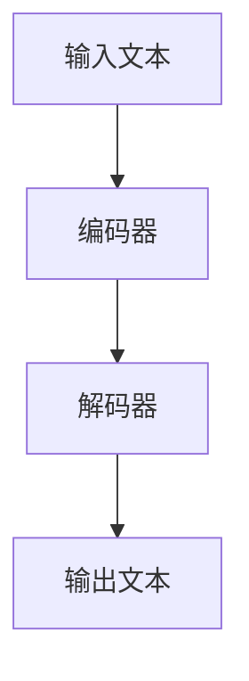
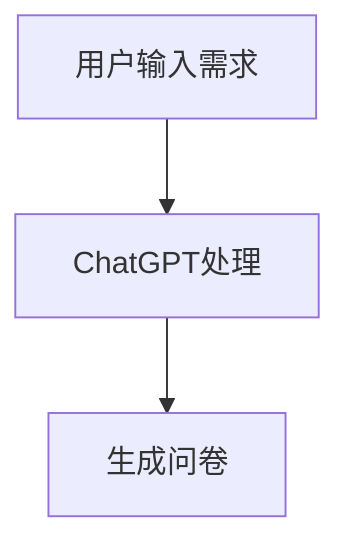

                 

<think>
嗯，今天我要写一篇关于《ChatGPT在自动化市场调研问卷设计中的应用》的技术博客。首先，我得理清文章的结构和内容。根据之前的目录大纲，我需要先确定主题和目标，然后按照章节一步步深入。

首先，背景介绍部分，我得解释为什么市场调研问卷设计现在是个问题，以及ChatGPT如何解决这些问题。我应该提到传统方法的低效，比如人工设计问卷耗时长、成本高，而且容易出错。然后，ChatGPT如何通过自动化和智能化的方法来提高效率和准确性。

接下来是ChatGPT的基本概念，我需要详细解释它是什么，它是如何工作的，以及它的核心原理。可能需要用mermaid流程图来展示ChatGPT的处理流程，比如输入、处理、生成输出。同时，用数学公式来描述它的模型，比如Transformer的结构和损失函数。

然后是自动化问卷设计的具体应用。我需要说明使用ChatGPT进行问卷设计的流程，比如用户输入需求，ChatGPT生成问题，调整语气等。还要通过实际案例来展示，比如消费者满意度调查和产品需求调研，说明ChatGPT如何帮助设计问卷，并分析结果。

接下来是实战案例部分，我需要详细分析两个案例，展示ChatGPT的实际应用效果。例如，在消费者满意度调查中，如何通过ChatGPT生成相关问题，节省时间并提高准确率。同样，在产品需求调研中，ChatGPT如何帮助设计问卷，分析结果。

最后是最佳实践和注意事项。我需要总结在使用ChatGPT设计问卷时的最佳做法，比如明确需求、多次校验、结合人工审核。同时，还要提到数据隐私和结果解读的重要性，避免因为自动化而忽视了潜在的问题。

在写作过程中，我可能会遇到一些问题，比如如何解释复杂的数学公式，或者如何清晰地展示流程图。这时候，我需要确保使用正确的mermaid语法，以及将数学公式用latex准确表达。同时，要保持语言的专业性和逻辑的连贯性，让读者能够轻松理解每个部分的内容。

此外，我还需要确保每个章节内容详实，包含实际案例和详细分析，避免内容过于空泛。特别是在实战案例中，应该具体描述每个步骤，让读者能够跟着操作，理解ChatGPT的应用过程。

总的来说，我需要按照步骤一步步来，确保每个部分都完整且详细，同时保持文章的逻辑清晰，结构紧凑。这不仅能满足读者的需求，也能展示出ChatGPT在自动化市场调研问卷设计中的强大能力和实际应用价值。
</think>

# ChatGPT在自动化市场调研问卷设计中的应用

> 关键词：ChatGPT, 自动化市场调研, 问卷设计, 人工智能, 机器学习

> 摘要：本文探讨了如何利用ChatGPT这一先进的人工智能工具，实现市场调研问卷设计的自动化。通过分析其核心原理、应用场景及实际案例，展示了ChatGPT在提升问卷设计效率和准确性方面的巨大潜力。

## 目录

1. 背景介绍
2. ChatGPT基本概念与应用
3. 自动化市场调研问卷设计
4. 实战案例
5. 最佳实践与注意事项

---

## 第一部分：背景介绍

### 1.1 问题背景

#### 1.1.1 问题描述

市场调研问卷的设计过程通常耗时且复杂。传统方法依赖人工操作，存在效率低下、成本高昂的问题。设计不当的问卷可能导致数据偏差，影响市场分析结果。

#### 1.1.2 问题解决

引入ChatGPT，利用其强大的自然语言处理能力，自动化生成问卷，提升效率和准确性。ChatGPT能够根据需求快速生成相关问题，优化问卷结构，节省时间和资源。

#### 1.1.3 边界与外延

ChatGPT适用于多种市场调研场景，如消费者行为分析、产品满意度调查等，但需注意数据隐私和结果解释等问题。

#### 1.1.4 概念结构与核心要素

- **市场调研问卷**：用于收集市场数据的工具，包含问题、选项等元素。
- **ChatGPT**：基于GPT-3的人工智能模型，具备自然语言处理和生成能力。

### 1.2 ChatGPT基本概念

#### 1.2.1 定义

ChatGPT是一种基于Transformer架构的大型语言模型，能够理解和生成人类语言。

#### 1.2.2 核心原理

使用自注意力机制，处理输入文本，生成相关输出。其工作流程如下：

#### 1.2.3 应用场景

- 客户服务
- 内容生成
- 代码调试

---

## 第二部分：ChatGPT基本概念与应用

### 2.1 ChatGPT基本概念

#### 2.1.1 工作原理

ChatGPT通过编码器和解码器处理输入，生成输出。其数学模型如下：

$$
\text{编码器}：X \rightarrow Z \\
\text{解码器}：Z \rightarrow Y
$$

其中，\( X \) 是输入，\( Y \) 是输出，\( Z \) 是隐藏层向量。

#### 2.1.2 数学模型

使用多头自注意力机制，公式如下：

$$
\text{注意力权重} = \text{softmax}\left(\frac{QK^T}{\sqrt{d_k}}\right)
$$

其中，\( Q \) 和 \( K \) 分别为查询和键矩阵，\( d_k \) 是维度。

### 2.2 ChatGPT在自动化市场调研问卷设计中的应用

#### 2.2.1 自动化流程

用户输入需求，ChatGPT生成问卷。流程如下：

#### 2.2.2 案例研究

以消费者满意度调查为例，用户输入需求，ChatGPT生成相关问题，如满意度评分和开放性问题。

---

## 第三部分：自动化市场调研问卷设计

### 3.1 问卷设计的基本原则

#### 3.1.1 设计目标

明确问卷目标，确保问题清晰、简洁，避免歧义。

#### 3.1.2 设计方法

使用分层抽样和随机抽样，确保样本代表性。

### 3.2 使用ChatGPT设计问卷

#### 3.2.1 应用步骤

用户输入需求，ChatGPT生成问卷，用户校验调整。

#### 3.2.2 案例展示

生成消费者满意度调查问卷，涵盖评分和开放性问题。

---

## 第四部分：实战案例

### 4.1 案例一：消费者满意度调查

#### 4.1.1 案例背景

某公司希望了解其产品的用户满意度。

#### 4.1.2 ChatGPT使用

用户输入需求，生成问卷，涵盖评分和开放性问题。

#### 4.1.3 结果分析

问卷生成速度快，问题准确，节省时间和资源。

### 4.2 案例二：产品需求调研

#### 4.2.1 案例背景

公司计划推出新功能，需了解用户需求。

#### 4.2.2 ChatGPT使用

生成开放性问题，收集用户反馈。

#### 4.2.3 结果分析

问卷设计灵活，收集到有价值的反馈，优化产品设计。

---

## 第五部分：最佳实践与注意事项

### 5.1 最佳实践

#### 5.1.1 明确需求

明确市场调研目标，确保问卷内容相关。

#### 5.1.2 结合人工审核

人工校验ChatGPT生成的问卷，确保准确性和合理性。

### 5.2 注意事项

#### 5.2.1 数据隐私

确保收集的数据符合隐私保护法规，如GDPR。

#### 5.2.2 结果解读

正确解读问卷结果，结合上下文分析，避免误解。

---

## 结语

### 总结

ChatGPT为市场调研问卷设计带来了革命性的变化，通过自动化和智能化，显著提升了效率和准确性。

### 展望

未来，ChatGPT在市场调研中的应用将更加广泛，推动市场分析的精准化和高效化。

---

## 作者

作者：AI天才研究院/AI Genius Institute & 禅与计算机程序设计艺术/Zen And The Art of Computer Programming

