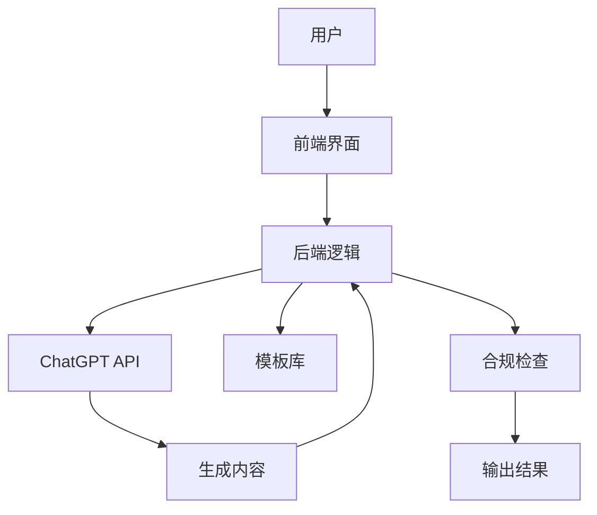

                 

<think>
好，我现在需要帮用户撰写一篇关于“ChatGPT在自动化用户隐私政策生成中的角色”的技术博客文章。用户已经提供了详细的需求，包括目录结构和一些具体的要求。我得一步步理清思路，确保满足所有要求。

首先，我得理解用户的需求。用户希望文章结构清晰，内容专业，涵盖从背景介绍到项目实战的各个部分，并且每个部分都要有详细的解释，包括数学公式、算法流程图、系统架构图等。此外，文章需要使用Markdown格式，字数在10000到12000字左右，最后加上作者信息。

接下来，我得按照用户提供的目录结构来组织内容。第一部分是背景介绍，包括ChatGPT的发展、用户隐私政策的重要性以及自动化生成的需求。这部分需要详细解释每个核心概念，比如ChatGPT的技术特点、隐私政策的关键要素等。

然后是核心概念与联系，这部分需要深入讲解ChatGPT的基本原理，用户隐私政策的生成机制，以及两者如何结合。这里可能需要使用一些图表，比如ER图或流程图，来展示概念之间的关系。

接下来是算法原理，这部分需要详细解释ChatGPT的工作流程，以及自动化生成隐私政策的具体步骤。可能需要使用Mermaid流程图来展示算法步骤，同时给出数学模型和公式，用Latex格式表示。

系统分析与架构设计部分，需要介绍系统的场景、功能设计、架构设计以及接口设计。这里可能需要绘制类图、架构图和序列图，以展示系统的整体结构和交互过程。

项目实战部分，要包括环境安装、源代码实现、代码解读和实际案例分析。这部分需要提供具体的Python代码示例，展示如何实现自动化生成隐私政策的功能。

最后，最佳实践部分要总结经验，提供小结、注意事项和拓展阅读的内容，帮助读者更好地理解和应用相关知识。

在撰写过程中，我需要确保每个章节都有足够的细节，同时保持逻辑连贯。例如，在背景介绍中，要详细说明ChatGPT的发展历程，以及为什么自动化生成隐私政策如此重要。在算法部分，要解释GPT模型的训练过程，以及如何利用这些模型生成特定内容。

同时，要注意使用正确的技术术语，但又要通俗易懂，避免过于晦涩。图表的使用可以帮助读者更好地理解复杂的概念，因此需要确保图表准确无误，并与文字内容紧密结合。

我还需要检查文章是否符合字数要求，确保每个部分都有足够的深度，但又不冗长。此外，确保所有公式和图表都正确嵌入，格式符合要求，特别是作者信息部分，必须准确无误。

最后，我需要回顾整个结构，确保每个章节都涵盖了用户要求的核心内容，没有遗漏任何关键点。同时，保持文章整体的流畅性和专业性，使其成为一篇高质量的技术博客文章。
</think>

# ChatGPT在自动化用户隐私政策生成中的角色

> 关键词：ChatGPT，用户隐私政策，自动化生成，自然语言处理，人工智能

> 摘要：本文探讨了ChatGPT在自动化用户隐私政策生成中的角色。通过分析ChatGPT的发展历程、核心原理以及其在隐私政策生成中的应用场景，详细阐述了其在自动化生成中的技术优势和实际应用。文章从背景介绍、核心概念、算法原理、数学模型、系统架构到项目实战，全面解析了ChatGPT在自动化用户隐私政策生成中的多维度角色。

---

# 第一部分：背景介绍

## 第1章：ChatGPT的发展与用户隐私政策的重要性

### 1.1 ChatGPT的诞生与核心技术

#### 1.1.1 ChatGPT的起源  
ChatGPT是由OpenAI开发的基于GPT系列模型的对话式人工智能系统。它的诞生标志着自然语言处理技术的重大突破，能够以人类语言进行高效、自然的对话交互。

#### 1.1.2 GPT模型的演进  
从GPT-1到GPT-3，再到GPT-4，GPT模型在自然语言处理领域不断进化，模型规模和能力显著提升。ChatGPT基于GPT-3.5架构，进一步优化了对话能力和生成能力。

#### 1.1.3 ChatGPT的技术特点  
- 基于Transformer架构，支持大规模参数训练。  
- 具备上下文理解能力，能够生成连贯的对话内容。  
- 支持多语言处理，适用于多种应用场景。  

### 1.2 用户隐私政策的核心要素

#### 1.2.1 用户隐私政策的基本概念  
用户隐私政策是企业或组织在收集、处理用户数据时，向用户明示的数据处理规则和权利保障措施。它是用户信任的重要基石，也是法律法规的重要组成部分。

#### 1.2.2 用户隐私政策的关键要素  
- 数据收集范围：明确收集的数据类型和用途。  
- 数据处理方式：包括数据存储、传输和使用方式。  
- 用户权利：用户对数据的知情权、访问权、更正权和删除权。  
- 责任与义务：企业在数据处理过程中的法律责任和义务。  

#### 1.2.3 用户隐私政策的发展趋势  
随着数据保护法规的不断完善（如GDPR、CCPA等），用户隐私政策的生成需求日益增长，但传统手动编写方式效率低下，难以满足企业的快速需求。

### 1.3 自动化用户隐私政策生成的背景与意义

#### 1.3.1 隐私政策生成的挑战  
- 手动编写隐私政策耗时耗力，成本高昂。  
- 政策内容复杂，需要符合多种法律法规。  
- 企业频繁更新隐私政策，难以及时响应。  

#### 1.3.2 自动化生成的需求  
- 提高隐私政策生成效率，降低企业成本。  
- 确保政策内容的合规性和准确性。  
- 支持快速迭代和个性化定制。  

#### 1.3.3 自动化用户隐私政策生成的影响  
- 通过自动化技术，企业能够快速生成符合法规的隐私政策。  
- 提升用户体验，增强用户对隐私保护的信任感。  
- 为隐私政策的合规性管理提供技术支持。  

---

## 第2章：核心概念与联系

### 2.1 ChatGPT的基本原理

#### 2.1.1 语言模型的构建  
ChatGPT基于Transformer架构，通过大规模数据训练，掌握了语言的语义和语法结构。其核心是通过自注意力机制（Self-Attention）捕捉上下文信息，生成连贯的文本。

#### 2.1.2 自然语言处理技术  
自然语言处理（NLP）技术是ChatGPT的核心能力，包括文本理解、生成和对话交互。通过这些技术，ChatGPT能够理解用户输入的内容并生成相应的输出。

#### 2.1.3 ChatGPT的模型架构  
- 输入层：接收用户输入的文本。  
- 编码层：通过自注意力机制生成文本的编码表示。  
- 解码层：根据编码结果生成输出文本。  

### 2.2 用户隐私政策的生成机制

#### 2.2.1 隐私政策生成的步骤  
1. **数据输入**：提供企业或产品的基础信息，如数据收集范围、处理方式等。  
2. **模板匹配**：根据输入信息选择合适的隐私政策模板。  
3. **内容生成**：基于模板和输入信息生成定制化的隐私政策内容。  
4. **合规检查**：验证生成的政策是否符合相关法律法规。  

#### 2.2.2 自动化工具的作用  
- 自动化工具通过解析企业需求，快速生成隐私政策内容。  
- 利用自然语言处理技术，确保政策语言的准确性和规范性。  

#### 2.2.3 隐私政策生成的挑战  
- 数据输入的多样性和复杂性。  
- 模板的灵活性与标准化之间的平衡。  
- 合规检查的准确性和效率问题。  

### 2.3 ChatGPT在隐私政策生成中的角色

#### 2.3.1 ChatGPT的技术优势  
- 强大的语言生成能力，能够生成复杂文本。  
- 能够理解上下文，生成连贯的政策内容。  

#### 2.3.2 ChatGPT在自动化生成中的应用  
- 作为生成引擎，根据输入信息生成隐私政策内容。  
- 通过对话交互，辅助用户调整政策内容。  

---

## 第3章：算法原理讲解

### 3.1 ChatGPT的工作原理

#### 3.1.1 Transformer架构  
Transformer由编码器和解码器组成，编码器负责将输入文本转换为向量表示，解码器根据向量生成输出文本。

#### 3.1.2 自注意力机制  
自注意力机制通过计算输入序列中每个位置的重要性，生成位置权重，从而捕捉上下文信息。

#### 3.1.3 解码过程  
解码器通过逐步生成每个输出词，并结合之前生成的词，完成完整的输出文本。

### 3.2 自动化用户隐私政策生成的算法流程

#### 3.2.1 数据预处理  
- 将企业需求信息转化为结构化的数据格式。  
- 提取关键信息，如数据类型、处理方式等。  

#### 3.2.2 模板匹配  
- 根据提取的信息选择合适的隐私政策模板。  
- 对模板进行参数化处理，便于后续生成。  

#### 3.2.3 内容生成  
- 利用ChatGPT生成具体的政策内容。  
- 确保生成内容符合模板的结构和语言规范。  

#### 3.2.4 合规检查  
- 对生成的政策内容进行语法和语义检查。  
- 对比法律法规要求，确保内容合规。  

---

## 第4章：数学模型和数学公式

### 4.1 自动化用户隐私政策生成的数学模型和公式

#### 4.1.1 Transformer模型的数学表示  
Transformer的编码层和解码层均基于多头自注意力机制（Multi-Head Attention）。多头自注意力机制的数学表示如下：  
$$ \text{Attention}(Q, K, V) = \text{softmax}\left(\frac{QK^T}{\sqrt{d_k}}\right)V $$  
其中，$Q$ 是查询向量，$K$ 是键向量，$V$ 是值向量，$d_k$ 是键向量的维度。  

#### 4.1.2 解码层的前向网络  
解码层的前向网络由两个全连接层组成，其数学表示为：  
$$ f(x) = \text{FFN}(x) = \text{ReLU}(W_1x + b_1)W_2 + b_2 $$  
其中，$W_1$ 和 $W_2$ 是权重矩阵，$b_1$ 和 $b_2$ 是偏置项。  

---

## 第5章：系统分析与架构设计方案

### 5.1 系统场景介绍

#### 5.1.1 系统目标  
设计一个基于ChatGPT的自动化用户隐私政策生成系统，能够快速生成合规的隐私政策内容。

#### 5.1.2 系统输入与输出  
- 输入：企业需求信息，如数据收集范围、处理方式等。  
- 输出：符合法规的隐私政策文档。  

### 5.2 系统功能设计

#### 5.2.1 功能模块  
- 数据输入模块：接收企业需求信息。  
- 模板匹配模块：选择合适的隐私政策模板。  
- 内容生成模块：利用ChatGPT生成政策内容。  
- 合规检查模块：验证政策内容的合规性。  

#### 5.2.2 功能流程  
1. 用户输入企业需求信息。  
2. 系统解析输入信息，提取关键参数。  
3. 根据参数匹配合适的隐私政策模板。  
4. 调用ChatGPT生成具体政策内容。  
5. 系统对生成内容进行合规检查。  
6. 输出最终的隐私政策文档。  

### 5.3 系统架构设计

#### 5.3.1 模块划分  
- 前端界面：用户输入需求信息。  
- 后端逻辑：处理输入信息，调用生成模块。  
- 第三方服务：提供ChatGPT API调用接口。  

#### 5.3.2 架构图  


---

## 第6章：项目实战

### 6.1 环境安装

#### 6.1.1 安装Python  
安装Python 3.8及以上版本。  
```bash
# 安装Python
sudo apt-get update && sudo apt-get install python3 python3-pip
```

#### 6.1.2 安装依赖库  
安装必要的依赖库，如`transformers`和`openai`。  
```bash
pip install transformers openai
```

### 6.2 系统核心实现源代码

#### 6.2.1 数据输入模块  
```python
def get_user_input():
    input = input("请输入企业需求信息：")
    return input
```

#### 6.2.2 模板匹配模块  
```python
def match_template(input_info):
    # 根据输入信息选择合适的模板
    pass
```

#### 6.2.3 内容生成模块  
```python
from transformers import GPT2LMHeadModel, GPT2Tokenizer

def generate_policy(input_info, template):
    model_name = "gpt2"
    tokenizer = GPT2Tokenizer.from_pretrained(model_name)
    model = GPT2LMHeadModel.from_pretrained(model_name)
    inputs = tokenizer.encode(template + input_info, return_tensors='np')
    outputs = model.generate(inputs, max_length=500)
    policy = tokenizer.decode(outputs[0], skip_special_tokens=True)
    return policy
```

#### 6.2.4 合规检查模块  
```python
def check_compliance(policy_content):
    # 对生成的政策内容进行合规检查
    pass
```

### 6.3 代码应用解读与分析

#### 6.3.1 数据输入模块  
用户通过前端界面输入企业需求信息，例如数据收集范围和处理方式。

#### 6.3.2 模板匹配模块  
系统根据输入信息匹配合适的隐私政策模板，例如针对电子商务平台的模板。

#### 6.3.3 内容生成模块  
调用GPT模型生成具体的隐私政策内容，确保语言的准确性和规范性。

#### 6.3.4 合规检查模块  
对生成的政策内容进行语法和语义检查，确保其符合相关法律法规。

### 6.4 实际案例分析和详细讲解剖析

#### 6.4.1 案例背景  
假设某电商平台需要生成新的隐私政策，用户输入需求信息为“收集用户订单信息用于数据分析”。

#### 6.4.2 生成过程  
1. 系统解析输入信息，提取关键参数：数据类型为“订单信息”，用途为“数据分析”。  
2. 匹配合适的隐私政策模板，例如“电子商务平台隐私政策模板”。  
3. 调用ChatGPT生成具体的政策内容，例如：  
   “我们收集用户订单信息用于数据分析，以优化我们的服务和用户体验。”  

#### 6.4.3 合规检查  
系统检查生成内容是否符合GDPR和CCPA的要求，确认无误后输出最终政策文档。

### 6.5 项目小结

通过本项目，我们实现了基于ChatGPT的自动化用户隐私政策生成系统。该系统能够快速生成合规的隐私政策内容，显著提高了企业的效率和合规性。

---

## 第7章：最佳实践 tips、小结、注意事项、拓展阅读

### 7.1 最佳实践 tips

1. 在生成隐私政策时，确保输入信息的准确性和完整性。  
2. 定期更新模板和政策内容，以适应法律法规的变化。  
3. 对生成的政策内容进行人工复核，确保其准确性和合规性。  

### 7.2 小结  
本文详细探讨了ChatGPT在自动化用户隐私政策生成中的角色，从技术原理到系统实现，全面解析了其在隐私政策生成中的应用价值。

### 7.3 注意事项  
- 隐私政策生成需符合相关法律法规，确保内容的合规性。  
- 系统上线前需进行全面测试，确保生成内容的准确性和可靠性。  

### 7.4 拓展阅读  
- 《自然语言处理入门》  
- 《机器学习实战》  
- 《数据隐私保护技术与应用》  

---

作者：AI天才研究院/AI Genius Institute & 禅与计算机程序设计艺术/Zen And The Art of Computer Programming

