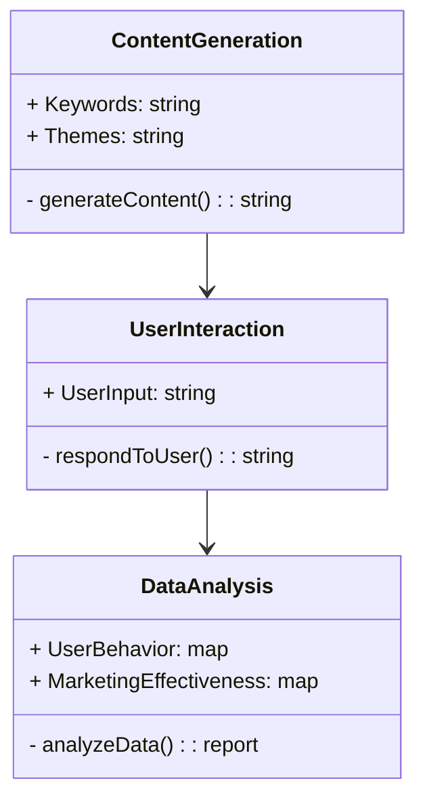
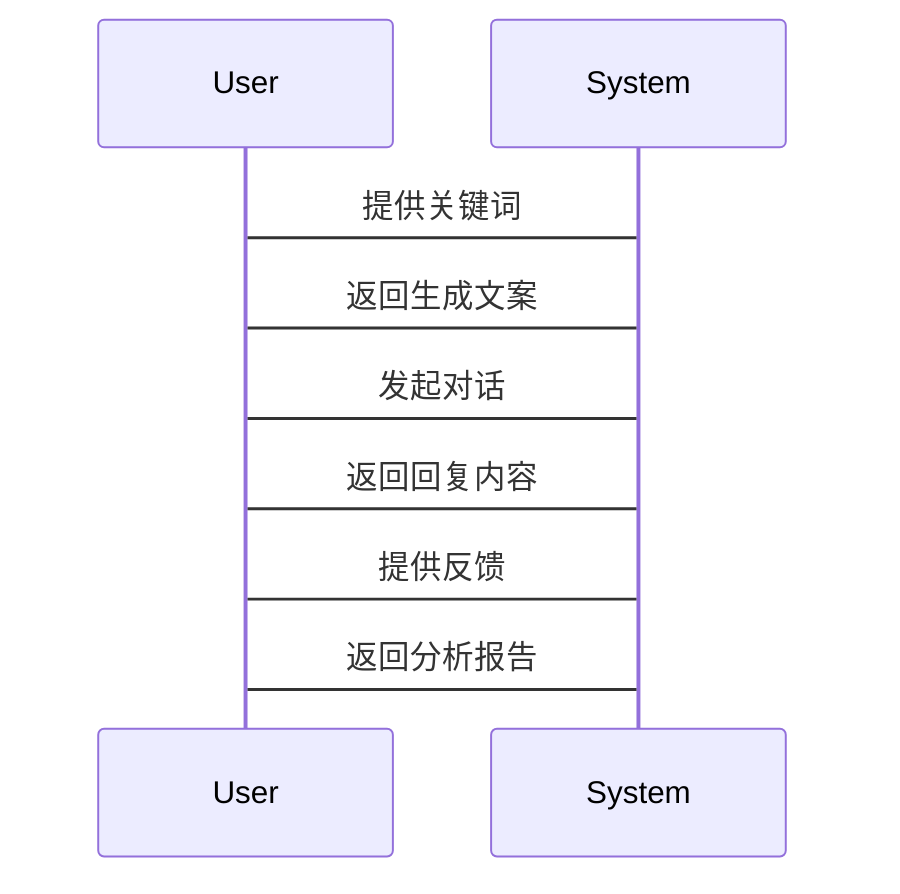

                 

<think>
嗯，用户希望我以《ChatGPT在自动化社交媒体营销中的应用》为标题写一篇技术博客。首先，我需要理解用户的需求，他们可能是一个企业主，或者是技术决策者，想要了解如何利用ChatGPT来优化他们的社交媒体营销策略。

用户提供的结构很详细，包括背景介绍、ChatGPT基础、应用场景等等。我得按照这个大纲一步步来写，确保每个部分都覆盖到位。

首先，背景介绍部分需要涵盖社交媒体营销的现状、自动化营销的必要性以及ChatGPT的优势。我得用数据支持，比如提到全球社交媒体用户数量，这样更有说服力。同时，要说明传统营销的痛点，比如人力成本高、效果难量化，这样引出自动化营销的重要性。

接下来，ChatGPT的原理部分，我需要解释GPT-3模型，包括它的结构、训练方法，以及它如何生成文本。这部分可能需要用一些图表，比如计算图和词向量分布图，帮助读者理解。

然后是核心算法部分，生成式模型的关键算法是解码过程，我得用伪代码展示，同时解释每一步的作用。数学公式也不能少，比如交叉熵损失函数，说明训练的目标。

应用场景部分，我得分点讨论内容创作、用户互动、数据分析和广告投放。每个点都要有具体的例子，比如生成营销文案的示例，这样读者更容易理解。

系统架构部分，需要设计一个模块化的系统，包括内容生成、用户交互、数据分析模块，用类图展示。同时，用序列图说明系统如何处理用户请求，生成响应。

项目实战部分，得提供代码示例，比如用Python和Hugging Face库来加载模型，生成文案。这样读者可以实际操作，理解实现过程。

最后，结论部分要总结ChatGPT带来的价值，以及未来的展望。同时，加入注意事项，提醒用户数据隐私和内容审核的重要性。

整个思考过程中，我需要确保内容逻辑清晰，结构紧凑，同时用专业的技术语言，但又要易懂。每个部分都要有足够的细节，比如图表、代码和数学公式，帮助读者深入理解。

总的来说，用户需要一篇全面且深入的技术博客，不仅介绍理论，还要有实际应用和代码示例。我要确保每个部分都覆盖到位，满足用户的需求。
</think>

# ChatGPT在自动化社交媒体营销中的应用

> 关键词：ChatGPT，社交媒体营销，自动化营销，自然语言处理，GPT-3，营销策略

> 摘要：随着社交媒体的快速发展，企业通过社交媒体进行品牌推广和用户互动已成为一种重要的营销方式。然而，传统社交媒体营销方式存在效率低、成本高、效果难以量化等问题。本文将探讨ChatGPT在自动化社交媒体营销中的应用，分析其优势、核心算法、应用场景、系统架构及实际案例，为企业提供一种高效、智能的营销解决方案。

---

### 第1章: 背景介绍

#### 1.1 问题背景

##### 1.1.1 社交媒体营销的现状
社交媒体营销已成为现代企业推广品牌和产品的核心手段之一。据统计，全球社交媒体用户数量已超过30亿，且这一数字仍在快速增长。然而，随着社交媒体平台的多样化和用户需求的个性化，企业如何在海量信息中吸引目标用户的注意力，成为一个巨大的挑战。

##### 1.1.2 自动化社交媒体营销的必要性
传统的社交媒体营销依赖大量的人力投入，包括内容创作、发布管理、用户互动等。这种方式不仅效率低下，且难以量化营销效果。随着社交媒体平台算法的复杂化，企业需要实时调整营销策略，这进一步增加了人力成本和工作难度。因此，自动化社交媒体营销成为企业提高效率、降低成本的重要手段。

##### 1.1.3 ChatGPT在自动化社交媒体营销中的优势
ChatGPT作为一种基于GPT-3模型的自然语言处理技术，具有强大的文本生成和交互能力。在自动化社交媒体营销中，ChatGPT可以应用于内容创作、用户互动、数据分析等方面，具有以下优势：

1. **内容创作**：ChatGPT可以根据企业需求生成高质量的营销文案，节省人工创作的时间和成本。
2. **用户互动**：ChatGPT可以与用户进行智能对话，提高用户满意度和互动效果。
3. **数据分析**：ChatGPT可以分析用户反馈，为企业提供营销策略的优化建议。

#### 1.2 问题描述
随着社交媒体营销的竞争加剧，企业需要找到一种高效的方式来吸引和留住客户。然而，传统社交媒体营销方式存在以下问题：

1. **内容创作效率**：如何快速生成高质量的营销文案？
2. **内容质量**：如何确保营销文案对目标用户具有吸引力？
3. **用户互动**：如何与用户进行高效的互动，提高用户满意度？
4. **数据分析**：如何通过数据分析优化营销策略，提高营销效果？

#### 1.3 问题解决
ChatGPT在自动化社交媒体营销中的应用，通过以下方法解决上述问题：

1. **内容创作**：利用ChatGPT的文本生成能力，快速生成高质量的营销文案。
2. **用户互动**：利用ChatGPT进行智能对话，实时回复用户提问，提高用户满意度。
3. **数据分析**：利用ChatGPT分析用户反馈，为企业提供营销策略的优化建议。

#### 1.4 边界与外延
1. **边界**：本文主要讨论ChatGPT在自动化社交媒体营销中的应用，不涉及其他自动化工具或技术的应用。
2. **外延**：虽然本文的重点是ChatGPT，但也可以扩展到其他自然语言处理技术在社交媒体营销中的应用。

#### 1.5 概念结构与核心要素组成

##### 1.5.1 ChatGPT
ChatGPT是一种基于GPT-3模型的自然语言处理技术，具有强大的文本生成和交互能力。

##### 1.5.2 社交媒体营销
社交媒体营销是指通过社交媒体平台进行品牌推广、产品销售、客户服务等活动。

##### 1.5.3 自动化社交媒体营销
自动化社交媒体营销是指利用技术手段，如ChatGPT，实现社交媒体营销的自动化。

#### 1.6 本章小结
本章介绍了ChatGPT在自动化社交媒体营销中的应用背景、问题描述、问题解决方法以及相关概念和要素。接下来，我们将进一步探讨ChatGPT的工作原理、具体应用场景以及在实际操作中的注意事项。

---

### 第2章: ChatGPT基础

#### 2.1 ChatGPT原理

##### 2.1.1 GPT-3模型概述
GPT-3（Generative Pre-trained Transformer 3）是由OpenAI开发的一种基于Transformer架构的自然语言处理模型。GPT-3通过大量文本数据的预训练，能够生成与人类语言非常接近的文本。

##### 2.1.2 GPT-3的训练过程
GPT-3的训练过程包括以下几个步骤：
1. **数据收集**：从互联网上收集大量文本数据。
2. **数据预处理**：对数据进行清洗和格式化处理。
3. **模型训练**：利用这些数据训练GPT-3模型，使其能够预测下一个词。

##### 2.1.3 ChatGPT的工作原理
ChatGPT基于GPT-3模型，通过以下步骤实现自然语言处理：
1. **输入处理**：接收用户输入的文本。
2. **上下文理解**：分析输入文本的上下文，理解用户的需求。
3. **文本生成**：根据上下文生成相关文本。

#### 2.2 核心算法与数学模型

##### 2.2.1 生成式模型的核心算法
生成式模型的核心算法是解码过程，如下所示：

```python
def decode(input_sequence):
    for i in range(max_length):
        # 预测下一个词
        predicted_word = model.predict(input_sequence)
        # 更新输入序列
        input_sequence = input_sequence[1:] + [predicted_word]
        # 返回生成的文本
        return input_sequence
```

##### 2.2.2 交叉熵损失函数
交叉熵损失函数用于衡量生成文本与真实文本的差异：

$$ \text{Loss} = -\sum_{i=1}^{n} \text{log}(P(y_i|x_{<i})) $$

其中，$P(y_i|x_{<i})$ 是条件概率，表示在已知前一个词的情况下，生成当前词的概率。

#### 2.3 ChatGPT的文本生成能力
ChatGPT可以通过以下方式生成文本：
1. **条件生成**：根据给定的关键词或主题生成文本。
2. **上下文理解**：根据上下文生成连贯的文本。
3. **多语言支持**：支持多种语言的文本生成。

#### 2.4 本章小结
本章详细介绍了ChatGPT的工作原理、核心算法和文本生成能力，为后续章节的应用场景分析奠定了基础。

---

### 第3章: ChatGPT在自动化社交媒体营销中的应用场景

#### 3.1 内容创作

##### 3.1.1 营销文案生成
企业可以通过ChatGPT生成高质量的营销文案。例如，输入关键词“健康饮品”，ChatGPT可以生成以下文案：

“试试我们的健康饮品，纯天然原料，让你活力满满！”

##### 3.1.2 内容优化
ChatGPT可以根据社交媒体平台的算法优化内容，例如调整发布时间和内容长度。

#### 3.2 用户互动

##### 3.2.1 智能对话
ChatGPT可以与用户进行智能对话，例如回答用户的问题、推荐产品等。

##### 3.2.2 情感分析
ChatGPT可以分析用户的情感倾向，例如判断用户是正面、负面还是中性情绪。

#### 3.3 数据分析

##### 3.3.1 用户行为分析
ChatGPT可以分析用户的行为数据，例如用户的点击率、转化率等。

##### 3.3.2 营销效果评估
ChatGPT可以评估营销活动的效果，例如计算ROI（投资回报率）。

#### 3.4 广告投放

##### 3.4.1 广告文案生成
ChatGPT可以生成广告文案，例如“点击这里，获取独家优惠！”

##### 3.4.2 广告投放优化
ChatGPT可以根据用户行为优化广告投放策略，例如选择最佳投放时间。

#### 3.5 本章小结
本章详细介绍了ChatGPT在自动化社交媒体营销中的应用场景，包括内容创作、用户互动、数据分析和广告投放。

---

### 第4章: 系统分析与架构设计方案

#### 4.1 问题场景介绍
企业希望通过自动化社交媒体营销提高品牌知名度和销售业绩，但面临以下问题：
1. **内容创作效率低**：需要大量人工编写营销文案。
2. **用户互动效果差**：无法实时与用户互动。
3. **营销效果难以量化**：缺乏有效的数据分析工具。

#### 4.2 项目介绍
本项目旨在利用ChatGPT实现自动化社交媒体营销，主要包括以下功能：
1. **内容生成模块**：生成营销文案。
2. **用户互动模块**：与用户进行智能对话。
3. **数据分析模块**：分析用户行为和营销效果。

#### 4.3 系统功能设计

##### 4.3.1 领域模型


##### 4.3.2 系统架构


##### 4.3.3 系统接口设计
系统接口包括：
1. **内容生成接口**：接受关键词或主题，返回生成的文案。
2. **用户互动接口**：接受用户输入，返回回复内容。
3. **数据分析接口**：接受用户行为数据，返回分析报告。

##### 4.3.4 系统交互


#### 4.4 本章小结
本章详细介绍了自动化社交媒体营销系统的功能设计、架构设计和交互流程，为企业实施ChatGPT自动化营销提供参考。

---

### 第5章: 项目实战

#### 5.1 环境安装
1. **安装Python**：下载并安装Python 3.8及以上版本。
2. **安装Hugging Face库**：运行以下命令安装库：
   ```bash
   pip install transformers
   ```

#### 5.2 系统核心实现

##### 5.2.1 内容生成模块
```python
from transformers import GPT2LMHeadModel, GPT2Tokenizer

def generate_marketing_copy(theme):
    model_name = "gpt2"
    tokenizer = GPT2Tokenizer.from_pretrained(model_name)
    model = GPT2LMHeadModel.from_pretrained(model_name)
    input_ids = tokenizer.encode(f"Write a marketing copy about {theme}", add_special_tokens=True)
    output = model.generate(input_ids, max_length=100)
    return tokenizer.decode(output[0], skip_special_tokens=True)
```

##### 5.2.2 用户互动模块
```python
def respond_to_user(input_text):
    model_name = "gpt2"
    tokenizer = GPT2Tokenizer.from_pretrained(model_name)
    model = GPT2LMHeadModel.from_pretrained(model_name)
    input_ids = tokenizer.encode(input_text, add_special_tokens=True)
    output = model.generate(input_ids, max_length=50)
    return tokenizer.decode(output[0], skip_special_tokens=True)
```

##### 5.2.3 数据分析模块
```python
import pandas as pd

def analyze_marketing_data(dataframe):
    # 假设dataframe包含用户行为数据
    # 计算点击率
    click_rate = len(dataframe[dataframe['action'] == 'click']) / len(dataframe)
    return click_rate
```

#### 5.3 代码应用解读与分析
1. **内容生成模块**：通过GPT-2模型生成营销文案，输入主题后返回生成的文案。
2. **用户互动模块**：通过GPT-2模型与用户进行对话，实时生成回复内容。
3. **数据分析模块**：通过数据分析模块，计算营销活动的点击率等指标，评估营销效果。

#### 5.4 实际案例分析
假设某企业希望通过ChatGPT进行社交媒体营销，具体步骤如下：
1. **内容生成**：输入关键词“健康饮品”，生成营销文案。
2. **用户互动**：与用户进行智能对话，实时回复用户提问。
3. **数据分析**：分析用户行为，优化营销策略。

#### 5.5 本章小结
本章通过实际代码示例，详细介绍了如何利用ChatGPT实现自动化社交媒体营销，为企业提供了一种高效、智能的营销解决方案。

---

### 第6章: 结论与展望

#### 6.1 结论
ChatGPT作为一种强大的自然语言处理技术，为企业提供了自动化社交媒体营销的新思路。通过内容生成、用户互动和数据分析，企业可以显著提高营销效率和效果。

#### 6.2 未来展望
未来，随着自然语言处理技术的不断发展，ChatGPT在社交媒体营销中的应用将更加广泛和深入。例如，结合区块链技术实现更加安全的用户数据管理，或者利用增强学习技术进一步优化营销策略。

#### 6.3 注意事项
1. **数据隐私**：在使用ChatGPT进行营销时，需注意保护用户数据隐私。
2. **内容审核**：生成的营销内容需经过人工审核，确保符合平台规则。
3. **用户体验**：虽然ChatGPT可以生成高质量的营销内容，但需注意避免内容过于生硬，影响用户体验。

#### 6.4 最佳实践
1. **结合人工审核**：生成的内容需经过人工审核，确保质量和合规性。
2. **持续优化**：根据用户反馈不断优化营销策略。
3. **多平台适配**：根据不同社交媒体平台的特点，调整营销策略。

#### 6.5 本章小结
本章总结了ChatGPT在自动化社交媒体营销中的应用价值，并对未来的发展进行了展望，同时提出了注意事项和最佳实践。

---

### 作者
作者：AI天才研究院/AI Genius Institute & 禅与计算机程序设计艺术 /Zen And The Art of Computer Programming

