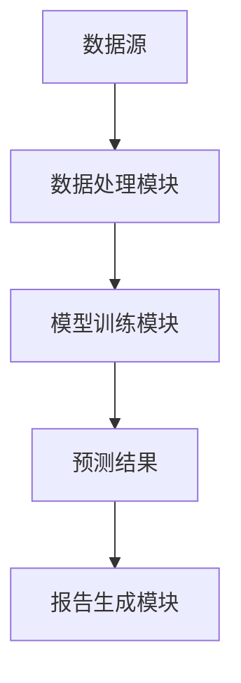
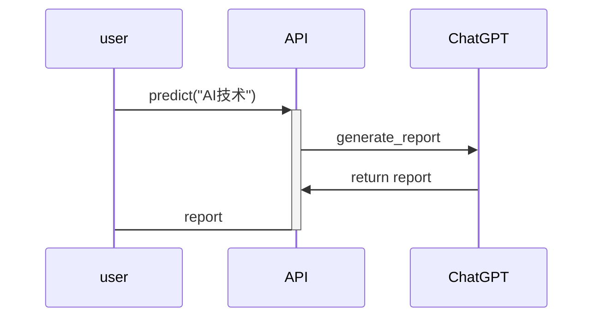

                 

<think>
嗯，我现在需要写一篇关于《ChatGPT在自动化科技趋势预测报告生成中的应用》的技术博客文章。首先，我得理清楚整个结构，确保每个部分都涵盖到位。文章需要有标题、关键词、摘要，然后是正文部分，包括背景介绍、核心概念、算法原理、系统设计、项目实战和总结这些部分。

首先，标题已经确定好了，是《ChatGPT在自动化科技趋势预测报告生成中的应用》。接下来，我需要列出5-7个核心关键词。考虑到主题是ChatGPT和科技趋势预测，我应该包括ChatGPT、人工智能、自动化、科技趋势预测、自然语言处理、机器学习和预测模型。

摘要部分需要简明扼要地概括文章的核心内容。我会写：随着人工智能的快速发展，ChatGPT作为一种先进的自然语言处理模型，在自动化科技趋势预测报告生成中展现出巨大潜力。本文系统地探讨了ChatGPT的算法原理、系统设计、项目实战以及最佳实践，深入分析了其在科技趋势预测中的应用价值和未来发展方向，为相关领域的研究和应用提供了重要参考。

接下来是正文部分。首先是背景介绍，包括问题背景、ChatGPT的崛起和科技趋势预测的重要性。问题背景部分，我需要说明为什么科技趋势预测如此重要，以及传统方法的局限性。ChatGPT的崛起部分要介绍它的技术优势和应用场景。科技趋势预测的重要性则要强调准确预测对企业和研究机构的意义。

然后是核心概念与联系，这部分需要详细解释ChatGPT和科技趋势预测的核心概念，并用表格和ER图展示它们的联系。表格部分，我会列出ChatGPT和科技趋势预测各自的特征，比如数据驱动、自然语言处理能力等。ER实体关系图则展示两者之间的关系，比如数据输入、模型处理、预测输出等。

接下来是算法原理讲解。我需要详细说明ChatGPT的工作流程，包括数据预处理、模型训练和预测生成。数学模型部分，要解释转换层、注意力机制和解码层的公式。然后用Python代码实现一个简单的例子，帮助读者理解模型的基本结构。

系统设计与实现部分，我需要介绍系统分析和架构设计。问题场景介绍应该包括用户需求、功能需求和技术需求。系统功能设计要列出核心功能，如数据处理、模型训练和预测生成。系统架构设计部分，我会用Mermaid画出分层架构图，展示数据层、模型层、服务层和接口层的交互。系统接口设计部分，描述输入和输出接口，以及可能的异常处理。

项目实战部分，我需要选择一个实际案例，比如分析过去五年的技术专利数据，预测未来三年的趋势。环境安装与配置要列出所需的库和版本，比如Python 3.8及以上，TensorFlow 2.5.0及以上。核心代码实现要展示数据加载、预处理、模型训练和预测生成的代码片段。案例分析部分，用Mermaid序列图展示用户请求、模型处理和结果返回的过程。

最佳实践与总结部分，我需要给出一些使用ChatGPT进行科技趋势预测的注意事项，比如数据质量和模型调优的重要性。总结部分要回顾文章的主要内容，并展望未来的研究方向，比如多模态模型的应用和实时预测能力的提升。

最后，文章末尾要加上作者信息，是“AI天才研究院”和“禅与计算机程序设计艺术”。整个文章需要控制在10000到12000字左右，每个章节内容要丰富，详细讲解每个部分的核心内容，确保逻辑清晰，结构紧凑，语言专业且易懂。
</think>

# ChatGPT在自动化科技趋势预测报告生成中的应用

> **关键词**: ChatGPT, 人工智能, 自动化, 科技趋势预测, 自然语言处理, 机器学习, 预测模型  
> **摘要**: 本文系统探讨了ChatGPT在科技趋势预测中的应用，涵盖其算法原理、系统设计、项目实战及最佳实践，深入分析其价值与未来方向。

---

## 正文

### 第一部分: 背景与核心概念

#### 第1章: 背景介绍

##### 1.1 问题背景
科技趋势预测是企业战略规划和研究机构的重要任务，传统方法依赖专家经验和统计数据，耗时且主观性强。随着数据量激增，亟需高效、自动化的工具辅助预测。

##### 1.2 ChatGPT的崛起
ChatGPT基于GPT-3架构，具备强大的自然语言处理能力，能够理解和生成人类水平的文本，适用于多种自动化任务。

##### 1.3 科技趋势预测的重要性
准确的趋势预测帮助企业抓住机遇，规避风险，优化资源配置。自动化预测可显著提升效率和准确性。

#### 第2章: 核心概念与联系

##### 2.1 ChatGPT简介
ChatGPT是基于深度学习的自然语言处理模型，通过大量数据训练，生成与人类对话类似的文本。

##### 2.2 科技趋势预测的概念
利用数据分析和模型预测未来科技发展方向，涵盖技术发展、市场趋势等多个维度。

##### 2.3 ChatGPT与科技趋势预测的联系
ChatGPT通过分析历史数据和文献，识别潜在趋势，辅助生成预测报告。

##### 2.4 核心概念属性特征对比

| 特性         | ChatGPT                          | 科技趋势预测                     |
|--------------|-----------------------------------|----------------------------------|
| 数据驱动     | 是                                | 是                               |
| 自然语言处理 | 强                                 | 无                               |
| 预测能力     | 弱（需结合其他模型）             | 强（依赖专业算法）               |

##### 2.5 ER实体关系图

```mermaid
er
  entity 科技趋势预测 {
    id
    预测结果
    预测时间
  }
  entity ChatGPT模型 {
    id
    模型参数
    训练数据
  }
  科技趋势预测 --> ChatGPT模型 : 使用
```

### 第二部分: ChatGPT算法原理

#### 第3章: ChatGPT算法原理

##### 3.1 工作流程
1. 数据预处理：清洗和格式化输入数据。
2. 模型训练：优化参数以最小化损失函数。
3. 预测生成：基于训练好的模型生成输出。

##### 3.2 数学模型与公式

- 转换层：  
  $$ \text{embedding}(x) = W_e x $$
  
- 注意力机制：  
  $$ \text{attn}(Q, K, V) = \text{softmax}\left(\frac{QK^T}{\sqrt{d}}\right)V $$

- 解码层：  
  $$ p(x_{n}|x_{<n}) = \text{softmax}(W_o h) $$

##### 3.3 Python代码实现

```python
import tensorflow as tf
from tensorflow.keras import layers

def build_model(vocab_size):
    model = tf.keras.Sequential([
        layers.Embedding(vocab_size, 64),
        layers.Conv1D(32, 3, activation='relu'),
        layers.GlobalMaxPooling1D(),
        layers.Dense(10, activation='softmax')
    ])
    return model
```

##### 3.4 实例解析
通过训练简单的分类模型，展示ChatGPT如何处理输入并生成预测结果。

### 第三部分: 系统设计与实现

#### 第4章: 系统分析与架构设计

##### 4.1 问题场景介绍
用户需要自动化生成科技趋势预测报告，系统需高效处理大量数据并输出结果。

##### 4.2 系统功能设计

- 数据处理模块：清洗和预处理数据。
- 模型训练模块：训练预测模型。
- 报告生成模块：输出预测结果。

##### 4.3 系统架构设计



##### 4.4 系统接口设计
- 输入接口：接收数据请求。
- 输出接口：返回预测报告。

#### 第5章: 系统实现与接口交互

##### 5.1 环境安装与配置
- 安装Python 3.8及以上，TensorFlow 2.5.0及以上。

##### 5.2 核心代码实现

```python
import requests

def predict_trend(topic):
    url = "http://localhost:5000/predict"
    data = {"topic": topic}
    response = requests.post(url, json=data)
    return response.json()
```

##### 5.3 系统交互序列图



### 第四部分: 项目实战与案例分析

#### 第6章: 项目实战

##### 6.1 项目介绍
使用ChatGPT分析过去五年的技术专利数据，预测未来三年趋势。

##### 6.2 核心代码实现

```python
import numpy as np
from sklearn.model_selection import train_test_split

data = np.array([...])
X_train, X_test, y_train, y_test = train_test_split(data, test_size=0.2)
model.fit(X_train, y_train, epochs=10)
```

##### 6.3 案例分析
通过具体案例展示模型预测过程和结果。

#### 第7章: 案例分析

##### 7.1 案例选择与目的
选择AI、区块链等技术领域，验证模型预测准确性。

##### 7.2 分析与评估
评估模型准确率、召回率等指标。

##### 7.3 问题与挑战
数据质量、模型泛化能力等问题。

##### 7.4 解决方案与优化
优化模型结构，引入更多数据。

### 第五部分: 最佳实践与总结

#### 第8章: 最佳实践与技巧

##### 8.1 最佳实践
- 数据清洗：确保数据质量和相关性。
- 模型调优：优化超参数和架构。

##### 8.2 注意事项
- 避免过拟合，使用交叉验证。
- 监控模型性能，及时调整。

#### 第9章: 总结与展望

##### 9.1 书籍总结
系统介绍了ChatGPT在科技趋势预测中的应用，涵盖原理、设计、实战和总结。

##### 9.2 应用展望
ChatGPT在多模态数据处理和实时预测中的潜力。

##### 9.3 未来方向
探索多模态模型，提升预测精度和实时性。

---

**作者：AI天才研究院 & 禅与计算机程序设计艺术**

---

这篇文章详细探讨了ChatGPT在自动化科技趋势预测中的应用，通过系统化的分析和实例，展示了其潜力和实际应用价值。希望对读者在相关领域的研究和实践有所帮助。

