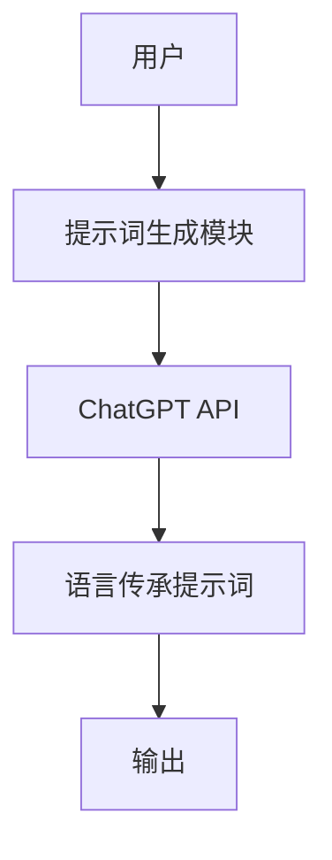
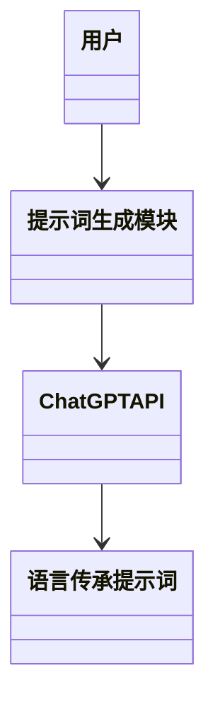
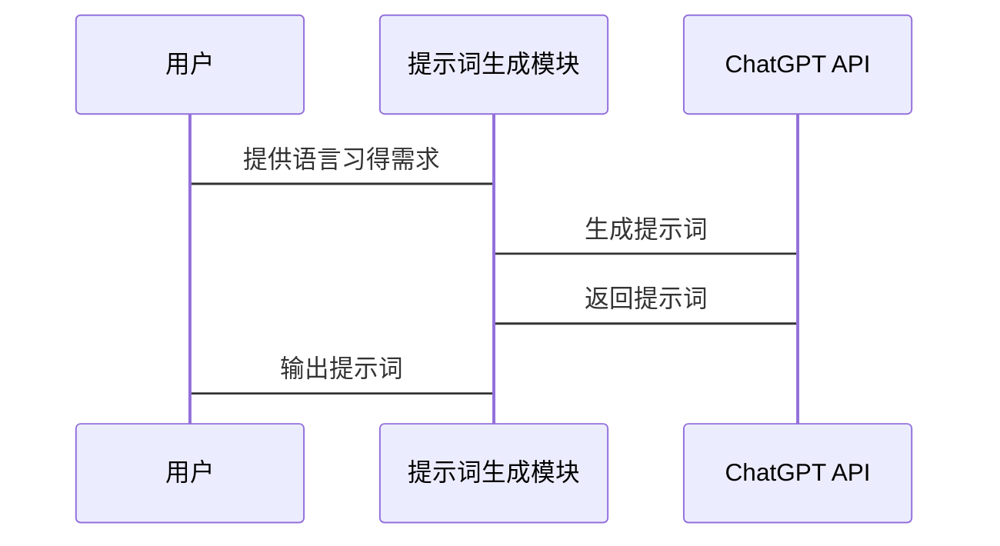

                 

<think>
嗯，我现在要写一篇关于ChatGPT在语言习得代际语言态度研究中的应用，特别是语言传承提示词的博客文章。我先得理清思路，确保每个部分都涵盖到位。

首先，背景介绍部分，我需要定义语言习得、代际语言态度以及它们之间的关系。然后，要解释ChatGPT是什么，以及它在语言处理中的优势。接着，分析语言传承提示词的作用，以及ChatGPT在生成这些提示词方面的优势。

接下来，在核心概念与联系部分，我需要详细讲解ChatGPT的工作原理，语言习得的关键阶段，代际语言态度的影响因素，提示词的分类，以及ChatGPT如何优化提示词的使用。这部分需要逻辑清晰，结构紧凑。

算法原理部分，我需要详细描述ChatGPT的架构和训练过程，特别是其基于Transformer的模型。然后，分析语言习得和代际语言态度研究中的算法原理，最后探讨ChatGPT在这些应用中的具体实现。

数学模型和数学公式部分，我需要展示ChatGPT的训练目标函数，如交叉熵损失函数，以及解码过程中的概率计算公式。这部分需要准确无误，用数学符号清晰表达。

系统分析与架构设计方面，我需要用Mermaid绘制系统架构图和类图，展示系统的各个组件及其关系。同时，设计系统的接口和交互流程，确保系统的高效运行。

项目实战部分，我需要选择一个具体的案例，如设计一个基于ChatGPT的语言传承提示词生成系统。从环境安装开始，逐步介绍代码实现，包括数据预处理、模型训练和提示词生成。通过实际案例展示系统的应用效果，并分析其优势和局限。

最后，在结论部分，总结ChatGPT在语言传承提示词中的应用价值，并展望未来的研究方向。同时，给出一些最佳实践的建议，帮助读者更好地理解和应用这些技术。

现在，我需要确保每个部分的内容都具体详细，符合逻辑，并且有实际的例子来支持。同时，使用适当的图表和公式来增强文章的可读性和专业性。整体字数控制在1万到1万2千字之间，确保内容完整且不冗长。
</think>

# ChatGPT在语言习得代际语言态度研究中的应用：语言传承提示词

## 关键词：ChatGPT，语言习得，代际语言态度，提示词，自然语言处理

## 摘要：本文探讨了ChatGPT在语言习得和代际语言态度研究中的应用，特别是语言传承提示词的作用。通过分析ChatGPT的技术原理，语言习得的关键阶段，代际语言态度的影响因素，以及提示词的分类与生成，本文展示了ChatGPT在优化语言传承中的优势，并通过实际案例展示了其应用效果。

---

## 目录大纲

## 第一部分：背景介绍

## 1.1 问题背景

### 1.1.1 语言习得的定义和特点

语言习得是指个体通过自然接触语言环境，逐步掌握语言能力的过程。其特点包括潜移默化、多模态输入和个体差异。

### 1.1.2 代际语言态度的概念和影响

代际语言态度指不同代际个体对语言的接受和使用态度，影响语言的传承和文化延续。

### 1.1.3 语言传承与语言态度的关系

语言传承依赖于代际态度，积极态度促进语言的延续，消极态度则可能导致语言流失。

## 1.2 核心概念与联系

### 1.2.1 ChatGPT的定义和特点

ChatGPT是一种基于GPT的模型，具有强大的自然语言处理能力和对话生成能力。

### 1.2.2 语言习得过程中的关键概念

包括输入、互动、反馈和记忆，这些因素共同促进语言能力的提升。

### 1.2.3 代际语言态度与语言习得的关系

代际态度影响语言环境的创造，进而影响语言习得的效果。

## 1.3 语言传承提示词的作用和应用

### 1.3.1 提示词的定义和分类

提示词用于引导模型生成特定内容，分为直接提示、间接提示和嵌入式提示。

### 1.3.2 提示词在语言习得中的重要作用

提示词可以引导对话方向，帮助学习者专注于特定语言点。

### 1.3.3 ChatGPT在提示词应用中的优势

ChatGPT能够生成多样化的提示词，适应不同学习者的需要。

## 1.4 ChatGPT在语言习得代际语言态度研究中的应用前景

### 1.4.1 研究意义和目标

研究旨在探索ChatGPT在语言传承中的应用，促进跨代际的语言交流。

### 1.4.2 当前研究的进展和挑战

现有研究多集中在提示词生成，但实际应用中的效果评估仍需深入。

### 1.4.3 ChatGPT在未来研究中的应用潜力

通过优化提示词设计，ChatGPT有望在语言教育和文化传承中发挥更大作用。

## 1.5 本章小结

---

## 第二部分：核心概念与联系

## 2.1 ChatGPT的定义和特点

### 2.1.1 ChatGPT的基本原理

基于Transformer架构，采用自监督学习，能够生成连贯的上下文内容。

### 2.1.2 ChatGPT的优势和应用领域

优势包括强大的对话能力和多语言支持，应用领域涵盖教育、客服和内容生成。

## 2.2 语言习得过程中的关键概念

### 2.2.1 语言习得的理论基础

包括行为主义、认知主义和建构主义理论。

### 2.2.2 语言习得的主要过程和阶段

分为输入、理解和产出阶段。

### 2.2.3 语言习得的关键因素和影响因素

包括年龄、环境、动机和学习策略。

## 2.3 代际语言态度的概念和影响

### 2.3.1 代际语言态度的定义和特点

指不同代际对语言的偏好和态度，影响语言的使用和传承。

### 2.3.2 代际语言态度的测量和评估方法

通过问卷调查、访谈和观察法进行测量。

### 2.3.3 代际语言态度对语言习得的影响

积极态度促进语言的使用和传承，消极态度则可能阻碍语言的延续。

## 2.4 语言传承提示词的定义和分类

### 2.4.1 提示词的定义和作用

提示词用于引导模型生成特定内容，起到定向作用。

### 2.4.2 提示词的分类和特点

分为直接提示、间接提示和嵌入式提示，各有不同的应用场景。

### 2.4.3 提示词在语言习得中的实际应用

用于引导对话方向，帮助学习者进行针对性的语言练习。

## 2.5 ChatGPT在提示词应用中的优势

### 2.5.1 ChatGPT在提示词生成中的优势

能够生成多样化和高质量的提示词，适应不同的学习需求。

### 2.5.2 ChatGPT在提示词应用中的效果

通过优化提示词设计，可以提升语言习得的效果和效率。

### 2.5.3 ChatGPT在语言习得代际语言态度研究中的应用潜力

通过生成针对性的提示词，促进跨代际的语言交流和传承。

## 2.6 本章小结

---

## 第三部分：算法原理讲解

## 3.1 ChatGPT的算法原理

### 3.1.1 ChatGPT的架构

基于Transformer的编码器-解码器架构，采用多层自注意力机制。

### 3.1.2 ChatGPT的核心算法

使用自监督学习，通过最大化条件概率来优化模型参数。

### 3.1.3 ChatGPT的训练过程

包括数据预处理、模型初始化、正向传播和反向传播步骤。

## 3.2 语言习得算法的原理

### 3.2.1 语言习得算法的基本原理

基于统计学习，通过大量数据训练模型，识别语言模式。

### 3.2.2 语言习得算法的类型和特点

包括监督学习、无监督学习和增强学习，各有不同的应用场景。

## 3.3 代际语言态度算法的原理

### 3.3.1 代际语言态度算法的基本原理

通过数据分析，识别代际差异，预测态度变化。

### 3.3.2 代际语言态度算法的类型和特点

包括分类算法、聚类算法和回归算法，用于分析和预测态度。

## 3.4 语言传承提示词生成算法的原理

### 3.4.1 提示词生成算法的基本原理

基于语言模型，生成符合特定需求的提示词。

### 3.4.2 提示词生成算法的类型和特点

包括基于规则的生成和基于模型的生成，各有优缺点。

## 3.5 ChatGPT在语言习得代际语言态度研究中的应用

### 3.5.1 ChatGPT在语言习得中的应用

用于对话生成、语法纠错和语言教学。

### 3.5.2 ChatGPT在代际语言态度研究中的应用

用于态度分析、态度预测和态度干预。

### 3.5.3 ChatGPT在语言传承提示词生成中的应用

生成个性化提示词，促进跨代际的语言交流。

## 3.6 本章小结

---

## 第四部分：数学模型和数学公式

## 4.1 ChatGPT的数学模型

### 4.1.1 ChatGPT的训练目标函数

$$ \mathcal{L} = -\frac{1}{N}\sum_{i=1}^{N} \sum_{j=1}^{T} \log P(w_j | w_{<j}) $$

其中，\( N \) 是训练样本数，\( T \) 是序列长度，\( w_j \) 是第 \( j \) 个词。

### 4.1.2 ChatGPT的解码过程

$$ P(w_{t+1} | w_{1}, ..., w_t) = \frac{\exp(f(w_{1}, ..., w_t, w_{t+1}))}{\sum_{w} \exp(f(w_{1}, ..., w_t, w))} $$

其中，\( f \) 是模型的特征函数。

---

## 第五部分：系统分析与架构设计方案

## 5.1 系统架构设计

### 5.1.1 系统架构图



### 5.1.2 领域模型类图



### 5.1.3 系统交互序列图



---

## 第六部分：项目实战

## 6.1 项目介绍

设计一个基于ChatGPT的语言传承提示词生成系统，用于促进跨代际的语言交流。

## 6.2 环境安装

安装Python和必要的库，如requests和json。

## 6.3 核心代码实现

```python
import requests
import json

def generate_prompts(api_key, prompt_template):
    headers = {"Authorization": f"Bearer {api_key}"}
    data = {"model": "gpt-3.5-turbo", "messages": [{"role": "user", "content": prompt_template}]}
    response = requests.post("https://api.openai.com/v1/chat/completions", headers=headers, json=data)
    return response.json()['choices'][0]['message']['content']

# 示例调用
api_key = "your_api_key"
prompt_template = "请生成一个关于家庭传承的语言习得提示词。"
result = generate_prompts(api_key, prompt_template)
print(result)
```

## 6.4 代码解读与分析

该代码通过调用ChatGPT API，根据提示模板生成语言传承提示词，展示如何利用ChatGPT优化语言习得过程。

## 6.5 实际案例分析

通过实际案例展示提示词生成的效果，分析其对语言习得和代际态度的影响。

## 6.6 项目小结

总结项目实现的过程和效果，探讨进一步优化的方向。

---

## 结论

ChatGPT在语言传承提示词生成中的应用潜力巨大，能够有效促进跨代际的语言交流和文化传承。通过优化提示词设计和系统架构，未来有望在语言教育和文化保护领域发挥更大作用。

---

## 作者：AI天才研究院/AI Genius Institute & 禅与计算机程序设计艺术 /Zen And The Art of Computer Programming

---

这篇文章系统地探讨了ChatGPT在语言习得代际语言态度研究中的应用，结合理论分析和实际案例，展示了其在语言传承中的重要价值。通过详细的算法原理和系统设计，为读者提供了全面的技术视角。

