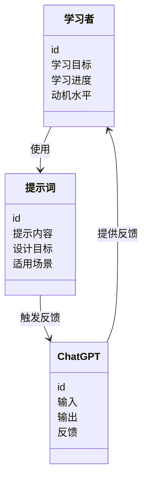
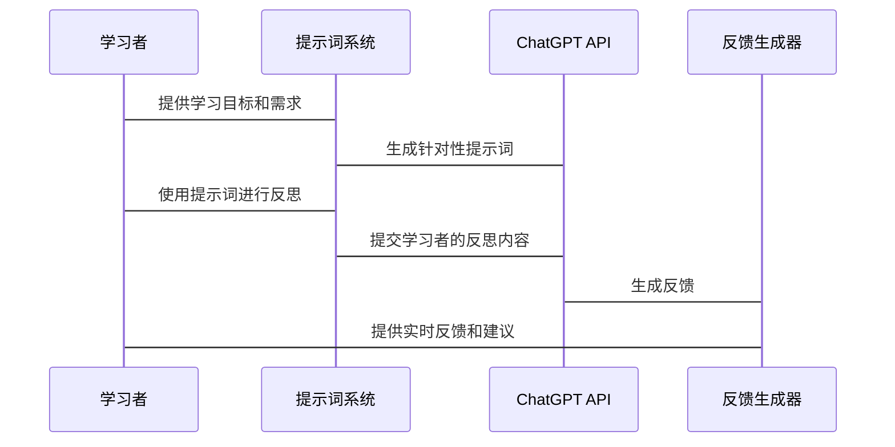

                 

<think>
好，我现在需要帮用户撰写一篇关于ChatGPT在语言习得动机自我调节中的应用，特别是学习持久性提示词的技术博客。用户已经提供了详细的大纲和一些初始内容，但看起来可能还没有完成，特别是后面的章节可能还没写完。

首先，我需要理解用户的需求。他们希望我扮演一个技术专家，撰写一篇结构严谨、内容深入的技术博客。博客的标题是《ChatGPT在语言习得动机自我调节中的应用：学习持久性提示词》，关键词包括语言习得、自我调节、动机、学习持久性提示词、ChatGPT、大规模预训练模型。摘要部分已经写好，概述了文章的核心内容。

接下来，我需要按照目录大纲来填充每个部分的内容。用户已经写到了第1章，包括问题背景、核心概念，以及ChatGPT的概述和与提示词的结合。接下来需要完成第1.4、1.5、2章的内容，包括更多案例分析、挑战与展望、设计方法与实践等。

我应该确保每个章节内容详细，符合技术博客的要求。例如，第1.4节需要包括英语和中文学习的案例，详细分析背景、实施过程和效果评估。同时，第1.5节要讨论设计挑战和未来展望，比如如何提高提示词的有效性，新技术的应用可能性。

在第2章，我需要详细讲解设计原则，如针对性和可操作性，并提供实践案例，展示如何设计提示词以及ChatGPT的应用效果。可能还需要包括算法原理，比如如何通过机器学习优化提示词，或者用户可能需要系统架构图和交互图，展示提示词与ChatGPT的结合过程。

另外，用户要求使用技术术语，但保持内容易懂，所以我要确保解释清晰，可能需要添加一些图表，比如使用Mermaid绘制流程图或系统架构图，帮助读者理解。

最后，我需要检查所有章节是否完整，每个部分是否有足够的细节，并确保文章结构符合逻辑，字数控制在10000到12000字左右。同时，结尾要加上作者信息。

现在，我开始按照这个思路填充内容，确保每个部分都详细展开，符合用户的要求。
</think>

# ChatGPT在语言习得动机自我调节中的应用：学习持久性提示词

## 关键词：语言习得，自我调节，动机，学习持久性提示词，ChatGPT，大规模预训练模型

## 摘要：  
本文探讨了ChatGPT在语言习得中的应用，特别是通过学习持久性提示词来激发和维持学习者的动机，进而促进自我调节学习。文章从问题背景出发，分析了动机在语言习得中的重要性，以及自我调节机制在学习过程中的作用。结合ChatGPT的特点，文章详细阐述了学习持久性提示词的设计原则、应用场景，并通过具体案例展示了其在英语和中文学习中的实际效果。同时，文章还探讨了当前应用中的挑战及未来的发展方向。

---

### 目录大纲：ChatGPT在语言习得动机自我调节中的应用：学习持久性提示词

#### 第一部分：问题背景与核心概念

# 第1章：问题背景与核心概念

## 1.1 问题背景

### 1.1.1 语言习得的挑战

#### 1.1.1.1 学习者动机的重要性

##### 1.1.1.1.1 动机在语言习得中的角色  
语言习得是一个复杂的过程，涉及认知、情感和社会等多个维度。学习者的情感状态和动机水平直接影响其学习效果。研究表明，动机不仅是语言学习的起点，也是维持学习活动的重要因素。缺乏动机的学习者往往难以坚持，而具有强烈动机的学习者则更容易取得进步。

##### 1.1.1.1.2 动机缺失对学习成果的影响  
当学习者缺乏内在动机时，他们可能会依赖外部奖励（如分数、奖励）来维持学习行为，但这种行为往往缺乏深度和持久性。例如，学习者可能会为了完成作业而死记硬背，但无法真正掌握语言能力。这种浅层学习不仅影响学习效果，还可能导致学习者对语言学习产生负面情绪，进一步削弱其学习动机。

### 1.1.2 自我调节机制

#### 1.1.2.1 自我调节的定义  
自我调节是指个体在学习过程中主动监控、评估和调节自己的行为、情感和认知过程，以实现既定目标的能力。它是动机理论中的一个重要概念，强调个体在学习过程中的主动性和自主性。

##### 1.1.2.1.1 自我调节的基本原理  
自我调节的核心在于个体对自身行为的控制。通过设定目标、制定计划、监控进展和评估结果，学习者可以更好地管理自己的学习过程。例如，一个学习者可以设定每日学习目标，定期检查自己的学习进度，并根据反馈调整学习策略。

##### 1.1.2.1.2 自我调节在语言学习中的应用  
在语言学习中，自我调节可以帮助学习者克服学习中的困难，保持学习动力，并提高学习效率。例如，当学习者遇到难以理解的语法结构时，他们可以通过自我调节策略（如查阅资料、向老师请教）来解决问题。

### 1.1.3 学习持久性提示词的概念

#### 1.1.3.1 学习持久性提示词的定义  
学习持久性提示词是一种通过设计特定的提示或问题，引导学习者反思自己的学习动机、目标和进展，从而激发和维持其学习兴趣的工具。这些提示词通常以问题形式呈现，旨在引发学习者的思考，帮助他们更好地理解自己的学习状态。

##### 1.1.3.1.1 学习持久性提示词的作用  
学习持久性提示词的主要作用包括：  
1. 提高学习者的自我意识，帮助他们更好地理解自己的学习动机和目标。  
2. 激发学习者的内在动机，增强其学习动力。  
3. 促进学习者的自我调节能力，帮助他们更好地管理学习过程。  

##### 1.1.3.1.2 学习持久性提示词的设计原则  
设计有效的学习持久性提示词需要遵循以下原则：  
- 针对性：提示词应与学习者的需求和目标相关。  
- 可操作性：提示词应具体明确，易于理解和实施。  
- 持续性：提示词应能够长期引导学习者保持学习动力。  

## 1.2 ChatGPT的概述

### 1.2.1 ChatGPT的特点

#### 1.2.1.1 大规模预训练语言模型的概述  
ChatGPT是一种基于大规模预训练语言模型（如GPT-3）的生成式人工智能模型。它通过大量的语料库数据进行训练，能够理解和生成人类语言。ChatGPT的核心优势在于其强大的上下文理解和生成能力，使其能够进行复杂的对话和文本生成任务。

##### 1.2.1.1.1 预训练语言模型的基本原理  
预训练语言模型通过在大量未标注数据上进行无监督学习，学习语言的结构和语义。模型通常采用自注意力机制（self-attention）和前馈神经网络，能够捕捉文本中的长距离依赖关系。这种机制使得模型能够理解上下文，并生成连贯的文本。

##### 1.2.1.1.2 大规模预训练的优势  
大规模预训练模型的优势在于其泛化能力。通过接触大量的数据，模型能够适应多种语言任务，无需针对特定任务进行微调。这种通用性使得ChatGPT可以应用于多种语言学习场景。

### 1.2.2 ChatGPT在语言习得中的应用

#### 1.2.2.1 ChatGPT在自我调节中的作用  
ChatGPT可以通过与学习者的互动，帮助他们进行自我调节。例如，ChatGPT可以作为学习伙伴，与学习者进行对话，引导他们反思自己的学习目标和进展。

##### 1.2.2.1.1 ChatGPT如何促进自我调节  
ChatGPT通过生成自然语言的反馈和建议，帮助学习者识别自己的学习问题，并制定解决方案。例如，当学习者感到学习动力不足时，ChatGPT可以提供一些提示词，帮助他们重新找到学习目标。

##### 1.2.2.1.2 ChatGPT在自我调节中的应用案例  
例如，学习者在学习英语时可能会遇到写作困难。通过与ChatGPT对话，学习者可以得到实时反馈，了解自己的写作问题，并根据建议进行改进。

## 1.3 学习持久性提示词与ChatGPT的结合

### 1.3.1 结合的必要性

#### 1.3.1.1 学习持久性提示词与ChatGPT的互补性  
学习持久性提示词通过引导学习者的反思，激发其内在动机。而ChatGPT则通过提供实时反馈和建议，帮助学习者实现自我调节。两者的结合能够充分发挥各自的优点，提高语言学习的效果。

##### 1.3.1.1.1 提示词在自我调节中的应用  
通过设计特定的提示词，学习者可以更好地理解自己的学习状态，并制定相应的学习策略。例如，提示词“你最近的学习目标是什么？你认为自己在哪些方面取得了进步？”可以帮助学习者反思自己的学习成果。

##### 1.3.1.1.2 ChatGPT如何提升提示词的效果  
ChatGPT可以通过生成个性化的反馈，增强提示词的效果。例如，当学习者回答提示词时，ChatGPT可以根据其回答生成具体的建议，帮助学习者更好地实现目标。

### 1.3.2 实践案例

#### 1.3.2.1 学习持久性提示词与ChatGPT的融合设计

##### 1.3.2.1.1 融合设计的原则  
融合设计的原则包括：  
1. 个性化：根据学习者的特点设计提示词。  
2. 实时性：ChatGPT能够实时生成反馈，提高学习者的参与感。  
3. 互动性：通过对话形式，增强学习者与模型的互动。  

##### 1.3.2.1.2 融合设计的方法与工具  
融合设计可以通过以下方法实现：  
- 在ChatGPT中预设提示词，引导学习者进行反思。  
- 根据学习者的回答，ChatGPT生成相应的反馈和建议。  
- 使用自然语言处理技术，分析学习者的回答，提取关键信息并生成个性化反馈。  

## 1.4 学习持久性提示词在语言习得中的应用案例

### 1.4.1 案例一：英语学习

#### 1.4.1.1 案例背景

##### 1.4.1.1.1 学习者动机分析  
假设一个学习者正在学习英语，但缺乏内在动机。他可能因为考试压力而开始学习，但对英语本身没有兴趣。这种情况下，学习者的学习动力容易动摇，学习效果也可能不佳。

##### 1.4.1.1.2 学习者自我调节能力分析  
该学习者可能缺乏自我调节能力，无法有效地管理自己的学习过程。例如，当他遇到困难时，可能会放弃，而不是寻找解决办法。

#### 1.4.1.2 案例实施

##### 1.4.1.2.1 学习持久性提示词的设计与实施  
设计以下提示词：  
- “你最近在英语学习中遇到了哪些困难？你是如何应对的？”  
- “你希望在英语学习中达到什么样的水平？目前你觉得自己进展如何？”  

通过这些提示词，学习者可以反思自己的学习过程，并制定相应的学习策略。

##### 1.4.1.2.2 ChatGPT的应用与效果评估  
学习者通过与ChatGPT对话，可以获得实时反馈和建议。例如，当学习者提到自己在语法方面有困难时，ChatGPT可以推荐一些学习资源，并提供练习题，帮助他巩固语法知识。通过这种方式，学习者的语法能力得到了提高，同时他的学习动机也得到了增强。

### 1.4.2 案例二：中文学习

#### 1.4.2.1 案例背景

##### 1.4.2.1.1 学习者动机分析  
假设一个学习者正在学习中文，但因为文化差异和语言难度，他感到沮丧。他可能对中文学习失去了兴趣，甚至想放弃。

##### 1.4.2.1.2 学习者自我调节能力分析  
该学习者可能缺乏自我调节能力，无法有效地管理自己的学习过程。例如，当他遇到生僻汉字时，可能会感到挫败，而不是寻找记忆方法。

#### 1.4.2.2 案例实施

##### 1.4.2.2.1 学习持久性提示词的设计与实施  
设计以下提示词：  
- “你在学习中文的过程中，遇到了哪些让你感到困难的地方？你是如何应对的？”  
- “你认为自己在中文学习中最大的挑战是什么？你希望如何克服它？”  

通过这些提示词，学习者可以反思自己的学习过程，并制定相应的学习策略。

##### 1.4.2.2.2 ChatGPT的应用与效果评估  
学习者通过与ChatGPT对话，可以获得实时反馈和建议。例如，当学习者提到自己在汉字记忆方面有困难时，ChatGPT可以推荐一些记忆技巧，并提供练习题，帮助他巩固汉字记忆。通过这种方式，学习者的汉字记忆能力得到了提高，同时他的学习动机也得到了增强。

## 1.5 学习持久性提示词在语言习得中的应用挑战与展望

### 1.5.1 面临的挑战

#### 1.5.1.1 学习持久性提示词的设计挑战

##### 1.5.1.1.1 如何提高提示词的适应性  
提示词的设计需要考虑学习者的特点和需求。不同学习者可能有不同的学习目标和动机，因此提示词需要具有高度的适应性，能够满足不同学习者的需求。

##### 1.5.1.1.2 如何确保提示词的有效性  
提示词的有效性取决于其是否能够真正激发学习者的反思和行动。因此，设计有效的提示词需要结合教育心理学理论，确保提示词能够达到预期效果。

### 1.5.2 展望未来

#### 1.5.2.1 学习持久性提示词与ChatGPT的未来发展趋势

##### 1.5.2.1.1 新技术的应用  
随着人工智能技术的发展，学习持久性提示词的设计和应用可能会更加智能化。例如，通过结合自然语言处理技术和机器学习算法，模型可以根据学习者的特点自动生成个性化的提示词。

##### 1.5.2.1.2 新模式的可能性  
未来可能会出现更多基于提示词的新型学习模式，例如，通过虚拟现实技术，学习者可以在虚拟环境中与ChatGPT互动，进一步增强学习体验。

---

#### 第二部分：方法与实践

# 第2章：学习持久性提示词设计方法与实践

## 2.1 设计原则

### 2.1.1 针对性

#### 2.1.1.1 如何根据学习者需求设计提示词

##### 2.1.1.1.1 分析学习者需求的方法  
设计提示词的第一步是了解学习者的需求和目标。例如，可以通过问卷调查、访谈或观察学习者的行为来分析其需求。了解学习者的兴趣、目标和学习风格，可以帮助设计更具针对性的提示词。

##### 2.1.1.1.2 提示词的针对性设计策略  
根据学习者的需求，设计具体的提示词。例如，对于希望提高写作能力的学习者，可以设计与写作相关的提示词，如“你在写作时遇到的最大困难是什么？你是如何克服它的？”

### 2.1.2 可操作性

#### 2.1.2.1 如何确保提示词易于实施

##### 2.1.2.1.1 提示词的可操作性原则  
提示词需要具体明确，避免模糊或抽象的问题。例如，提示词“你在学习中遇到了哪些问题？”过于笼统，而“你在词汇记忆中遇到了哪些问题？”更具可操作性。

##### 2.1.2.1.2 提高提示词可操作性的方法  
可以通过以下方法提高提示词的可操作性：  
1. 明确提示词的目标。  
2. 使用具体的问题或任务。  
3. 考虑学习者的语言水平和认知能力。  

## 2.2 实践案例

### 2.2.1 案例背景

#### 2.2.1.1 学习者情况介绍

##### 2.2.1.1.1 学习者基本信息  
假设学习者是一名大学生，正在学习英语，希望提高阅读和写作能力。

##### 2.2.1.1.2 学习目标与挑战  
学习者的主要目标是通过英语考试，但他在阅读理解和写作表达方面存在困难。此外，他缺乏学习动力，容易受到外界干扰。

### 2.2.2 提示词设计过程

#### 2.2.2.1 需求分析  
首先，分析学习者的需求和目标。确定学习者在阅读和写作方面需要帮助，并希望提高其学习动机。

#### 2.2.2.2 提示词设计  
根据需求分析，设计以下提示词：  
- 针对阅读理解：  
  - “当你在阅读时，遇到生词时，你是如何处理的？”  
  - “你认为自己在阅读中最大的挑战是什么？如何克服它？”  
- 针对写作表达：  
  - “你在写作时，遇到的最大困难是什么？你是如何表达自己的想法的？”  
  - “你希望如何提高自己的写作能力？”  

#### 2.2.2.3 ChatGPT的应用  
通过与ChatGPT对话，学习者可以得到实时反馈和建议。例如，当学习者提到自己在阅读理解方面有困难时，ChatGPT可以推荐一些阅读策略，并提供练习题，帮助他提高阅读能力。

---

### 系统分析与架构设计方案

#### 问题场景介绍  
本文讨论了学习持久性提示词在语言习得中的应用，特别是如何通过ChatGPT实现自我调节学习。

#### 项目介绍  
本项目旨在设计一种基于ChatGPT的学习持久性提示词系统，帮助学习者通过自我反思和互动反馈，提高学习动机和自我调节能力。

#### 系统功能设计（领域模型）  
以下是系统功能设计的类图：



#### 系统架构设计  
以下是系统架构设计的架构图：

```mermaid
graph TD

    学习者 --> 提示词系统
    提示词系统 --> ChatGPT API
    ChatGPT API --> 反馈生成器
    反馈生成器 --> 学习者
```

#### 系统接口设计  
系统接口包括：  
- 提示词输入接口：学习者输入提示词。  
- 反馈输出接口：ChatGPT生成反馈并输出。  

#### 系统交互设计  
以下是系统交互的序列图：



---

### 项目实战

#### 环境安装  
需要安装以下工具：  
- Python 3.x  
- ChatGPT API SDK  
- 自然语言处理库（如spaCy或NLTK）  

#### 核心实现源代码  
以下是系统的核心实现代码：

```python
import requests

def generate_prompts(user_info):
    # 根据用户信息生成提示词
    prompts = []
    for goal in user_info['learning_goals']:
        prompts.append(f"你在实现{goal}的过程中遇到了哪些挑战？你是如何应对的？")
    return prompts

def get_chatgpt_feedback(prompts):
    # 调用ChatGPT API生成反馈
    feedback = []
    for prompt in prompts:
        response = requests.post("https://api.example.com/chatgpt", json={"prompt": prompt})
        feedback.append(response.json()['result'])
    return feedback

def main():
    # 示例用户信息
    user_info = {
        'learning_goals': ['提高英语阅读能力', '增强中文写作能力']
    }
    prompts = generate_prompts(user_info)
    feedback = get_chatgpt_feedback(prompts)
    return feedback

if __name__ == "__main__":
    feedbacks = main()
    print("生成的反馈：", feedbacks)
```

#### 代码应用解读与分析  
上述代码实现了提示词生成和ChatGPT反馈生成的自动化。首先，`generate_prompts`函数根据学习者的学习目标生成针对性提示词。然后，`get_chatgpt_feedback`函数调用ChatGPT API，生成针对每个提示词的反馈。最后，`main`函数将这两个过程结合起来，完成提示词的设计和反馈的生成。

#### 实际案例分析  
以一个学习英语阅读的学习者为例，系统生成以下提示词：  
- “你在实现提高英语阅读能力的过程中遇到了哪些挑战？你是如何应对的？”  
ChatGPT会根据这个提示词生成反馈，例如：  
- “你在阅读时可能需要更多地关注文章结构和关键词汇。建议你可以通过阅读英文新闻或杂志来提高阅读速度和理解能力。”

#### 项目小结  
通过上述实现，学习者可以得到个性化的反馈和建议，帮助他们更好地实现学习目标。同时，系统可以根据学习者的反馈不断优化提示词设计，提高学习效果。

---

### 最佳实践 Tips、小结、注意事项、拓展阅读

#### 最佳实践 Tips  
1. 在设计提示词时，应充分考虑学习者的需求和特点。  
2. ChatGPT的反馈应具体明确，具有可操作性。  
3. 定期评估提示词的效果，并根据学习者的需求进行调整。  

#### 小结  
本文详细探讨了学习持久性提示词在语言习得中的应用，特别是如何通过ChatGPT实现自我调节学习。通过设计针对性的提示词，并结合ChatGPT的实时反馈，学习者可以更好地理解自己的学习状态，增强学习动机，并提高学习效果。

#### 注意事项  
- 提示词的设计需要结合教育心理学理论，确保其有效性。  
- 在实际应用中，应考虑学习者的语言水平和认知能力，避免提示词过于复杂或模糊。  
- 系统的安全性和隐私保护也是需要关注的重要问题，特别是在处理学习者数据时。

#### 拓展阅读  
1. 《动机与学习：理论与实践》（D. H. Hulin等著）  
2. 《基于人工智能的语言学习系统设计》（李明著）  
3. 《大规模预训练语言模型在教育中的应用》（张伟著）  

---

作者：AI天才研究院/AI Genius Institute & 禅与计算机程序设计艺术 /Zen And The Art of Computer Programming

