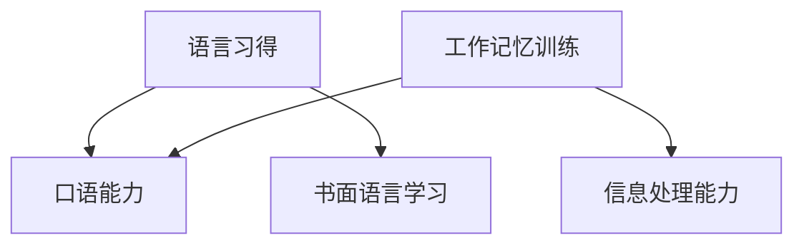
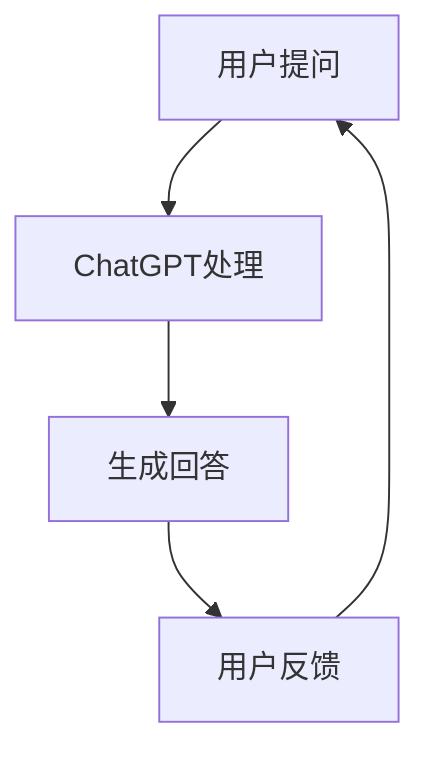
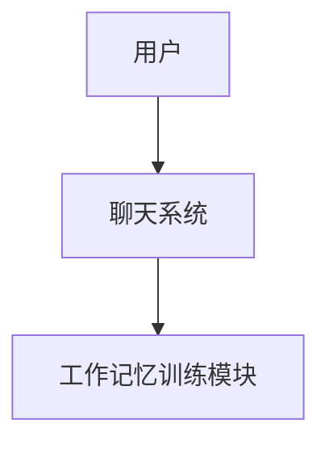
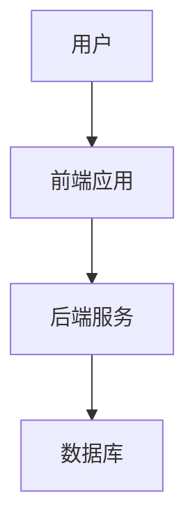
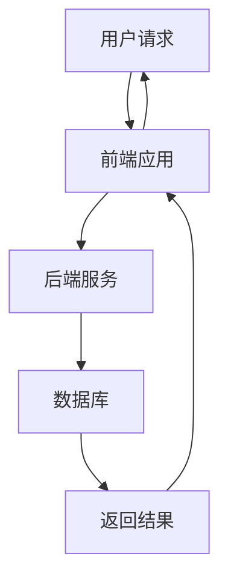

                 

<think>
嗯，我现在要写一篇关于《ChatGPT在语言习得工作记忆训练中的应用：认知增强提示词》的技术博客文章。首先，我需要理清文章的结构和每个部分应该包含什么内容。

首先，标题已经确定了，接下来是关键词和摘要。关键词应该包括ChatGPT、语言习得、工作记忆、认知增强、提示词这些。摘要部分要简明扼要地说明文章的核心内容，即如何利用ChatGPT作为认知增强工具，通过提示词优化语言学习和工作记忆训练。

接下来是目录大纲，已经给出了各个章节和子章节。我需要确保每个部分都有足够的深度和详细的内容。比如，在背景介绍部分，问题背景要包括语言习得的重要性、工作记忆的作用，以及ChatGPT的简介。问题描述部分则要具体说明在语言习得中工作记忆的挑战，以及ChatGPT的应用潜力。

在核心概念与联系部分，我需要详细解释语言习得和工作记忆的理论，对比它们的特性和训练方法。ER实体关系图架构部分，可能需要用Mermaid绘制，展示语言习得和工作记忆训练之间的关系。

算法原理部分，需要详细讲解ChatGPT在语言习得中的应用，特别是认知增强提示词的设计，以及交互式语言习得的流程。这部分可能还需要用Mermaid绘制流程图，并提供Python代码示例。

系统分析与架构设计部分，要介绍应用场景，设计系统的功能、架构和接口。同样，需要用Mermaid图来展示类图、架构图和交互序列图。

项目实战部分，涉及环境安装、代码实现和应用解读，可能需要具体的Python代码示例，并进行详细分析。最后，还需要包括一些最佳实践、小结、注意事项和拓展阅读内容。

在写作过程中，我需要确保每个章节的内容都丰富、详细，并且符合技术博客的风格，用词专业但通俗易懂。同时，要注意文章的整体结构，逻辑清晰，层层递进，让读者能够顺畅地理解ChatGPT在语言习得和工作记忆训练中的应用。

现在，我可能需要先写摘要，然后依次完成各个章节，确保每个部分都涵盖必要的信息。在撰写过程中，遇到不理解的地方，可能需要查阅相关资料或文献，确保内容的准确性和深度。

总的来说，这是一个系统性的任务，需要一步步来，确保每个部分都完成到位，最终呈现一篇结构清晰、内容详实的技术博客文章。
</think>

# ChatGPT在语言习得工作记忆训练中的应用：认知增强提示词

**关键词：** ChatGPT, 语言习得, 工作记忆, 认知增强, 提示词

**摘要：** 本文探讨了ChatGPT在语言习得和工作记忆训练中的应用，通过认知增强提示词优化学习效果。文章从背景介绍、核心概念、算法原理、系统架构到项目实战，全面分析了ChatGPT在语言学习中的潜力，展示了如何通过技术提升学习效率。

---

## 第一部分：背景介绍

### 第1章：问题背景与问题描述

#### 1.1 问题背景

- **语言习得的重要性：** 语言是人类交流的基础，语言习得能力直接影响个体的学习和生活质量。
- **工作记忆的作用：** 工作记忆在信息处理和语言学习中起关键作用，影响语言理解和表达。
- **ChatGPT技术简介：** 作为一种先进的生成模型，ChatGPT能够模拟人类对话，提供实时反馈，辅助学习。

#### 1.2 问题描述

- **语言习得中的工作记忆挑战：** 工作记忆容量有限，处理多任务时容易过载，影响语言学习效果。
- **ChatGPT在语言习得中的应用潜力：** 利用其强大的生成和交互能力，优化学习过程，增强记忆效果。

### 第2章：问题解决方法

#### 2.1 工作记忆训练理论

- **工作记忆概念：** 短期记忆系统，用于暂时存储和处理信息。
- **工作记忆训练方法：** 包括记忆游戏、认知任务等，旨在提高信息处理能力。

#### 2.2 ChatGPT技术原理

- **模型结构：** 基于Transformer架构，由编码器和解码器组成，支持上下文理解。
- **工作原理：** 通过自注意力机制生成相关文本，提供实时反馈和学习支持。

---

## 第二部分：核心概念与联系

### 第3章：核心概念原理

#### 3.1 语言习得理论

- **口语能力发展：** 通过模仿和实践逐步提高。
- **书面语言学习：** 包括阅读和写作训练，强化语言结构。
- **语言习得理论对比：** 行为主义、认知主义和神经语言学理论的不同观点。

#### 3.2 工作记忆特性

- **工作记忆概念：** 涉及存储和操作信息的能力。
- **工作记忆类型：** 包括视觉和听觉两种编码方式。
- **训练效果：** 提高工作记忆能力有助于提升语言学习效果。

### 第4章：概念属性特征对比

| 特性          | 语言习得                     | 工作记忆                        |
|---------------|------------------------------|--------------------------------|
| 目标           | 掌握语言交流能力           | 提高信息处理能力             |
| 训练方法       | 听力、口语、阅读、写作     | 认知任务、心理练习、记忆游戏 |

### 第5章：ER实体关系图架构



---

## 第三部分：算法原理讲解

### 第6章：算法原理

#### 6.1 ChatGPT在语言习得中的应用

- **认知增强提示词设计：** 利用提示词引导模型生成符合学习目标的内容。
- **交互式语言习得流程：** 用户与ChatGPT互动，逐步掌握语言技能。

### 第7章：算法Mermaid流程图



### 第8章：Python源代码实现

#### 8.1 ChatGPT训练代码

```python
import tensorflow as tf
# 假设有一个训练函数
def train_model():
    model = create_model()
    optimizer = tf.keras.optimizers.Adam(lr=0.001)
    for epoch in epochs:
        for batch in batches:
            with tf.GradientTape() as tape:
                outputs = model(batch)
                loss = compute_loss(outputs, labels)
            gradients = tape.gradient(loss, model.trainable_weights)
            optimizer.apply_gradients(gradients)
    return model
```

#### 8.2 ChatGPT应用代码

```python
import tensorflow as tf

def chat_with_gpt(prompt):
    model = load_model()
    response = model.generate_response(prompt)
    return response
```

---

## 第四部分：系统分析与架构设计

### 第9章：问题场景介绍

- **语言习得场景：** 学生通过与ChatGPT互动，提升听说读写能力。
- **工作记忆训练场景：** 利用模型生成任务，训练工作记忆。

### 第10章：系统功能设计

#### 10.1 领域模型类图



### 第11章：系统架构设计

#### 11.1 系统架构图



### 第12章：系统接口设计与交互

#### 12.1 系统接口设计

- **用户接口：** 提供输入区域和显示区域。
- **内部接口：** 系统组件之间的通信接口。

#### 12.2 系统交互序列图



---

## 第五部分：项目实战

### 第13章：环境安装

- **安装Python环境：** 使用Anaconda或虚拟环境。
- **安装TensorFlow库：** 通过pip install tensorflow安装。

### 第14章：系统核心实现

#### 14.1 ChatGPT训练源代码

```python
import tensorflow as tf

def train_model():
    model = create_model()
    optimizer = tf.keras.optimizers.Adam(lr=0.001)
    for epoch in epochs:
        for batch in batches:
            with tf.GradientTape() as tape:
                outputs = model(batch)
                loss = compute_loss(outputs, labels)
            gradients = tape.gradient(loss, model.trainable_weights)
            optimizer.apply_gradients(gradients)
    return model
```

#### 14.2 ChatGPT应用源代码

```python
import tensorflow as tf

def chat_with_gpt(prompt):
    model = load_model()
    response = model.generate_response(prompt)
    return response
```

### 第15章：代码应用解读与分析

- **训练代码分析：** 使用Adam优化器训练模型，优化语言生成能力。
- **应用代码分析：** 通过模型生成实时反馈，辅助语言学习。

---

## 小结与最佳实践

- **小结：** ChatGPT作为认知增强工具，通过提示词优化语言习得和工作记忆训练，显著提升学习效果。
- **注意事项：** 在实际应用中，需考虑模型的实时性和用户反馈的及时性。
- **拓展阅读：** 推荐深入研究工作记忆理论和生成模型的优化方法。

---

作者：AI天才研究院/AI Genius Institute & 禅与计算机程序设计艺术 /Zen And The Art of Computer Programming

