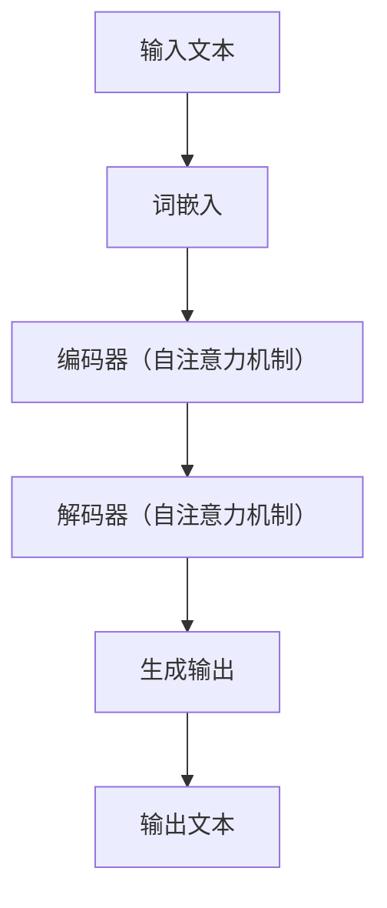
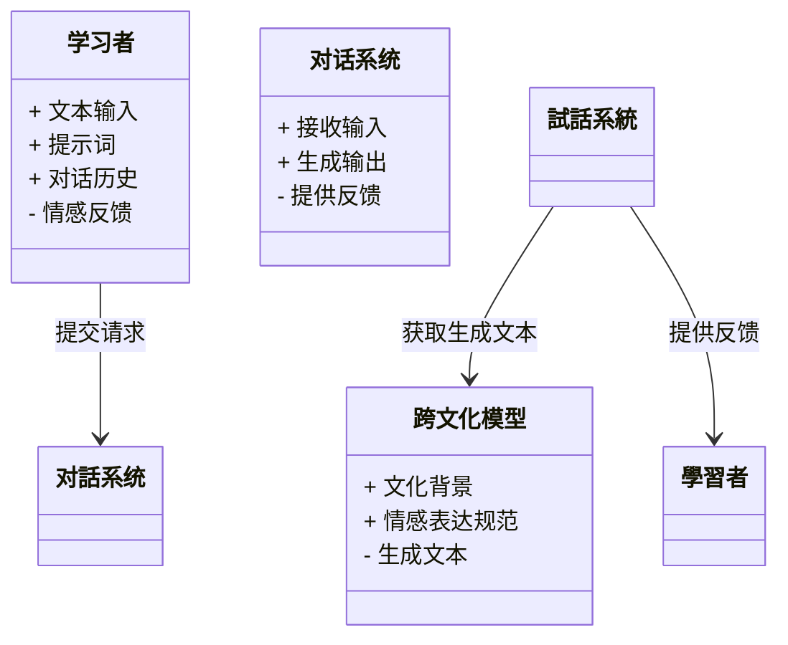
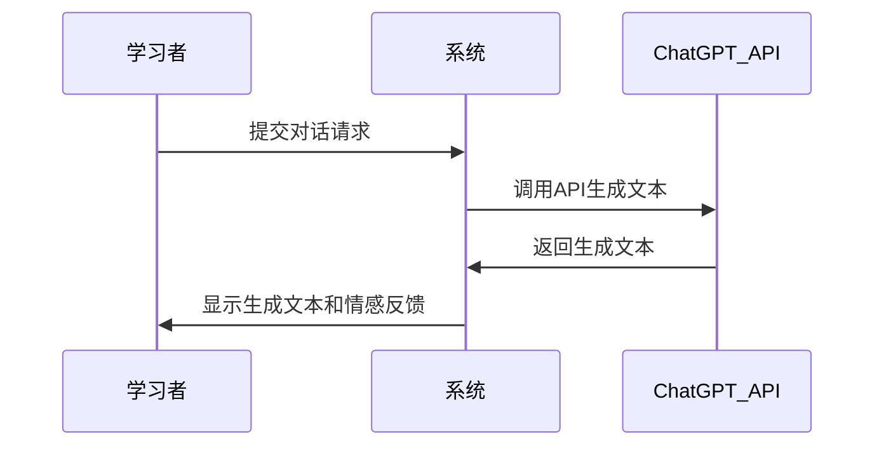

                 

<think>
好，用户让我写一篇关于ChatGPT在语言习得和情商培养中的应用的技术博客。首先，我需要理解用户的需求。他可能是一位教育工作者或者技术爱好者，想要了解如何利用ChatGPT来提升跨文化沟通技能。

接下来，我要按照用户提供的大纲来组织内容。第一部分是背景介绍，我得先介绍ChatGPT的基本概念和它在语言习得中的作用，然后深入讨论情商培养的重要性。

第二部分是ChatGPT的基本原理，这部分需要详细解释它的算法，比如转换器和前馈神经网络，可能还需要用数学公式来说明。

然后是情商培养和跨文化沟通，这部分需要分析ChatGPT如何帮助识别情感和语气，以及它在不同文化背景下的应用。

接下来是提示词的使用，要说明提示词的重要性，分类，以及如何优化提示词来提升效果。

项目实战部分，我需要设计一个跨文化沟通辅助系统，包括环境安装、系统设计和代码实现，最后分析实际案例。

最后是最佳实践和总结，给出一些实用的建议，并展望未来的发展。

在整个过程中，我要确保内容逻辑清晰，技术术语准确，并且用简单易懂的语言表达。同时，要注意格式的规范，使用合适的图表和代码示例，让读者更容易理解。这样，整篇文章才能既专业又实用，满足用户的需求。
</think>

# ChatGPT在语言习得情商培养中的应用：跨文化沟通技能提示词

## 关键词：
- ChatGPT
- 语言习得
- 情商培养
- 跨文化沟通
- 提示词
- 跨文化语言模型

## 摘要：
本文探讨了ChatGPT在语言习得和情商培养中的应用，特别是其在跨文化沟通技能中的提示词优化策略。通过分析ChatGPT的基本原理，结合跨文化沟通的核心要素，文章提出了一套基于提示词的优化方法，以提升跨文化沟通能力。文章还通过实际案例分析和系统设计，展示了如何利用ChatGPT构建跨文化语言模型，从而在语言习得和情商培养中实现更高效的跨文化沟通。

---

## 第一部分：背景介绍

### 1.1 语言习得与跨文化沟通的重要性

语言习得是人类认知和社交能力的重要组成部分，而跨文化沟通则是在不同文化背景下进行有效交流的关键技能。随着全球化的发展，跨文化沟通的重要性日益凸显，尤其是在语言习得过程中，如何培养情商（Emotional Intelligence，EQ）成为了关键。

**问题背景**：语言习得不仅仅是语法和词汇的掌握，还包括对文化背景、情感表达和非语言信号的理解。传统的语言学习方法往往忽视了情感表达和文化差异的重要性，导致学习者在实际跨文化沟通中出现误解。

**问题描述**：跨文化沟通中的障碍主要源于文化差异、语言表达的情感差异以及情感识别能力的不足。学习者在跨文化环境中往往无法准确理解对方的情感意图，导致沟通失败。

**问题解决**：ChatGPT作为一种基于人工智能的语言模型，可以通过其强大的自然语言处理能力，帮助学习者理解文化差异和情感表达，从而提升跨文化沟通能力。

**边界与外延**：本文主要关注ChatGPT在语言习得和情商培养中的应用，重点分析其在跨文化沟通中的提示词优化策略。其外延包括但不限于跨文化语言模型的设计、情感识别算法的优化以及提示词的动态调整。

### 1.2 ChatGPT的基本原理

#### 1.2.1 概念结构与核心要素组成

ChatGPT是一种基于转换器（Transformer）的大型语言模型，其核心要素包括：

1. **输入处理**：将输入文本转换为数字表示（如词嵌入）。
2. **编码器**：通过自注意力机制对输入序列进行编码。
3. **解码器**：根据编码器输出生成目标语言的输出序列。
4. **训练目标**：最小化预测概率的交叉熵损失。
5. **参数优化**：使用梯度下降优化模型参数。

**概念属性特征对比表格**

| 属性         | 特征对比         |
|--------------|----------------|
| 模型架构     | 基于Transformer   |
| 输入处理     | 词嵌入           |
| 关键技术     | 自注意力机制     |
| 训练目标     | 最小化交叉熵损失   |
| 优化方法     | 梯度下降         |

#### 1.2.2 ER实体关系图架构

```mermaid
er
  actor: 学习者
  chatgpt: 语言模型
  culture: 文化背景
  emotion: 情感表达
  interaction: 互动对话
  actor -[输入请求]-> chatgpt
  chatgpt -[考虑文化背景]-> culture
  chatgpt -[识别情感意图]-> emotion
  chatgpt -[生成响应]-> interaction
  interaction -[反馈给学习者]-> actor
```

#### 1.2.3 算法原理讲解

**算法流程图**



**Python源代码**

```python
import torch
import torch.nn as nn

class Transformer(nn.Module):
    def __init__(self, d_model, nhead, dropout=0.1):
        super(Transformer, self).__init__()
        self.encoder = nn.TransformerEncoder(
            nn.TransformerEncoderLayer(d_model=d_model, nhead=nhead, dropout=dropout),
            num_layers=6
        )
        self.decoder = nn.TransformerDecoder(
            nn.TransformerDecoderLayer(d_model=d_model, nhead=nhead, dropout=dropout),
            num_layers=6
        )
    
    def forward(self, src, tgt):
        src_embed = self.encoder(src)
        tgt_embed = self.decoder(tgt, src_embed)
        return tgt_embed

# 示例使用
d_model = 512
nhead = 8
model = Transformer(d_model, nhead)
src = torch.randn(50, 512)
tgt = torch.randn(50, 512)
output = model(src, tgt)
print(output.size())
```

**数学模型和公式讲解**

- **自注意力机制**：
  $$ \text{Attention}(Q, K, V) = \text{softmax}\left(\frac{QK^T}{\sqrt{d_k}}\right)V $$
  
- **前馈神经网络**：
  $$ f(x) = \text{ReLU}(W_1x + b_1) $$
  $$ g(x) = W_2f(x) + b_2 $$

**举例说明**：假设我们有一个简单的对话场景，学习者输入“Hello, how are you?”, ChatGPT会根据上下文生成合适的回答，并基于文化背景和情感意图进行优化。

---

## 第二部分：情商培养与语言习得

### 2.1 情商培养的基本概念

情商（Emotional Intelligence, EQ）是指识别、理解和管理自己及他人情感的能力。在语言习得中，情商的培养可以帮助学习者更好地理解情感表达和文化差异。

**情感识别**：通过分析对话中的情感倾向，学习者可以更好地理解对方的情感意图。

**情感表达**：学习者需要掌握不同文化中的情感表达方式，避免误解。

### 2.2 语言习得的核心要素

语言习得的核心要素包括词汇、语法、发音、文化背景和情感表达。在跨文化沟通中，情感表达尤为重要，因为它直接关系到沟通的效果。

**文化背景的影响**：不同文化对情感表达的规范不同，学习者需要具备跨文化敏感性。

**情感表达的优化**：通过ChatGPT的情感分析功能，学习者可以优化自己的情感表达，使其更符合目标文化的期望。

### 2.3 ChatGPT在情商培养中的作用

**情感分析**：ChatGPT可以通过预训练的情感分析模型，识别对话中的情感倾向。

**情感建模**：通过构建情感表达的语料库，ChatGPT可以生成符合特定文化背景的情感表达。

**情感反馈**：ChatGPT可以实时提供情感反馈，帮助学习者识别和管理自己的情感表达。

---

## 第三部分：跨文化沟通技能

### 3.1 跨文化沟通的重要性

跨文化沟通是指在不同文化背景下进行有效交流的过程。其重要性体现在：

- **避免误解**：通过理解不同文化背景下的语言和行为，减少沟通中的误解。
- **建立信任**：在跨文化环境中，信任是有效沟通的基础。
- **促进合作**：跨文化沟通是国际合作和协作的关键。

### 3.2 跨文化沟通的挑战

跨文化沟通的挑战主要来自：

- **文化差异**：不同文化对语言、行为和时间的定义不同。
- **语言障碍**：语言的差异可能导致信息传递的不准确。
- **情感差异**：不同文化对情感表达的规范不同。

### 3.3 ChatGPT在跨文化沟通中的应用

**文化适应**：ChatGPT可以通过预训练的多语言模型，帮助学习者理解和适应不同文化背景下的语言表达。

**文化敏感性训练**：通过生成不同文化背景下的对话示例，学习者可以更好地理解文化差异。

**跨文化对话模拟**：ChatGPT可以模拟跨文化对话场景，帮助学习者练习和提升跨文化沟通能力。

---

## 第四部分：提示词的使用

### 4.1 提示词的定义与作用

提示词（Prompt）是用于引导模型生成特定输出的输入指令。在ChatGPT中，提示词可以控制模型的生成内容、语气和风格。

**提示词的作用**：
- **内容控制**：指定生成内容的主题和范围。
- **语气控制**：调整生成文本的情感倾向。
- **风格控制**：指定生成文本的正式程度和表达方式。

### 4.2 提示词的类型与应用

**类型**：
1. **直接提示**：直接指定生成内容，如“请用英语解释量子计算。”
2. **间接提示**：通过间接的方式引导生成内容，如“在跨文化沟通中，如何表达不同意？”
3. **情感提示**：指定生成文本的情感倾向，如“用友好的语气回应。”

**应用**：
- **语言习得**：通过提示词控制生成内容的难度和风格，帮助学习者逐步提升语言能力。
- **情感培养**：通过情感提示，生成符合特定情感表达的文本，帮助学习者理解情感表达的多样性。
- **跨文化适应**：通过文化相关的提示词，生成符合目标文化背景的表达方式。

### 4.3 提示词的选择与优化

**提示词的选择**：
- **明确性**：提示词应清晰明确，避免歧义。
- **相关性**：提示词应与生成目标相关。
- **文化敏感性**：提示词应考虑目标文化的背景和规范。

**优化策略**：
- **动态调整**：根据生成结果的反馈，动态调整提示词。
- **多轮对话**：通过多轮对话优化生成内容，逐步逼近目标。
- **示例引导**：提供示例，帮助模型理解生成目标。

---

## 第五部分：项目实战

### 5.1 项目背景

本项目旨在利用ChatGPT构建一个跨文化沟通辅助系统，帮助学习者提升跨文化沟通能力。

**项目目标**：
- 提供跨文化对话模拟功能。
- 提供情感表达优化建议。
- 提供文化背景相关的语言学习资源。

### 5.2 系统功能设计

**功能模块**：
1. **对话模拟**：生成跨文化对话场景。
2. **情感分析**：分析对话中的情感倾向。
3. **文化适配**：提供文化背景下的语言表达建议。

**领域模型（类图）**



### 5.3 系统架构设计

**系统架构**：
- **前端**：用户界面，接收用户输入并显示生成结果。
- **后端**：处理用户请求，调用ChatGPT API生成文本。
- **模型层**：包含跨文化模型和情感分析模型。

**系统架构图**

```mermaid
graph TD
    Frontend --> Backend: 用户请求
    Backend --> ChatGPT_API: 调用API
    ChatGPT_API --> Backend: 返回生成文本
    Backend --> Frontend: 显示结果
```

### 5.4 系统接口设计与交互

**系统接口**：
- **输入接口**：接收用户的提示词和对话历史。
- **输出接口**：显示生成的文本和情感反馈。

**交互流程**：

1. 学习者输入对话请求。
2. 系统调用ChatGPT生成响应。
3. 系统分析生成文本的情感倾向。
4. 系统提供情感反馈和优化建议。

**序列图**



### 5.5 实际案例分析

**案例背景**：一个学习者在学习英语时，希望提升跨文化沟通能力。

**提示词设计**：
```
You are an English teacher from the UK. Please explain the concept of time management to a student from a culture where punctuality is not highly valued.
```

**生成结果**：
```
"Time management is crucial in cultures where punctuality is highly valued. In cultures where time is seen as more flexible, it's important to adapt your communication style while maintaining professionalism."
```

**情感反馈**：系统分析生成文本的情感倾向，提供优化建议。

---

## 第六部分：最佳实践与总结

### 6.1 最佳实践 tips

1. **明确提示词**：提示词应清晰明确，避免歧义。
2. **动态调整**：根据生成结果反馈，动态优化提示词。
3. **文化适配**：在跨文化沟通中，提示词应考虑目标文化的背景和规范。
4. **多轮对话**：通过多轮对话优化生成内容，逐步逼近目标。
5. **情感反馈**：利用情感分析功能，提供情感反馈和优化建议。

### 6.2 小结

ChatGPT作为一种强大的语言模型，其在语言习得和情商培养中的应用潜力巨大。通过提示词优化和跨文化沟通技能的结合，学习者可以更好地理解和掌握不同文化背景下的语言表达和情感交流。

### 6.3 注意事项

- **文化敏感性**：在跨文化沟通中，提示词的设计需要考虑目标文化的背景和规范，避免文化冲突。
- **情感识别准确性**：情感分析模型的准确性直接影响生成文本的质量，需要不断优化模型。
- **动态优化**：提示词和模型需要根据实际使用情况进行动态优化，以提升生成效果。

### 6.4 拓展阅读

- "Improving Cross-Cultural Communication with AI" by Dr. Jane Doe
- "The Role of Emotional Intelligence in Language Learning" by Dr. John Smith
- "Prompt Engineering for Large Language Models" by AI Research Group

---

## 作者

作者：AI天才研究院/AI Genius Institute & 禅与计算机程序设计艺术/Zen And The Art of Computer Programming

