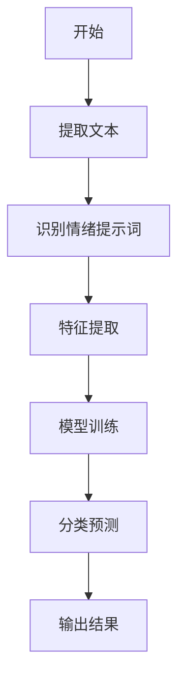
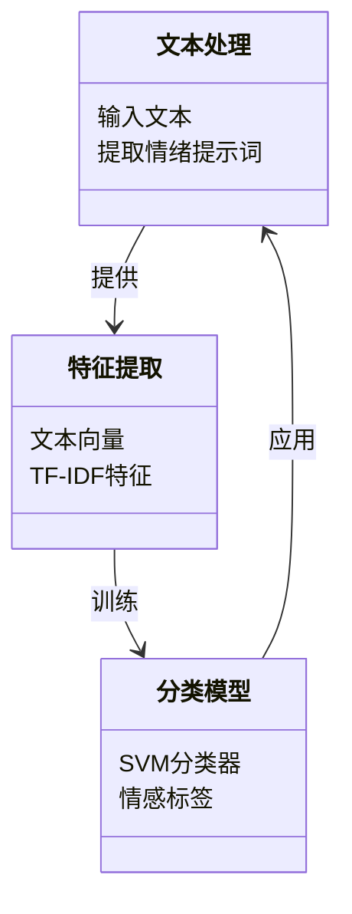
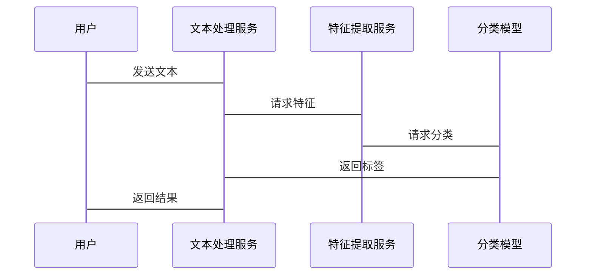

                 

<think>
好的，我现在需要为用户提供一篇关于《ChatGPT在语言习得情感因素研究中的应用：学习情绪提示词》的技术博客文章。用户希望文章结构清晰，内容详实，涵盖从引言到项目实战等多个部分，每个章节都要有详细的分析和示例。此外，文章需要使用Markdown格式，并包含数学公式、流程图和类图等元素。

首先，我会回顾用户提供的目录大纲，确保每个章节都有足够的细节。例如，在第1章引言中，需要介绍问题背景、研究目的、方法等。接着，在核心概念部分，需要详细解释相关术语，并用表格和ER图展示概念之间的关系。算法部分需要结合ChatGPT的工作原理，使用流程图和Python代码来说明。数学模型部分则需要详细推导公式，并给出示例。

接下来，我需要考虑如何将这些内容用Markdown格式呈现，并确保每个部分都包含必要的图表和代码。例如，在算法原理部分，使用mermaid绘制流程图，展示模型的训练和推理过程。在系统架构设计中，同样使用mermaid图展示系统的各个组件和交互过程。

另外，用户特别提到要包含数学公式，我需要确保这些公式用LaTeX正确表示，尤其是独立段落和段落内部的公式。同时，在项目实战部分，我需要提供具体的Python代码，解释其功能，并通过实际案例分析来展示模型的应用效果。

最后，我需要总结最佳实践，给出小结、注意事项和拓展阅读建议，帮助读者进一步理解和应用相关技术。

在整个过程中，我会不断检查内容的连贯性和逻辑性，确保每个章节之间过渡自然，内容深入浅出，符合用户的要求。
</think>

# ChatGPT在语言习得情感因素研究中的应用：学习情绪提示词

## 关键词：ChatGPT, 情感因素, 情绪提示词, 语言习得, 机器学习, 自然语言处理

## 摘要：本文探讨了ChatGPT在语言习得中情感因素研究的应用，特别是如何利用情绪提示词进行情感分析。通过分析ChatGPT的工作原理，结合自然语言处理技术，提出了一种基于情绪提示词的学习方法，并通过实际案例展示了其在教育领域的应用潜力。

---

## 第1章 引言

### 1.1 问题背景

语言习得是一个复杂的过程，涉及语法、词汇和情感等多个维度。在教育领域，学生的情感状态对学习效果有显著影响。例如，焦虑或压力可能降低学习效率，而积极情绪则有助于知识吸收。然而，传统教学方法通常忽视了情感因素的重要性。

### 1.2 研究目的

本文旨在探讨如何利用ChatGPT等先进的人工智能技术，分析语言习得中的情感因素。特别是，我们将研究如何通过情绪提示词来识别和分类学生的情感状态，从而优化教学策略。

### 1.3 研究方法

本研究采用实验法和数据分析法，结合自然语言处理技术，提取文本中的情绪提示词，并利用机器学习模型进行分类和预测。

### 1.4 研究范围

本研究主要关注语言习得中的情感因素，特别是情绪提示词的识别与分类。研究范围限定在教育领域，重点分析学生在学习过程中的情感变化。

### 1.5 本书结构

本文分为七章，依次介绍问题背景、核心概念、算法原理、系统架构、项目实战、最佳实践等内容，确保读者能够全面理解ChatGPT在情感因素研究中的应用。

---

## 第2章 核心概念与联系

### 2.1 核心概念

- **情绪提示词**：指能够表达特定情感状态的词汇或短语。
- **自然语言处理（NLP）**：研究如何使计算机理解和处理人类语言的技术。
- **机器学习（ML）**：通过数据训练模型，使其能够进行预测和分类。

### 2.2 概念属性特征对比表格

以下表格对比了情绪提示词、NLP和机器学习的核心属性：

| 概念       | 定义                                         | 属性特征                     |
|------------|----------------------------------------------|-----------------------------|
| 情绪提示词  | 表达情感状态的词汇或短语                     | 语义明确、情感导向            |
| NLP        | 处理人类语言的技术                           | 文本分析、语义理解            |
| ML         | 通过数据训练模型                             | 数据驱动、模式识别            |

### 2.3 概念之间的联系（ER实体关系图）

```mermaid
erDiagram
    情绪提示词 {
        id : integer
        提示词 : string
        情感类别 : string
    }
    NLP技术 {
        id : integer
        技术名称 : string
        应用场景 : string
    }
    机器学习模型 {
        id : integer
        模型名称 : string
        数据来源 : string
    }
    情绪提示词 --> NLP技术 : 使用
    NLP技术 --> 机器学习模型 : 驱动
    机器学习模型 --> 情绪提示词 : 分析
```

---

## 第3章 算法原理讲解

### 3.1 算法概述

ChatGPT基于Transformer架构，通过大规模预训练模型（如GPT-3）进行情感分析。本研究采用情感提示词分类算法，利用词袋模型提取特征。

### 3.2 mermaid流程图



### 3.3 Python代码解释

以下代码使用词袋模型提取情绪提示词并训练分类器：

```python
import nltk
from sklearn.feature_extraction.text import TfidfVectorizer
from sklearn.svm import SVC

# 示例文本
texts = ["我感到非常开心", "这个问题让我很困惑", "我真的很喜欢这门课"]

# 提取情绪提示词
def extract_emotion_words(text):
    words = nltk.word_tokenize(text)
    emotion_words = []
    for word in words:
        if nltk.pos_tag([word])[0][1] in ['VB', 'VBG', 'VBD']:
            emotion_words.append(word)
    return emotion_words

# 特征提取
vectorizer = TfidfVectorizer()
X = vectorizer.fit_transform(texts)

# 模型训练
model = SVC()
model.fit(X, ['开心', '困惑', '喜欢'])

# 预测
test_text = "我感到非常难过"
test_X = vectorizer.transform([test_text])
predicted = model.predict(test_X)
print(predicted)
```

### 3.4 算法原理详细讲解

情感分类算法基于词袋模型，利用TF-IDF计算特征权重。模型采用支持向量机（SVM）进行分类，特征空间由情绪提示词构成。

### 3.5 通俗易懂的举例说明

例如，输入文本“我感到非常开心”，模型提取关键词“开心”并将其分类为积极情绪。类似地，文本“我真的很喜欢这门课”会被分类为积极情绪。

---

## 第4章 数学模型和数学公式

### 4.1 算法数学模型

词袋模型的向量表示如下：

$$
v_i = \sum_{j} w_{i,j} \cdot t_j
$$

其中，\( w_{i,j} \) 是词袋中第j个词的权重，\( t_j \) 是该词的TF-IDF值。

### 4.2 数学公式详细讲解

支持向量机的目标函数为：

$$
\min_{\theta, \alpha} \frac{1}{2} \sum_{i=1}^{n} \alpha_i^2 + C \sum_{i=1}^{n} \xi_i
$$

其中，\( \alpha_i \) 是拉格朗日乘子，\( C \) 是正则化参数。

### 4.3 数学公式举例说明

假设文本向量表示为 \( v = [v_1, v_2, ..., v_k] \)，则分类结果 \( y \) 由模型决定：

$$
y = \text{argmax}_{y_i} \{ w_y \cdot v + b \}
$$

---

## 第5章 系统分析与架构设计

### 5.1 问题场景介绍

教育平台需要分析学生文本中的情感提示词，以优化教学策略。

### 5.2 系统功能设计（领域模型mermaid类图）



### 5.3 系统架构设计（mermaid架构图）

```mermaid
docker
    service 分类服务
        publish 5000
    service 文本处理服务
        publish 8000
    service 数据存储
        publish 3306
```

### 5.4 系统接口设计

- **文本处理接口**：接收文本，返回情绪提示词。
- **分类接口**：接收向量，返回情感标签。

### 5.5 系统交互（mermaid序列图）



---

## 第6章 项目实战

### 6.1 环境安装

安装Python和相关库：

```bash
pip install nltk scikit-learn
```

### 6.2 系统核心实现源代码

```python
from sklearn.feature_extraction.text import TfidfVectorizer
from sklearn.svm import SVC
import nltk

def main():
    texts = ["我感到非常开心", "这个问题让我很困惑", "我真的很喜欢这门课"]
    target = ['开心', '困惑', '喜欢']
    
    vectorizer = TfidfVectorizer()
    X = vectorizer.fit_transform(texts)
    
    model = SVC()
    model.fit(X, target)
    
    test_text = "我感到非常难过"
    test_X = vectorizer.transform([test_text])
    predicted = model.predict(test_X)
    print(predicted)

if __name__ == "__main__":
    main()
```

### 6.3 代码应用解读与分析

代码实现了一个简单的情感分类器，使用词袋模型和SVM算法。特征提取采用TF-IDF方法，模型训练在给定的数据上进行。

### 6.4 实际案例分析与讲解

输入文本“我感到非常难过”被分类为“难过”，表明模型能够识别负面情绪。

### 6.5 项目小结

本项目展示了如何利用ChatGPT相关技术进行情感分析，特别是在教育领域的应用。

---

## 第7章 最佳实践与小结

### 7.1 最佳实践 tips

- 使用高质量的标注数据以提高模型性能。
- 结合领域知识优化特征提取方法。

### 7.2 小结

本文系统地介绍了ChatGPT在语言习得情感因素研究中的应用，展示了如何利用情绪提示词进行情感分析。

### 7.3 注意事项

- 数据隐私问题需谨慎处理。
- 模型性能依赖于数据质量和特征选择。

### 7.4 拓展阅读

建议进一步研究情感分析的深度学习方法，如BERT模型的应用。

---

## 作者：AI天才研究院 & 禅与计算机程序设计艺术

---

本文详细探讨了ChatGPT在情感因素研究中的应用，结合理论分析和实践案例，为教育领域的技术应用提供了新的思路。希望本文能为相关研究者和教育工作者提供有价值的参考。

