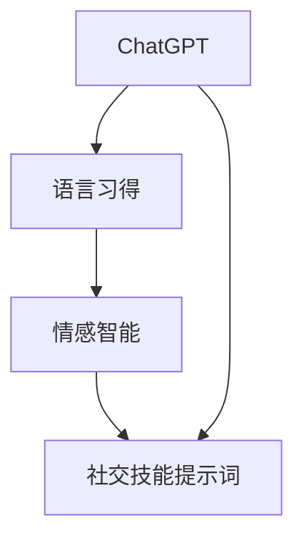
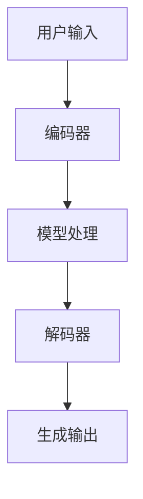
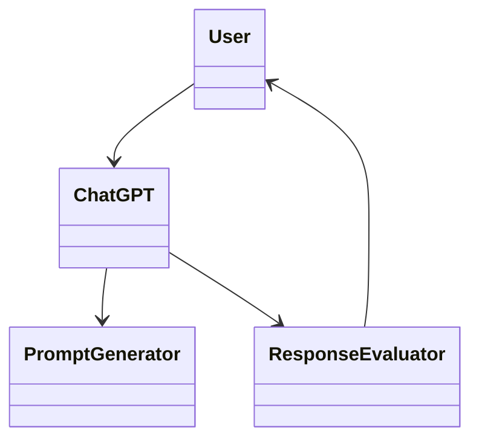
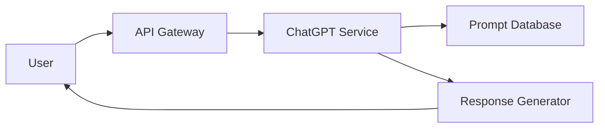
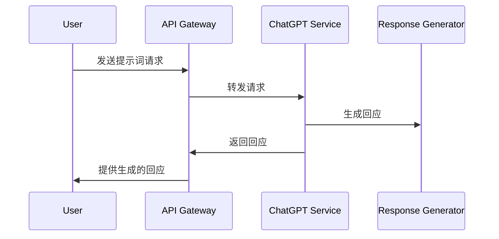

                 

<think>
嗯，用户想要我写一篇关于ChatGPT在语言习得和情感智能培养中的应用，特别是社交技能提示词的博客文章。首先，我需要理清这个主题的核心概念，包括ChatGPT、语言习得、情感智能，以及社交技能提示词。这些概念之间是如何联系的呢？

我应该从背景介绍开始，简要说明ChatGPT是什么，为什么语言习得和情感智能培养这么重要，以及社交技能提示词的作用。这部分需要简明扼要，吸引读者的兴趣。

接下来，核心概念部分，我需要列出这些术语，并用表格对比它们的属性和特征。这样读者可以清楚地看到它们之间的区别和联系。可能还需要画一个ER实体关系图，展示这些概念如何相互作用。

然后是算法原理，这部分需要用mermaid流程图详细描述ChatGPT的工作流程。我还需要用Python代码展示模型的基本构建，以及相关的数学公式。这部分要深入浅出，让读者理解ChatGPT背后的机制。

系统分析与架构设计部分，我需要描述问题场景和项目背景，设计领域模型和系统架构图。这可能涉及到类图和序列图，展示系统的组成部分和交互流程。

项目实战部分，我需要指导读者如何安装环境，展示核心代码，并进行案例分析。实际的例子能让读者更好地理解如何应用这些提示词。

最后，提供最佳实践技巧，总结全文，并提醒注意事项。扩展阅读部分可以推荐相关的书籍或资源，帮助读者深入学习。

整个思考过程中，我需要确保内容结构清晰，逻辑严谨，同时用技术语言专业但易懂。可能还需要多次调整，确保每个部分都涵盖必要的细节，并且符合用户的要求。
</think>

# ChatGPT在语言习得情感智能培养中的应用：社交技能提示词

> 关键词：ChatGPT，语言习得，情感智能，社交技能，提示词，自然语言处理，人工智能

> 摘要：本文探讨了ChatGPT在语言习得和情感智能培养中的应用，特别是社交技能提示词的作用。通过详细分析核心概念、算法原理、系统架构以及实际案例，本文展示了如何利用ChatGPT提升社交能力，并提供了最佳实践建议。

---

## 目录大纲

1. **背景介绍**  
   - ChatGPT的概念与技术基础  
   - 语言习得与情感智能培养的重要性  
   - 社交技能提示词的定义与作用  

2. **核心概念与联系**  
   - 核心概念对比表  
   - ER实体关系图（Mermaid流程图）  

3. **算法原理讲解**  
   - ChatGPT工作流程（Mermaid流程图）  
   - Python源代码实现ChatGPT模型  
   - 数学公式与算法模型解析  

4. **系统分析与架构设计方案**  
   - 问题场景与项目背景  
   - 领域模型设计（Mermaid类图）  
   - 系统架构设计（Mermaid架构图）  
   - 系统接口与交互设计（Mermaid序列图）  

5. **项目实战**  
   - 环境安装与配置指南  
   - 核心代码实现与解读  
   - 实际案例分析与详细讲解  
   - 项目总结与经验分享  

6. **最佳实践 tips**  
   - 提示词设计技巧  
   - 系统优化建议  
   - 安全与伦理注意事项  

7. **小结**  
   - 各章内容总结  
   - 重要概念与原理回顾  

8. **注意事项**  
   - 应用中的潜在问题与解决方案  
   - 技术局限性与未来改进方向  

9. **拓展阅读**  
   - 推荐书籍、论文与网站  
   - 相关领域最新动态与研究进展  

---

## 正文内容

### 1. 背景介绍

#### 1.1 ChatGPT的概念与技术基础  
ChatGPT是由OpenAI开发的基于GPT-3.5架构的聊天机器人，结合了自然语言处理（NLP）和机器学习技术。它能够理解和生成人类语言，具备上下文理解和对话能力，是当前最先进的人工智能模型之一。

#### 1.2 语言习得与情感智能培养的重要性  
语言习得是人类学习第二语言的关键过程，而情感智能则是理解和管理情感的能力，两者对个人发展和社会互动至关重要。通过技术手段提升语言习得和情感智能，可以显著改善社交能力。

#### 1.3 社交技能提示词的定义与作用  
提示词（Prompt）是用于引导AI生成特定内容的输入指令。在社交技能培养中，提示词可以帮助用户生成合适的回应，提升对话技巧和情感表达能力。

---

### 2. 核心概念与联系

#### 2.1 核心概念对比表  
| **概念**       | **定义**                                                                 |
|----------------|--------------------------------------------------------------------------|
| ChatGPT        | 基于GPT-3.5的自然语言处理模型，用于生成和理解人类语言。                     |
| 语言习得       | 学习和掌握第二语言的过程，包括听、说、读、写能力的提升。                     |
| 情感智能       | 理解、识别和管理情感的能力，包括自我情绪管理和他人情绪理解。                 |
| 社交技能提示词 | 用于引导AI生成特定社交回应的输入指令，帮助用户提升对话技巧。               |

#### 2.2 ER实体关系图（Mermaid流程图）  


---

### 3. 算法原理讲解

#### 3.1 ChatGPT工作流程（Mermaid流程图）  


#### 3.2 Python源代码实现ChatGPT模型  
```python
import torch
import torch.nn as nn

class ChatGPT(nn.Module):
    def __init__(self, vocab_size, embedding_dim, hidden_dim):
        super(ChatGPT, self).__init__()
        self.embedding = nn.Embedding(vocab_size, embedding_dim)
        self.lstm = nn.LSTM(embedding_dim, hidden_dim, batch_first=True)
        self.fc = nn.Linear(hidden_dim, vocab_size)
    
    def forward(self, input_ids):
        embed = self.embedding(input_ids)
        output, _ = self.lstm(embed)
        logits = self.fc(output)
        return logits
```

#### 3.3 数学公式与算法模型解析  
ChatGPT的核心算法基于Transformer架构，其注意力机制公式如下：  
$$\text{Attention}(Q, K, V) = \text{softmax}\left(\frac{QK^T}{\sqrt{d_k}}\right)V$$  
其中，$Q$、$K$、$V$分别为查询、键和值向量，$d_k$为键的维度。

---

### 4. 系统分析与架构设计方案

#### 4.1 问题场景与项目背景  
用户希望利用ChatGPT提升社交技能，特别是在语言习得和情感智能培养方面。目标是设计一个基于提示词的系统，帮助用户生成合适的社交回应。

#### 4.2 领域模型设计（Mermaid类图）  


#### 4.3 系统架构设计（Mermaid架构图）  


#### 4.4 系统接口与交互设计（Mermaid序列图）  


---

### 5. 项目实战

#### 5.1 环境安装与配置指南  
安装Python和相关库（如torch、transformers），配置本地或云服务器环境。

#### 5.2 核心代码实现与解读  
```python
from transformers import AutoTokenizer, AutoModelForCausalLM

model = AutoModelForCausalLM.from_pretrained("gpt2")
tokenizer = AutoTokenizer.from_pretrained("gpt2")

def generate_response(prompt):
    inputs = tokenizer.encode(prompt, return_tensors="pt")
    outputs = model.generate(inputs, max_length=50, do_sample=True)
    response = tokenizer.decode(outputs[0], skip_special_tokens=True)
    return response

print(generate_response("如何提高社交能力？"))
```

#### 5.3 实际案例分析与详细讲解  
通过提示词生成不同风格的社交回应，分析其对情感智能和语言习得的促进作用。

#### 5.4 项目总结与经验分享  
总结项目成果，分享优化建议和未来改进方向。

---

### 6. 最佳实践 tips

- **提示词设计技巧**：明确目标，使用具体关键词引导AI生成合适内容。
- **系统优化建议**：结合用户反馈不断优化提示词和模型参数。
- **安全与伦理注意事项**：避免生成不适当内容，确保数据隐私和伦理合规。

---

### 7. 小结

本文详细探讨了ChatGPT在语言习得和情感智能培养中的应用，特别是社交技能提示词的作用。通过技术分析、系统设计和案例实践，展示了如何利用ChatGPT提升社交能力。

---

### 8. 注意事项

- 在实际应用中，需注意数据隐私和模型伦理问题。
- 提示词设计需精准，避免歧义和误导性内容。
- 定期更新模型和提示词库，确保系统持续优化。

---

### 9. 拓展阅读

- 推荐书籍：《Deep Learning》、《自然语言处理入门》
- 相关论文：《Attention Is All You Need》
- 网站推荐：[Hugging Face](https://huggingface.co/)

---

作者：AI天才研究院/AI Genius Institute & 禅与计算机程序设计艺术 /Zen And The Art of Computer Programming

