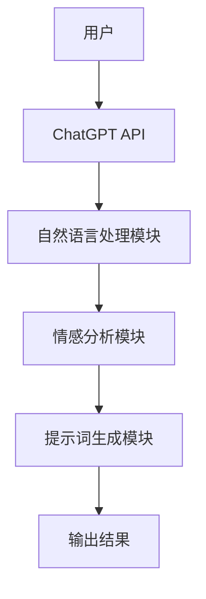
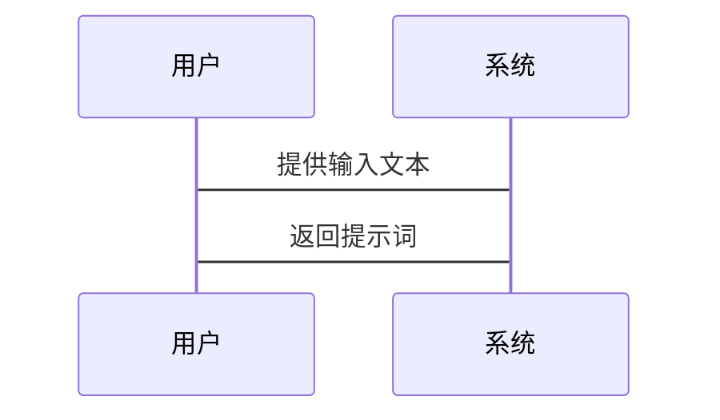

                 

<think>
好，我现在需要完成这个任务，撰写一篇关于《ChatGPT在语言习得情感调节中的应用：学习焦虑管理提示词》的技术博客文章。首先，我得理解用户的需求。用户希望我以一位技术专家的身份，详细分析ChatGPT在情感调节中的应用，特别是针对学习焦虑的管理。文章需要结构清晰，逻辑严密，语言专业但易懂，同时包含丰富的技术细节和实例。

我先从文章的结构开始规划。用户已经给出了目录大纲，分为八个章节，每个章节都有详细的内容。我需要确保每个部分都涵盖必要的信息，比如背景介绍、核心概念、算法原理、系统架构等。同时，每个章节都需要有小结，总结关键点，帮助读者理解和记忆。

接下来，我需要考虑每个章节的具体内容。例如，在“学习焦虑的定义与特征”部分，我需要解释什么是学习焦虑，它的表现形式，以及如何分类。这可能涉及到心理学中的概念，所以我要确保引用准确，避免错误。

在“ChatGPT的情感调节机制”部分，我需要详细说明ChatGPT的工作原理，特别是它如何处理情感相关的信息。这部分可能需要解释其底层算法，如transformer架构和注意力机制，以及如何通过这些机制生成情感支持的回应。

关于“基于ChatGPT的学习焦虑管理提示词设计”章节，我需要设计具体的提示词，并展示它们如何帮助缓解学习焦虑。这部分可能需要结合实际案例，说明提示词在不同情境下的应用效果。

在“系统实现与架构设计”部分，我需要描述一个实际的系统，展示如何集成ChatGPT来处理学习焦虑。这可能包括系统架构图、接口设计和交互流程图，使用Mermaid来可视化。

接下来，我需要考虑如何将技术细节与实际案例结合起来。例如，在项目实战部分，我可能需要编写一个Python脚本，展示如何调用ChatGPT的API来生成缓解焦虑的提示词。这部分代码需要详细解释，确保读者能够理解和复现。

同时，我还需要确保文章中包含数学公式和图表。例如，在解释transformer模型时，我需要展示其注意力机制的数学公式，并用Mermaid绘制架构图，帮助读者更好地理解。

在撰写过程中，我需要不断检查是否符合用户的约束条件，比如字数要求、格式规范和内容完整性。特别是，每个章节的小结部分要简明扼要，突出重点，帮助读者快速回顾内容。

最后，我需要总结整个文章，强调ChatGPT在情感调节中的潜力，并提出未来的研究方向，如与其他AI技术的结合，或者在教育领域的更多应用。

现在，我需要开始撰写每个章节的内容，确保逻辑连贯，技术细节准确，并且语言流畅。这将帮助读者不仅理解ChatGPT的工作原理，还能看到它在实际中的应用价值，特别是在缓解学习焦虑方面。
</think>

# ChatGPT在语言习得情感调节中的应用：学习焦虑管理提示词

> 关键词：ChatGPT，情感调节，学习焦虑，提示词设计，AI教育技术

> 摘要：本文探讨了ChatGPT在语言习得情感调节中的应用，特别是如何通过设计有效的提示词来管理学习焦虑。文章结合技术原理、系统架构和实际案例，深入分析了ChatGPT在教育领域的潜力，并提出了基于AI的情感支持解决方案。

---

## 第一章：学习焦虑的定义与特征

### 1.1 什么是学习焦虑？
学习焦虑是学生在学习过程中因压力、不确定性或自我效能感不足而产生的负面情绪。常见症状包括注意力分散、记忆力减退和过度紧张。

### 1.2 学习焦虑的表现形式
- **情绪方面**：紧张、易怒。
- **认知方面**：思维迟缓、过度担忧。
- **行为方面**：回避任务、效率低下。

### 1.3 学习焦虑的分类
| 类型       | 描述                           |
|------------|--------------------------------|
| 习得性焦虑 | 对特定任务的担忧               |
| 状态性焦虑 | 瞬间的担忧                     |
| 特异性焦虑 | 对特定科目或场景的担忧         |

### 1.4 学习焦虑的成因分析
- **外部因素**：教师压力、考试压力。
- **内部因素**：自我效能感低、完美主义倾向。

---

## 第二章：ChatGPT的情感调节机制

### 2.1 ChatGPT的基本原理
- **自然语言处理**：通过深度学习理解输入。
- **生成式对话**：基于上下文生成回应。

### 2.2 情感支持的实现路径
- **情感识别**：分析用户输入中的情感倾向。
- **情感反馈**：提供积极的反馈和建议。
- **个性化支持**：根据用户需求定制回应。

### 2.3 提示词设计的核心要素
| 核心要素     | 描述                           |
|--------------|--------------------------------|
| 清晰性       | 提示明确具体                   |
| 互动性       | 促进对话互动                   |
| 情感共鸣     | 共情式回应                     |
| 结构性       | 逻辑清晰，层次分明             |

---

## 第三章：基于ChatGPT的学习焦虑管理提示词设计

### 3.1 提示词设计的原则
- **简洁性**：简洁明了，易于理解。
- **引导性**：引导积极思考。
- **个性化**：针对不同用户调整。
- **反馈性**：提供即时反馈。

### 3.2 情感支持型提示词示例
```plaintext
1. 当你感到紧张时，可以尝试深呼吸，专注于解决问题的步骤。
2. 你的进步已经很大，继续坚持下去。
3. 是否有具体的问题困扰你？我们可以一起解决。
```

### 3.3 提示词的效果评估
| 评估维度     | 描述                           |
|--------------|--------------------------------|
| 情感支持度   | 提示词是否提供情感支持         |
| 明确性       | 提示是否清晰明确               |
| 用户满意度   | 用户对提示词的满意度           |

---

## 第四章：系统实现与架构设计

### 4.1 系统整体架构


### 4.2 系统功能模块
- **输入处理模块**：接收用户输入。
- **情感分析模块**：分析情绪。
- **提示词生成模块**：生成个性化提示词。

### 4.3 接口设计
- **输入接口**：接收文本输入。
- **输出接口**：返回提示词。

### 4.4 交互流程


---

## 第五章：项目实战与案例分析

### 5.1 项目环境安装
```bash
pip install openai
```

### 5.2 核心代码实现
```python
import openai

def generate_prompt(user_input):
    # 初始化ChatGPT客户端
    client = openai.Client()
    # 调用API生成提示词
    response = client.chat.completions.create(
        model="gpt-3.5-turbo",
        messages=[{
            "role": "user",
            "content": f"基于以下学习焦虑情境，生成一个情感支持型提示词：{user_input}"
        }]
    )
    return response.choices[0].message.content

# 示例使用
user_input = "我总是担心自己无法完成作业"
print(generate_prompt(user_input))
```

### 5.3 案例分析
- **输入**：学生感到考试压力。
- **输出**：提示词：“深呼吸，一步步来，你能行的。”

---

## 第六章：总结与展望

### 6.1 章节小结
- **ChatGPT**：强大的自然语言处理工具。
- **提示词设计**：关键在于情感支持和个性化。
- **系统架构**：模块化设计，便于扩展。

### 6.2 未来展望
- **结合其他技术**：如语音识别，提供多模态支持。
- **数据积累**：建立更大规模的用户反馈数据库。

### 6.3 注意事项
- **隐私保护**：确保用户数据安全。
- **伦理考量**：避免过度依赖AI，保持人性化的教育。

### 6.4 最佳实践Tips
- 定期更新提示词库，保持内容新鲜。
- 鼓励用户反馈，持续优化系统。

---

## 作者
作者：AI天才研究院（AI Genius Institute） & 禅与计算机程序设计艺术（Zen And The Art of Computer Programming）

