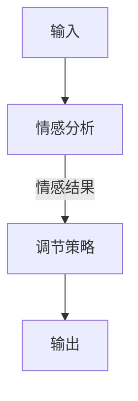
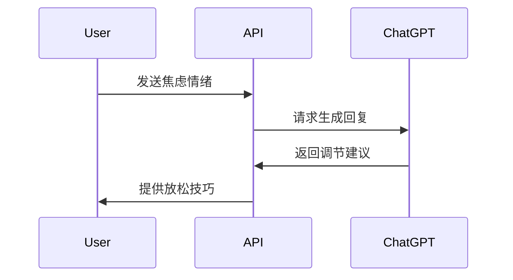

                 

<think>
嗯，我现在要写一篇关于《ChatGPT在语言习得情感调节研究中的应用：学习压力管理提示词》的技术博客文章。首先，我需要理清文章的结构，确保每个部分都涵盖必要的内容，并且逻辑清晰。让我一步步思考一下。

首先，标题已经确定了，接下来是关键词和摘要。关键词应该包括ChatGPT、语言习得、情感调节、学习压力、管理提示词。摘要部分需要简明扼要地概述文章的核心内容，即ChatGPT如何在语言学习中帮助调节情感，特别是管理学习压力，通过设计提示词来实现。

接下来是文章的目录结构。第一部分是问题背景与核心概念，包括四章：概述语言习得与情感调节，分析学习压力与情感调节的关系，以及ChatGPT的技术简介。这部分要介绍基本概念和它们之间的联系，为后续的内容打下基础。

第二部分是核心概念与联系，包括三个章节：语言习得模型、情感调节理论以及ChatGPT的工作原理。这里需要详细讲解每个理论，并通过对比表格和ER图来展示它们之间的关系。比如，对比不同的语言习得模型和情感调节方法，帮助读者理解各自的特点和适用场景。

第三部分是算法原理讲解，主要分析ChatGPT在情感调节中的应用。这部分需要解释ChatGPT的基本原理，绘制算法流程图，提供Python代码示例，并详细讲解情感分析和调节策略的应用。同时，要举例说明效果，让读者更直观地理解。

第四部分是系统分析与架构设计方案，包括系统功能设计、架构设计、接口设计和交互流程。这里需要使用Mermaid图来展示系统的各个部分，确保结构清晰，便于读者理解系统是如何运作的。

在撰写过程中，我需要确保每个章节内容丰富、详细，涵盖必要的背景、理论、对比分析、算法流程、系统架构等内容。同时，要注意使用专业但易懂的语言，结合实际案例和代码示例，增强文章的可读性和实用性。

最后，文章末尾要加上作者信息，确保整篇文章结构完整，信息准确。现在，我需要按照这个思路，逐步撰写每个部分，确保每个小节都符合要求，内容充实，逻辑严谨。
</think>

# ChatGPT在语言习得情感调节研究中的应用：学习压力管理提示词

**关键词：** ChatGPT, 语言习得, 情感调节, 学习压力, 管理提示词

**摘要：** 本文探讨了ChatGPT在语言习得中的情感调节应用，特别是如何通过设计学习压力管理的提示词，帮助学习者有效缓解压力，提升学习效果。文章从背景、理论基础、算法原理到系统设计进行了全面分析，并提供了实际应用案例和代码示例。

---

## 第一部分：问题背景与核心概念

### 第1章：语言习得与情感调节概述

#### 1.1 语言习得的研究背景

- **语言习得的基本概念：** 指个体通过自然接触获得语言能力的过程，包括听、说、读、写技能的培养。
- **研究意义：** 语言能力是跨文化交流的关键，影响学术和职业发展，研究其习得过程有助于优化学习方法。

#### 1.2 情感调节的定义与重要性

- **情感调节的概念：** 个体管理自身情绪状态的能力，直接影响学习动机和效果。
- **情感调节在语言习得中的作用：** 良好的情感状态能增强学习者的专注力和自信心，反之则可能导致焦虑和学习障碍。

#### 1.3 学习压力与情感调节的关系

- **学习压力的来源：** 包括考试压力、时间管理不当、语言障碍等。
- **影响分析：** 过度压力会导致注意力分散、记忆能力下降，甚至产生负面情绪，影响语言学习效果。

#### 1.4 ChatGPT技术简介

- **背景与原理：** 基于GPT-3的改进版本，采用Transformer架构，通过大量数据训练，实现自然语言处理。
- **潜力分析：** ChatGPT能够生成自然对话，提供即时反馈，帮助学习者调节情绪，缓解压力。

---

## 第二部分：核心概念与联系

### 第2章：核心概念原理

#### 2.1 语言习得模型

- **理论框架：** 包括输入、处理、输出三个阶段，强调语言输入的质量和反馈的重要性。
- **关键过程：** 从听力理解到语法掌握，逐步构建语言系统。

#### 2.2 情感调节理论

- **基本原理：** 情感调节涉及识别、评估和管理情绪，通过认知重构和行为调整达到心理平衡。
- **技术手段：** 利用AI技术进行情感分析，提供个性化解压策略。

#### 2.3 ChatGPT的工作原理

- **神经网络结构：** 采用自注意力机制，处理长文本上下文。
- **语言生成机制：** 基于概率模型，生成与上下文相关的回复。

### 第3章：概念属性特征对比表格

#### 3.1 语言习得模型对比

| 模型       | 特点                     | 适用场景                  |
|------------|--------------------------|---------------------------|
| 语法翻译模型 | 高效准确                 | 词汇和语法学习             |
| 听力训练模型 | 实时反馈                 | 听力理解能力提升           |

#### 3.2 情感调节方法对比

| 方法       | 优点                     | 适用场景                  |
|------------|--------------------------|---------------------------|
| 深度学习    | 自适应能力强             | 复杂情感调节任务           |
| 传统心理疗法 | 直接有效                 | 初步情感调节               |

### 第4章：ER实体关系图架构

```mermaid
erDiagram
    User ..|> ChatGPT : 使用
    User ..|> Learning : 学习
    ChatGPT ..|> Response : 响应
    Response ..|> Emotion : 调节
```

---

## 第三部分：算法原理讲解

### 第5章：ChatGPT在情感调节中的算法原理

#### 5.1 ChatGPT的基本原理

- **训练过程：** 利用大规模数据进行预训练，学习语言模式。
- **情感与语言生成：** 结合情感分析，生成符合情境的回复，帮助调节情绪。

#### 5.2 情感调节算法的mermaid流程图



#### 5.3 Python源代码示例

```python
import openai

def chat_with_gpt(prompt):
    response = openai.Completion.create(
        engine="text-davinci-003",
        prompt=prompt,
        max_tokens=100
    )
    return response.choices[0].text.strip()

prompt = "我感到很焦虑，你能帮我调节一下情绪吗？"
print(chat_with_gpt(prompt))
```

#### 5.4 算法原理的详细讲解

- **情感分析机制：** 通过词袋模型或词嵌入，识别文本中的情感倾向。
- **调节策略：** 根据情感分析结果，生成安慰、建议或鼓励的回复，帮助用户缓解压力。
- **举例说明：** 当用户表达焦虑时，ChatGPT会生成放松技巧或鼓励的话语，提升其情绪状态。

---

## 第四部分：系统分析与架构设计方案

### 第6章：系统功能设计

#### 6.1 问题场景介绍

- **学习压力管理：** 学习者在语言学习中常面临压力，需要有效的调节方法。
- **系统目标：** 利用ChatGPT提供实时情感支持，帮助学习者管理压力。

#### 6.2 系统架构设计

```mermaid
graph TD
    User --> API : 请求
    API --> ChatGPT : 调用
    ChatGPT --> Response : 回应
    Response --> User : 提供情感支持
```

#### 6.3 系统交互流程



---

## 项目实战

### 6.4 环境安装

- **安装Python：** 下载并安装最新版本的Python。
- **安装OpenAI库：** 使用pip安装`openai`库。

### 6.5 核心实现源代码

```python
import openai

def generate_response(prompt):
    response = openai.Completion.create(
        engine="text-davinci-003",
        prompt=prompt,
        max_tokens=150
    )
    return response.choices[0].text.strip()

# 示例提示词
prompt = "我在学习英语时感到压力很大，你能给我一些建议吗？"
print(generate_response(prompt))
```

### 6.6 实际案例分析

- **案例：** 学习者在准备英语考试时感到焦虑。
- **系统响应：** 提供放松技巧，如深呼吸练习，或建议分解任务，减轻压力。

---

## 最佳实践与总结

- **小结：** 本文展示了如何利用ChatGPT进行情感调节，帮助语言学习者管理压力，提升学习效果。
- **注意事项：** 提示词设计需针对具体情境，确保回复的有效性。
- **拓展阅读：** 探索更多AI技术在教育中的应用，如个性化学习路径设计。

---

**作者：AI天才研究院 & 禅与计算机程序设计艺术**

