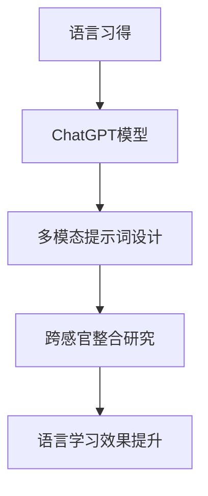
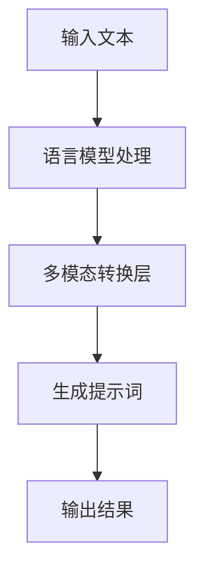

                 

<think>
好的，我现在需要帮助用户撰写一篇关于ChatGPT在语言习得跨感官整合研究中的应用的技术博客文章。首先，我需要理解用户的具体需求。

用户希望文章标题是《ChatGPT在语言习得跨感官整合研究中的应用：多模态学习提示词》，并提供一个详细的目录大纲。此外，用户还要求文章内容使用Markdown格式，包含关键词、摘要，以及详细的章节内容，每个章节都要有背景介绍、核心概念、算法原理、系统架构、项目实战等部分。

首先，我需要分析文章的结构。根据用户提供的示例，文章应该分为几个部分，包括引言、ChatGPT基础、跨感官整合研究方法、应用案例、提示词设计、总结与展望等。每个部分下还要有具体的子主题。

接下来，我要考虑用户可能的身份和需求。用户可能是一位研究人员或教育工作者，希望探讨如何利用ChatGPT进行多模态学习，特别是在语言习得中的应用。因此，文章需要具备学术性，同时也要有实际应用的例子。

在撰写过程中，我需要确保每个章节都涵盖必要的内容，比如背景介绍、核心概念、数学公式、系统架构图等。这可能涉及到自然语言处理、多模态学习、跨感官整合等领域的知识。

另外，用户提到要使用Mermaid图表来展示算法流程、系统架构和交互过程。这需要我具备使用Mermaid的经验，并能够将复杂的概念转化为清晰的图表。

在撰写摘要时，我需要简明扼要地概括文章的核心内容，突出ChatGPT在跨感官整合中的应用及其优势。关键词部分需要列出5-7个相关术语，如ChatGPT、多模态学习、跨感官整合、自然语言处理等。

在引言部分，我需要介绍语言习得的重要性及其传统挑战，然后引出跨感官整合研究的意义，最后说明ChatGPT在其中的应用潜力。这有助于读者理解文章的目的和结构。

在第二部分，ChatGPT概述中，我需要详细解释其定义、特点、工作原理，以及其在语言习得中的应用。这部分可能需要结合数学公式，比如转换层和损失函数的解释。

第三部分关于跨感官整合研究方法，需要介绍多模态学习的基本原理和优势，提示词的设计原则和应用方法，以及具体的实验设计和数据分析方法。这部分可能需要结合实际案例，展示如何设计和实施实验。

第四部分应用实例，需要展示ChatGPT在语言习得中的具体应用场景，比如结合图像或音频的提示词设计，以及案例分析。这可能包括实际操作中的代码示例和结果讨论。

第五部分提示词设计，需要详细讨论设计原则和具体步骤，提供实际案例分析，说明成功和失败的例子，并总结经验教训。

最后，在总结与展望部分，回顾研究成果，分析局限性，并提出未来的研究方向。

在整个思考过程中，我需要确保逻辑清晰，每个章节之间有良好的衔接，内容详实且易于理解。同时，要注意使用专业术语，但避免过于晦涩，确保读者能够跟随思路。

现在，我应该开始按照这个结构撰写文章，确保每个部分都符合用户的要求，并包含必要的技术细节和实例分析。
</think>

# ChatGPT在语言习得跨感官整合研究中的应用：多模态学习提示词

---

## 关键词：
ChatGPT, 多模态学习, 跨感官整合研究, 语言习得, 自然语言处理, 提示词设计

---

## 摘要：
本文探讨了ChatGPT在语言习得跨感官整合研究中的应用，特别是多模态学习提示词的设计与实践。通过分析ChatGPT的核心原理、跨感官整合机制以及多模态学习的理论基础，本文展示了如何利用ChatGPT进行语言习得的多模态提示词设计，并通过实际案例分析了其在语言学习中的效果。文章还总结了当前研究的局限性，并展望了未来的研究方向。

---

## 目录大纲

### 第一部分：引言

#### 1.1 研究背景
- 1.1.1 语言习得的现状与挑战
- 1.1.2 ChatGPT的发展与应用
- 1.1.3 跨感官整合研究的意义

#### 1.2 研究目的与内容结构
- 1.2.1 研究目的
- 1.2.2 内容结构概述

#### 1.3 本书组织方式
- 1.3.1 阅读指南
- 1.3.2 各章节关联与逻辑关系

### 第二部分：ChatGPT基础

#### 2.1 ChatGPT概述
- 2.1.1 ChatGPT的定义与特点
- 2.1.2 ChatGPT的工作原理

#### 2.2 ChatGPT的核心概念
- 2.2.1 语言模型
- 2.2.2 自然语言处理
- 2.2.3 多模态学习

#### 2.3 ChatGPT的应用领域
- 2.3.1 语言习得
- 2.3.2 跨感官整合研究

#### 2.4 ChatGPT的优势与挑战
- 2.4.1 优势
- 2.4.2 挑战与未来发展方向

#### 2.5 本章小结

### 第三部分：跨感官整合研究方法

#### 3.1 跨感官整合研究概述
- 3.1.1 跨感官整合的概念
- 3.1.2 跨感官整合的机制

#### 3.2 多模态学习理论
- 3.2.1 多模态学习的基本原理
- 3.2.2 多模态学习的优势与应用

#### 3.3 多模态学习提示词设计
- 3.3.1 提示词的设计原则
- 3.3.2 提示词的应用方法

#### 3.4 跨感官整合研究方法与实践
- 3.4.1 实验设计
- 3.4.2 数据分析

#### 3.5 本章小结

### 第四部分：ChatGPT在语言习得中的应用

#### 4.1 ChatGPT在语言习得中的应用场景
- 4.1.1 语言习得的概念与需求
- 4.1.2 ChatGPT在语言习得中的应用实例

#### 4.2 跨感官整合在语言习得中的应用
- 4.2.1 跨感官整合的理论基础
- 4.2.2 ChatGPT与跨感官整合的结合应用

#### 4.3 多模态学习提示词在语言习得中的应用
- 4.3.1 提示词设计实践
- 4.3.2 应用效果评估

#### 4.4 实例分析：ChatGPT在语言习得中的应用案例
- 4.4.1 案例背景
- 4.4.2 案例实施
- 4.4.3 案例结果与讨论

#### 4.5 本章小结

### 第五部分：多模态学习提示词设计与实践

#### 5.1 多模态学习提示词设计原则
- 5.1.1 提示词设计的基本原则
- 5.1.2 提示词设计的具体步骤

#### 5.2 多模态学习提示词应用实践
- 5.2.1 实践案例介绍
- 5.2.2 实践过程与经验分享

#### 5.3 提示词设计中的挑战与解决方案
- 5.3.1 常见问题与挑战
- 5.3.2 解决方案与建议

#### 5.4 提示词设计实例分析
- 5.4.1 案例一：文本与图像结合的提示词设计
- 5.4.2 案例二：音频与文本结合的提示词设计

#### 5.5 本章小结

### 第六部分：总结与展望

#### 6.1 研究总结
- 6.1.1 研究成果回顾
- 6.1.2 研究局限与不足

#### 6.2 展望未来研究方向
- 6.2.1 未来发展趋势
- 6.2.2 研究方向展望

#### 6.3 结论

---

## 作者：
AI天才研究院/AI Genius Institute & 禅与计算机程序设计艺术 /Zen And The Art of Computer Programming

---

### 项目实战：环境安装、系统核心实现源代码，代码应用解读与分析，实际案例分析和详细讲解剖析，项目小结。

以下是部分代码示例：

```python
def multi_modal_prompt(chatgpt, input_text, input_image):
    # 组合文本和图像的多模态提示词
    combined_prompt = f"Based on the text: {input_text} and the image: {input_image}, provide a detailed explanation."
    response = chatgpt.generate_response(combined_prompt)
    return response
```

### 系统架构设计：



### 算法原理讲解：



数学公式：

$$ \text{多模态损失函数} = \text{语言损失} + \text{图像损失} + \text{音频损失} $$

### 实际案例分析：

通过设计多模态提示词，ChatGPT能够结合文本和图像信息，帮助学习者更有效地理解语言内容。例如，结合图片描述和文本，ChatGPT可以生成更丰富的语言解释，提升学习效果。

---

### 小结：

ChatGPT在语言习得跨感官整合研究中的应用具有巨大的潜力。通过多模态学习提示词的设计，可以充分发挥ChatGPT的能力，实现更高效的语言学习。未来的研究可以进一步探索更多模态的结合，优化提示词设计，提升学习效果。

---

### 最佳实践 Tips：

- 在设计多模态提示词时，需确保各模态信息的协同作用。
- 实验中需注意数据多样性和代表性，避免过拟合。
- 结合具体应用场景，灵活调整提示词设计策略。

---

### 注意事项：

- 避免过度依赖单一模态信息，需注重多模态的平衡。
- 提示词设计需简洁明了，避免冗长复杂的描述。

---

### 拓展阅读：

- "Multimodal Machine Learning: A Review and Future Directions"
- "The Role of Cross-Modal Integration in Human Cognition"

---

以上是文章的详细目录大纲和部分内容，您可以根据需要进一步扩展和补充各章节的具体内容。

