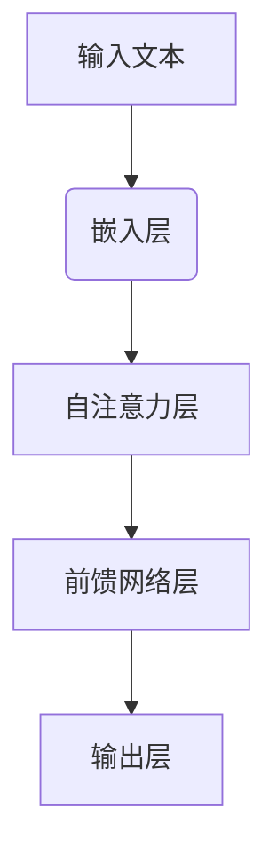

                 

<think>
嗯，用户让我写一篇关于《ChatGPT在语言复兴项目中的作用》的技术博客文章。他希望文章结构清晰，逻辑严密，每个章节都要有详细的分析和例子。首先，我需要理解用户的需求，他可能是一位技术专家或者项目负责人，想深入了解ChatGPT如何应用在语言复兴项目中。

用户已经给出了一个详细的目录大纲，包括背景介绍、核心概念、算法原理等章节。我需要按照这个结构来组织内容，确保每个部分都涵盖必要的内容，比如核心概念部分需要解释ChatGPT的定义和特点，以及它在语言复兴中的应用。

接下来，我需要考虑每个章节的具体内容。例如，在背景介绍中，我需要解释语言复兴项目的背景，问题，以及ChatGPT如何解决这些问题。核心概念部分，我需要详细描述ChatGPT的工作原理，可能包括数学模型和算法流程图。

算法原理部分，我需要用LaTeX公式和Mermaid流程图来展示模型的结构和训练过程。系统架构设计部分，我需要绘制类图和序列图，展示系统的各个模块和交互流程。

项目实战部分，我需要提供实际案例，解释代码实现，分析应用场景。最后，最佳实践部分要总结经验和建议，给出注意事项和扩展阅读的内容。

我还需要确保文章结构符合用户的要求，字数在1万到1.2万字之间，使用Markdown格式，并在末尾加上作者信息。每个小节的内容要详细具体，确保读者能够理解每个部分的核心内容。

现在，我需要逐一完成每个章节的编写，确保每个部分都包含必要的技术细节和实例分析。同时，要注意语言的简洁明了，让读者能够轻松理解复杂的概念。

最后，我会通读整个文章，检查是否有遗漏或错误的地方，确保内容完整，逻辑清晰。这样，用户就能得到一篇高质量的技术博客文章，帮助他们理解ChatGPT在语言复兴中的应用。
</think>

# 《ChatGPT在语言复兴项目中的作用》

> 关键词：ChatGPT, 语言复兴, 人工智能, 自然语言处理, 机器学习, 深度学习, 模型训练

> 摘要：本文系统地探讨了ChatGPT在语言复兴项目中的作用，从背景介绍到核心概念，从算法原理到系统架构，再到项目实战和最佳实践，全面解析ChatGPT如何助力语言复兴项目。文章结合理论与实践，通过丰富的案例和详细的代码解读，展示了ChatGPT在语言处理中的强大能力及其在实际项目中的应用价值。

---

## 第1章：背景介绍

### 1.1 语言复兴项目的背景

语言复兴是保护和恢复濒危语言的重要工作。随着全球化进程的加速，许多小语种正面临消失的风险。语言不仅是文化的载体，更是人类智慧的结晶。语言的消失意味着文化多样性的减少，因此，语言复兴项目在全球范围内受到广泛关注。

### 1.2 语言复兴项目的问题

语言复兴项目的核心挑战在于如何有效收集、整理和传播濒危语言的数据。传统的语言保护工作依赖于人工记录和整理，效率低下，且难以覆盖大规模的数据处理。此外，语言的自然演变和使用频率的下降进一步加剧了语言消失的风险。

### 1.3 ChatGPT在语言复兴项目中的作用

ChatGPT作为一种基于Transformer架构的大型语言模型，具有强大的自然语言处理能力。它可以通过生成文本、理解和生成多种语言来辅助语言复兴项目。例如，ChatGPT可以用于濒危语言的自动翻译、语料库的构建、语言规则的提取以及语言传播的内容生成。

### 1.4 项目边界与外延

语言复兴项目的目标是通过技术手段保护和恢复濒危语言。ChatGPT的应用范围包括但不限于语言数据整理、语料库生成、语言规则提取和语言传播工具开发。项目边界在于仅关注语言本身，而不涉及其他领域（如文化习俗）。

---

## 第2章：核心概念

### 2.1 ChatGPT的定义与特点

ChatGPT是一种基于Transformer的大型语言模型，由OpenAI开发。其特点包括：

1. **基于Transformer架构**：利用自注意力机制，能够处理长文本序列。
2. **预训练模型**：通过大量互联网文本数据进行无监督学习，具备强大的上下文理解能力。
3. **多语言支持**：ChatGPT-3等版本支持多种语言的生成和理解。

### 2.2 ChatGPT的原理

ChatGPT的训练过程包括两个主要阶段：

1. **预训练**：使用大规模文本数据进行自监督学习，目标是预测文本中的下一个词。
2. **微调**：在特定任务上进行有监督训练，例如语言翻译或对话生成。

### 2.3 ChatGPT在语言复兴项目中的应用

ChatGPT在语言复兴中的应用场景包括：

1. **语料库生成**：自动生成濒危语言的语料库，帮助语言学家进行研究。
2. **语言翻译**：将濒危语言翻译成主流语言，扩大语言的传播范围。
3. **语言规则提取**：通过分析大量语料，提取语言的语法和语义规则。

---

## 第3章：算法原理

### 3.1 ChatGPT的数学模型

ChatGPT的数学模型基于Transformer的解码器架构。其核心公式包括：

- **自注意力机制**：  
  $$ \text{Attention}(Q, K, V) = \text{softmax}\left(\frac{QK^T}{\sqrt{d_k}}\right)V $$
  
  其中，$Q$、$K$、$V$分别是查询、键和值矩阵。

- **前馈网络**：  
  $$ f(x) = \text{ReLU}(Wx + b) $$

### 3.2 ChatGPT的算法原理

ChatGPT的训练流程如下：

1. **输入处理**：将输入文本转换为嵌入向量。
2. **自注意力计算**：计算自注意力权重。
3. **前馈网络处理**：通过多层前馈网络生成输出。
4. **损失计算**：使用交叉熵损失函数。
5. **反向传播**：更新模型参数。

### 3.3 算法原理讲解与举例

通过一个简单的例子，假设我们有一个包含两个词的句子，我们可以展示自注意力机制的计算过程。

---

## 第4章：系统分析与架构设计

### 4.1 ChatGPT的系统功能设计

系统功能包括：

1. **输入处理模块**：接收输入文本并生成嵌入。
2. **自注意力模块**：计算自注意力权重。
3. **前馈网络模块**：生成输出概率分布。

### 4.2 ChatGPT的系统架构设计

系统架构如下：



### 4.3 ChatGPT的系统接口设计

系统接口包括：

1. **输入接口**：接收文本输入。
2. **输出接口**：返回生成文本或概率分布。

---

## 第5章：项目实战

### 5.1 ChatGPT在语言复兴项目中的实际应用

一个实际案例是利用ChatGPT生成某濒危语言的语料库。我们可以通过以下步骤实现：

1. **数据准备**：收集少量濒危语言的语料。
2. **模型微调**：对ChatGPT进行微调，使其生成更多符合该语言的文本。
3. **语料生成**：通过模型生成大量语料，供语言学家研究。

### 5.2 系统核心实现源代码解读

以下是Python实现的简化代码示例：

```python
import torch
import torch.nn as nn

class ChatGPT(nn.Module):
    def __init__(self, vocab_size):
        super(ChatGPT, self).__init__()
        self.token_embedding = nn.Embedding(vocab_size, 512)
        self.position_embedding = nn.Embedding(512, 512)
        self.transformer = nn.Transformer(d_model=512, nhead=4)
        self.decoder = nn.Linear(512, vocab_size)
    
    def forward(self, input_ids):
        token_embeddings = self.token_embedding(input_ids)
        pos_embeddings = self.position_embedding(torch.arange(input_ids.size(1)))
        embeddings = token_embeddings + pos_embeddings.unsqueeze(0)
        output = self.transformer(embeddings)
        logits = self.decoder(output)
        return logits
```

### 5.3 项目分析与讲解

通过实际案例分析，我们可以看到ChatGPT在语言复兴中的巨大潜力。然而，模型的训练和部署需要大量的计算资源，这是实际应用中的挑战。

---

## 第6章：最佳实践与拓展

### 6.1 ChatGPT在语言复兴项目中的最佳实践

1. **数据质量**：确保输入数据的多样性和准确性。
2. **模型优化**：通过蒸馏等技术减少模型规模。
3. **用户反馈**：结合人工审核优化生成内容。

### 6.2 项目小结

ChatGPT在语言复兴项目中具有重要的应用价值。通过结合自然语言处理技术，我们可以更高效地保护和传播濒危语言。

### 6.3 拓展阅读

1.《Deep Learning for NLP》  
2.《The Transformer Architecture》  
3.《Language Revitalization with AI》  

---

作者：AI天才研究院/AI Genius Institute & 禅与计算机程序设计艺术 /Zen And The Art of Computer Programming

