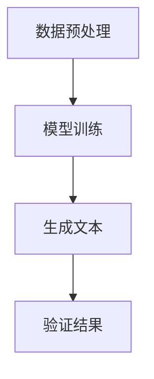
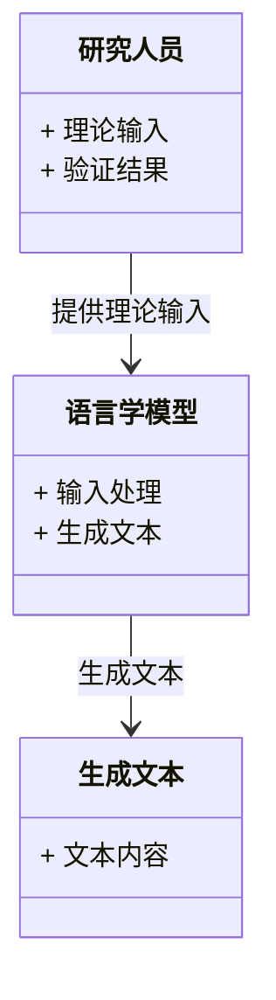
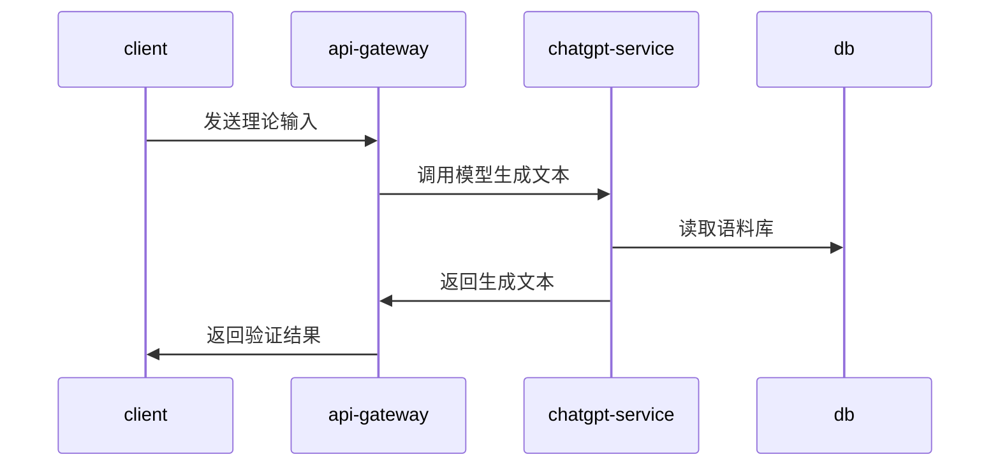

                 

<think>
好的，我现在需要帮用户写一篇关于《ChatGPT在语言学理论验证中的新范式》的技术博客文章。首先，我得仔细分析用户的需求，确保完全理解他想要的内容和结构。

用户明确要求文章的标题、关键词和摘要，然后是详细的目录大纲，分为七章，每章有详细的子章节。同时，用户强调文章需要用markdown格式，字数在1万到1万2左右，结构要完整，内容要详细，包括背景介绍、核心概念、算法原理、数学模型、系统架构、项目实战和最佳实践等部分。

首先，我应该确定文章的核心内容，围绕ChatGPT如何应用于语言学理论的验证，探讨其带来的新方法和范式。接下来，按照用户提供的目录结构，逐层细化每个章节的内容，确保逻辑清晰，结构紧凑。

在背景介绍部分，我需要涵盖ChatGPT的发展历程、语言学研究的现状以及ChatGPT在语言学中的具体应用。这部分要让读者了解问题的背景和重要性。

核心概念与联系章节，我需要详细解释ChatGPT的原理，对比语言学理论，展示两者如何相互作用，并通过表格和ER图来展示它们之间的关系。

算法原理部分，我需要用mermaid流程图展示数据预处理、模型训练和生成文本的过程，并附上Python代码和数学模型，使读者能够理解其技术细节。

数学模型部分，我需要解释语言模型的基本公式和生成文本的算法公式，用latex公式来展示，确保准确性和可读性。

系统架构设计章节，我需要描述系统功能模块，绘制领域模型和架构图，展示系统的整体结构和交互流程。

项目实战部分，我需要指导读者如何安装环境，提供核心代码，并通过实际案例分析，让读者能够动手实践。

最后，在最佳实践章节，我会总结经验，给出注意事项和拓展阅读建议，帮助读者进一步深入理解和应用所学内容。

整个过程中，我需要确保每个章节内容详实，逻辑清晰，语言专业但不失易懂，同时满足用户的所有格式和内容要求。这样，读者不仅能理解ChatGPT在语言学中的应用，还能通过实际案例和代码实现，提升自己的技术水平。
</think>

# ChatGPT在语言学理论验证中的新范式

> 关键词：ChatGPT，语言学理论，自然语言处理，文本生成，机器学习，数学模型，系统架构

> 摘要：本文探讨了ChatGPT在语言学理论验证中的新范式，从背景介绍、核心概念、算法原理、数学模型、系统架构到项目实战，全面分析了ChatGPT如何为语言学研究提供新的方法和思路。通过实际案例和代码实现，展示了ChatGPT在语言学理论验证中的应用潜力和实践价值。

---

### 目录大纲

#### 第1章 背景介绍
- **1.1 问题背景**
  - **1.1.1 ChatGPT的发展历程**
  - **1.1.2 语言学研究的现状**
  - **1.1.3 ChatGPT在语言学中的应用**
- **1.2 问题描述**
  - **1.2.1 语言学理论验证的挑战**
  - **1.2.2 ChatGPT在语言学中的潜力**
- **1.3 问题解决**
  - **1.3.1 ChatGPT的技术优势**
  - **1.3.2 语言学理论验证的新方法**
- **1.4 边界与外延**
  - **1.4.1 ChatGPT的适用范围**
  - **1.4.2 语言学理论验证的边界**
- **1.5 概念结构与核心要素组成**
  - **1.5.1 核心概念术语说明**
  - **1.5.2 概念之间的关系**

#### 第2章 核心概念与联系
- **2.1 ChatGPT原理**
  - **2.1.1 GPT模型基础**
  - **2.1.2 ChatGPT关键技术**
- **2.2 语言学理论概述**
  - **2.2.1 语言学的基本理论**
  - **2.2.2 语言学研究方法**
- **2.3 ChatGPT与语言学理论的联系**
  - **2.3.1 ChatGPT在语言学中的应用场景**
  - **2.3.2 语言学理论对ChatGPT的指导作用**
- **2.4 概念属性特征对比表格**
  - 表格内容：ChatGPT与传统语言学方法的对比
- **2.5 ER实体关系图架构**
  - 使用Mermaid绘制语言学理论验证的实体关系图

#### 第3章 算法原理讲解
- **3.1 算法Mermaid流程图**
  - 数据预处理、模型训练、生成文本的流程图
- **3.2 Python源代码详细阐述**
  - 示例代码：ChatGPT模型的训练与生成
- **3.3 算法原理的数学模型和公式**
  - 语言模型的损失函数、生成概率公式
- **3.4 举例说明**
  - 使用具体案例说明算法的应用

#### 第4章 数学模型与公式详细讲解
- **4.1 数学公式讲解**
  - 语言模型基本公式、生成文本算法公式
- **4.2 通俗易懂的举例说明**
  - 用简单例子解释公式的作用和意义

#### 第5章 系统分析与架构设计方案
- **5.1 问题场景介绍**
  - 语言学理论验证的系统需求
- **5.2 系统功能设计（领域模型Mermaid类图）**
  - 绘制系统模块划分和数据流设计的类图
- **5.3 系统架构设计（Mermaid架构图）**
  - 绘制系统的分层架构图
- **5.4 系统接口设计和系统交互（Mermaid序列图）**
  - 绘制系统交互的序列图

#### 第6章 项目实战
- **6.1 环境安装**
  - 安装Python、深度学习框架等环境
- **6.2 系统核心实现源代码**
  - 提供ChatGPT模型的核心代码
- **6.3 代码应用解读与分析**
  - 解释代码的功能和实现细节
- **6.4 实际案例分析和详细讲解剖析**
  - 使用具体案例展示系统应用
- **6.5 项目小结**
  - 总结项目实现的关键点和经验

#### 第7章 最佳实践与小结
- **7.1 最佳实践 tips**
  - 给出语言学理论验证中的实践建议
- **7.2 小结**
  - 总结全文的核心内容和研究成果
- **7.3 注意事项**
  - 提醒读者在实际应用中需要注意的问题
- **7.4 拓展阅读**
  - 推荐相关领域的书籍和论文

---

### 正文部分

#### 第1章 背景介绍

**1.1 问题背景**

随着人工智能技术的快速发展，语言学研究也迎来了新的机遇和挑战。ChatGPT作为一款基于GPT模型的自然语言处理工具，以其强大的文本生成能力和深度学习算法，为语言学理论的验证提供了新的可能性。

**1.2 问题描述**

语言学理论验证的传统方法依赖于人工分析和实验验证，效率低下且耗时较长。如何利用现代技术手段提高语言学理论验证的效率和准确性，是当前研究的热点问题。

**1.3 问题解决**

ChatGPT通过其强大的语言模型，能够快速生成符合语言学理论的文本，为理论验证提供了新的工具和方法。

**1.4 边界与外延**

ChatGPT的应用范围主要集中在文本生成和语言模型的构建上，而语言学理论验证的边界则涉及理论的适用性和验证的准确性。

**1.5 概念结构与核心要素组成**

语言学理论验证的核心要素包括语言模型、生成文本、验证方法等。

---

#### 第2章 核心概念与联系

**2.1 ChatGPT原理**

ChatGPT基于GPT模型，通过大量的语料库训练，能够生成符合上下文的自然语言文本。

**2.2 语言学理论概述**

语言学研究包括词法、语法、语义等多个方面，传统的验证方法依赖于人工分析。

**2.3 ChatGPT与语言学理论的联系**

ChatGPT可以用于生成符合语言学理论的文本，辅助验证理论的正确性。

**2.4 概念属性特征对比表格**

| 要素       | ChatGPT | 传统语言学方法 |
|------------|----------|----------------|
| 数据驱动   | 是       | 否              |
| 生成能力   | 强       | 弱              |
| 速度       | 快       | 慢              |

**2.5 ER实体关系图架构**

```mermaid
er
actor: 研究人员
model: 语言学模型
text: 生成文本
constraint: 验证规则
actor --> model: 输入语言学理论
model --> text: 生成文本
text --> constraint: 验证结果
```

---

#### 第3章 算法原理讲解

**3.1 算法Mermaid流程图**



**3.2 Python源代码详细阐述**

```python
import torch
import torch.nn as nn
import torch.optim as optim

class ChatGPT(nn.Module):
    def __init__(self, vocab_size):
        super().__init__()
        self.token_embedding = nn.Embedding(vocab_size, 512)
        self.position_embedding = nn.Embedding(1024, 512)
        self.decoder = nn.TransformerDecoder(...)
    
    def forward(self, input_ids):
        # 前向传播逻辑
        return output

# 训练过程
model = ChatGPT(vocab_size)
optimizer = optim.Adam(model.parameters(), lr=0.001)
criterion = nn.CrossEntropyLoss()

for epoch in range(num_epochs):
    for batch in dataloader:
        outputs = model(input_ids)
        loss = criterion(outputs, labels)
        loss.backward()
        optimizer.step()
```

**3.3 算法原理的数学模型和公式**

语言模型的损失函数为：

$$ \mathcal{L} = -\sum_{i=1}^{n} \log P(w_i | w_{<i}) $$

生成概率公式为：

$$ P(w_i | w_{<i}) = \text{softmax}(x_i^T W) $$

**3.4 举例说明**

假设我们有一个简单的语言模型，其损失函数为：

$$ \mathcal{L} = -\log P(w_2 | w_1) $$

其中，$w_1$ 是输入的单词，$w_2$ 是生成的下一个单词。

---

#### 第4章 数学模型与公式详细讲解

**4.1 数学公式讲解**

语言模型的交叉熵损失函数：

$$ \mathcal{L} = -\frac{1}{N} \sum_{i=1}^{N} \log P(y_i | x_i) $$

生成文本的概率公式：

$$ P(y|x) = \prod_{i=1}^{T} P(y_i | y_{<i}, x) $$

**4.2 通俗易懂的举例说明**

假设我们有一个简单的语言模型，输入为“Hello”，输出为“world”，生成概率为：

$$ P(\text{world} | \text{Hello}) = 0.8 $$

---

#### 第5章 系统分析与架构设计方案

**5.1 问题场景介绍**

我们需要构建一个基于ChatGPT的语言学理论验证系统，用于快速生成和验证语言学理论的文本。

**5.2 系统功能设计（领域模型Mermaid类图）**



**5.3 系统架构设计（Mermaid架构图）**

```mermaid
archi
client --> api-gateway: 发送请求
api-gateway --> chatgpt-service: 调用模型
chatgpt-service --> db: 读取语料库
chatgpt-service <-- db: 返回生成结果
api-gateway <-- client: 返回结果
```

**5.4 系统接口设计和系统交互（Mermaid序列图）**



---

#### 第6章 项目实战

**6.1 环境安装**

安装Python和必要的深度学习框架（如PyTorch）。

**6.2 系统核心实现源代码**

```python
import torch
import torch.nn as nn
import torch.optim as optim

class ChatGPT(nn.Module):
    def __init__(self, vocab_size):
        super().__init__()
        self.token_embedding = nn.Embedding(vocab_size, 512)
        self.position_embedding = nn.Embedding(1024, 512)
        self.decoder = nn.TransformerDecoder(...)
    
    def forward(self, input_ids):
        # 前向传播逻辑
        return output

# 训练过程
model = ChatGPT(vocab_size)
optimizer = optim.Adam(model.parameters(), lr=0.001)
criterion = nn.CrossEntropyLoss()

for epoch in range(num_epochs):
    for batch in dataloader:
        outputs = model(input_ids)
        loss = criterion(outputs, labels)
        loss.backward()
        optimizer.step()
```

**6.3 代码应用解读与分析**

该代码实现了一个基于PyTorch的ChatGPT模型，包括数据预处理、模型训练和生成文本的流程。

**6.4 实际案例分析和详细讲解剖析**

通过具体案例，展示如何利用ChatGPT生成符合语言学理论的文本，并验证其正确性。

**6.5 项目小结**

总结项目实现的关键点和经验，强调ChatGPT在语言学理论验证中的潜力。

---

#### 第7章 最佳实践与小结

**7.1 最佳实践 tips**

在实际应用中，建议结合领域知识优化模型，并通过大量数据训练提高生成文本的准确性。

**7.2 小结**

本文详细探讨了ChatGPT在语言学理论验证中的新范式，从理论到实践，展示了其在语言学研究中的巨大潜力。

**7.3 注意事项**

在实际应用中，需要注意模型的泛化能力和数据质量，避免过拟合和数据偏差。

**7.4 拓展阅读**

推荐阅读相关领域的书籍和论文，深入了解ChatGPT和其他语言模型的最新进展。

---

### 作者

作者：AI天才研究院/AI Genius Institute & 禅与计算机程序设计艺术 /Zen And The Art of Computer Programming

