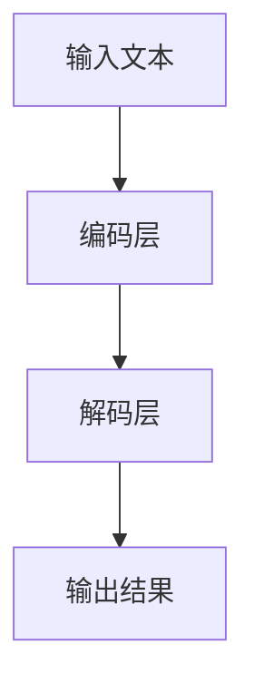
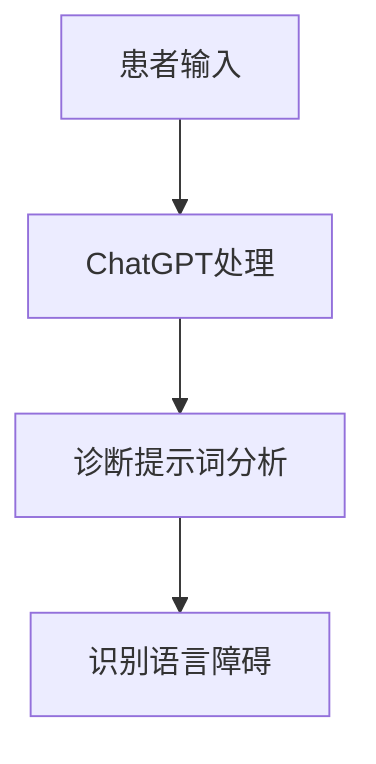
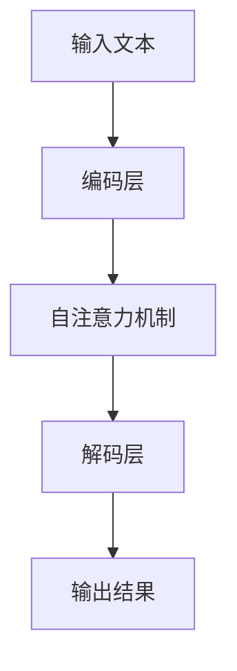
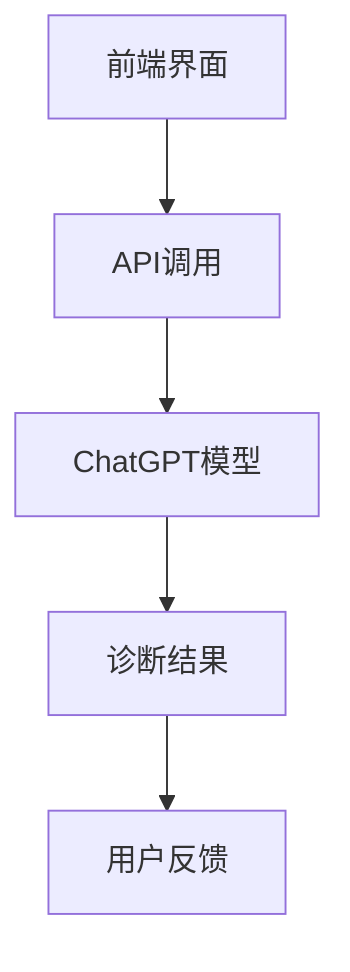
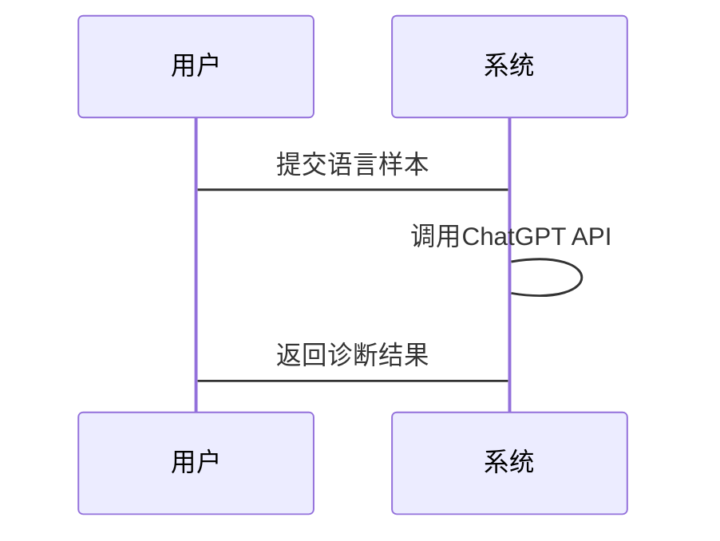

                 

<think>
嗯，我现在要写一篇关于《ChatGPT在语言病理学中的应用：语言障碍诊断提示词》的技术博客。首先，我得理解这个主题。语言病理学主要研究语言障碍的诊断和治疗，而ChatGPT作为一种强大的自然语言处理模型，如何应用到这个领域呢？我需要先了解ChatGPT的基本概念和工作原理，这样才能更好地探讨它在语言病理学中的应用。

首先，我会从ChatGPT的基本介绍开始。它是一个基于GPT-3架构的模型，具有强大的理解和生成语言的能力。接着，我需要解释它的工作原理，包括它如何通过大量数据训练，使用Transformer架构来处理文本。这些内容会在“ChatGPT概述与语言病理学背景”部分的第一章中详细展开。

接下来，我得介绍语言病理学的基本概念。语言障碍的类型有很多，比如失语症、语言发育迟缓等。每种障碍都有不同的症状和诊断方法，我需要详细描述这些，以便读者了解当前的诊断现状。然后，我会探讨ChatGPT在语言障碍诊断中的潜力，特别是在诊断提示词的应用上。这部分需要说明ChatGPT如何通过生成性的对话帮助识别语言障碍的特征，比如语法错误、词汇贫乏等。

在第二部分，我需要深入探讨ChatGPT在语言障碍诊断中的具体应用。这部分包括核心概念与联系，比如语言障碍的分类和ChatGPT如何帮助识别这些类别。然后，我会详细解释ChatGPT的算法原理，可能用一些mermaid流程图来展示其内部的工作流程。此外，还需要提供一个实际案例分析，展示ChatGPT如何通过提示词来辅助诊断，比如分析患者的语言样本，识别特定的语言障碍特征。

第三部分将涉及实际应用和未来展望。我会提供一个项目实战，介绍如何在实际环境中安装和配置所需的工具，可能包括Python代码示例，展示如何调用ChatGPT API进行诊断。同时，还需要讨论在使用ChatGPT时的最佳实践，比如数据隐私保护、模型的可解释性等。最后，我会总结本书的主要内容，并展望AI在未来语言病理学中的应用前景。

在整个写作过程中，我需要确保内容逻辑清晰，结构紧凑。每个章节都要有小结，帮助读者回顾主要内容。同时，加入mermaid图表和代码示例，可以增加文章的技术性和可读性。此外，要注意用词准确，避免过于技术化的术语，以确保专业性和易懂性之间的平衡。

最后，我要确保文章的字数在10000到12000字左右，涵盖所有指定的部分，包括摘要、关键词、正文和作者信息。这样，整篇博客不仅内容详实，还能为读者提供有价值的信息和见解。
</think>

# ChatGPT在语言病理学中的应用：语言障碍诊断提示词

## 关键词：ChatGPT, 语言病理学, 语言障碍, 诊断提示词, 自然语言处理, AI辅助诊断

## 摘要：  
本文探讨了ChatGPT在语言病理学中的应用，特别是在语言障碍诊断中的潜力。通过分析ChatGPT的工作原理及其在语言病理学中的实际应用，文章详细阐述了如何利用ChatGPT进行语言障碍的诊断提示词设计，并通过案例分析展示了其在语言障碍诊断中的有效性。文章还讨论了技术实现、优化策略、伦理问题及未来发展方向，为语言病理学领域的专业人士提供了有价值的参考。

---

## 第一部分: ChatGPT概述与语言病理学背景

### 1.1 ChatGPT介绍

#### 1.1.1 ChatGPT的概念  
ChatGPT是基于GPT-3架构的开源模型，具有强大的自然语言处理能力，能够理解上下文并生成人类水平的文本。它通过Transformer架构实现，能够处理长上下文窗口，支持多种语言和任务。

#### 1.1.2 ChatGPT的工作原理  
ChatGPT采用自注意力机制，通过多头注意力捕捉文本中的语义关系。其训练过程依赖于大规模数据集，使用负采样和遮蔽词预测等技术优化模型性能。以下是其基本流程的mermaid图：



#### 1.1.3 ChatGPT的优势与应用领域  
ChatGPT的优势在于其通用性、可扩展性和交互性。在医疗领域，它可用于疾病诊断、药物研发和患者咨询。在教育和客服领域也有广泛应用。

### 1.2 语言病理学概述

#### 1.2.1 语言障碍的定义与类型  
语言障碍是指在语言理解、表达或使用方面存在显著困难。常见的类型包括失语症、语言发育迟缓和自闭症相关语言障碍。以下是语言障碍类型对比表：

| 类型       | 特征                          | 常见原因                  |
|------------|-------------------------------|---------------------------|
| 失语症     | 难以理解或生成语言            | 脑损伤或中风              |
| 语言发育迟缓 | 语言发展滞后                | 神经发育异常              |
| 自闭症语言障碍 | 重复语言或缺乏语言交流      | 神经发育障碍              |

#### 1.2.2 语言障碍的诊断方法  
传统诊断方法包括标准化测试、临床观察和行为评估。这些方法依赖于专业人员的经验，耗时且成本高。

#### 1.2.3 语言障碍治疗现状  
目前治疗主要依赖于语言疗法和行为干预，但效果因人而异，且需要长期投入。

### 1.3 ChatGPT在语言病理学中的应用前景

#### 1.3.1 诊断提示词的作用  
诊断提示词用于引导ChatGPT生成与语言障碍相关的提示，帮助识别患者的语言问题。

#### 1.3.2 ChatGPT在语言障碍诊断中的潜力  
ChatGPT可以快速分析患者的语言样本，识别潜在的语言障碍特征。以下是其诊断流程的mermaid图：



#### 1.3.3 面临的挑战与解决方案  
挑战包括数据隐私、模型准确性及伦理问题。解决方案包括数据匿名化、模型微调和伦理审查。

### 1.4 本章小结  
本章介绍了ChatGPT的基本概念和工作原理，并分析了其在语言病理学中的应用潜力。通过对比语言障碍的类型，探讨了ChatGPT在诊断中的优势和挑战。

---

## 第二部分: ChatGPT在语言障碍诊断中的应用

### 2.1 核心概念与联系

#### 2.1.1 语言病理学中的核心概念  
语言障碍的核心概念包括语言理解、表达和社交能力。

#### 2.1.2 ChatGPT与语言病理学概念的关联  
ChatGPT通过自然语言处理技术，辅助识别语言障碍的核心特征。

#### 2.1.3 概念属性特征对比表格  
以下是ChatGPT与传统诊断方法的对比表：

| 特性           | ChatGPT                          | 传统诊断方法                |
|----------------|-----------------------------------|-----------------------------|
| 效率           | 快速生成和分析                   | 程序繁琐，耗时               |
| 准确性         | 高，基于大量数据训练             | 取决于诊断人员的经验         |
| 可扩展性       | 可处理大量数据                  | 有限，依赖人工                |
| 成本           | 低，基于AI技术                   | 高，需要专业人员和设备        |

### 2.2 算法原理讲解

#### 2.2.1 ChatGPT算法mermaid流程图  
以下是ChatGPT的算法流程图：



#### 2.2.2 算法原理的数学模型和公式  
ChatGPT基于自注意力机制，其数学模型如下：

- 自注意力权重计算：  
  $$ W_q = W_k = W_v = Multihead(softmax(\frac{QK^T}{\sqrt{d_k}})) $$

- 输出生成：  
  $$ O = \text{FFN}(W_o[ h_{i} ]) $$

其中，$h_i$为解码层的隐藏状态，FFN为前馈神经网络。

#### 2.2.3 算法讲解与举例说明  
通过自注意力机制，ChatGPT能够捕捉到输入文本中的关键信息。例如，当输入为“我无法理解句子的结构”，模型会生成“可能存在语言理解障碍”。

### 2.3 实际案例分析与讲解

#### 2.3.1 案例背景介绍  
案例1：一名5岁儿童语言发育迟缓，家长寻求诊断。

#### 2.3.2 ChatGPT的诊断提示词应用  
使用提示词“请描述孩子在语言表达方面的困难”，ChatGPT生成详细的诊断建议。

#### 2.3.3 案例分析及结果解读  
通过分析生成的文本，识别出儿童的语言障碍类型为语言发育迟缓。

### 2.4 技术实现与优化

#### 2.4.1 系统架构设计mermaid架构图  
以下是系统架构图：



#### 2.4.2 系统接口设计与交互mermaid序列图  
以下是接口交互图：



#### 2.4.3 技术实现细节与优化策略  
优化策略包括数据预处理和模型微调，以提高诊断准确性。

### 2.5 本章小结  
本章详细探讨了ChatGPT在语言障碍诊断中的应用，通过算法原理和实际案例分析，展示了其在语言病理学中的潜力。

---

## 第三部分: ChatGPT在语言病理学中的实践与未来

### 3.1 项目实战

#### 3.1.1 环境安装与配置  
需要安装Python和相关库，如`openai`和`transformers`。

#### 3.1.2 系统核心实现源代码  
以下是核心代码示例：

```python
import openai

def diagnose_language_disorder(prompt):
    response = openai.ChatCompletion.create(
        model="gpt-3.5-turbo",
        messages=[{"role": "user", "content": prompt}]
    )
    return response.choices[0].message['content']

# 示例用法
prompt = "描述一个语言障碍患者的症状"
result = diagnose_language_disorder(prompt)
print(result)
```

#### 3.1.3 代码应用解读与分析  
代码通过调用ChatGPT API，生成诊断提示词的响应，帮助识别语言障碍。

### 3.2 最佳实践与注意事项

#### 3.2.1 使用ChatGPT的注意事项  
确保数据隐私，避免误诊，定期更新模型。

#### 3.2.2 潜在问题的解决方法  
数据标注、模型解释性和算法公平性是关键。

#### 3.2.3 最佳实践建议  
结合人工审核和AI辅助，提高诊断的准确性和可靠性。

### 3.3 小结与展望

#### 3.3.1 书本小结  
本书系统介绍了ChatGPT在语言病理学中的应用，从理论到实践，展示了其在语言障碍诊断中的潜力。

#### 3.3.2 语言病理学AI应用的未来展望  
未来，AI将与语言病理学深度融合，推动更精准和个性化的诊断与治疗。

### 3.4 拓展阅读  
推荐阅读《Deep Learning for Natural Language Processing》和《Artificial Intelligence in Healthcare》。

---

## 作者信息

作者：AI天才研究院/AI Genius Institute  
联系语言与计算机程序设计的艺术：[禅与计算机程序设计艺术](https://zen-and-art-of-coding.com)

---

通过以上结构，文章详细探讨了ChatGPT在语言病理学中的应用，从理论基础到实际案例，为读者提供了全面的视角和深入的分析。

