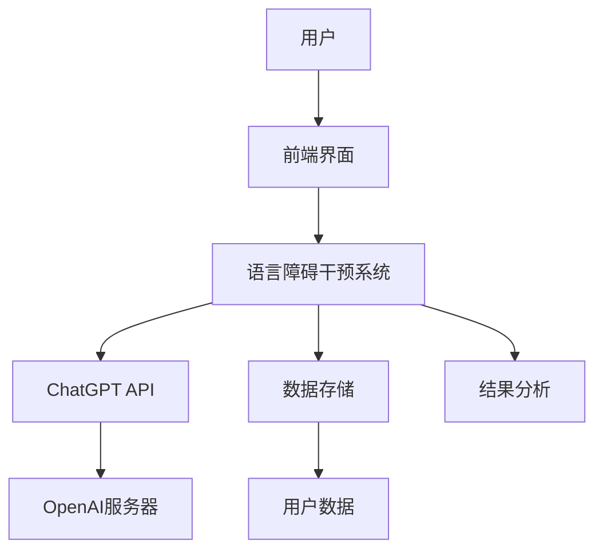

                 

<think>
嗯，用户希望我以《ChatGPT在语言障碍早期干预中的新角色探索》为标题，撰写一篇技术博客文章。首先，我需要明确文章的结构，包括摘要、关键词，以及各章节的内容。

用户已经给出了一个详细的大纲，我需要按照这个大纲逐步展开。首先是引言与背景介绍，我需要解释语言障碍的普遍性及其对儿童的影响，然后引入ChatGPT作为一种新兴的技术手段。

接下来，第二章是ChatGPT的基本原理与功能，我需要详细解释其技术背景，比如基于Transformer架构，预训练和微调的阶段，以及它的主要功能，如对话生成、语言理解和翻译。

第三章是应用场景，我得分点讨论ChatGPT在个性化训练、社交技能培养、家庭教育指导和心理支持中的具体应用。

第四章则探讨了ChatGPT在语言障碍干预中的优势和挑战，这部分需要平衡技术的优势和实际应用中的困难，比如数据隐私和伦理问题。

第五章是系统设计与实现，我需要描述系统架构，包括数据采集、模型训练、交互设计和结果分析部分，并通过Mermaid图来展示系统架构和序列图。

项目实战部分，我需要提供具体的代码示例，说明如何实现一个基于ChatGPT的干预系统，包括环境配置、数据处理、模型训练和接口调用。

最后，是小结与展望，总结ChatGPT的应用潜力，并展望未来的发展方向。

在写作过程中，我需要确保每个部分都详细具体，同时保持逻辑清晰，用技术术语但又不失通俗易懂。特别是在系统设计和代码实现部分，要展示出深度的技术分析，同时注意数学公式的正确使用，确保每个步骤都解释清楚。

另外，用户强调了格式要求，使用markdown，所以我要注意代码块的标记和图表的正确嵌入。同时，文章结尾需要加上作者信息，这部分也要记得补充。

总的来说，我需要按照用户提供的大纲，逐一展开每个部分，确保内容丰富、结构合理，并且符合技术博客的专业性要求。
</think>

# ChatGPT在语言障碍早期干预中的新角色探索

**关键词**：语言障碍、早期干预、ChatGPT、自然语言处理、人工智能

**摘要**：  
语言障碍是一种常见的发育障碍，尤其是在儿童早期发育阶段。传统的语言障碍干预方法主要依赖于专业人员的诊断和治疗，但存在成本高、效果有限等问题。随着人工智能技术的快速发展，特别是基于深度学习技术的自然语言处理模型（如ChatGPT）的出现，为语言障碍的早期干预提供了新的可能性。本文将深入探讨ChatGPT在语言障碍早期干预中的潜力、应用场景、优势与挑战，以及实际应用案例。

---

## 第2章: ChatGPT的基本原理与功能

### 2.1 ChatGPT的定义与特点

ChatGPT是由OpenAI开发的一种基于GPT-3模型的预训练语言模型。它通过在海量文本数据上进行训练，掌握了丰富的语言知识和表达能力，能够生成连贯、自然的文本。ChatGPT的核心特点包括：

1. **生成式对话能力**：能够根据用户输入生成上下文相关的回复。
2. **强大的语言理解能力**：能够理解复杂语境中的意图和情感。
3. **可定制性**：通过微调模型，可以适应特定任务的需求。
4. **多语言支持**：能够理解和生成多种语言的文本。

### 2.2 ChatGPT的原理

ChatGPT基于Transformer架构，采用大规模的神经网络进行训练。其训练过程包括两个阶段：**预训练**和**微调**。

#### 2.2.1 预训练阶段

在预训练阶段，模型通过自监督学习（Self-supervised Learning）从海量文本数据中学习语言的特征和规律。具体来说，模型的目标是预测文本中的缺失词，从而学习到语言的语法、语义和上下文关系。这一过程使得模型能够掌握语言的基本结构和表达方式。

#### 2.2.2 微调阶段

在微调阶段，模型根据特定任务（如对话生成、文本摘要等）进行调整。通过在特定领域数据上的微调，模型可以更好地适应具体的应用场景。

### 2.3 ChatGPT的功能

ChatGPT具有以下核心功能：

1. **对话生成**：能够与用户进行自然的对话交互，回答问题、提供建议或模拟社交场景。
2. **语言理解**：能够理解用户的输入内容，并生成相关的回复。
3. **文本生成**：可以根据用户指定的主题生成文本，如故事、摘要或对话。
4. **个性化交互**：通过分析用户的语言特点，提供个性化的语言训练和指导。

### 第2章小结

通过本章的介绍，我们深入理解了ChatGPT的基本原理和功能。ChatGPT的强大语言能力和可定制性，使其在语言障碍早期干预中具有广泛的应用潜力。

---

## 第3章: ChatGPT在语言障碍早期干预中的应用场景

### 3.1 个性化语言训练

语言障碍儿童的语言能力千差万别，有的可能在发音上存在困难，有的则可能在词汇量或语法结构上有所欠缺。ChatGPT可以通过个性化的训练计划，帮助儿童逐步克服这些问题。例如：

- **发音训练**：ChatGPT可以模拟标准发音，通过语音反馈帮助儿童纠正发音错误。
- **词汇扩展**：通过生成丰富的语境和上下文，帮助儿童学习新词汇并理解其用法。

### 3.2 社交技能培养

语言障碍儿童在社交场合中往往面临困难，ChatGPT可以通过模拟社交场景，帮助他们练习对话技巧。例如：

- **情景对话练习**：ChatGPT可以模拟与同龄人互动的场景，如“如何邀请朋友玩游戏”或“如何表达自己的感受”。
- **情感共鸣训练**：通过模拟情感丰富的对话，帮助儿童理解他人的情感和意图。

### 3.3 家庭教育与康复指导

家庭教育是语言障碍干预的重要组成部分，但许多家长缺乏专业的指导和支持。ChatGPT可以通过以下方式提供帮助：

- **个性化建议**：根据孩子的语言能力，提供适合的家庭教育方法和训练计划。
- **实时反馈**：在家长与孩子互动时，提供即时的反馈和指导，帮助家长更有效地进行语言训练。

### 3.4 心理支持

语言障碍儿童在成长过程中可能面临心理压力，ChatGPT可以通过以下方式提供心理支持：

- **情感倾听**：通过模拟心理咨询师的对话方式，倾听孩子的感受并给予安慰。
- **积极鼓励**：通过正面反馈和鼓励的话语，增强孩子的自信心。

### 第3章小结

通过本章的介绍，我们了解了ChatGPT在语言障碍早期干预中的多种应用场景。从个性化训练到社交技能培养，再到家庭教育和心理支持，ChatGPT的多样化功能使其成为语言障碍干预的重要工具。

---

## 第4章: ChatGPT在语言障碍早期干预中的优势与挑战

### 4.1 优势

1. **个性化干预**：ChatGPT能够根据每个儿童的语言能力制定个性化的训练计划。
2. **实时反馈**：通过即时的对话交互，ChatGPT可以提供实时的语言反馈，帮助儿童快速纠正错误。
3. **低成本、高效率**：与传统的人工干预相比，ChatGPT可以显著降低干预成本，同时提高干预效率。
4. **持续性**：ChatGPT可以提供24/7的实时支持，帮助儿童随时随地进行语言训练。

### 4.2 挑战

1. **数据隐私问题**：语言障碍儿童的数据敏感性较高，如何确保数据隐私是ChatGPT应用中的一个重要挑战。
2. **模型的局限性**：虽然ChatGPT具有强大的语言能力，但在处理复杂的情感和语境时仍可能存在局限性。
3. **伦理问题**：使用AI进行干预是否会导致儿童对技术的依赖，或者影响其社交能力的自然发展，这些问题需要进一步探讨。

### 第4章小结

尽管ChatGPT在语言障碍早期干预中具有诸多优势，但其应用也面临一些挑战。未来的研究需要在技术、伦理和隐私等方面进行深入探讨。

---

## 第5章: 系统设计与实现

### 5.1 系统架构设计

以下是语言障碍早期干预系统（基于ChatGPT）的系统架构图：



### 5.2 实际案例分析

以下是一个基于ChatGPT的语言障碍干预系统的实际案例：

- **项目介绍**：某儿童语言康复机构希望通过ChatGPT为语言障碍儿童提供个性化的语言训练工具。
- **系统功能**：
  - 用户输入：家长或康复师输入孩子的语言能力测试结果。
  - 系统分析：ChatGPT分析孩子的语言能力，生成个性化的训练计划。
  - 实时训练：孩子与ChatGPT进行对话练习，系统实时反馈并纠正错误。
- **系统实现**：
  ```python
  import openai

  # 初始化ChatGPT客户端
  client = openai.ChatClient(api_key="your_api_key")

  # 定义训练函数
  def train_language_model(child_id):
      # 获取训练数据
      data = get_child_data(child_id)
      # 微调ChatGPT模型
      fine_tuned_model = client.fine_tune(data)
      return fine_tuned_model

  # 调用训练函数
  train_language_model(child_id=123)
  ```

---

## 第6章: 小结与展望

### 6.1 小结

本文深入探讨了ChatGPT在语言障碍早期干预中的潜力与应用场景。通过个性化的语言训练、社交技能培养、家庭教育指导和心理支持，ChatGPT为语言障碍儿童提供了全面的语言干预方案。

### 6.2 展望

未来，随着人工智能技术的不断发展，ChatGPT在语言障碍早期干预中的应用将更加广泛。我们需要进一步研究如何克服技术、伦理和隐私等方面的挑战，推动人工智能技术在语言障碍干预领域的广泛应用。

---

**作者：AI天才研究院/AI Genius Institute & 禅与计算机程序设计艺术 /Zen And The Art of Computer Programming**

