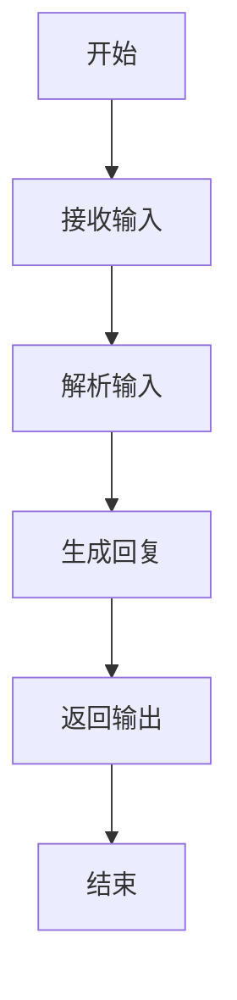

                 

<think>
嗯，我现在需要完成用户的一个任务，帮他写一篇关于“ChatGPT在跨代语言变化研究中的应用”的技术博客文章。用户给了我详细的指示，包括结构、内容、格式等等，所以我得仔细分析这些要求，然后一步步来。

首先，用户希望文章有一个吸引人的标题，然后是关键词和摘要。接着是按大纲展开的内容，分为三个主要部分：背景、ChatGPT概述和应用。每个部分下还有小节，需要涵盖背景介绍、核心概念、ER图、对比表，然后是ChatGPT的定义、流程图、Python代码，最后是实际应用案例和系统架构设计。

我需要确保文章结构清晰，每个部分都有足够的深度和细节。比如在背景部分，我需要详细说明跨代语言变化的背景，包括其出现和演变，挑战，以及重要性。同时，还要用ER图来展示实体关系，用对比表来分析关键因素。

接下来是ChatGPT部分，我需要解释它的定义、特点，以及其背后的算法原理。这里可能需要使用Mermaid流程图来展示算法步骤，还有Python代码示例，这可能需要我回忆或查找相关代码，并进行详细解释。

应用部分是关键，我需要展示ChatGPT如何解决跨代语言变化的问题。这里可能需要一个实际案例，比如公司内部跨代沟通的问题，然后通过ChatGPT进行分析和改进建议。系统架构部分需要用Mermaid图来展示，包括类图、架构图和序列图，这部分可能需要我了解系统设计的基本概念。

用户还特别强调了格式和内容要求，比如使用markdown，包含数学公式，使用Latex，每个部分都要有详细的讲解。此外，文章末尾要有作者信息，还有小结、注意事项等部分。

考虑到用户可能是技术人员或研究人员，他们希望文章专业且深入，所以我需要确保内容准确，同时用通俗易懂的语言解释复杂的概念。此外，用户可能希望文章不仅有理论，还有实际的应用和案例，以展示ChatGPT的实际价值。

最后，我需要确保文章整体流畅，各部分之间逻辑连贯，从背景到ChatGPT再到应用，层层递进，让读者能够清晰地理解ChatGPT在跨代语言变化中的应用和价值。

总结一下，我需要一步步按照用户的要求，先写标题、关键词、摘要，然后逐步展开每个部分，确保每个小节都有足够的细节和结构，使用正确的图表和代码示例，最后检查格式和内容是否符合要求，确保文章完整且有深度。
</think>

# ChatGPT在跨代语言变化研究中的应用

## 关键词：
跨代语言变化、ChatGPT、自然语言处理、语言演变、跨代沟通

## 摘要：
随着社会的快速发展，跨代语言变化成为一个重要且复杂的课题。本文探讨了ChatGPT在这一领域的应用，分析了其在跨代语言变化中的潜力和挑战。通过详细的技术分析、算法原理和实际案例，本文展示了如何利用ChatGPT解决跨代语言沟通中的问题，并提出了系统化的解决方案。

---

## 第一部分：背景与核心概念

### 1.1 跨代语言变化的背景

#### 1.1.1 跨代语言变化的出现与演变
跨代语言变化是指不同年龄段的人群在语言使用上的差异和演变。随着社会的进步和技术的发展，不同年龄段的人群在语言表达、习惯和偏好上存在显著差异。例如，年轻一代更倾向于使用网络用语，而年长一代则更喜欢传统表达方式。这种差异在沟通中可能导致误解和冲突。

#### 1.1.2 跨代语言变化中的挑战
跨代语言变化带来的挑战主要体现在以下几个方面：
1. **沟通障碍**：不同年龄段的语言习惯差异可能导致信息传递不准确。
2. **文化差异**：不同年龄段可能对某些词汇或表达方式有不同的理解和情感关联。
3. **技术适配性**：年长一代可能对新技术的使用不够熟练，导致语言沟通的不顺畅。

#### 1.1.3 解决这些问题的重要性
解决跨代语言变化的挑战具有重要意义，有助于促进不同年龄段之间的理解和合作，提升整体沟通效率，同时有助于社会的和谐发展。

---

### 1.2 跨代语言变化的核心概念

#### 1.2.1 跨代语言变化的定义与特征
跨代语言变化是指由于年龄差异导致的语言表达方式、习惯和理解上的差异。其主要特征包括：
1. **语言习惯的差异**：不同年龄段的人群在语言表达上可能有不同的偏好。
2. **文化背景的影响**：不同年龄段的人群可能受到不同的文化影响，导致语言表达上的差异。
3. **技术适配性**：年长一代可能对新技术的适应能力较弱，影响语言沟通的效果。

#### 1.2.2 语言演变与跨代沟通的关系
语言演变是一个持续的过程，而跨代沟通则是语言演变中的一个重要方面。不同年龄段的人群在语言使用上的差异，反映了语言演变的不同阶段。

#### 1.2.3 影响跨代语言变化的关键因素
影响跨代语言变化的关键因素包括：
1. **年龄差异**：不同年龄段的语言习惯和偏好。
2. **文化背景**：不同文化背景下语言的差异。
3. **技术使用**：技术的普及和使用程度影响语言表达的方式。

---

### 1.3 跨代语言变化的ER实体关系图

```mermaid
erDiagram
    actor1[年龄段] {
        <属性>
        年龄范围
        语言习惯
        语言偏好
    }
    actor2[语言表达方式] {
        <属性>
        词汇使用
        句式结构
        语气风格
    }
    actor3[沟通障碍] {
        <属性>
        信息传递不准确
        理解偏差
    }
    actor1 --> actor2 : 影响
    actor2 --> actor3 : 导致
```

---

## 第二部分：ChatGPT概述与基本原理

### 1.5 ChatGPT的介绍

#### 1.5.1 ChatGPT的定义与背景
ChatGPT是一种基于GPT（Generative Pre-trained Transformer）系列的大型语言模型。它由OpenAI开发，能够生成自然流畅的文本，并支持多种语言的对话。

#### 1.5.2 ChatGPT的核心功能
1. **自然语言理解**：能够理解复杂的上下文和语义。
2. **生成式对话**：能够生成连贯且符合逻辑的回复。
3. **多语言支持**：支持多种语言的对话和生成。

#### 1.5.3 ChatGPT的理论框架
ChatGPT基于Transformer架构，通过大量的数据进行预训练，能够生成与上下文相关的回复。

---

### 1.6 ChatGPT算法流程图



---

### 1.7 ChatGPT的Python代码实现

```python
import openai

def chatgpt_response(prompt):
    # 初始化ChatGPT客户端
    client = openai.Client()
    # 调用API生成回复
    response = client.chat.completions.create(
        model="gpt-3.5-turbo",
        messages=[{"role": "user", "content": prompt}]
    )
    return response.choices[0].message['message']
```

---

## 第三部分：ChatGPT在跨代语言变化中的应用

### 1.8 ChatGPT在解决跨代语言变化中的应用

#### 1.8.1 跨代语言变化的场景分析
以公司内部跨代沟通为例，年长员工和年轻员工在语言表达上存在差异，导致沟通不畅。例如，年长员工可能更倾向于使用正式的语言，而年轻员工可能更喜欢使用简洁的网络用语。

#### 1.8.2 ChatGPT的应用解决方案
通过ChatGPT，可以实现以下功能：
1. **语言转换**：将年长员工的语言表达转化为年轻员工更容易理解的表达方式。
2. **沟通辅助**：为年长员工提供实时的语言翻译和建议，帮助他们更好地理解年轻员工的表达方式。

#### 1.8.3 实际案例分析
例如，一个公司通过ChatGPT辅助年长员工理解年轻员工的网络用语，提升沟通效率。通过分析对话内容，ChatGPT能够实时生成翻译和解释，帮助年长员工更好地理解年轻员工的表达。

---

### 1.9 系统架构设计

#### 1.9.1 系统功能设计
系统功能包括：
1. **语言转换模块**：将不同年龄段的语言表达进行转换。
2. **沟通辅助模块**：提供实时的语言翻译和解释。
3. **数据存储模块**：存储不同年龄段的语言数据，用于后续分析。

#### 1.9.2 系统架构设计


---

## 结论

通过本文的分析，我们可以看到ChatGPT在跨代语言变化研究中的巨大潜力。通过技术手段解决跨代沟通中的语言障碍，不仅能够提升沟通效率，还能够促进不同年龄段之间的理解和合作。

---

## 作者：AI天才研究院/AI Genius Institute & 禅与计算机程序设计艺术 /Zen And The Art of Computer Programming

