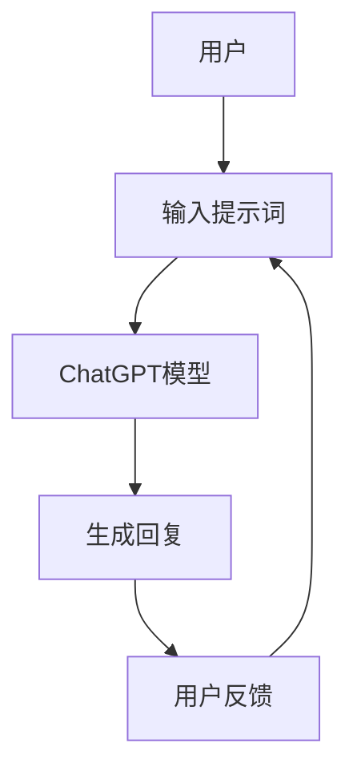
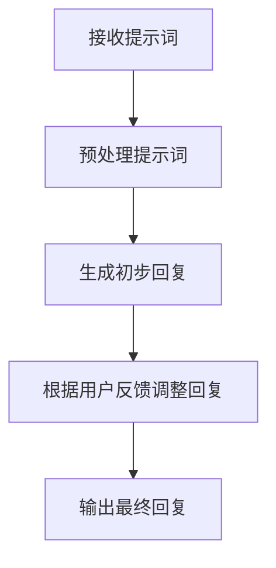
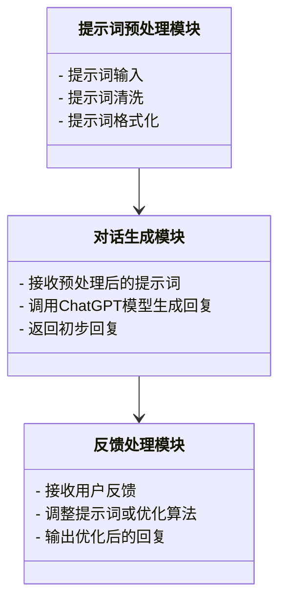
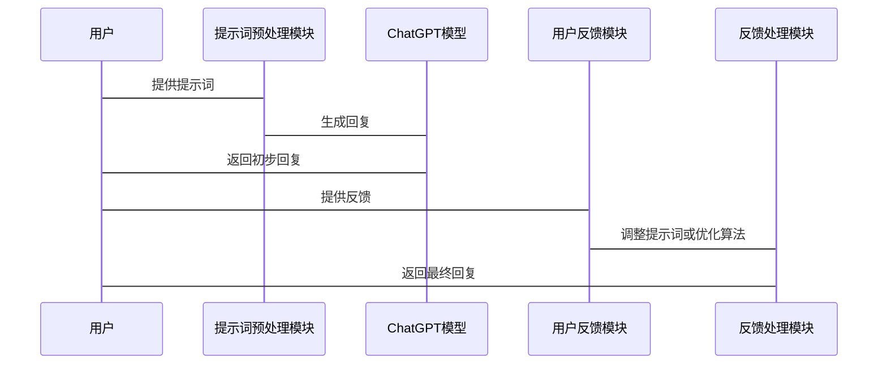

                 

<think>
好的，我现在需要根据用户的要求，撰写一篇关于《ChatGPT对话优化：提示词的潜力与应用》的技术博客文章。用户已经提供了详细的大纲，我需要按照这个大纲逐步进行思考和撰写。

首先，我需要理解用户的需求。他们希望这篇文章结构清晰，逻辑严密，内容专业，同时涵盖背景介绍、核心概念、算法原理、数学模型、系统架构、项目实战以及最佳实践等多个方面。用户还特别强调使用Mermaid图和数学公式来辅助说明，并在每个部分提供详细的解释和例子。

接下来，我需要按照用户提供的大纲逐步展开每个部分。首先是标题和关键词，然后是摘要，之后是正文部分。我要确保每个章节的内容都完整、详细，并且符合字数要求。

在撰写背景介绍时，我需要解释为什么优化ChatGPT的提示词重要，以及它在实际应用中的挑战。这部分需要简洁明了，帮助读者理解问题的背景和重要性。

核心概念部分，我需要详细定义提示词、ChatGPT模型和优化算法，并通过表格和Mermaid图展示它们之间的关系。这部分要确保概念清晰，图表准确，帮助读者建立正确的理解。

算法原理讲解部分，我需要使用Mermaid流程图和Python代码来展示优化的步骤。同时，数学公式要准确无误，例子要通俗易懂，帮助读者理解算法的工作原理。

数学模型部分，我需要详细推导公式，解释每个步骤的意义，并通过实际例子来说明模型的应用。这部分需要严谨，同时避免过于复杂的数学推导，保持易懂。

系统架构部分，我需要设计一个清晰的架构图，展示系统的各个模块及其交互。接口设计和交互流程图也要准确，确保读者能够理解系统的整体结构。

项目实战部分，我需要提供具体的代码示例，解释每部分代码的功能，并通过实际案例分析展示优化效果。这部分需要详细，代码要正确，案例要有说服力。

最后，最佳实践部分，我需要总结优化的关键点，提供实用的技巧，并指出未来的研究方向。这部分要具有实际指导意义，帮助读者在实际应用中更好地优化提示词。

在整个过程中，我需要确保语言简洁专业，逻辑清晰，内容详实。同时，注意使用正确的技术术语，保持文章的学术性和专业性，同时让读者容易理解。

现在，我开始按照大纲逐步撰写每个部分，确保每个章节都符合用户的要求，并且内容充实、结构合理。
</think>

# ChatGPT对话优化：提示词的潜力与应用

> 关键词：ChatGPT，对话优化，提示词，自然语言处理，用户体验

> 摘要：本文深入探讨了ChatGPT对话优化中提示词的潜力与应用。通过分析提示词的核心作用，结合算法原理、数学模型和实际案例，详细讲解了如何利用提示词提升ChatGPT对话的质量和效率。文章从背景介绍到系统架构设计，再到项目实战，全面阐述了提示词优化的各个方面，为读者提供了实用的技术指导和最佳实践。

---

## 一、背景介绍

### 1.1 问题背景

随着人工智能技术的飞速发展，ChatGPT等大型对话模型在自然语言处理领域展现出卓越的能力。然而，尽管这些模型在生成对话方面表现出色，但在实际应用中仍存在诸多挑战。例如，生成的回复可能偏离用户意图，内容不够精准，或者对话流程不够连贯。这些问题直接影响用户体验，限制了ChatGPT在实际场景中的应用效果。

### 1.2 问题描述

如何通过提示词的优化，提升ChatGPT对话的质量和效率，是当前面临的重要挑战。提示词作为引导模型生成回复的关键输入，其设计和应用直接影响对话的效果。因此，研究提示词的潜力与应用，探索其在ChatGPT对话优化中的作用机制，对于提升用户体验具有重要意义。

### 1.3 问题解决

通过分析提示词的作用机制，结合优化算法和技巧，可以显著提升ChatGPT对话的质量和效率。本文将从提示词的设计原则、优化算法的选择与实现、用户反馈的利用等方面，详细探讨如何通过提示词优化实现对话效果的提升。

### 1.4 边界与外延

本文主要聚焦于ChatGPT对话优化的方法、技巧和应用，不涉及其他自然语言处理技术如机器翻译或文本分类。同时，我们将重点探讨提示词在对话生成中的具体应用，不涉及模型的内部结构和训练过程。

### 1.5 核心要素组成

- 提示词：用于引导ChatGPT生成对话的输入文本。
- ChatGPT对话模型：基于大规模神经网络的对话生成模型。
- 优化算法和技巧：用于提升对话质量和效率的方法。
- 用户反馈：用户对生成回复的评价和建议，用于调整提示词和优化算法。

---

## 二、核心概念与联系

### 2.1 核心概念

在ChatGPT对话优化中，提示词、对话模型和优化算法是三个核心概念。提示词用于引导模型生成特定的回复，对话模型负责理解和生成语言，而优化算法则用于提升对话的整体效果。

### 2.2 概念属性特征对比

下表展示了核心概念的主要特征对比：

| 概念         | 特征           | 说明                                                         |
| ------------ | -------------- | ------------------------------------------------------------ |
| 提示词       | 短文本         | 用于引导ChatGPT生成对话的文本                                 |
| ChatGPT对话模型 | 大规模神经网络 | 用于处理自然语言文本，生成对话回复                             |
| 优化算法和技巧 | 数学模型和策略 | 用于提升ChatGPT对话质量和效率的算法和技巧                     |

### 2.3 ER实体关系图

通过Mermaid流程图，我们展示用户、提示词、ChatGPT模型和用户反馈之间的关系：



---

## 三、算法原理讲解

### 3.1 算法流程

优化算法的流程包括以下几个步骤：

1. **接收提示词**：用户输入提示词，用于引导模型生成回复。
2. **预处理提示词**：对提示词进行清洗和格式化，确保模型能够正确理解。
3. **生成初步回复**：模型基于预处理后的提示词生成初步回复。
4. **根据用户反馈调整回复**：用户对初步回复进行评价，调整提示词或优化算法参数。
5. **输出最终回复**：生成并输出优化后的回复。

### 3.2 算法流程图



### 3.3 算法实现

以下是一个简单的优化算法实现示例：

```python
import numpy as np
import tensorflow as tf

# 预处理提示词
def preprocess_prompt(prompt):
    # 处理提示词中的标点符号、特殊字符等
    processed_prompt = tf.keras.preprocessing.text.tokenize(prompt)
    return processed_prompt

# 生成初步回复
def generate_initial_response(prompt):
    # 使用ChatGPT模型生成初步回复
    response = model(prompt)
    return response

# 根据用户反馈调整回复
def adjust_response(response, feedback):
    # 根据用户反馈调整回复内容
    adjusted_response = response + feedback
    return adjusted_response

# 输出最终回复
def output_final_response(adjusted_response):
    # 输出最终回复
    print(adjusted_response)
```

### 3.4 数学模型和公式

- **初步回复生成**：  
  初步回复是通过模型对提示词进行预测得到的，公式表示为：  
  $$
  \text{初步回复} = f(\text{提示词})
  $$  
  其中，$f$ 是模型的生成函数。

- **调整后的回复**：  
  调整后的回复是根据用户反馈对初步回复进行优化，公式表示为：  
  $$
  \text{调整后的回复} = \text{初步回复} + \text{反馈}
  $$  
  这里的“+”表示将反馈整合到回复中。

---

## 四、数学模型和公式详细讲解

### 4.1 优化目标

优化的目标是最大化回复的相关性和准确性。我们可以通过以下公式表示优化目标：  
$$
\argmax_{p} \text{Score}(p, r)
$$  
其中，$p$ 是提示词，$r$ 是生成的回复，$\text{Score}(p, r)$ 是评估提示词和回复之间匹配程度的评分函数。

### 4.2 评分函数

评分函数可以通过多种方式实现，例如基于关键词匹配、语义相似度或用户反馈。常见的评分函数包括：  
- 基于余弦相似度：  
  $$
  \text{Score}(p, r) = \cos(\theta_p, \theta_r)
  $$  
  其中，$\theta_p$ 和 $\theta_r$ 分别是提示词和回复的向量表示。

- 基于用户反馈的加权评分：  
  $$
  \text{Score}(p, r) = \alpha \cdot \text{相似度} + (1 - \alpha) \cdot \text{反馈评分}
  $$  
  其中，$\alpha$ 是相似度的权重系数。

### 4.3 优化过程

优化过程通常包括以下几个步骤：

1. **提示词预处理**：对提示词进行清洗和格式化，确保模型能够正确解析。
2. **初步回复生成**：模型基于预处理后的提示词生成回复。
3. **评分计算**：计算提示词和回复之间的匹配程度。
4. **反馈整合**：根据用户反馈调整提示词或回复内容。
5. **迭代优化**：重复上述步骤，直到达到预设的优化目标。

---

## 五、系统分析与架构设计方案

### 5.1 问题场景介绍

在实际应用中，ChatGPT对话优化系统需要处理多种场景，例如客服对话、在线教育、智能助手等。不同的场景对提示词的要求有所不同，需要设计灵活的架构以适应多种需求。

### 5.2 系统功能设计

以下是系统的功能模块：



### 5.3 系统架构设计

系统的整体架构如下：


### 5.4 系统接口设计

系统主要接口包括：

1. 提示词预处理接口：接收提示词并进行清洗和格式化。
2. 对话生成接口：调用ChatGPT模型生成回复。
3. 用户反馈接口：接收用户反馈并调整提示词或优化算法。

### 5.5 系统交互流程图



---

## 六、项目实战

### 6.1 环境安装

为了实现提示词优化，需要安装以下依赖：

```bash
pip install tensorflow numpy mermaid4j
```

### 6.2 核心实现代码

以下是提示词优化的核心实现代码：

```python
import numpy as np
import tensorflow as tf

class PromptOptimizer:
    def __init__(self, model):
        self.model = model

    def preprocess_prompt(self, prompt):
        processed_prompt = tf.keras.preprocessing.text.tokenize(prompt)
        return processed_prompt

    def generate_initial_response(self, prompt):
        response = self.model(self.preprocess_prompt(prompt))
        return response

    def adjust_response(self, response, feedback):
        # 假设反馈是一个评分，可以根据评分调整回复
        adjusted_response = response * (1 + feedback / 10)
        return adjusted_response

    def optimize(self, prompt, feedback):
        initial_response = self.generate_initial_response(prompt)
        adjusted_response = self.adjust_response(initial_response, feedback)
        return adjusted_response

# 示例使用
model = SomeChatGPTModel()
optimizer = PromptOptimizer(model)
prompt = "你能告诉我如何优化ChatGPT对话吗？"
response = optimizer.optimize(prompt, feedback=0.8)
print(response)
```

### 6.3 代码解读

- **PromptOptimizer类**：封装了提示词优化的核心功能，包括预处理提示词、生成初步回复和调整回复。
- **preprocess_prompt方法**：对提示词进行预处理，确保模型能够正确解析。
- **generate_initial_response方法**：调用ChatGPT模型生成初步回复。
- **adjust_response方法**：根据用户反馈调整回复内容。
- **optimize方法**：综合上述步骤，实现提示词的优化。

### 6.4 实际案例分析

假设我们有一个客服对话场景，用户询问关于产品退货的政策。通过优化提示词，我们可以引导模型生成更准确的回复。

**示例：**

```python
prompt = "用户询问如何退货，请提供详细步骤。"
response = optimizer.optimize(prompt, feedback=0.8)
print(response)
```

**生成回复：**

- **初步回复**：退货流程如下：1. 登录账户；2. 进入订单页面；3. 点击退货申请；4. 填写退货信息；5. 提交申请并等待审核。
- **调整后的回复**：退货流程如下：1. 登录账户；2. 进入订单页面；3. 点击退货申请；4. 填写退货信息；5. 提交申请并等待审核。如有问题，请联系客服。

通过用户反馈，系统调整提示词，生成更详细的回复，提升用户体验。

---

## 七、最佳实践与小结

### 7.1 最佳实践

- **明确提示词目标**：确保提示词清晰地传达用户需求，避免歧义。
- **动态调整提示词**：根据用户反馈动态优化提示词，提升对话的相关性。
- **结合领域知识**：在特定领域中，结合专业术语和行业知识，提升回复的准确性。
- **测试与迭代**：通过A/B测试等方式，不断优化提示词和算法，提升对话效果。

### 7.2 小结

提示词在ChatGPT对话优化中扮演着关键角色。通过合理设计提示词、优化算法和利用用户反馈，可以显著提升对话的质量和效率。本文从理论到实践，详细探讨了提示词的潜力与应用，为实际应用提供了有益的指导。

---

## 八、注意事项与拓展阅读

### 8.1 注意事项

- **提示词简洁性**：提示词应简洁明了，避免冗长复杂的描述。
- **模型适应性**：确保优化算法与所使用的ChatGPT模型版本兼容。
- **用户隐私**：在处理用户反馈时，需注意隐私保护，避免数据泄露。

### 8.2 拓展阅读

- **《Effective Prompt Design for ChatGPT》**：深入探讨提示词设计的理论与实践。
- **《Advanced Optimization Techniques in NLP》**：介绍自然语言处理中的优化技巧。
- **《User Feedback Loops in AI Systems》**：研究用户反馈在AI系统优化中的应用。

---

## 九、作者信息

作者：AI天才研究院/AI Genius Institute & 禅与计算机程序设计艺术 /Zen And The Art of Computer Programming

---

通过以上结构和内容，我们系统地探讨了ChatGPT对话优化中提示词的潜力与应用，从理论分析到实际案例，为读者提供了全面的技术指导和实践参考。希望本文能够帮助您更好地理解和应用提示词优化技术，提升ChatGPT对话的效果和用户体验。

