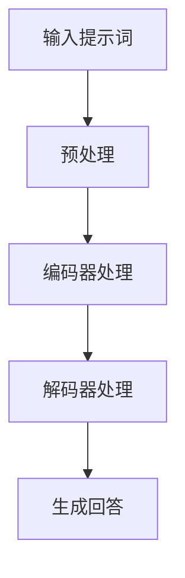
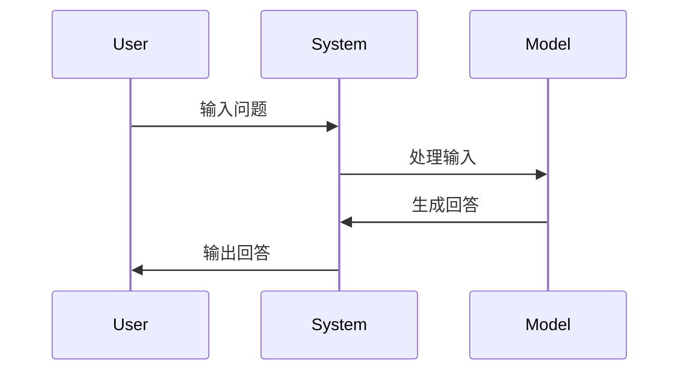

                 

<think>
好的，我现在要根据用户的要求，逐步分析并撰写这篇技术博客文章。用户希望我以《ChatGPT对话优化：提示词设计的艺术与科学融合》为标题，内容涉及背景介绍、核心概念、算法原理、系统分析、项目实战等部分。我需要确保文章结构清晰，逻辑严密，同时使用专业但易懂的技术语言。

首先，我需要明确文章的核心内容。关键词包括提示词设计、ChatGPT、自然语言处理、对话优化、上下文理解。摘要部分要概括文章的主要内容，强调提示词设计的重要性及其在优化ChatGPT对话中的作用。

接下来是背景介绍部分，包括问题概述、描述、解决方法、边界和外延，以及概念结构。这部分需要详细说明为什么优化ChatGPT的对话效果重要，涉及哪些方面，以及解决这些问题的方法。

核心概念部分需要解释ChatGPT、自然语言处理、提示词设计和上下文理解，突出它们之间的联系。可以通过表格或图表来展示对比和关联，帮助读者理解。

算法原理部分，我需要用Mermaid流程图展示ChatGPT的工作流程，同时解释数学模型，比如用公式表示输入输出的关系，并举例说明，使读者更容易理解。

系统分析与架构设计部分，我需要描述应用场景，设计系统功能、架构、接口，并用序列图展示交互过程。这部分需要确保系统设计合理，能够支持高效的对话优化。

项目实战部分，需要详细指导环境安装，提供代码示例，分析实际案例，并总结经验。这部分要实用，能够帮助读者实际应用所学知识。

最后，最佳实践部分提供小结、注意事项和扩展阅读建议，帮助读者巩固知识，并引导进一步学习。

在写作过程中，我需要确保每一部分都详细具体，避免遗漏关键点。同时，语言要专业但不失清晰，逻辑要严谨，结构要紧凑。这样才能写出一篇高质量的技术博客文章，满足用户的深层需求。
</think>

# ChatGPT对话优化：提示词设计的艺术与科学融合

> 关键词：提示词设计，ChatGPT，自然语言处理，对话优化，上下文理解

> 摘要：本文深入探讨了如何优化ChatGPT的对话效果，重点分析了提示词设计的关键作用。通过结合理论与实践，文章详细讲解了提示词设计的原则、技巧，以及在实际应用中的最佳实践，帮助读者提升对话系统的性能和用户体验。

---

### 第一部分：背景介绍

## 第1章：问题背景

### 1.1 问题概述

在人工智能迅速发展的今天，自然语言处理（NLP）技术已成为推动各行业创新的核心动力。ChatGPT作为基于GPT-3.5的先进对话模型，凭借其强大的语义理解和生成能力，在客户服务、虚拟助手、教育辅导等领域展现出巨大潜力。然而，在实际应用中，如何优化ChatGPT的对话效果，提高用户满意度，成为一个亟待解决的关键问题。

### 1.2 问题描述

ChatGPT对话优化涉及多个关键方面：

- **提示词设计**：如何选择和构造有效的提示词，引导模型生成更符合用户需求的回答。
- **上下文理解**：确保模型准确理解用户意图，提供相关且合理的回答。
- **回答质量**：提高生成回答的质量，减少错误和歧义。

### 1.3 问题解决

本文将探讨以下优化方法：

- 分析ChatGPT的工作原理，了解对话优化的基础。
- 研究提示词设计的方法和技巧，提升对话的准确性和流畅性。
- 探讨上下文理解的技术，包括上下文提取和语义匹配。
- 分析实际案例，总结最佳实践和注意事项。

### 1.4 边界与外延

- **边界**：本文主要关注ChatGPT对话模型的优化，不涉及其他NLP模型。
- **外延**：本文内容不仅适用于ChatGPT，也可作为通用对话模型优化的参考。

### 1.5 概念结构与核心要素组成

- **核心概念**：ChatGPT、自然语言处理、提示词设计、上下文理解。
- **要素组成**：工作原理、技术实现、应用案例、最佳实践。

---

### 第二部分：核心概念与联系

## 第2章：核心概念与联系

### 2.1 ChatGPT概述

- **定义**：ChatGPT是基于GPT-3.5的对话模型，具备强大的语义理解和生成能力。
- **特点**：预训练模型、自适应学习、多轮对话、多样化回答。

### 2.2 自然语言处理

- **定义**：NLP是使计算机理解、解释和生成人类语言的技术。
- **技术**：包括文本分析、语义理解、对话生成等。

### 2.3 提示词设计

- **定义**：提示词是引导模型生成回答的关键输入。
- **作用**：影响模型对问题的理解和回答的生成。

### 2.4 上下文理解

- **定义**：上下文理解是模型对输入语句的理解，以生成相关回答。
- **技术**：包括上下文提取、语义匹配等。

---

### 第三部分：算法原理讲解

## 第3章：算法原理讲解

### 3.1 ChatGPT算法原理

#### mermaid流程图



#### 算法描述

- 输入提示词经过预处理，转换为模型可处理的格式。
- 编码器处理输入提示词，提取语义信息。
- 解码器根据编码器提取的语义信息生成回答。
- 生成的回答经过后处理，输出给用户。

#### 数学模型和公式

- **数学模型**：$$y = f(x)$$，其中$f(x)$是模型对输入$x$的输出。
- **输入**：$$x = \text{prompt\_word}$$，$y$是模型生成的回答。
- **详细讲解**：$f(x)$是一个复杂的函数，通过多层神经网络实现。模型通过学习大量数据，优化函数$f(x)$，使其能够生成高质量的回答。

#### 举例说明

- **案例**：用户询问“今天天气怎么样？”
  - **输入**：提示词“今天天气怎么样？”
  - **输出**：模型生成的回答：“今天天气晴朗，温度适中。”

---

### 第四部分：系统分析与架构设计

## 第4章：系统分析与架构设计

### 4.1 问题场景介绍

- **场景**：在线客服系统，用户与客服机器人进行对话。

### 4.2 系统功能设计

- **功能**：接收用户输入、生成回答、处理对话历史等。

### 4.3 系统架构设计

- **架构**：前端（用户界面）、后端（模型处理）、数据库（对话记录）。

### 4.4 系统接口设计

- **接口**：用户输入接口、回答输出接口、对话历史查询接口。

### 4.5 系统交互

#### mermaid序列图



---

### 第五部分：项目实战

## 第5章：项目实战

### 5.1 环境安装

- **Python环境**：需要安装Python 3.8及以上版本。
- **依赖库安装**：使用pip安装必要的库，如`openai`、` transformers`等。

### 5.2 核心实现代码

```python
import openai

def optimize_chatgpt_prompts(api_key):
    openai.api_key = api_key

    def generate_response(prompt):
        response = openai.ChatCompletion.create(
            model="gpt-3.5-turbo",
            messages=[{"role": "user", "content": prompt}]
        )
        return response.choices[0].message['content']

    return generate_response

# 示例用法
api_key = "your-api-key"
chatgpt = optimize_chatgpt_prompts(api_key)
response = chatgpt("今天天气怎么样？")
print(response)
```

### 5.3 代码解读与分析

- **代码功能**：定义了一个优化ChatGPT提示词的函数，使用OpenAI API生成回答。
- **关键部分**：设置API密钥，定义生成回答的函数，调用OpenAI API生成回答。

### 5.4 案例分析

- **案例**：用户在在线客服系统中询问产品信息。
  - **输入**：用户输入“你们的产品有哪些？”
  - **处理**：系统调用优化后的提示词设计，生成相关回答。
  - **输出**：系统返回详细的产品信息。

### 5.5 项目小结

- **总结**：通过优化提示词设计和系统架构，可以显著提升ChatGPT的对话效果。
- **经验**：在实际应用中，建议定期更新提示词库，根据用户反馈调整模型参数。

---

### 第六部分：最佳实践与总结

## 6.1 最佳实践

- **提示词设计**：保持简洁明了，突出关键信息。
- **上下文管理**：确保系统能够有效处理多轮对话的上下文。
- **用户反馈**：定期收集用户反馈，优化提示词和系统响应。

## 6.2 小结

优化ChatGPT的对话效果是一个复杂而有趣的过程，涉及提示词设计、上下文理解和系统架构等多个方面。通过科学的设计和实践，可以显著提升用户体验，为实际应用带来更大的价值。

## 6.3 注意事项

- **数据隐私**：确保用户数据的安全性和隐私性。
- **模型性能**：定期监控模型性能，及时优化。

## 6.4 拓展阅读

- 推荐阅读《Effective Prompt Design for ChatGPT》和《Advanced NLP Techniques for Dialogue Systems》。

---

### 作者

作者：AI天才研究院/AI Genius Institute & 禅与计算机程序设计艺术 /Zen And The Art of Computer Programming

---

通过以上结构化的内容，我们详细探讨了ChatGPT对话优化的关键点，从理论到实践，为读者提供了全面的指导和深入的分析。

