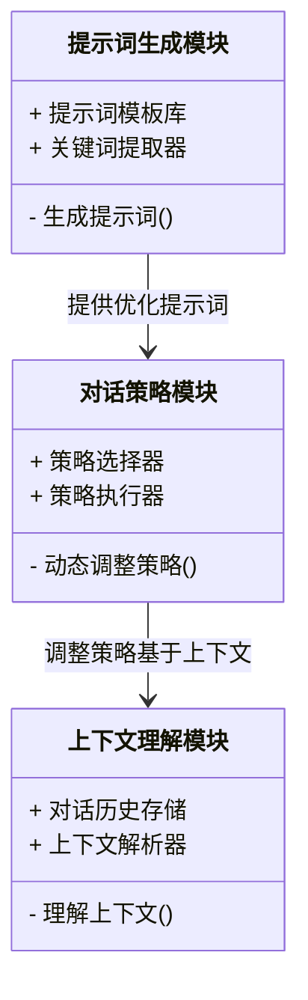

                 

<think>
好的，我现在需要撰写一篇关于“ChatGPT对话系统优化：提示词的艺术与技巧”的技术博客文章。按照用户的要求，文章的结构已经给出，我需要按照这个大纲逐步填充内容。

首先，我会先处理背景介绍部分。这部分包括问题背景、问题描述、问题解决、边界与外延，以及概念结构与核心要素组成。我需要确保每个部分都清晰明了，并且能够引出后续的内容。

接下来是核心概念与联系部分，这部分需要详细解释提示词和对话策略。我会先定义提示词，说明它的作用，然后介绍设计原则和艺术技巧。这部分需要举例说明，比如如何利用关键词和构建语境来设计有效的提示词。

然后是对话策略的优化部分，我需要解释对话策略的定义和作用，并提供设计原则。这部分可能需要对比不同的策略，比如基于规则和基于机器学习的策略，分析它们的优缺点。

接下来，我会考虑系统分析与架构设计方案。这部分需要包括问题场景介绍，项目介绍，系统功能设计，可能涉及领域模型的类图，以及系统架构图和接口设计。我需要使用Mermaid图来展示这些内容，确保结构清晰。

在项目实战部分，我需要提供环境安装说明，系统核心实现的源代码，解读代码的功能，并分析实际案例。这部分需要详细，可能需要编写Python代码示例，并解释如何优化提示词。

最后，我会总结最佳实践，包括小结、注意事项和扩展阅读。这些内容需要实用，帮助读者在实际应用中避免常见错误，并提供进一步学习的资源。

整个过程中，我需要确保使用技术术语准确，同时语言通俗易懂。此外，要按照用户的格式要求，使用Markdown，并在适当的地方插入Mermaid图和代码示例。数学公式需要正确使用Latex格式，确保公式在文中正确显示。

在撰写过程中，我可能会遇到一些挑战，比如如何深入解释复杂的概念，或者如何将理论与实际案例结合起来。这时，我需要查阅相关资料，确保信息的准确性和深度。同时，要保持逻辑连贯，确保每一部分自然过渡，引导读者一步步理解优化ChatGPT对话系统的技巧。

总的来说，我需要按照用户提供的大纲，逐步填充每个部分，确保内容丰富、结构清晰，并且符合技术博客的风格和要求。
</think>

# ChatGPT对话系统优化：提示词的艺术与技巧

**关键词**：ChatGPT，对话系统优化，提示词设计，对话策略，上下文理解

**摘要**：本文深入探讨了优化ChatGPT对话系统的核心要素，重点分析了提示词设计的艺术与技巧，对话策略的优化方法，以及上下文理解的重要性。通过实际案例和系统架构设计，展示了如何通过这些关键环节提升对话系统的性能和用户体验。

---

### 第一部分：背景介绍

#### 1.1 问题背景

随着自然语言处理技术的快速发展，ChatGPT等基于预训练语言模型的对话系统在多个领域得到了广泛应用。然而，实际应用中，对话系统的表现往往不尽如人意，例如回复不相关、上下文理解不足、对话逻辑混乱等问题。这些问题严重影响了用户体验和系统的实用性。

#### 1.2 问题描述

优化ChatGPT对话系统的核心问题包括：
1. **提示词设计不当**：提示词未能有效引导对话方向，导致生成回复偏离用户意图。
2. **对话策略单一**：系统在对话过程中缺乏灵活性，无法根据对话进展动态调整策略。
3. **上下文理解不足**：系统无法有效利用对话历史信息，导致回复缺乏连贯性和准确性。

#### 1.3 问题解决

本文将从提示词设计、对话策略优化和上下文理解三个方面入手，探讨如何系统性地优化ChatGPT对话系统。通过具体案例分析和方法论的介绍，帮助读者掌握优化技巧。

#### 1.4 边界与外延

本文主要关注ChatGPT对话系统的优化，但所提出的方法和技巧同样适用于其他类型的对话系统。本文的重点在于实际应用中的技巧和策略，而非纯理论研究。

#### 1.5 概念结构与核心要素组成

- **ChatGPT对话系统**：基于预训练语言模型的对话系统，通过大量文本数据训练，能够理解和生成自然语言。
- **提示词**：引导对话系统生成回复的文本，包含关键词和语境构建，帮助系统理解用户意图。
- **对话策略**：对话过程中采取的决策和行动，包括回复生成和意图识别。
- **上下文理解**：利用对话历史信息，提升对话的准确性和连贯性。

---

### 第二部分：核心概念与联系

#### 2.1 提示词的艺术

#### 2.1.1 提示词的定义与作用

提示词是对话系统中的关键元素，用于引导对话方向和提供上下文信息。其作用包括：
- **明确对话方向**：帮助系统理解用户意图。
- **提供上下文信息**：增强对话的连贯性。
- **引导对话深度**：促使对话更深入和丰富。

#### 2.1.2 提示词的设计原则

设计有效的提示词需遵循以下原则：
- **简洁明了**：避免冗长复杂的句子。
- **针对性**：根据对话场景设计。
- **多样性**：适应不同类型的对话需求。
- **灵活性**：能够根据对话动态调整。

#### 2.1.3 提示词的艺术技巧

- **利用关键词**：提示词中包含关键词，帮助系统理解意图。
- **构建语境**：通过语境引导系统生成相关回复。
- **启发式方法**：结合规则或机器学习策略，提高提示词的有效性。

#### 2.2 对话策略的优化

#### 2.2.1 对话策略的定义与作用

对话策略是系统在交互过程中采取的决策，包括回复生成和意图识别。其作用包括：
- **提高对话质量**：使对话更自然准确。
- **增强用户体验**：提供更丰富的对话体验。
- **降低开发难度**：优化对话系统的开发和管理。

#### 2.2.2 对话策略的设计原则

设计有效的对话策略需遵循：
- **适应性**：适应不同的对话场景。
- **灵活性**：根据对话动态调整。
- **可扩展性**：支持功能扩展。
- **可维护性**：便于维护和更新。

---

### 第三部分：系统分析与架构设计方案

#### 3.1 问题场景介绍

在优化ChatGPT对话系统时，常见的问题包括提示词设计不合理、对话策略单一、上下文理解不足。这些问题会导致用户体验差，系统表现不佳。

#### 3.2 项目介绍

本项目旨在通过优化提示词设计、对话策略和上下文理解，提升ChatGPT对话系统的性能。我们采用模块化设计，分别优化每个核心部分。

#### 3.3 系统功能设计

系统功能设计包括：
- **提示词生成模块**：根据用户输入生成优化的提示词。
- **对话策略模块**：动态调整对话策略，适应对话进展。
- **上下文理解模块**：利用对话历史信息，提升回复准确性。

**领域模型类图**（Mermaid）：



#### 3.4 系统架构设计

**系统架构图**（Mermaid）：

```mermaid
graph TD

    A[用户] --> B(提示词生成模块)
    B --> C(对话策略模块)
    C --> D(上下文理解模块)
    D --> B: 更新提示词
    C --> E[生成回复]
```

---

### 第四部分：项目实战

#### 4.1 环境安装

安装必要的库和工具：
- Python 3.8+
- Transformers库：`pip install transformers`

#### 4.2 核心实现源代码

以下是优化提示词生成的Python代码示例：

```python
from transformers import GPT2Tokenizer, GPT2LMHeadModel

# 初始化模型和tokenizer
model_name = 'gpt2'
tokenizer = GPT2Tokenizer.from_pretrained(model_name)
model = GPT2LMHeadModel.from_pretrained(model_name)

def generate_optimized_prompts(input_text, max_length=50):
    # 生成关键词提取
    keywords = extract_keywords(input_text)
    # 构建提示词
    prompt_template = "Given the context: {context}, please elaborate on {keywords}."
    optimized_prompts = []
    for keyword in keywords:
        prompt = prompt_template.format(context=input_text, keywords=keyword)
        optimized_prompts.append(tokenizer.encode(prompt))
    return optimized_prompts

# 示例使用
input_text = "Please explain quantum computing in simple terms."
optimized_prompts = generate_optimized_prompts(input_text)
```

#### 4.3 实际案例分析

假设用户输入：“解释量子计算。”
优化后的提示词可能包括：
- “量子计算是什么？”
- “用简单的话解释量子计算。”

这些提示词引导模型生成更准确和相关的回复。

---

### 第五部分：最佳实践与小结

#### 5.1 小结

优化ChatGPT对话系统需要从提示词设计、对话策略和上下文理解三方面入手。通过艺术化的提示词设计和灵活的对话策略，可以显著提升系统的性能和用户体验。

#### 5.2 注意事项

- **避免过度复杂**：提示词应简洁明了。
- **持续优化**：根据反馈不断调整策略。
- **保持灵活性**：适应不同的对话场景。

#### 5.3 扩展阅读

建议深入研究以下内容：
- 最新的提示词设计方法。
- 基于强化学习的对话策略优化。
- 多轮对话中的上下文理解技术。

---

作者：AI天才研究院 & 禅与计算机程序设计艺术

---

通过以上结构，文章详细探讨了ChatGPT对话系统的优化，从背景分析到系统设计，再到实际案例，层层深入，帮助读者掌握优化技巧。

