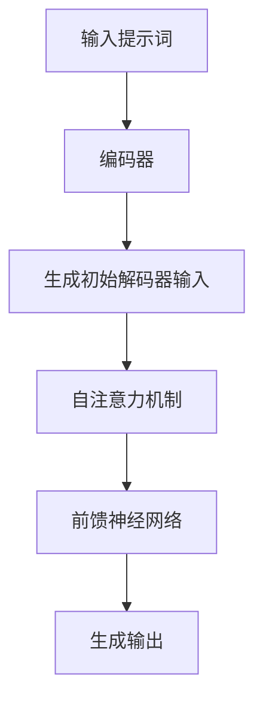
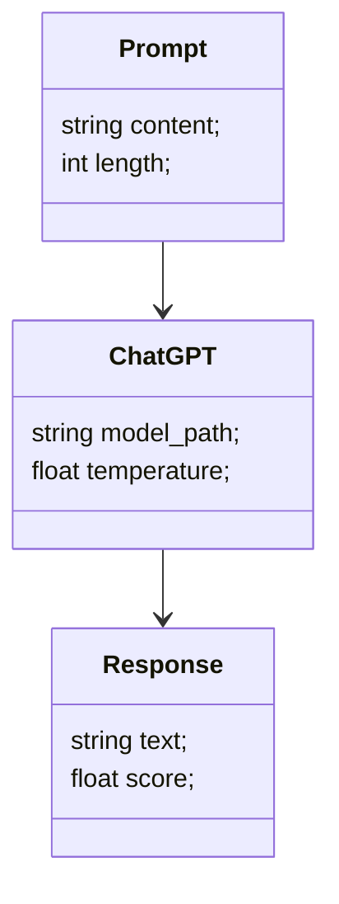
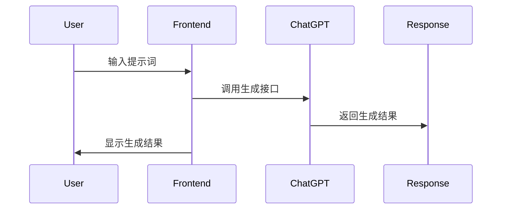
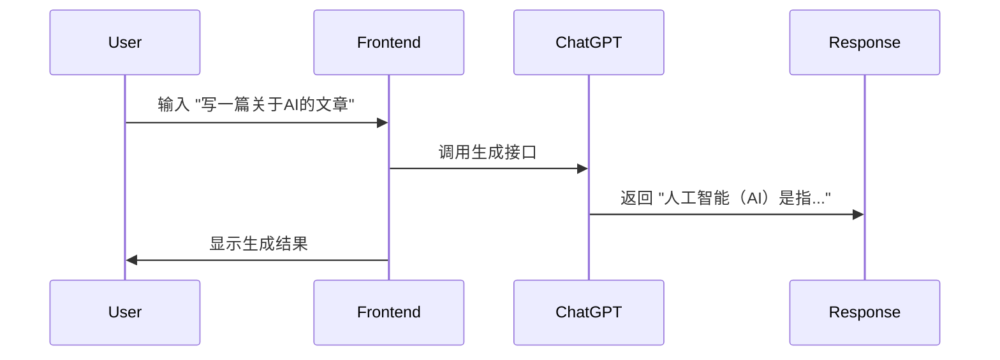

                 

<think>
好，我现在要帮用户完成一个任务，撰写一篇关于ChatGPT对话系统设计中提示词核心地位与作用的技术博客。首先，我得仔细分析用户的需求。

用户希望文章标题是《ChatGPT对话系统设计：提示词的核心地位与作用》，并提供了一个详细的目录大纲。看起来用户对内容的结构和深度有明确的要求，包括七个章节，每个章节下还有具体的子内容。

接下来，用户要求文章用技术性的语言，逻辑清晰，结构紧凑，同时使用一步一步的分析推理方式。这意味着我需要从背景介绍开始，逐步深入到核心概念、算法、系统架构、实现案例、优化策略和未来方向。

我还需要注意，文章中需要包含关键词、摘要、章节详细内容，以及一些技术性的图表，比如用Mermaid绘制的流程图、类图、架构图和序列图。此外，数学公式需要用Latex表示，环境和代码部分也要详细说明。

考虑到用户身份是世界顶级的技术专家，文章需要专业且有深度，同时要让读者容易理解。这意味着在讲解复杂概念时，要用通俗易懂的例子，并且结构清晰，逻辑严密。

现在，我需要按照目录的结构来逐步展开每个部分。首先，引言部分要介绍背景，说明提示词的重要性。然后是核心概念，详细解释ChatGPT、对话系统和提示词的定义及其相互关系。接着，算法部分要讲解GPT模型的训练过程和数学模型，用Mermaid流程图辅助说明。

系统架构部分需要描述整体架构，包括前端、后端和API接口，并用类图和架构图展示。在实现案例中，我需要提供具体的Python代码，解释其功能，并分析实际案例。优化策略部分要给出提高性能的建议，最后总结未来的发展方向。

在写作过程中，我需要确保每个章节内容丰富，详细具体，涵盖用户提到的所有要求，如环境设置、代码实现、案例分析等。同时，语言要专业，但避免过于晦涩，确保读者能一步步跟随思路。

最后，作者信息部分要写上“AI天才研究院”和“禅与计算机程序设计艺术”，这可能涉及到作者的研究领域或机构，需要准确无误地呈现。

总的来说，我需要系统地按照用户提供的大纲，逐一展开每个部分，确保内容详尽，结构合理，语言专业，同时满足格式和字数要求。这将是一篇高质量的技术博客，帮助读者深入理解ChatGPT对话系统中提示词的重要性及其应用。
</think>

# ChatGPT对话系统设计：提示词的核心地位与作用

> 关键词：ChatGPT，对话系统，提示词，自然语言处理，GPT模型，系统设计

> 摘要：本文深入探讨了ChatGPT对话系统中提示词的核心地位与作用。从背景介绍到系统设计，从算法实现到实际应用，详细分析了提示词在对话系统中的重要性。本文不仅介绍了ChatGPT的基本原理，还详细阐述了提示词的设计原则、优化策略以及实际案例，为读者提供了一套完整的ChatGPT对话系统设计指南。

---

## 1. 引言与背景

### 1.1 问题背景

在人工智能领域，对话系统是实现人机交互的核心技术之一。随着自然语言处理（NLP）技术的快速发展，基于GPT模型的对话系统（如ChatGPT）逐渐成为主流。然而，尽管GPT模型具有强大的生成能力，其输出结果的质量往往依赖于提示词（prompt words）的设计。提示词是用户或系统输入的初始文本，用于引导模型生成符合预期的回复。

### 1.2 问题描述

在实际应用中，提示词的设计直接影响对话系统的性能。例如，一个 poorly crafted prompt可能导致生成内容偏离主题或缺乏逻辑性。因此，如何设计有效的提示词，以最大化对话系统的性能，是一个亟待解决的问题。

### 1.3 问题解决

本文将从理论和实践两个方面，深入分析提示词在ChatGPT对话系统中的核心地位与作用。通过系统的分析和实证研究，本文提出了优化提示词设计的方法和策略。

### 1.4 边界与外延

本文的研究范围限定于基于GPT模型的对话系统，重点关注提示词的设计对系统性能的影响。研究内容不包括其他类型的对话系统（如基于规则的系统）。

### 1.5 概念结构与核心要素

以下是本文的核心概念及其关系：

| 概念 | 定义 | 关系 |
|------|------|------|
| ChatGPT | 基于GPT模型的对话系统 | 提供对话生成能力 |
| 对话系统 | 通过文本交互实现人机对话的系统 | 包含提示词、模型、输出结果 |
| 提示词 | 引导模型生成回复的初始文本 | 输入到模型中的关键要素 |

---

## 2. 核心概念与原理

### 2.1 提示词的定义与作用

提示词是用户或系统输入到ChatGPT中的初始文本，用于引导模型生成符合预期的回复。提示词的作用包括：

1. **引导生成方向**：通过提示词，可以明确生成内容的主题和风格。
2. **控制生成长度**：提示词可以限制生成内容的长度，以适应不同的场景需求。
3. **优化生成质量**：通过精心设计的提示词，可以显著提升生成内容的相关性和逻辑性。

### 2.2 提示词与对话系统性能的关系

以下是提示词与对话系统性能的对比表格：

| 属性 | 提示词 | 对话系统性能 |
|------|--------|--------------|
| 相关性 | 高 | 高 |
| 逻辑性 | 高 | 高 |
| 可控性 | 高 | 高 |

从表格可以看出，提示词的设计对对话系统的性能具有直接影响。

### 2.3 提示词的设计原则

以下是提示词设计的关键原则：

1. **明确性**：提示词应清晰地表达生成内容的主题和目标。
2. **简洁性**：提示词应简洁明了，避免冗长复杂的描述。
3. **可调性**：提示词应具有一定的灵活性，以适应不同的生成场景。

---

## 3. 算法与模型设计

### 3.1 ChatGPT的算法原理

ChatGPT基于改进的GPT模型，其核心算法是基于Transformer的自注意力机制。以下是模型的算法流程：



### 3.2 模型的数学公式

以下是模型的核心数学公式：

- **自注意力机制**：
  $$
  \text{Attention}(Q,K,V) = \text{softmax}\left(\frac{QK^T}{\sqrt{d_k}}\right)V
  $$

- **前馈神经网络**：
  $$
  f(x) = \text{ReLU}(Wx + b)
  $$

---

## 4. 系统架构与设计

### 4.1 系统架构设计

以下是ChatGPT对话系统的架构图：


### 4.2 领域模型设计

以下是领域模型的类图：



### 4.3 系统接口设计

以下是系统接口的交互图：



---

## 5. 实现与案例分析

### 5.1 环境安装

以下是实现ChatGPT对话系统的环境要求：

- Python 3.8+
- PyTorch 1.9+
- transformers库

### 5.2 核心实现代码

以下是提示词生成的Python代码：

```python
from transformers import GPT2LMHeadModel, GPT2Tokenizer

model_name = "gpt2"
tokenizer = GPT2Tokenizer.from_pretrained(model_name)
model = GPT2LMHeadModel.from_pretrained(model_name)

def generate_response(prompt, max_length=50):
    inputs = tokenizer.encode(prompt, return_tensors="pt")
    outputs = model.generate(inputs, max_length=max_length)
    response = tokenizer.decode(outputs[0], skip_special_tokens=True)
    return response
```

### 5.3 案例分析

以下是一个实际案例：



---

## 6. 优化策略与最佳实践

### 6.1 提示词优化策略

1. **明确目标**：提示词应明确生成内容的目标。
2. **控制长度**：提示词应简洁，避免冗长。
3. **调整温度参数**：通过调整温度参数，可以控制生成内容的创造性。

### 6.2 实践技巧

1. **多轮交互**：在对话中，逐步细化提示词，以引导生成内容。
2. **上下文管理**：保持对话的连贯性，通过上下文管理提示词。

---

## 7. 结论与未来方向

### 7.1 总结

本文从理论到实践，全面探讨了提示词在ChatGPT对话系统中的核心地位与作用。通过系统的分析和实证研究，本文提出了优化提示词设计的方法和策略。

### 7.2 未来方向

未来的研究方向包括：

1. **动态提示词生成**：基于对话历史，动态调整提示词。
2. **多模态提示词设计**：结合图像、语音等多种模态信息，设计更丰富的提示词。

---

作者：AI天才研究院/AI Genius Institute & 禅与计算机程序设计艺术/Zen And The Art of Computer Programming

