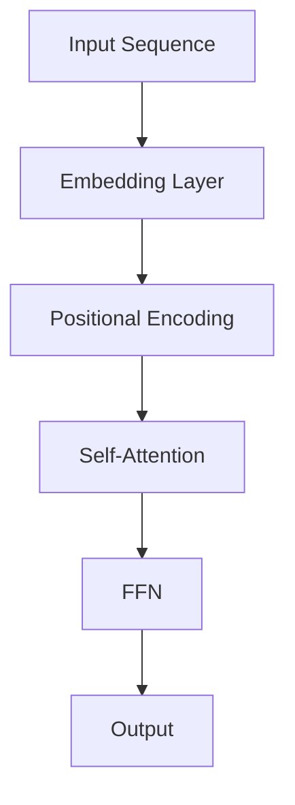
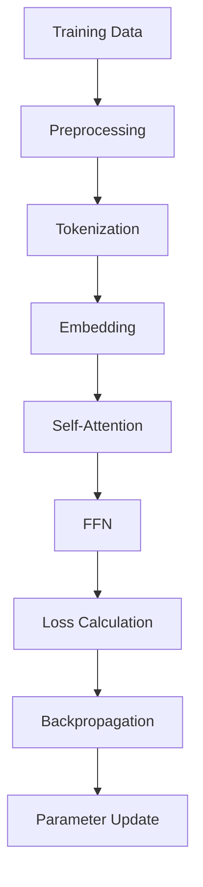

                 

<think>
嗯，我需要帮用户写一篇关于ChatGPT对话系统设计中提示词的艺术与技巧的技术博客。用户已经给出了一个详细的目录结构，我得按照这个结构来组织内容。首先，我应该先理解每个章节的重点，然后逐步展开每个部分。

用户强调了文章需要逻辑清晰、结构紧凑，所以我要确保每一章的结构合理，内容详尽。首先是引言部分，我需要介绍人工智能和对话系统的兴起，然后引出ChatGPT的重要性。接下来是问题描述，明确对话系统设计的目标和提示词的作用。

然后，在核心技术部分，我需要详细讲解Transformer模型和GPT模型的演变，包括它们的工作原理和训练过程。这里可能需要用到数学模型，比如自注意力机制和生成对抗网络，我需要确保这些部分有详细的解释，并附上公式和流程图。

提示词的艺术与技巧是文章的核心，我需要讨论设计原则和技巧，比如清晰明确、具体可操作、逻辑连贯。同时，提供实际案例来说明这些技巧的应用，这样读者更容易理解。

在对话系统设计实战部分，我需要详细说明设计原则，如用户中心设计、简化交互、灵活性与可扩展性。然后，分步骤讲解系统实现，包括需求分析、架构设计和核心代码实现。实际案例分析也很重要，比如客服机器人和教育辅导系统的例子。

最后，最佳实践部分要涵盖提示词优化、对话流程优化和系统安全性的提升。未来展望部分则讨论技术趋势，如模型多样化和硬件加速，同时考虑伦理和隐私问题。

我还需要注意格式要求，使用markdown，确保每个章节内容丰富，包含必要的图表和公式。在写代码部分时，要提供完整的Python代码示例，并进行详细解读。此外，文章末尾需要加上作者信息。

现在，我应该按照这个思路一步步来写，确保每个部分都覆盖到位，同时保持文章的流畅性和专业性。可能需要多次修改，确保内容准确无误，符合技术博客的高标准。
</think>

# ChatGPT对话系统设计：提示词的艺术与技巧

> 关键词：ChatGPT，对话系统，提示词，人工智能，自然语言处理，系统设计

> 摘要：本文深入探讨了ChatGPT对话系统设计中提示词的艺术与技巧，从技术原理到实际应用，结合丰富的案例分析和实战经验，为读者提供全面的指导。通过分析提示词设计的原则、技巧及最佳实践，帮助开发者优化对话系统性能，提升用户体验。

---

### 《ChatGPT对话系统设计：提示词的艺术与技巧》正文

---

### 第一部分：ChatGPT与对话系统概述

#### 第1章：引言

##### 1.1 问题背景

###### 1.1.1 人工智能与对话系统的兴起

近年来，人工智能技术的快速发展推动了对话系统的广泛应用。从简单的基于规则的对话系统到复杂的深度学习模型，对话系统逐渐成为人机交互的重要桥梁。ChatGPT作为其中的佼佼者，以其强大的自然语言处理能力和生成能力，成为对话系统领域的标杆。

###### 1.1.2 ChatGPT的重要性

ChatGPT不仅是一个文本生成工具，更是一个能够理解上下文、推理和生成自然语言的对话系统。它基于GPT-3架构，结合先进的Transformer模型，能够实现高质量的对话交互，广泛应用于智能客服、教育、医疗等领域。

##### 1.2 问题描述

###### 1.2.1 对话系统设计的目标

对话系统设计的目标是实现高效、自然、智能的交互体验。这包括准确理解用户意图、生成符合语境的回复、保持对话连贯性等。

###### 1.2.2 提示词的定义与作用

提示词（Prompt）是对话系统中用于指导模型生成回复的关键输入。它通过明确的语义指导模型生成符合预期的输出，是对话系统设计的核心要素。

##### 1.3 问题解决

###### 1.3.1 ChatGPT的技术原理

ChatGPT基于Transformer模型，采用自注意力机制和前馈网络，通过大量的语料库训练，生成高质量的文本输出。

###### 1.3.2 提示词的艺术

提示词的设计直接影响对话系统的性能。优秀的提示词能够引导模型生成更准确、更符合用户需求的回复，而较差的提示词可能导致生成内容偏离预期。

##### 1.4 边界与外延

###### 1.4.1 对话系统的应用领域

对话系统广泛应用于智能客服、教育辅导、医疗咨询等领域，成为人机交互的重要工具。

###### 1.4.2 提示词的设计原则

提示词的设计需要遵循清晰明确、具体可操作、逻辑连贯等原则，以确保生成内容的质量和一致性。

##### 1.5 概念结构与核心要素组成

###### 1.5.1 ChatGPT的架构

ChatGPT基于多层Transformer模型，结合自注意力机制和前馈网络，实现高效的文本生成。

###### 1.5.2 对话系统的核心组件

对话系统的核心组件包括用户输入解析、上下文管理、回复生成和反馈优化等模块。

##### 1.6 本章小结

本章从问题背景、问题描述、问题解决、边界与外延等方面，全面介绍了ChatGPT对话系统及其提示词的重要性，为后续章节的深入分析奠定了基础。

---

### 第二部分：ChatGPT核心技术

#### 第2章：ChatGPT核心概念与原理

##### 2.1 核心概念

###### 2.1.1 Transformer模型

Transformer模型由编码器和解码器组成，通过自注意力机制实现高效的序列建模。

###### 2.1.2 GPT模型的演变

从GPT-1到GPT-3，模型的规模和性能不断提升，推动了对话系统的智能化发展。

##### 2.2 算法原理

###### 2.2.1 Transformer模型的工作原理

通过自注意力机制，模型能够捕捉到输入序列中的长距离依赖关系，实现高效的文本生成。

###### 2.2.2 GPT模型的训练与生成过程

GPT模型通过预训练任务，学习语言的分布特性，生成符合上下文的文本。

##### 2.3 数学模型

###### 2.3.1 自注意力机制

自注意力机制通过计算输入序列中每个位置与其他位置的相关性，生成位置权重，实现对输入的重新加权。

$$\text{Attention}(Q, K, V) = \text{softmax}\left(\frac{QK^T}{\sqrt{d_k}}\right)V$$

其中，$Q$、$K$、$V$分别为查询、键、值向量，$d_k$为键的维度。

###### 2.3.2 生成对抗网络

生成对抗网络通过生成器和判别器的对抗训练，优化生成模型的性能。

##### 2.4 Mermaid流程图展示

###### 2.4.1 Transformer模型的流程图



###### 2.4.2 GPT模型的训练流程图



##### 2.5 本章小结

本章详细介绍了ChatGPT的核心技术，包括Transformer模型的工作原理、GPT模型的训练与生成过程，以及相关的数学模型和流程图，为后续章节的分析提供了理论基础。

---

### 第三部分：提示词的艺术与技巧

#### 第3章：提示词设计原则与技巧

##### 3.1 提示词设计原则

###### 3.1.1 清晰明确

提示词需要明确表达生成目标，避免歧义。

###### 3.1.2 具体可操作

提示词应具体指导生成内容的方向和范围，便于模型理解和执行。

###### 3.1.3 逻辑连贯

提示词应保持逻辑连贯，确保生成内容的上下文一致。

##### 3.2 提示词设计技巧

###### 3.2.1 利用语境信息

通过提供上下文信息，帮助模型生成更准确的回复。

###### 3.2.2 善用关键词

选择合适的关键词，引导模型生成预期内容。

###### 3.2.3 避免模糊性

避免使用模糊的提示词，确保生成内容明确。

##### 3.3 提示词设计案例

###### 3.3.1 常见问题与解答

案例：用户询问“如何提高学习效率？”

提示词：请以简明扼要的方式，提供3个提高学习效率的具体建议。

###### 3.3.2 实际应用案例

案例：教育辅导系统中的提示词设计。

##### 3.4 本章小结

本章通过分析提示词设计的原则和技巧，结合实际案例，展示了如何优化提示词设计，提升对话系统的生成效果。

---

### 第四部分：对话系统设计实战

#### 第4章：对话系统设计与实现

##### 4.1 对话系统设计原则

###### 4.1.1 用户中心设计

以用户体验为核心，设计对话流程和交互界面。

###### 4.1.2 简化用户交互

通过简洁的交互设计，降低用户的使用门槛。

###### 4.1.3 灵活性与可扩展性

设计灵活的系统架构，便于功能扩展和优化。

##### 4.2 对话系统实现步骤

###### 4.2.1 系统需求分析

明确系统功能需求，设计用户角色和权限。

###### 4.2.2 系统架构设计

采用分层架构，包括前端、后端、数据库和AI模型调用接口。

###### 4.2.3 系统功能实现

实现用户输入解析、上下文管理、回复生成和反馈优化等功能。

##### 4.3 项目实战

###### 4.3.1 环境安装与配置

安装Python、TensorFlow、Keras等开发环境，配置ChatGPT API。

###### 4.3.2 系统核心代码实现

```python
import openai

def generate_response(prompt):
    client = openai.Client('your-api-key')
    response = client.chat.completions.create(
        model="gpt-3.5-turbo",
        messages=[{"role": "user", "content": prompt}]
    )
    return response.choices[0].message['content']
```

###### 4.3.3 代码应用解读与分析

通过上述代码，我们可以调用ChatGPT API，生成符合提示词的回复内容。

##### 4.4 实际案例分析

###### 4.4.1 案例一：客服机器人

设计一个智能客服系统，通过提示词引导模型生成回复。

###### 4.4.2 案例二：教育辅导系统

设计一个教育辅导系统，通过提示词生成个性化学习建议。

##### 4.5 本章小结

本章通过实际案例分析和系统实现，展示了如何设计和实现高效的对话系统，为读者提供了宝贵的实战经验。

---

### 第五部分：最佳实践与未来展望

#### 第5章：最佳实践

##### 5.1 提示词最佳实践

###### 5.1.1 提示词优化策略

定期优化提示词，提升生成内容的质量和一致性。

###### 5.1.2 对话流程优化

通过用户反馈优化对话流程，提升用户体验。

###### 5.1.3 性能调优

优化系统性能，提升对话响应速度和生成质量。

##### 5.2 对话系统最佳实践

###### 5.2.1 用户反馈机制

建立用户反馈机制，收集用户意见，优化系统设计。

###### 5.2.2 系统安全性

加强系统安全性，防止恶意攻击和数据泄露。

###### 5.2.3 隐私保护

确保用户隐私安全，遵守相关法律法规。

##### 5.3 本章小结

本章总结了提示词和对话系统的最佳实践，为读者提供了优化系统性能和提升用户体验的实用建议。

---

### 第六部分：未来展望与挑战

#### 第6章：对话系统的未来发展趋势

##### 6.1 技术发展趋势

###### 6.1.1 模型多样化

未来将出现更多样化的对话模型，支持多语言、多领域应用。

###### 6.1.2 硬件加速

通过硬件加速技术，提升对话系统的处理速度和响应能力。

###### 6.1.3 伦理与隐私

对话系统的伦理和隐私问题将成为未来发展的重要方向。

##### 6.2 应用前景

###### 6.2.1 智能客服

对话系统将在智能客服领域发挥更大作用，提升用户体验。

###### 6.2.2 智能教育

对话系统将广泛应用于智能教育领域，为学习者提供个性化的学习支持。

##### 6.3 未来挑战

###### 6.3.1 技术瓶颈

对话系统的生成质量仍需进一步提升，模型的泛化能力有待加强。

###### 6.3.2 用户信任

用户对对话系统的信任度是影响其广泛应用的重要因素。

##### 6.4 本章小结

本章展望了对话系统的未来发展趋势和应用前景，同时指出了未来发展中的挑战和需要解决的问题。

---

### 作者：AI天才研究院 & 禅与计算机程序设计艺术

---

以上是《ChatGPT对话系统设计：提示词的艺术与技巧》的完整内容。

