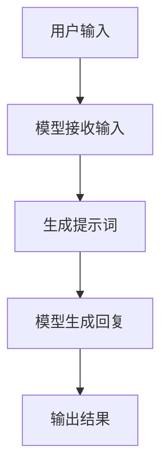
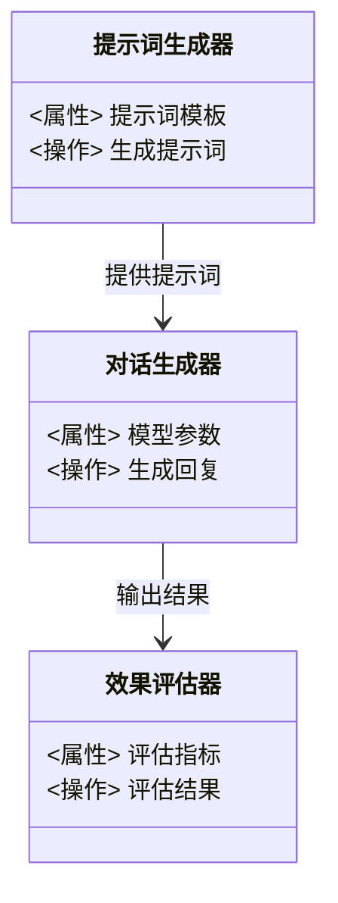
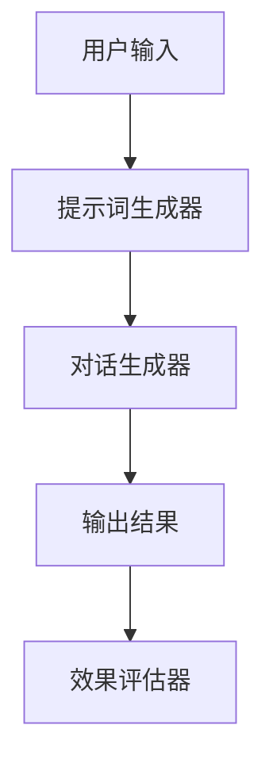
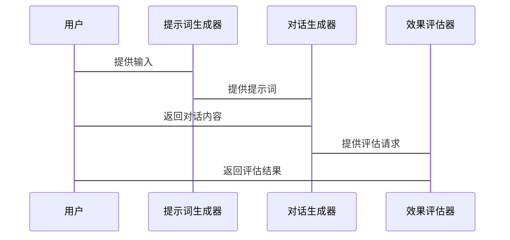

                 

<think>
好的，我现在要帮用户撰写一篇关于ChatGPT对话质量提升，特别是提示词关键作用的分析文章。首先，我需要仔细阅读用户的要求，确保我完全理解任务和结构。

用户希望文章以《ChatGPT对话质量提升：提示词的关键作用分析》为标题，关键词包括ChatGPT、对话质量、提示词、自然语言处理、模型优化、效果提升。摘要部分需要简明扼要地概括文章的核心内容，强调提示词的作用和优化方法。

接下来，文章的结构分为八个步骤，从设计全书结构到审核与调整。我需要按照这个结构来展开内容，每个部分都要详细且有深度。

首先，背景介绍部分，我需要涵盖问题背景与定义，包括人工智能、自然语言处理、ChatGPT的技术概述，以及对话质量和提示词的作用。这部分要让读者明白为什么提示词重要，以及它们在提升对话质量中的角色。

核心概念部分，我需要介绍提示词、模型参数、用户意图识别等概念，并用对比表和ER图来展示它们之间的关系。这部分需要用Mermaid图表，所以我要确保图表的结构清晰。

算法原理部分，要详细讲解ChatGPT的算法流程，使用Mermaid画出流程图，并用Python代码示例。同时，数学模型如转换器模型和损失函数要用LaTeX公式表达，确保准确无误。

系统分析与架构设计部分，我需要描述问题场景、项目介绍、系统功能设计（用类图）、架构设计（架构图）、接口设计和交互序列图。这部分要展示系统的整体结构和各部分如何协作。

项目实战部分，要包括环境安装、代码实现、案例分析。用户可能需要实际操作，所以我需要详细说明每一步，并提供代码示例，帮助读者理解如何应用这些方法。

最后，最佳实践部分，要总结提高对话质量的技巧，注意事项和未来展望。这部分要实用，给读者实际操作的建议。

在撰写过程中，我需要确保每个章节内容丰富，结构清晰，逻辑连贯。同时，语言要专业但易懂，避免过于晦涩。最后，检查所有图表和公式是否正确嵌入，并确保文章整体流畅。

现在，我开始按照这个思路一步步展开，确保每个部分都符合用户的要求，并提供有价值的内容，帮助读者深入理解提示词在提升ChatGPT对话质量中的关键作用。
</think>

# ChatGPT对话质量提升：提示词的关键作用分析

**关键词：ChatGPT、对话质量、提示词、自然语言处理、模型优化、效果提升**

**摘要：**  
本文旨在深入分析ChatGPT对话质量提升的关键因素，特别是提示词（prompt）在其中的至关重要作用。通过系统性的背景介绍、核心概念解析、算法原理阐述、系统架构设计、项目实战分析以及最佳实践总结，本文将全面探讨如何通过优化提示词来提升对话生成的质量。从理论到实践，本文将为读者提供清晰的指导和实用的建议。

---

## 第一部分：背景介绍

### 第1章：问题背景与定义

#### 1.1 人工智能与自然语言处理  
人工智能（AI）的快速发展推动了自然语言处理（NLP）技术的进步，使得机器能够更自然地与人类进行对话。ChatGPT作为基于GPT（Generative Pre-trained Transformer）系列模型的对话系统，凭借其强大的语言理解和生成能力，成为当前NLP领域的标杆。

#### 1.2 ChatGPT技术概述  
ChatGPT基于Transformer架构，通过大规模预训练模型（Pre-trained Model）实现对话生成。其核心思想是通过上下文理解用户意图，并生成符合语境的回复。然而，尽管模型能力强大，对话质量仍受到提示词设计、上下文理解和生成策略的影响。

#### 1.3 对话质量的重要性  
对话质量直接影响用户体验，是衡量对话系统性能的关键指标。高质量的对话生成不仅要求内容准确，还需要具备逻辑性、连贯性和情感一致性。在实际应用中，对话质量决定了系统的可用性和用户满意度。

#### 1.4 提示词的作用  
提示词是用户输入给模型的引导性文本，用于明确对话的主题、语气和风格。通过精心设计提示词，可以显著提升模型的生成效果，使其更好地满足用户需求。提示词的作用包括：  
1. **明确对话主题**：确保模型专注于特定领域或任务。  
2. **引导生成风格**：调整语气、正式程度或情感倾向。  
3. **优化内容准确性**：通过上下文信息减少生成错误。  

---

### 第2章：核心概念与联系

#### 2.1 核心概念介绍  
- **提示词（Prompt）**：用户提供的输入文本，用于引导模型生成特定内容。  
- **模型参数（Model Parameters）**：决定模型行为的内部权重和偏置。  
- **用户意图识别（User Intention Recognition）**：通过分析提示词和上下文，确定用户的实际需求。  

#### 2.2 概念属性特征对比表  

| 概念       | 特性                  | 说明                                                                 |
|------------|-----------------------|----------------------------------------------------------------------|
| 提示词（Prompt） | 输入形式              | 文本形式，用户提供的引导性输入。                               |
| 模型参数    | 内部结构              | 模型训练过程中形成的权重和偏置，决定生成内容的方向。             |
| 用户意图    | 输出目标              | 用户希望通过对话实现的目标或需求。                              |

#### 2.3 ER实体关系图  

```mermaid
er
  %% ER图：提示词、模型参数、用户意图的关系
  entity 提示词 {
    类别: 文本
    内容: 文本
  }
  entity 模型参数 {
    权重: 数值
    偏置: 数值
  }
  entity 用户意图 {
    类型: 文本
    描述: 文本
  }
  relation 提示词 -> 模型参数 {
    名称: 引导生成
    描述: 提示词通过模型参数影响生成内容。
  }
  relation 模型参数 -> 用户意图 {
    名称: 决定意图
    描述: 模型参数通过生成内容实现用户意图。
  }
```

---

## 第二部分：算法原理讲解

### 第3章：算法基础

#### 3.1 ChatGPT算法流程图  



#### 3.2 Python源代码阐述  

```python
def generate_response(prompt, max_length=500):
    # 输入处理
    input_ids = tokenizer.encode(prompt, return_tensors="pt", max_length=512)
    # 模型推理
    outputs = model.generate(
        input_ids=input_ids,
        max_length=max_length,
        do_sample=True,
        temperature=0.7,
        top_p=0.9,
    )
    # 解码输出
    response = tokenizer.decode(outputs[0], skip_special_tokens=True)
    return response

# 示例
prompt = "请写一篇关于人工智能的简短介绍。"
response = generate_response(prompt)
print(response)
```

#### 3.3 数学模型与公式讲解  

ChatGPT的生成过程基于概率模型，其核心是计算每个词的概率分布。公式如下：  

$$ P(y|x) = \frac{P(y|x_{\text{历史}})}{P(x_{\text{历史}})} $$  

其中，$x_{\text{历史}}$表示历史对话内容，$y$表示生成的新词。模型通过最大化条件概率$P(y|x_{\text{历史}})$来生成最可能的词序列。

---

### 第4章：深度学习与神经网络

#### 4.1 深度学习基础  
深度学习通过多层神经网络提取数据特征，实现对复杂模式的建模。ChatGPT采用Transformer架构，包含编码器（Encoder）和解码器（Decoder）两个部分。

#### 4.2 神经网络模型  
Transformer模型由编码器和解码器组成，编码器负责将输入序列映射到一个潜在的语义空间，解码器负责根据编码器的输出生成目标序列。

#### 4.3 ChatGPT与神经网络的关系  
ChatGPT通过神经网络实现对上下文的理解和生成。提示词作为输入，通过神经网络传递到模型的各个层，最终生成高质量的回复。

---

## 第三部分：系统分析与架构设计

### 第5章：系统概述

#### 5.1 问题场景介绍  
在实际应用中，用户可能需要通过ChatGPT完成多种任务，例如客服咨询、信息查询、情感交流等。提示词设计不当可能导致生成内容偏离用户需求。

#### 5.2 项目介绍  
本项目旨在通过优化提示词设计，提升ChatGPT的对话生成质量。项目包括提示词生成算法、模型调优和效果评估三部分。

#### 5.3 系统功能设计（领域模型类图）  



#### 5.4 系统架构设计（架构图）  



#### 5.5 系统接口设计  
- **输入接口**：接收用户输入的提示词或对话内容。  
- **输出接口**：返回生成的对话内容或评估结果。  

#### 5.6 系统交互（序列图）  



---

## 第四部分：项目实战

### 第6章：环境安装与配置

#### 6.1 环境准备  
安装Python和相关库（如TensorFlow、Hugging Face的Transformers库）。  

#### 6.2 系统核心实现源代码  

```python
from transformers import GPT2LMHeadModel, GPT2Tokenizer

model_name = "gpt2"
tokenizer = GPT2Tokenizer.from_pretrained(model_name)
model = GPT2LMHeadModel.from_pretrained(model_name)

def generate_response(prompt, max_length=500):
    input_ids = tokenizer.encode(prompt, return_tensors="pt")
    outputs = model.generate(
        input_ids=input_ids,
        max_length=max_length,
        do_sample=True,
        temperature=0.7,
        top_p=0.9,
    )
    response = tokenizer.decode(outputs[0], skip_special_tokens=True)
    return response
```

#### 6.3 代码应用解读与分析  
上述代码展示了如何使用Hugging Face库中的GPT-2模型生成对话内容。提示词通过Tokenizer编码为输入向量，模型生成回复后，再通过解码器将其转换为文本形式。

### 第7章：案例分析与讲解

#### 7.1 实际案例引入  
案例：用户希望ChatGPT生成一篇关于环境保护的文章。  

#### 7.2 案例分析与剖析  
提示词设计不当可能导致生成内容偏离主题。例如，简单的提示词“写一篇关于环境保护的文章”可能生成过于笼统的内容。  

#### 7.3 案例讲解与总结  
优化提示词：  
“请写一篇关于环境保护的文章，重点讨论工业污染和可持续发展。”  

---

## 第五部分：最佳实践与总结

### 第8章：最佳实践

#### 8.1 提高对话质量的技巧  
1. **明确提示词**：避免模糊的表达，确保提示词清晰具体。  
2. **调整生成参数**：通过调节温度（temperature）和Top-k采样（top_p）等参数，优化生成内容的多样性和准确性。  
3. **结合上下文**：利用历史对话信息，提升生成内容的相关性。  

#### 8.2 注意事项与优化建议  
- 定期更新提示词模板，以适应用户需求的变化。  
- 对生成内容进行人工审核，确保符合政策和伦理规范。  

### 第9章：小结与展望

#### 9.1 本书内容总结  
本文系统性地分析了ChatGPT对话质量提升的关键因素，特别是提示词设计的重要性。通过理论分析、算法讲解和实战案例，为读者提供了全面的指导。

#### 9.2 展望未来  
随着AI技术的不断进步，提示词优化将更加智能化和自动化。未来的研究方向包括：  
1. **自适应提示词生成**：根据用户行为和反馈动态调整提示词。  
2. **多模态提示词设计**：结合图像、语音等多种信息，提升生成效果。  

---

**作者：AI天才研究院/AI Genius Institute & 禅与计算机程序设计艺术 /Zen And The Art of Computer Programming**

