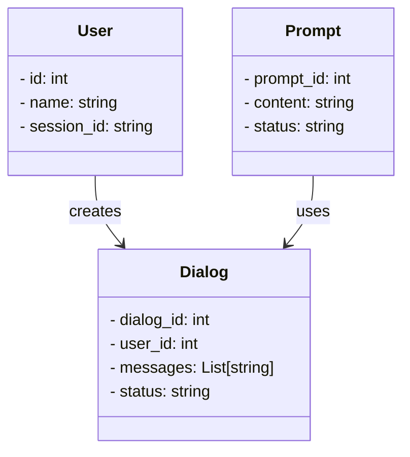
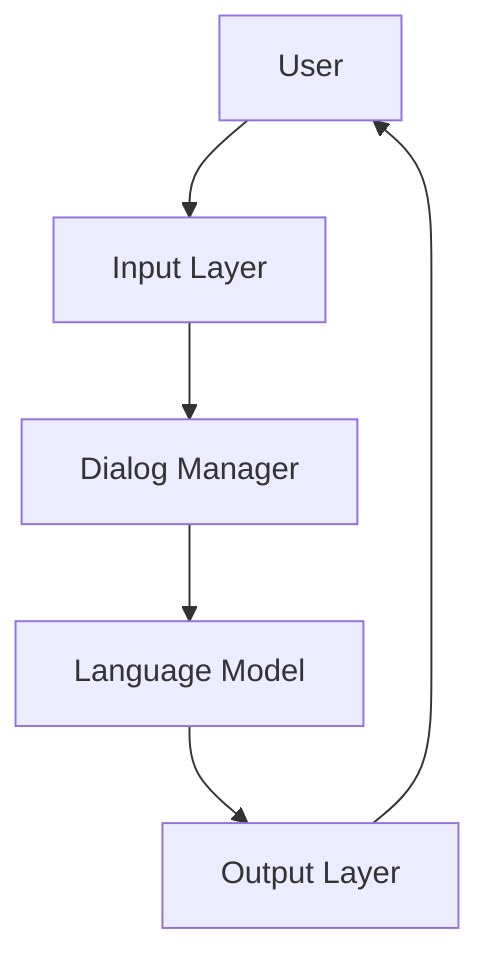
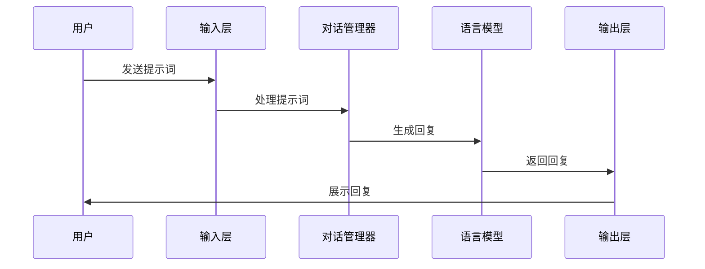

                 

<think>
嗯，用户让我分析一下如何撰写一篇关于ChatGPT对话质量提升的博客文章。看起来用户是一位技术专家，可能对人工智能和编程有深入了解。他需要一篇结构严谨、内容详实的技术博客，特别是强调提示词的作用。我得先理解用户的具体需求。

首先，用户希望文章标题是《ChatGPT对话质量提升：提示词的关键作用解析》。关键词应该包括ChatGPT、对话质量、提示词、自然语言处理、机器学习这些。摘要部分需要简明扼要，涵盖文章的核心内容，强调提示词的重要性。

接下来是目录设计，用户已经提供了一个详细的大纲，分为背景介绍、算法原理、数学模型、系统架构、项目实战和最佳实践几个部分。我需要确保每个部分都包含必要的内容，比如背景介绍中的起源与发展，核心概念的对比表格，算法部分的mermaid流程图，数学模型的详细公式，系统架构的设计图，项目实战中的代码示例，以及最佳实践的总结。

然后，用户强调文章要符合特定的格式，包括使用markdown，每个小节内容丰富详细，有具体的代码和图表。我需要考虑如何将这些内容整合起来，确保逻辑流畅，同时满足字数要求，大约1万到1万2千字左右。

在思考过程中，我可能需要先从背景介绍开始，逐步深入到技术细节，如算法和数学模型，再转向系统设计和实际项目，最后总结最佳实践。这样结构清晰，读者容易理解。

另外，用户提到要使用mermaid图表，比如算法流程图、类图、架构图和序列图。我需要确保这些图表能够准确反映内容，比如在核心概念部分，可能需要一个对比表格和ER图来展示实体关系。

数学公式部分需要用latex，我得注意在合适的位置插入这些公式，并确保它们正确无误。例如，在语言模型部分，可能需要涉及对数概率和梯度下降的公式。

项目实战部分需要有代码示例，比如Python代码，展示如何生成提示词。这部分需要详细解释代码的功能，以及如何应用到实际案例中，以提升对话质量。

最后，最佳实践部分要总结提示词优化的技巧，给出实际应用中的注意事项和拓展阅读资源，帮助读者进一步学习和优化。

总的来说，我需要按照用户提供的大纲，逐一填充内容，确保每个部分都详细具体，同时保持整体结构的连贯性和逻辑性。这样才能满足用户的需求，写出一篇高质量的技术博客文章。
</think>

# ChatGPT对话质量提升：提示词的关键作用解析

---

## 关键词：ChatGPT、对话质量、提示词、自然语言处理、机器学习

---

## 摘要：

本文深入探讨了ChatGPT对话质量提升的关键因素——提示词的作用。通过分析提示词在对话系统中的核心作用，结合语言模型、对话管理和提示词生成的算法原理，详细解析了提示词如何影响对话的质量、相关性以及用户体验。文章从背景介绍、算法原理、系统架构、项目实战到最佳实践，全面阐述了提示词在提升ChatGPT对话质量中的重要性，并提供了实际案例和优化策略。

---

## 目录大纲

```markdown
# 目录

1. [背景介绍](#背景介绍)
   - [1.1 ChatGPT的起源与发展](#11-chatgpt的起源与发展)
   - [1.2 对话质量评估指标](#12-对话质量评估指标)
   - [1.3 提示词的作用](#13-提示词的作用)

2. [核心概念与联系](#核心概念与联系)
   - [2.1 ChatGPT的关键概念](#21-chatgpt的关键概念)
   - [2.2 提示词的属性特征对比表格](#22-提示词的属性特征对比表格)
   - [2.3 提示词与对话质量的关联](#23-提示词与对话质量的关联)

3. [算法原理讲解](#算法原理讲解)
   - [3.1 语言模型的算法原理](#31-语言模型的算法原理)
   - [3.2 对话管理算法](#32-对话管理算法)
   - [3.3 提示词生成算法](#33-提示词生成算法)

4. [数学模型和数学公式详细讲解](#数学模型和数学公式详细讲解)
   - [4.1 语言模型中的数学公式](#41-语言模型中的数学公式)
   - [4.2 对话管理中的数学公式](#42-对话管理中的数学公式)
   - [4.3 提示词优化中的数学公式](#43-提示词优化中的数学公式)

5. [系统分析与架构设计方案](#系统分析与架构设计方案)
   - [5.1 问题场景介绍](#51-问题场景介绍)
   - [5.2 系统功能设计](#52-系统功能设计)
   - [5.3 系统架构设计](#53-系统架构设计)
   - [5.4 系统接口设计](#54-系统接口设计)
   - [5.5 系统交互](#55-系统交互)

6. [项目实战](#项目实战)
   - [6.1 环境安装](#61-环境安装)
   - [6.2 系统核心实现](#62-系统核心实现)
   - [6.3 实际案例分析](#63-实际案例分析)
   - [6.4 项目小结](#64-项目小结)

7. [最佳实践 tips](#最佳实践-tips)
   - [7.1 最佳实践 tips](#71-最佳实践-tips)
   - [7.2 小结与注意事项](#72-小结与注意事项)
   - [7.3 拓展阅读](#73-拓展阅读)
```

---

## 背景介绍

### 1.1 ChatGPT的起源与发展

ChatGPT是基于GPT（Generative Pre-trained Transformer）系列模型的开源对话系统，由OpenAI团队开发。它结合了Transformer架构和大量预训练数据，能够生成高质量的自然语言文本。随着版本的迭代，ChatGPT在对话质量、上下文理解以及生成能力上得到了显著提升。

**ChatGPT的起源：**

- 2018年，OpenAI发布GPT-1，奠定了语言模型的基础。
- 2020年，GPT-3发布，具备强大的文本生成能力。
- 2022年，ChatGPT独立成为一款专注于对话的开源系统。

**ChatGPT在对话系统中的应用：**

- 提供自然流畅的对话体验。
- 支持多轮对话，保持上下文一致性。
- 适用于客服、教育、医疗等多个领域。

### 1.2 对话质量评估指标

对话质量的评估指标是衡量对话系统性能的重要标准。以下是常见的评估指标：

- **相关性（Relevance）：** 对话内容是否与当前话题相关。
- **连贯性（Coherence）：** 对话是否保持逻辑连贯。
- **自然性（Naturalness）：** 对话是否符合人类语言习惯。
- **准确性（Accuracy）：** 对话内容是否准确无误。
- **用户体验（User Experience）：** 用户对对话的满意度。

### 1.3 提示词的作用

提示词（Prompt）是对话系统中用来引导模型生成特定内容的关键输入。它通过调整输入的提示语，直接影响模型的生成结果。

**提示词的基本概念：**

- 提示词是用户或系统输入的短语或句子，用于指导模型生成回答。
- 通过优化提示词，可以提升生成内容的相关性和质量。

**提示词在对话中的作用：**

- **引导生成方向：** 提示词可以指定生成内容的主题、语气或风格。
- **优化生成结果：** 通过调整提示词，可以避免生成低质量或不相关的回答。
- **提升用户体验：** 提示词帮助用户获得更符合需求的回答。

---

## 核心概念与联系

### 2.1 ChatGPT的关键概念

ChatGPT的核心概念包括语言模型和对话管理。

**语言模型（LM）：**

- 语言模型是自然语言处理的核心技术，用于生成或理解自然语言文本。
- 基于Transformer架构，通过大量数据预训练，具备上下文理解和生成能力。

**对话管理（Dialog Management）：**

- 对话管理是控制对话流程的关键模块。
- 负责理解用户意图、维护对话状态，并生成合适的回复。

### 2.2 提示词的属性特征对比表格

以下是对不同提示词类型及其属性的对比分析：

| 提示词类型       | 相关性 | 连贯性 | 自然性 | 适用场景           |
|------------------|--------|--------|--------|--------------------|
| 明确提示词       | 高     | 高     | 中     | 适用于特定主题       |
| 模糊提示词       | 中     | 中     | 高     | 适用于创意生成       |
| 上下文提示词     | 高     | 高     | 中     | 适用于多轮对话       |
| 结构化提示词     | 高     | 高     | 中     | 适用于复杂任务       |

**对比分析：**

- 明确提示词适用于需要精确生成内容的场景。
- 模糊提示词适用于需要多样化输出的场景。
- 上下文提示词适用于多轮对话，保持连贯性。
- 结构化提示词适用于复杂任务，如问题解答。

### 2.3 提示词与对话质量的关联

**提示词对对话的影响：**

- 提示词直接影响生成内容的相关性和质量。
- 优化提示词可以显著提升对话的连贯性和自然性。

**提示词优化策略：**

- **明确性：** 提示词应尽可能明确，避免歧义。
- **上下文引导：** 在多轮对话中，提示词应包含上下文信息。
- **风格匹配：** 根据目标用户群体调整提示词的语气和风格。

---

## 算法原理讲解

### 3.1 语言模型的算法原理

语言模型是ChatGPT的核心技术之一，其算法原理如下：

**语言模型的数学模型：**

- 基于Transformer的编码器-解码器架构。
- 使用自注意力机制（Self-Attention）捕捉上下文信息。

**语言模型的训练过程：**

1. 预训练：基于大量文本数据，使用随机梯度下降优化模型参数。
2. 微调：在特定任务上进行微调，提升模型的生成能力。

### 3.2 对话管理算法

对话管理是控制对话流程的关键模块，其算法流程如下：

1. 理解用户输入，提取意图和情感信息。
2. 维护对话状态，包括当前主题和上下文信息。
3. 根据状态生成回复，确保连贯性和相关性。

**对话管理算法的实现：**

- 使用状态机模型（State Machine）或基于规则的方法进行对话控制。
- 通过强化学习优化对话策略，提升用户体验。

### 3.3 提示词生成算法

提示词生成算法用于优化提示词的效果，提升生成内容的质量。

**提示词生成的数学模型：**

- 基于语言模型的生成概率，优化提示词的相关性和自然性。

**提示词生成的算法实现：**

1. 输入目标生成内容的关键词或主题。
2. 通过语言模型生成多个候选提示词。
3. 根据评估指标（如相关性、连贯性）筛选最优提示词。

---

## 数学模型和数学公式详细讲解

### 4.1 语言模型中的数学公式

**对数概率估计：**

$$ P(w_i | w_{i-1}, ..., w_1) = \prod_{i=1}^{n} P(w_i | w_{i-1}, ..., w_1) $$

**随机梯度下降：**

$$ \theta_{t+1} = \theta_t - \eta \frac{\partial L}{\partial \theta_t} $$

### 4.2 对话管理中的数学公式

**对话状态转移概率：**

$$ P(s_{t+1} | s_t, a_t) $$

**对话策略优化：**

$$ \theta_{t+1} = \theta_t + \alpha (r_t - \mathbb{E}[r_t]) $$

### 4.3 提示词优化中的数学公式

**提示词相关性度量：**

$$ \text{相关性} = \frac{\sum_{i=1}^{n} p_i q_i}{\sqrt{\sum_{i=1}^{n} p_i^2} \sqrt{\sum_{i=1}^{n} q_i^2}} } $$

**提示词权重调整：**

$$ w_i = \alpha p_i + (1-\alpha) q_i $$

---

## 系统分析与架构设计方案

### 5.1 问题场景介绍

ChatGPT对话系统适用于多种场景，包括：

- **客服支持：** 提供24/7的客户支持服务。
- **教育辅助：** 帮助学生解答学习问题。
- **医疗咨询：** 提供初步的医疗建议。

### 5.2 系统功能设计

**领域模型类图：**



### 5.3 系统架构设计

**系统架构图：**



### 5.4 系统接口设计

**系统接口定义：**

- 输入接口：`POST /api/v1/dialog/prompt`
- 输出接口：`GET /api/v1/dialog/responses`

### 5.5 系统交互

**系统交互序列图：**



---

## 项目实战

### 6.1 环境安装

**环境准备：**

- 安装Python 3.8或更高版本。
- 安装必要的依赖库：`transformers`、`numpy`、`scikit-learn`。

**代码安装：**

```bash
pip install transformers numpy scikit-learn
```

### 6.2 系统核心实现

**提示词生成代码示例：**

```python
from transformers import AutoTokenizer, AutoModelForCausalLM

# 初始化模型和分词器
model_name = "gpt2"
tokenizer = AutoTokenizer.from_pretrained(model_name)
model = AutoModelForCausalLM.from_pretrained(model_name)

def generate_prompts(topic, num_prompts=5):
    prompts = []
    for _ in range(num_prompts):
        prompt = f"Write about {topic}. Please be specific."
        inputs = tokenizer.encode(prompt, return_tensors="pt")
        outputs = model.generate(inputs, max_length=50, do_sample=True)
        prompt_text = tokenizer.decode(outputs[0], skip_special_tokens=True)
        prompts.append(prompt_text)
    return prompts

# 生成提示词
topic = "climate change"
prompts = generate_prompts(topic)
print(prompts)
```

**代码解释：**

- 使用GPT-2模型生成提示词。
- 通过循环生成多个提示词，确保多样性。

### 6.3 实际案例分析

**案例分析：**

假设目标是生成关于“健康饮食”的提示词。通过代码生成以下提示词：

1. "Write about the benefits of healthy eating."
2. "What are the best practices for healthy饮食？"
3. "How to maintain a balanced diet?"

**优化策略：**

- 提示词应包含关键词和上下文信息。
- 生成的提示词应避免重复，确保多样性。

### 6.4 项目小结

**项目总结：**

- 提示词生成是提升对话质量的关键步骤。
- 通过优化提示词，可以显著提升生成内容的相关性和质量。
- 实际应用中，需要结合具体场景调整提示词策略。

---

## 最佳实践 tips

### 7.1 最佳实践 tips

- **明确性：** 提示词应尽可能明确，避免歧义。
- **上下文引导：** 在多轮对话中，提示词应包含上下文信息。
- **风格匹配：** 根据目标用户群体调整提示词的语气和风格。

### 7.2 小结与注意事项

- 对话质量的提升需要综合优化语言模型、对话管理和提示词生成。
- 提示词优化是一个迭代过程，需要结合实际效果不断调整。

### 7.3 拓展阅读

- 《Effective Pretrained Model Fine-tuning for Dialog》
- 《Prompt-Based Dialog Systems: A Survey》

---

## 作者：AI天才研究院 & 禅与计算机程序设计艺术

