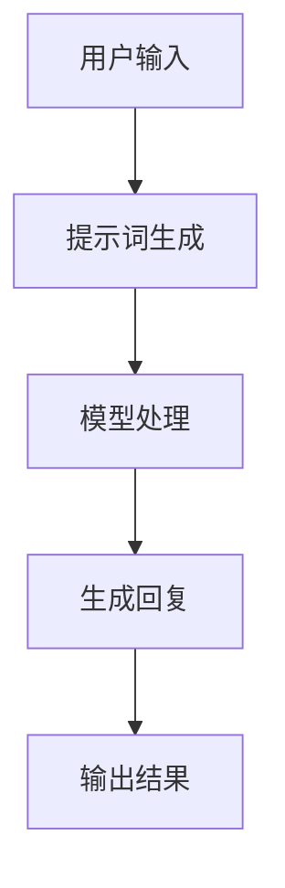

                 

<think>
嗯，用户希望我写一篇关于提升ChatGPT对话质量的博客文章，特别是关于提示词的作用。首先，我需要理解用户的需求。他们想要一篇结构清晰、内容详实的技术博客，目录已经给出，我需要按照这个大纲来展开。

我应该从背景介绍开始，先解释ChatGPT的产生背景和功能，然后讨论对话质量的重要性，以及提示词的作用。接着是ChatGPT的基础知识，这部分可能需要简单介绍其原理和架构，但不要过于深入，毕竟重点是提示词。

接下来，第三章是提示词的原理，我需要详细解释什么是提示词，它们的类型，工作原理，以及属性特征。可能需要做一个对比表格，这样读者更容易理解。

然后是优化策略，这部分需要详细讲解如何优化提示词。包括算法的流程图，用Python代码和数学模型来解释。比如，可能需要一个流程图来展示优化步骤，代码示例帮助读者理解实现方式，数学公式说明模型如何处理提示词。

应用案例部分，我需要找几个实际的案例，比如客服、教育和医疗领域，说明提示词如何提升对话质量。这样读者可以看到实际效果。

最后，总结最佳实践，包括优化提示词的技巧、注意事项和拓展阅读。这部分要给出实用的建议，帮助读者在实际应用中避免错误。

在写作过程中，我需要确保每个部分都详细具体，用技术语言但保持易懂。还要注意文章的结构，确保逻辑清晰，章节之间有良好的衔接。同时，满足用户对字数和格式的要求，比如使用Markdown，加入数学公式和流程图，确保内容完整。

可能会遇到的问题是如何将复杂的算法用简单的方式解释清楚。我需要找到合适的例子，可能还需要查阅一些资料，确保技术准确性。此外，如何让每个章节都足够详细，同时又不显得冗长，也是一个挑战。

总的来说，我需要一步步按照大纲展开，确保每个部分都涵盖必要的内容，同时保持文章的整体流畅性和专业性。
</think>

# ChatGPT对话质量提升：提示词的魔力解析与应用

---

## 关键词  
ChatGPT, 对话质量, 提示词, 优化策略, 应用案例

---

## 摘要  
ChatGPT作为一种革命性的对话生成模型，其表现高度依赖于输入的提示词。本文从ChatGPT的背景与基础知识入手，深入解析提示词的定义、类型、工作原理及其优化策略，结合实际应用案例，详细阐述如何通过提示词的魔力提升对话质量。文章最后总结了最佳实践和注意事项，为读者提供实用的指导。

---

## 目录大纲  
（见上方）

---

## 正文  

---

### 第一部分：背景介绍  

#### 第1章：ChatGPT与对话质量概述  

##### 1.1 ChatGPT的产生背景与功能  
ChatGPT是由OpenAI开发的基于GPT-3.5架构的先进对话模型，它能够通过大规模预训练和微调，生成自然流畅的对话内容。ChatGPT的核心功能包括：  
1. **对话生成**：通过上下文理解用户意图并生成回答。  
2. **多轮对话**：支持连续上下文的交互，保持对话的连贯性。  
3. **上下文记忆**：通过内部机制记忆对话历史，提供更智能的回复。  

ChatGPT的出现标志着自然语言处理技术的重大突破，但在实际应用中，对话质量仍然受到提示词的影响。  

##### 1.2 对话质量的重要性  
对话质量是衡量ChatGPT性能的关键指标，直接影响用户体验。高质量的对话应具备以下特点：  
1. **准确性**：回答内容与用户意图高度匹配。  
2. **流畅性**：回复自然，逻辑清晰。  
3. **相关性**：回答与上下文高度相关，避免偏离主题。  
4. **情感一致性**：回复符合语境中的情感倾向。  

##### 1.3 提示词在提升对话质量中的作用  
提示词（Prompt）是用户输入的初始文本，用于引导模型生成特定的回复。高质量的提示词能够显著提升对话质量，主要体现在以下方面：  
- **明确意图**：通过提示词引导模型关注特定主题或问题。  
- **控制风格**：调整回复的语气、风格或形式（如正式、非正式、幽默等）。  
- **拓展内容**：提示词可以扩展对话内容的深度和广度。  

##### 1.4 本书结构安排  
本书将从ChatGPT的基础知识出发，逐步深入提示词的原理与优化策略，并通过实际案例展示提示词的应用价值。最后，总结最佳实践和注意事项，帮助读者最大化利用提示词提升对话质量。  

---

#### 第2章：ChatGPT基础知识  

##### 2.1 ChatGPT的原理  
ChatGPT基于Transformer架构，通过自注意力机制（Self-Attention）捕捉上下文信息。其核心原理包括：  
1. **编码器-解码器结构**：编码器将输入文本转化为向量表示，解码器生成目标输出。  
2. **自注意力机制**：模型能够关注输入文本中的关键信息。  
3. **预训练与微调**：通过大规模数据预训练，再通过特定任务微调优化。  

##### 2.2 ChatGPT的架构  
ChatGPT的架构主要由编码器和解码器组成：  
- **编码器**：将输入文本转化为上下文向量。  
- **解码器**：根据上下文向量生成目标输出。  

##### 2.3 ChatGPT的训练与优化  
ChatGPT的训练分为预训练和微调两个阶段：  
1. **预训练**：通过大量通用数据（如书籍、网页）进行无监督学习。  
2. **微调**：通过特定任务数据（如对话数据）进行有监督优化。  

---

### 第二部分：提示词原理  

#### 第3章：提示词原理  

##### 3.1 提示词的定义与作用  
提示词是用户输入的初始文本，用于引导模型生成特定的回复。它的作用包括：  
1. **明确意图**：告诉模型对话的主题或目标。  
2. **设定语境**：为对话提供初始背景信息。  
3. **控制风格**：调整回复的语气或形式。  

##### 3.2 提示词的类型  
提示词可以根据功能和形式分为以下几种类型：  
1. **主题提示**：直接指定对话的主题。  
2. **风格提示**：控制回复的语气或风格。  
3. **上下文提示**：提供对话的背景信息。  
4. **结构提示**：引导模型生成特定格式的回复。  

##### 3.3 提示词的工作原理  
提示词通过影响模型的注意力机制，引导模型关注特定信息。具体过程包括：  
1. **输入处理**：提示词被编码为向量。  
2. **注意力分配**：模型根据提示词向量分配注意力权重。  
3. **生成输出**：根据注意力权重生成回复。  

##### 3.4 提示词的属性特征对比表格  

| 属性     | 描述                                                                           |
|----------|-------------------------------------------------------------------------------|
| 类型     | 主题提示、风格提示、上下文提示、结构提示等                                       |
| 长度     | 短提示（1-5句话）、长提示（段落级）                                               |
| 风格     | 正式、非正式、幽默等                                                           |
| 目的     | 明确意图、设定语境、控制风格等                                                 |

---

#### 第4章：提示词优化策略  

##### 4.1 提示词优化的重要性  
优化提示词能够显著提升对话质量，具体表现包括：  
1. **提高准确性**：减少偏离主题的回答。  
2. **增强流畅性**：生成更自然的回复。  
3. **提升相关性**：使回答更贴近用户需求。  

##### 4.2 提示词优化的方法  

###### 4.2.1 算法原理讲解  

####### 4.2.1.1 算法流程图  



####### 4.2.1.2 算法原理讲解  

以下是提示词优化算法的Python实现示例：  

```python
def optimize_prompt(prompt, model):
    # 提示词预处理
    processed_prompt = preprocess_prompt(prompt)
    # 生成优化提示词
    optimized_prompt = generate_optimized_prompt(processed_prompt, model)
    return optimized_prompt

def preprocess_prompt(prompt):
    # 分词和词性分析
    tokens = tokenize(prompt)
    # 生成上下文向量
    context_vector = generate_context_vector(tokens)
    return context_vector

def generate_optimized_prompt(context_vector, model):
    # 优化提示词生成
    optimized_tokens = model.generate_optimized_tokens(context_vector)
    return ' '.join(optimized_tokens)
```

####### 4.2.1.3 算法原理的数学模型和公式  

优化提示词生成的过程可以表示为：  

$$ P_{optimized} = f(P_{input}, \theta) $$  

其中，$P_{input}$ 是输入提示词，$\theta$ 是模型参数，$f$ 是优化函数。  

优化函数的数学表达式为：  

$$ f(P_{input}, \theta) = \arg\max_{P_{optimized}} \text{Score}(P_{optimized}, P_{input}) $$  

其中，$\text{Score}$ 是提示词优化的评分函数。  

####### 4.2.1.4 举例说明  

假设用户输入的提示词是“如何提高学习效率？”。优化后的提示词可能是“请详细说明如何提高学习效率，包括具体方法和步骤。”  

---

### 第三部分：应用案例  

#### 第5章：应用案例  

##### 5.1 案例一：提升客服对话质量  
在客服领域，提示词可以用于优化客户咨询的回复。例如：  
- **原始提示词**：“有什么问题？”  
- **优化提示词**：“请详细描述您遇到的问题，并提供解决方案。”  

##### 5.2 案例二：教育领域中的应用  
在教育领域，提示词可以用于个性化教学。例如：  
- **原始提示词**：“解释一下牛顿定律。”  
- **优化提示词**：“用简单易懂的语言，为高中生讲解牛顿的三大定律。”  

##### 5.3 案例三：医疗咨询中的应用  
在医疗咨询中，提示词可以用于引导医生生成更准确的诊断建议。例如：  
- **原始提示词**：“我感到头疼。”  
- **优化提示词**：“我最近经常头疼，伴随恶心和视力模糊，请给出可能的原因和建议。”  

---

### 第四部分：最佳实践  

#### 第6章：最佳实践  

##### 6.1 提示词优化的最佳实践  
1. **明确目标**：确保提示词清晰传达对话目标。  
2. **简洁明了**：避免冗长复杂的提示词。  
3. **动态调整**：根据对话进展实时优化提示词。  

##### 6.2 提升对话质量的技巧  
1. **使用具体案例**：通过具体案例引导模型生成更精准的回复。  
2. **控制对话节奏**：避免一次性提出过多问题。  
3. **监控对话结果**：实时调整提示词以优化对话质量。  

##### 6.3 注意事项  
1. **避免歧义**：提示词应避免引起歧义。  
2. **注意伦理问题**：确保提示词不涉及敏感或不当内容。  
3. **保持适度**：避免过度优化导致提示词失去自然性。  

##### 6.4 拓展阅读  
推荐阅读以下资源，深入理解提示词的优化方法：  
1. OpenAI官方文档：[ChatGPT API](https://platform.openai.com/docs/api-reference)  
2. 《Effective Prompt Design for Text Generation》  

---

## 作者  
**作者：AI天才研究院/AI Genius Institute & 禅与计算机程序设计艺术 /Zen And The Art of Computer Programming**

