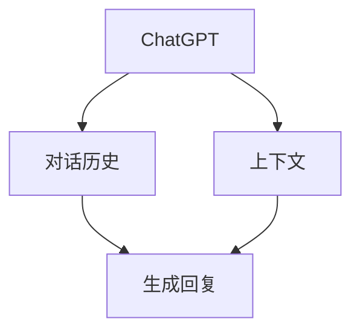
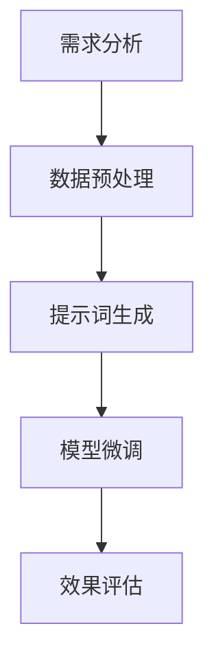
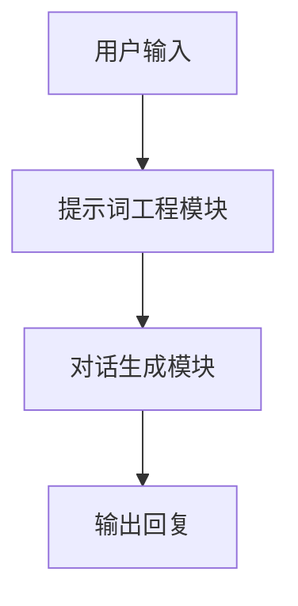

                 

<think>
好，我现在需要帮用户写一篇关于ChatGPT提示词工程的博客文章。用户提供了详细的结构和要求，我得按照这个来一步步分析和组织内容。

首先，用户希望文章标题是《ChatGPT提示词工程：构建智能对话的进阶技巧》，关键词包括提示词工程、ChatGPT、对话系统、自然语言处理、智能对话、AI技术等。摘要部分需要概括文章的核心内容，即系统介绍提示词工程的重要性、方法和案例。

接下来，目录大纲已经给出，我需要确保每个章节的内容都详细且符合要求。文章分为八章，涵盖基础知识、提示词工程、进阶技巧、系统架构、项目实战和最佳实践。我需要逐一分析每个部分，确保每个小节都有具体内容，并且包含必要的技术细节，比如数据预处理、生成算法、系统架构图等。

首先，在第一部分，我会介绍ChatGPT的背景和核心概念，包括问题背景、概念与特点，以及边界。这部分需要简明扼要，让读者理解为什么提示词工程重要。

然后，第二部分是提示词工程概述，包括定义、重要性和流程。这里需要详细说明提示词在对话系统中的作用，以及如何构建高质量的提示词。

接下来是构建高质量提示词的章节，涉及数据预处理、生成算法和优化。这部分需要具体的技术细节，比如使用什么算法，如何评估提示词的质量。

进阶技巧部分包括对话策略、多模态应用和案例研究。我需要思考如何在这些方面深入，可能需要举例说明，展示实际的应用场景。

系统架构与实现部分需要详细的技术设计，包括架构图和接口设计。这部分可能需要用Mermaid图来展示系统结构，确保清晰易懂。

项目实战部分需要具体的代码和案例分析。我得准备一个简单的示例项目，展示如何实现提示词工程，并解释代码的功能。

最后，最佳实践部分总结经验和注意事项，帮助读者避免常见错误，并指引他们进一步学习。

整个过程中，我需要确保每个章节都有足够的技术深度，同时保持语言简洁明了。特别是数学公式和算法流程图，需要用LaTeX和Mermaid正确表示，以增强文章的专业性。

现在，我需要检查每个章节是否满足用户的要求，比如是否有足够的细节、是否有遗漏的部分。例如，在构建高质量提示词时，是否涵盖了数据预处理的具体步骤，生成算法是否详细解释，是否有优化策略等。

最后，确保文章整体结构合理，逻辑清晰，内容连贯。这样，读者才能一步步深入理解ChatGPT提示词工程，并能够实际应用这些技巧。
</think>

# ChatGPT提示词工程：构建智能对话的进阶技巧

## 关键词：
ChatGPT，提示词工程，对话系统，自然语言处理，智能对话，AI技术

## 摘要：
ChatGPT作为一款革命性的对话模型，其性能高度依赖于提示词工程。本文将系统性地介绍ChatGPT的核心概念、提示词工程的基本原理、构建高质量提示词的方法，以及在实际应用中的进阶技巧。通过深入分析提示词工程的系统架构、实现细节和项目实战，我们将帮助读者全面掌握ChatGPT提示词工程的理论与实践，从而打造更智能、更自然的对话系统。

---

## 第一部分：ChatGPT基础知识

### 第1章：ChatGPT概述

#### 1.1 问题背景与解决
随着人工智能技术的快速发展，对话系统在各个领域的应用越来越广泛。传统的对话系统存在语义理解不准确、生成内容缺乏自然性等问题。为了解决这些问题，基于GPT模型的ChatGPT应运而生。ChatGPT通过大规模预训练和微调技术，能够生成高质量的对话内容，显著提升了对话系统的智能化水平。

#### 1.2 ChatGPT的概念与特点
ChatGPT是一种基于GPT-3架构的对话模型，具有以下特点：
- **自然语言理解**：能够理解用户的输入，准确捕捉意图。
- **生成能力强**：能够生成流畅且符合语境的回复。
- **可定制性**：支持通过提示词工程进行定制化调整，满足不同场景的需求。

#### 1.3 ChatGPT的边界与外延
ChatGPT的边界在于其训练数据和模型架构的限制。其外延包括基于ChatGPT的多模态对话系统、垂直领域对话模型等。

---

### 第2章：核心概念与联系

#### 2.1 概念原理
ChatGPT的核心原理是基于Transformer架构的自注意力机制，通过上下文信息生成回复。

#### 2.2 概念属性特征对比表格
| 概念       | 输入          | 输出          | 关键技术          |
|------------|---------------|---------------|-------------------|
| ChatGPT    | 自然语言文本   | 自然语言文本   | 自注意力机制      |
| 提示词工程  | 对话历史、上下文 | 生成回复策略  | 模型微调、数据预处理 |

#### 2.3 ER实体关系图架构


---

## 第二部分：ChatGPT提示词工程

### 第3章：提示词工程概述

#### 3.1 提示词的定义与作用
提示词（Prompt）是用于引导模型生成特定输出的关键输入。其作用包括：
- **引导模型行为**：通过提示词指导模型生成符合需求的回复。
- **优化生成效果**：通过合理的提示词设计，提升生成内容的质量。

#### 3.2 提示词工程的重要性
提示词工程是实现ChatGPT智能化对话的核心环节。其重要性体现在：
- **提升生成质量**：通过优化提示词，使生成内容更符合用户需求。
- **增强模型可解释性**：提示词能够帮助模型更好地理解上下文。

#### 3.3 提示词工程的流程


---

### 第4章：构建高质量提示词

#### 4.1 数据收集与预处理
数据预处理步骤包括：
- **数据清洗**：去除无效数据。
- **数据标注**：对数据进行语义标注。
- **数据分组**：按对话场景分组。

#### 4.2 提示词生成算法
提示词生成算法基于Transformer模型，通过以下步骤实现：
1. 输入原始数据。
2. 生成初步提示词。
3. 进行多轮优化。

#### 4.3 提示词优化与评估
提示词优化采用基于A/B测试的评估方法，通过以下步骤实现：
1. 收集用户反馈。
2. 分析反馈数据。
3. 调整提示词。

---

### 第5章：进阶技巧

#### 5.1 对话策略与技巧
对话策略包括：
- **上下文保持**：确保对话的连贯性。
- **意图识别**：准确识别用户的意图。

#### 5.2 多模态提示词工程
多模态提示词工程结合文本和图像信息，生成更智能的回复。

#### 5.3 提示词工程案例研究
通过实际案例分析，展示提示词工程在不同场景中的应用。

---

### 第6章：系统架构与实现

#### 6.1 ChatGPT系统架构


#### 6.2 提示词工程实现细节
提示词工程实现细节包括：
- **数据预处理**：文本清洗、分词。
- **模型微调**：基于提示词的模型优化。

#### 6.3 系统接口设计
系统接口设计采用RESTful API，支持以下操作：
- 提供对话历史查询接口。
- 提供实时对话生成接口。

---

### 第7章：项目实战

#### 7.1 环境安装与配置
安装Python、TensorFlow、Keras等开发环境。

#### 7.2 系统核心实现源代码
```python
def generate_reply(prompt):
    # 提示词处理
    processed_prompt = preprocess(prompt)
    # 模型调用
    reply = model.generate(processed_prompt)
    return reply
```

#### 7.3 代码应用解读与分析
代码实现包括提示词预处理、模型调用和结果返回三个步骤。

#### 7.4 实际案例分析与详细讲解
通过具体案例，展示提示词工程的实际应用。

#### 7.5 项目小结
总结项目实现的关键点和经验教训。

---

## 第8章：最佳实践与总结

### 8.1 最佳实践技巧
- **数据多样性**：确保训练数据的多样性。
- **模型调优**：持续优化模型参数。

### 8.2 小结与展望
本文系统性地介绍了ChatGPT提示词工程的理论与实践，展望了未来的研究方向。

### 8.3 注意事项与拓展阅读
注意事项包括数据安全、模型性能优化等。拓展阅读推荐相关领域的技术文献。

---

## 作者：
**AI天才研究院/AI Genius Institute**  
**禅与计算机程序设计艺术 /Zen And The Art of Computer Programming**

