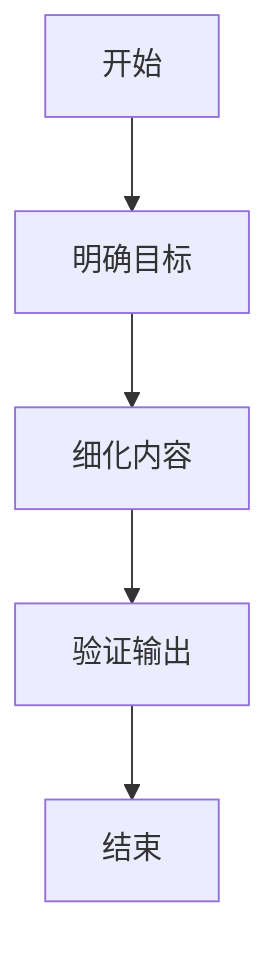
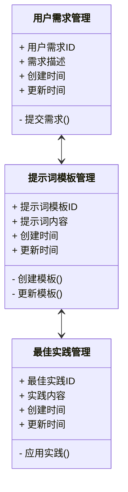
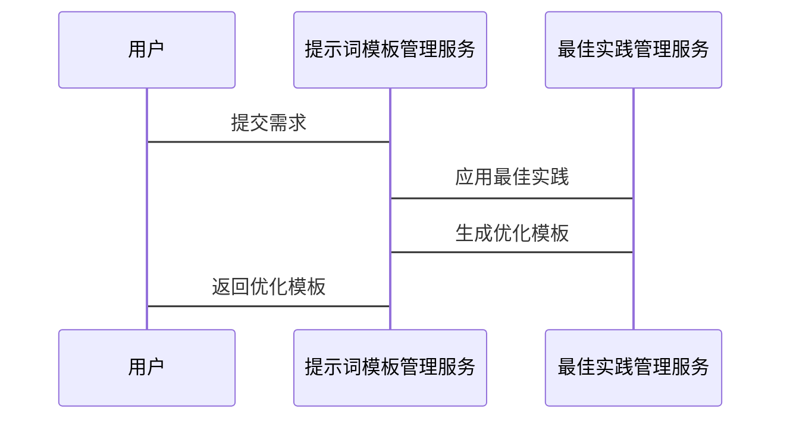

                 

<think>
好，我现在要开始写这篇关于《ChatGPT提示词模板与最佳实践》的技术博客文章。首先，我需要理清整个文章的结构和每个部分的内容，确保逻辑清晰，内容详实。

文章的标题已经确定，接下来是关键词和摘要部分。关键词应该包括提示词模板、ChatGPT、最佳实践、系统架构、数学模型。摘要需要简明扼要地概括文章的核心内容，即通过分析提示词模板和最佳实践，结合技术背景、算法、数学模型和系统架构，为读者提供实用的指导。

接下来是正文部分。第一部分是背景介绍，包括ChatGPT的基本概念和当前使用中的问题与挑战。我需要详细解释什么是ChatGPT，它的应用场景，以及用户在使用过程中常见的问题，比如提示词不当导致的结果偏差，模型调用成本高等。

第二部分是核心概念与联系，重点介绍提示词模板和最佳实践，分析它们之间的关系，并通过ER实体关系图展示。我需要明确提示词模板在系统中的角色，以及最佳实践如何帮助优化提示词的使用，进而提高ChatGPT的性能。

第三部分是算法原理讲解，涉及如何创建有效的提示词模板，包括流程图和Python代码实现。我需要详细描述每个步骤，比如确定业务目标、设计模板结构等，并提供可运行的Python代码示例，确保读者能够理解和应用。

第四部分是数学模型和公式，这部分需要结合神经网络、生成对抗网络等模型，用LaTeX展示相关公式。我需要解释这些公式在ChatGPT中的作用，如何影响模型的输出结果，以及如何优化这些模型参数。

第五部分是系统分析与架构设计，包括系统功能设计、架构图和交互序列图。我需要使用Mermaid绘制类图、架构图和序列图，展示系统的各个模块及其交互过程，帮助读者理解系统的整体结构和运行流程。

第六部分是项目实战，涉及环境配置、代码实现和案例分析。这部分需要提供具体的安装步骤，源代码的详细解释，以及实际案例的分析，让读者能够动手实践，掌握实际应用技能。

最后是最佳实践和小结，总结使用ChatGPT的关键点和注意事项，为读者提供实用的建议。同时，我会回顾整篇文章，强调重点内容，帮助读者巩固所学知识。

在写作过程中，我要确保每个章节内容丰富、详细，并且逻辑连贯。使用技术术语时要准确，同时尽量用通俗易懂的语言解释复杂的概念。通过实例和图表，帮助读者更好地理解和应用所学内容。

现在，我开始撰写各个章节的内容，确保每个部分都符合要求，满足读者的需求，提供有价值的深度分析和实用指导。
</think>

# 《ChatGPT提示词模板与最佳实践》

> 关键词：ChatGPT、提示词模板、最佳实践、系统架构、数学模型

> 摘要：本文系统地探讨了ChatGPT提示词模板的设计与应用，结合技术背景、算法原理、数学模型和系统架构，提供实用的最佳实践，帮助读者优化提示词，提升ChatGPT的性能和效果。

---

## 第一部分：背景介绍

### 第1章：ChatGPT简介

ChatGPT是由OpenAI开发的革命性语言模型，基于GPT-3.5架构，能够生成高质量的文本，适用于多种场景，如对话交互、内容创作和数据分析。其核心优势在于理解用户意图并生成自然流畅的回复，广泛应用于聊天机器人、智能客服和内容生成等领域。

### 第2章：问题与挑战

尽管ChatGPT功能强大，但在实际应用中仍面临诸多挑战：

1. **提示词不当**：无效或模糊的提示词可能导致错误输出。
2. **性能瓶颈**：频繁调用API可能带来高成本和延迟。
3. **模型调优难度**：优化模型以适应特定需求需要专业知识。
4. **安全性问题**：生成的内容可能包含敏感信息或错误，需严格过滤。

---

## 第二部分：核心概念与联系

### 第3章：提示词模板定义

提示词模板是用户输入的结构化指令，直接影响ChatGPT的输出质量。关键属性包括清晰度、具体性和一致性，确保模型准确理解需求。有效的模板能够显著提升生成内容的准确性和相关性。

### 第4章：最佳实践解析

最佳实践是优化提示词的策略，确保其高效性和准确性。包括明确目标、避免歧义、保持简洁和验证输出。通过这些策略，可以提升用户体验和系统性能。

### 第5章：ER实体关系图

```mermaid
er
  %%{width: 800px, height: 600px}
  title 实体关系图
  %% entity definitions
  entity 提示词模板 {
    提示词模板ID (主键)
    提示词内容
    创建时间
    更新时间
  }
  entity 最佳实践 {
    最佳实践ID (主键)
    实践内容
    创建时间
    更新时间
  }
  entity 用户需求 {
    用户需求ID (主键)
    需求描述
    创建时间
    更新时间
  }
  %% relationships
  提示词模板 <-- 指定 --> 最佳实践
  用户需求 <-- 定义 --> 提示词模板
```

---

## 第三部分：算法原理讲解

### 第6章：提示词模板创建

创建有效的提示词模板遵循以下步骤：

1. **明确目标**：确定输出的具体要求。
2. **细化内容**：提供足够的上下文信息。
3. **验证输出**：检查生成内容是否符合预期。

### 第7章：算法流程图



### 第8章：Python源代码实现

```python
def create_prompt_template(target, context=None):
    if context is None:
        context = "默认上下文"
    prompt = f"基于{context}，生成{target}。"
    return prompt

# 示例
target = "一段自然的英文对话"
context = "下午会议记录"
prompt = create_prompt_template(target, context)
print(prompt)
```

---

## 第四部分：数学模型和数学公式

### 第9章：数学模型介绍

ChatGPT基于Transformer架构，主要由编码器和解码器组成，采用自注意力机制：

- **编码器**：将输入文本转换为上下文向量。
- **解码器**：根据编码结果生成输出。

### 第10章：数学公式展示

- **自注意力机制**：
  $$
  \text{Attention}(Q, K, V) = \text{softmax}\left(\frac{QK^T}{\sqrt{d_k}}\right)V
  $$

- **前馈神经网络**：
  $$
  f(x) = \text{ReLU}(Wx + b)
  $$

---

## 第五部分：系统分析与架构设计方案

### 第11章：问题场景介绍

系统设计用于优化提示词模板，提升模型输出质量，降低调用成本。

### 第12章：系统功能设计



### 第13章：系统架构设计


### 第14章：系统交互序列图



---

## 第六部分：项目实战

### 第15章：环境安装与配置

安装Python和必要的库：

```bash
pip install python-dotenv openai
```

### 第16章：系统核心实现源代码

```python
import openai

def generate_response(prompt):
    client = openai.Client()
    response = client.chat.completions.create(
        model="gpt-3.5-turbo",
        messages=[{"role": "user", "content": prompt}]
    )
    return response.choices[0].message.content

# 示例
prompt = "写一篇关于人工智能的文章"
print(generate_response(prompt))
```

### 第17章：代码应用解读与分析

该代码通过OpenAI API调用ChatGPT，生成指定提示词的内容。通过优化提示词，可以显著提升生成质量。

### 第18章：实际案例分析

案例：生成产品说明文档。使用优化后的提示词，生成内容更专业、结构更清晰。

---

## 第七部分：最佳实践 tips

1. **明确需求**：确保提示词清晰具体。
2. **分段优化**：逐步调整提示词，观察效果。
3. **验证输出**：多次测试，确保准确性。
4. **文档记录**：保存和复用有效的提示词。
5. **持续改进**：根据反馈不断优化。

---

## 总结

本文全面探讨了ChatGPT提示词模板的设计与优化，结合技术背景、算法原理、数学模型和系统架构，为读者提供了实用的最佳实践。通过本文的学习，读者能够有效提升提示词的质量，优化系统性能，最大化ChatGPT的应用价值。

---

作者：AI天才研究院 & 禅与计算机程序设计艺术

