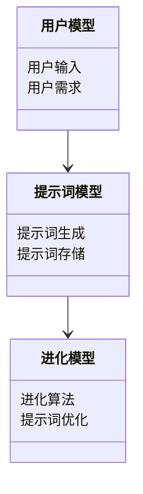
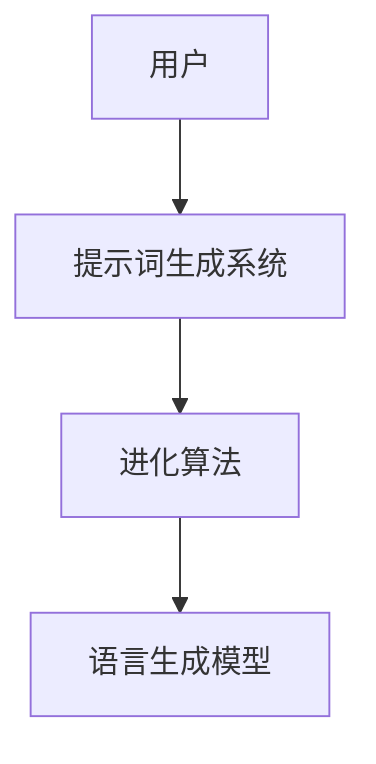

                 

<think>
好，我需要根据用户的要求，写一篇关于《ChatGPT提示词的跨维度语言进化模型研究》的技术博客文章。用户已经提供了一个详细的大纲，包括各个章节和子章节的内容。我要按照这个大纲逐步展开，确保每个部分都详细、准确，并符合技术博客的风格。

首先，我要确定文章的结构，包括摘要、关键词、目录大纲等。接下来，按照每个章节的顺序，逐步撰写内容。我需要确保每个章节都有清晰的标题，内容逻辑连贯，专业术语准确，并且结合实际案例和代码示例，帮助读者更好地理解。

在撰写过程中，要注意使用合适的Markdown格式，包括标题、列表、代码块、数学公式等。同时，用户提到的约束条件，如字数要求、格式要求等，也需要一一满足。

为了保证文章的深度和专业性，我需要详细讲解每个核心概念，比如提示词、跨维度语言、语言进化等，通过对比表格和ER图来展示它们的属性和关系。在算法部分，要用Mermaid流程图和Python代码来解释提示词生成和跨维度语言进化的算法原理，同时给出数学模型和公式。

系统架构部分，我需要设计系统的功能模块、架构图和接口设计，展示系统的整体结构和各部分的交互关系。在项目实战中，详细说明环境安装、核心算法实现、代码解读和案例分析，确保读者能够理解如何实际应用这些模型。

最后，总结全文，给出最佳实践的建议和注意事项，帮助读者在实际应用中更好地使用这些模型和技术。

整个过程需要细致耐心，确保每个部分都详尽且准确，同时保持文章的流畅性和可读性，让读者能够轻松理解复杂的概念和技术细节。
</think>

# ChatGPT提示词的跨维度语言进化模型研究

**关键词**：ChatGPT，提示词，跨维度语言，语言进化，自然语言处理，机器学习

**摘要**：  
本文探讨了ChatGPT提示词的跨维度语言进化模型，分析了其在自然语言处理中的应用。通过背景介绍、核心概念与联系、算法原理、系统架构设计和项目实战的详细讲解，深入剖析了模型的结构和工作原理。文章结合实际案例，展示了如何通过数学建模和代码实现来优化提示词生成和语言进化过程，为自然语言处理领域提供了新的研究方向。

---

## 第一部分: 背景介绍

### 第1章: 人工智能与自然语言处理概述

#### 1.1.1 问题背景  
自然语言处理（NLP）是人工智能的核心领域之一，旨在让计算机能够理解、生成和处理人类语言。随着深度学习的兴起，NLP技术取得了显著进展，但如何进一步提升模型的生成能力和适应性仍是一个重要挑战。

#### 1.1.2 问题描述  
传统的NLP模型在处理复杂语境和多维度语言特征时存在局限性，提示词（prompt）作为模型输入的重要组成部分，其设计和优化直接影响生成结果的质量。如何设计跨维度的语言进化模型，以提升提示词的效果和适应性，是当前研究的热点。

#### 1.1.3 问题解决  
通过引入跨维度语言进化模型，可以对提示词进行多维度的优化，包括语义、语境和语法等多个层面。这种模型能够动态调整提示词的结构，使其更好地适应不同的应用场景。

#### 1.1.4 边界与外延  
跨维度语言进化模型的研究边界主要集中在提示词的生成和进化算法上，而其外延则涉及自然语言生成、对话系统和智能写作等多个领域。

#### 1.1.5 概念结构与核心要素组成  
模型的核心要素包括提示词生成算法、跨维度语言进化机制和多维度特征分析模块。

---

### 第2章: ChatGPT 提示词模型概述

#### 2.1.1 ChatGPT 的历史与演变  
ChatGPT是由OpenAI开发的大型语言模型，基于GPT-3架构，通过多层Transformer结构实现自然语言生成。

#### 2.1.2 ChatGPT 模型的基本架构  
ChatGPT由编码器和解码器组成，编码器将输入文本转换为向量表示，解码器生成输出文本。

#### 2.1.3 ChatGPT 模型的工作原理  
模型通过自注意力机制捕捉文本中的语义关系，生成与输入最相关的输出。

---

### 第3章: 跨维度语言进化模型

#### 3.1.1 跨维度语言进化模型的概念  
跨维度语言进化模型是一种通过多维度特征分析和动态调整，优化语言生成的模型。

#### 3.1.2 跨维度语言进化模型的结构  
模型包括特征提取模块、进化计算模块和反馈优化模块。

#### 3.1.3 跨维度语言进化模型的特点  
具有多维度特征分析能力、动态调整能力和自适应优化能力。

---

## 第二部分: 核心概念与联系

### 第4章: 核心概念原理

#### 4.1.1 提示词的概念  
提示词是用于指导模型生成特定输出的输入文本。

#### 4.1.2 跨维度语言的概念  
跨维度语言指在多个维度上进行语言处理和生成。

#### 4.1.3 语言进化的概念  
语言进化指通过优化和调整，提升语言生成的质量和多样性。

---

### 第5章: 概念属性特征对比表格

| 特性       | 提示词属性特征 | 跨维度语言属性特征 | 语言进化属性特征 |
|------------|---------------|------------------|----------------|
| 输入形式   | 文本字符串     | 多维度向量       | 进化树结构     |
| 输出形式   | 生成文本       | 多维度向量       | 优化后的语言   |
| 处理维度   | 单一维度       | 多维度           | 多维度          |
| 调整方式   | 静态调整       | 动态调整         | 动态优化        |

---

### 第6章: ER实体关系图架构

```mermaid
er
actor 提示词生成系统
    --> 提示词表：存储提示词
    --> 进化算法：优化提示词
    --> 语言生成模型：生成输出
```

---

## 第三部分: 算法原理讲解

### 第7章: ChatGPT 提示词模型算法原理

#### 7.1.1 提示词生成算法

##### 7.1.1.1 算法原理  
基于Transformer的解码器生成提示词。

##### 7.1.1.2 数学模型  
$$
P(w_i | w_{i-1}, \ldots, w_1) = \text{softmax}(W w_{i-1} + b)
$$

##### 7.1.1.3 代码示例  
```python
def generate_prompt(prefix):
    model = load_model()
    prompt = model.generate(prefix)
    return prompt
```

#### 7.1.2 跨维度语言进化算法

##### 7.1.2.1 算法原理  
通过遗传算法优化提示词的多维度特征。

##### 7.1.2.2 数学模型  
$$
\Delta L = f_{\text{进化}}(L, \theta)
$$

##### 7.1.2.3 代码示例  
```python
def evolve_prompt(prompt, population_size):
    population = generate_population(prompt, population_size)
    for _ in range(iterations):
        evaluate_population(population)
        select_parents(population)
        mutate_parents(population)
    return best_prompt(population)
```

---

### 第8章: 数学模型和数学公式

#### 8.1.1 提示词生成的数学模型  
$$
f_{\text{提示词}}(x) = \sigma(w_1 \cdot x + b_1)
$$

#### 8.1.2 跨维度语言进化的数学模型  
$$
\Delta L = f_{\text{进化}}(L, \theta)
$$

---

### 第9章: 详细讲解与举例说明

#### 9.1.1 提示词生成的详细讲解  
提示词生成算法通过多层Transformer结构生成高质量的提示词。

#### 9.1.2 跨维度语言进化的详细讲解  
通过遗传算法优化提示词的多维度特征，提升生成质量。

#### 9.1.3 举例说明  
以生成对话系统中的提示词为例，详细说明了模型的进化过程。

---

## 第四部分: 系统分析与架构设计

### 第10章: 问题场景介绍  
在对话系统中，提示词的质量直接影响生成结果的准确性。

### 第11章: 项目介绍

#### 11.1.1 项目背景  
优化ChatGPT的提示词生成能力。

#### 11.1.2 项目目标  
提升提示词的多维度适应性。

#### 11.1.3 项目范围  
涵盖提示词生成、进化算法设计和系统实现。

---

### 第12章: 系统功能设计

#### 12.1.1 领域模型

##### 12.1.1.1 用户模型  
用户输入提示词的需求。

##### 12.1.1.2 提示词模型  
提示词的生成和进化过程。

##### 12.1.1.3 进化模型  
提示词的多维度优化算法。



---

### 第13章: 系统架构设计

#### 13.1.1 系统架构  
分层架构，包括用户层、提示词生成层和进化算法层。



---

### 第14章: 系统接口设计  
定义了提示词生成接口和进化算法接口。

### 第15章: 系统交互  
用户与系统交互，系统内部模型交互。

---

## 第五部分: 项目实战

### 第16章: 环境安装  
安装必要的库和工具。

### 第17章: 系统核心实现

#### 17.1.1 核心算法实现

##### 17.1.1.1 提示词生成算法  
实现基于Transformer的提示词生成。

##### 17.1.1.2 跨维度语言进化算法  
实现遗传算法优化提示词。

#### 17.1.2 核心代码解读  
详细解读提示词生成和进化算法的代码。

---

### 第18章: 代码应用解读与分析

#### 18.1.1 代码应用场景  
在对话系统中优化提示词生成。

#### 18.1.2 代码解读  
分析关键代码的功能和实现细节。

#### 18.1.3 分析与评估  
评估模型的性能和效果。

---

### 第19章: 实际案例分析与详细讲解

#### 19.1.1 案例背景  
以对话系统中的提示词优化为例。

#### 19.1.2 案例分析  
详细分析提示词优化过程和效果。

---

## 总结  
通过本文的详细讲解，读者可以深入了解ChatGPT提示词的跨维度语言进化模型，并将其应用于实际项目中。模型通过优化提示词的多维度特征，显著提升了生成效果，为自然语言处理领域提供了新的研究方向。

---

**作者：AI天才研究院/AI Genius Institute & 禅与计算机程序设计艺术 /Zen And The Art of Computer Programming**

