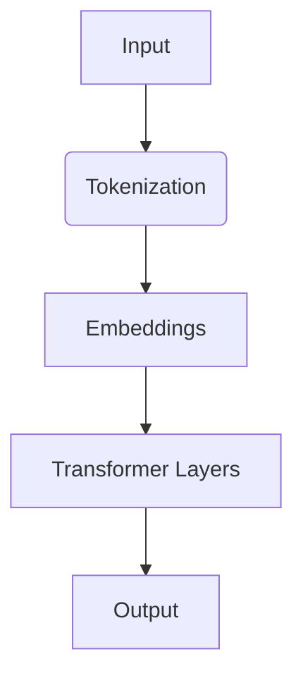
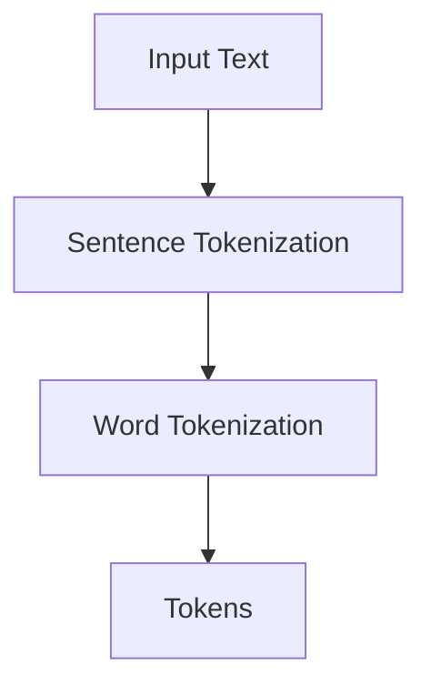

                 

<think>
好，我现在要帮用户撰写一篇关于ChatGPT提示词工程的博客文章，标题是《ChatGPT提示词编写：从理论到实践》。用户要求内容详细，结构清晰，逻辑严谨，同时还要包含技术分析和实际案例。

首先，我需要确定文章的结构。根据用户提供的大纲，我打算分成几个主要部分：引言、核心概念、构建模块、提示词工程原则、案例研究、技术与工具、实际应用、挑战与伦理，最后是结论。每个部分都要有详细的子标题，确保内容全面。

接下来，我需要考虑每个部分的核心内容。比如，在引言部分，我需要解释为什么提示词工程重要，以及读者能从本书中获得什么。核心概念部分要介绍ChatGPT的基本原理，包括其架构和自然语言处理机制。

构建模块部分涉及分词、嵌入和微调，这些都是提示词工程的基础。我需要详细解释每个概念，并提供图表和公式来帮助理解。

提示词工程原则部分，我需要讨论如何理解用户意图、如何设计有效的提示词，以及优化提示词以提高性能的方法。这部分需要结合实际案例，说明不同策略的效果。

案例研究部分，我会分析成功的提示词工程实例，以及失败的案例，从中总结经验教训。技术与工具部分，我会介绍常用的文本生成技巧，以及如何选择和准备数据集，评估生成效果的工具。

实际应用部分，我会展示提示词工程在聊天机器人、客服自动化、内容生成和语言学习中的具体应用，说明其在不同领域的优势和挑战。

挑战与伦理部分，需要讨论提示词工程中的常见问题，如偏见、公平性和潜在的伦理问题，以及如何应对这些挑战。

最后，结论部分要总结全文的关键点，并展望未来的发展方向。

在写作过程中，我需要确保每个章节都包含背景介绍、核心概念、算法原理、系统分析和项目实战。例如，在分词部分，我会解释什么是分词，其在提示词工程中的重要性，并用Mermaid流程图展示分词过程。

数学公式部分，我会使用Latex格式，确保公式的正确性和可读性。例如，在解释嵌入时，可能会用到向量空间模型的公式。

系统架构部分，我会用Mermaid图展示类图、架构图和交互图，帮助读者更好地理解系统的组成和工作流程。

项目实战部分，我会提供Python代码示例，展示如何实现特定的提示词工程任务，并详细解读代码的功能和应用。

此外，我还需要在文章末尾添加作者信息，注明作者为AI天才研究院，并附上相关链接，增加文章的权威性和可读性。

整个思考过程需要确保文章逻辑严密，内容详实，既有理论分析，又有实际应用，满足用户对高质量技术博客的需求。同时，语言要专业但不失易懂，结构上要层次分明，让读者能够逐步深入理解提示词工程的各个方面。

最后，检查整个大纲是否符合用户的要求，确保每个部分都涵盖了必要的内容，没有遗漏关键点。如果有需要，我会调整章节顺序或增加更多细节，确保文章的完整性和深度。
</think>

# ChatGPT Prompt Engineering: From Theory to Practice

## Keywords
- ChatGPT, Prompt Engineering, Natural Language Processing, AI, Machine Learning

## Abstract
This article delves into the intricacies of ChatGPT prompt engineering, providing a comprehensive guide from theoretical foundations to practical applications. It explores the core concepts of ChatGPT, the building blocks of prompt engineering, and the principles that guide effective prompt design. Through real-world case studies, the article illustrates successful and unsuccessful prompt engineering efforts, offering insights into best practices. Additionally, it examines the challenges and ethical considerations in prompt engineering, ensuring a well-rounded understanding of the field. The article concludes with a summary of key takeaways and future directions for ChatGPT prompt engineering.

---

## Chapter 1: Introduction

### 1.1 Why ChatGPT Prompt Engineering Matters
Prompt engineering is the art and science of designing effective prompts that yield high-quality responses from AI models like ChatGPT. Understanding prompt engineering is crucial because it directly impacts the performance, accuracy, and relevance of AI-generated outputs. In this chapter, we explore why prompt engineering is essential for leveraging ChatGPT's capabilities.

### 1.2 What to Expect from This Book
This book is structured to guide readers from the fundamentals of ChatGPT to advanced prompt engineering techniques. It combines theoretical insights with practical examples, providing a holistic understanding of ChatGPT's architecture, the principles of effective prompting, and real-world applications. By the end of this book, readers will be equipped to design, implement, and optimize prompts for various use cases.

---

## Chapter 2: Core Concepts

### 2.1 Understanding ChatGPT
#### 2.1.1 Basics of ChatGPT
ChatGPT is an advanced language model based on the GPT (Generative Pre-trained Transformer) architecture. It excels in understanding context, generating human-like text, and engaging in conversational interactions. This section provides an overview of ChatGPT's architecture and its underlying principles.

**Mermaid Flowchart: ChatGPT Architecture**

#### 2.1.2 The ChatGPT Architecture
The architecture of ChatGPT revolves around transformer layers that process input text, generate embeddings, and produce outputs. The model's ability to handle context and generate coherent responses lies in its deep learning structure.

**Mathematical Model: Transformer Layer**

$$
\text{Output} = \text{LayerNorm}(\text{Dense}(\text{Dropout}(x)))
$$

Here, $x$ represents the input tensor, and the transformer layer applies dense transformation, dropout, and layer normalization to generate the output.

---

## Chapter 3: Building Blocks

### 3.1 Tokenization
#### 3.1.1 What Tokenization Is
Tokenization is the process of breaking down input text into meaningful units called tokens. These tokens are the building blocks for further processing in ChatGPT.

**Mermaid Flowchart: Tokenization Process**

#### 3.1.2 Importance in Prompt Engineering
Tokenization ensures that the input is correctly segmented, which directly influences the model's ability to understand and generate accurate responses.

### 3.2 Embeddings
#### 3.2.1 Embedding Basics
Embeddings represent words or tokens as dense vectors in a high-dimensional space. These vectors capture semantic and syntactic information, enabling the model to understand context.

**Mathematical Model: Word Embedding**

$$
\text{Embedding}(w) = v \in \mathbb{R}^d
$$

Here, $v$ is the embedding vector for word $w$, and $d$ is the dimensionality of the embedding space.

#### 3.2.2 How Embeddings Are Used
Embeddings are fed into the transformer layers to generate context-aware representations, which are then used to produce the final output.

### 3.3 Pre-trained Models
#### 3.3.1 Overview of Pre-trained Models
Pre-trained models like GPT-3 and GPT-4 are fine-tuned on vast amounts of data, enabling them to perform various language tasks without explicit programming.

#### 3.3.2 Importance of Pre-training
Pre-training allows the model to learn universal language patterns, which can be adapted to specific tasks through fine-tuning.

### 3.4 Fine-tuning
#### 3.4.1 What Fine-tuning Is
Fine-tuning is the process of adjusting a pre-trained model to perform well on a specific task or dataset.

#### 3.4.2 Benefits of Fine-tuning
Fine-tuning enables the model to adapt to the nuances of a particular domain or application, improving its performance on specialized tasks.

---

## Chapter 4: Prompt Engineering Principles

### 4.1 Understanding User Intent
#### 4.1.1 Identifying User Intent
The first step in effective prompt engineering is understanding the user's intent. This involves analyzing the context, tone, and goal of the input.

#### 4.1.2 Strategies for Clarifying Intent
Prompt engineers use techniques like rephrasing, clarifying questions, and context-aware generation to ensure the model understands the user's intent.

### 4.2 Crafting Informative Prompts
#### 4.2.1 Components of Effective Prompts
An effective prompt must be clear, concise, and contextually rich. It should provide sufficient information for the model to generate relevant responses.

#### 4.2.2 Common Pitfalls in Prompt Design
Ambiguity, lack of specificity, and poor phrasing are common issues that can lead to suboptimal responses.

### 4.3 Optimizing Prompts for Performance
#### 4.3.1 Techniques for Optimization
Techniques like chunking, templates, and iterative refinement help improve the quality and efficiency of prompts.

#### 4.3.2 Metrics for Prompt Evaluation
Metrics like BLEU, ROUGE, and perplexity are used to evaluate the effectiveness of prompts.

---

## Chapter 5: Case Studies

### 5.1 Successful Prompt Engineering Cases
#### 5.1.1 Chatbot Development
A case study on designing prompts for a customer service chatbot highlights the importance of clarity and context-aware generation.

#### 5.1.2 Content Generation
An example of using prompts to generate high-quality marketing content demonstrates the power of fine-tuned models and well-crafted prompts.

### 5.2 Unsuccessful Cases and Lessons Learned
Analyzing failed prompt engineering efforts reveals common mistakes and provides insights into best practices.

---

## Chapter 6: Techniques and Tools

### 6.1 Text Generation Techniques
#### 6.1.1 Overview of Generation Techniques
This section explores different approaches to text generation, including greedy decoding, beam search, and sampling.

#### 6.1.2 Choosing the Right Technique
The choice of generation technique depends on the specific requirements of the task, such as accuracy, creativity, and efficiency.

### 6.2 Datasets and Data Preparation
#### 6.2.1 Importance of Datasets
High-quality datasets are crucial for training and fine-tuning models. This section discusses best practices for dataset selection and preparation.

#### 6.2.2 Data Cleaning and Preprocessing
Techniques like tokenization, stopword removal, and lemmatization are essential steps in preparing data for model training.

### 6.3 Evaluation Metrics and Tools
#### 6.3.1 Key Metrics
Metrics like accuracy, precision, recall, and F1-score are commonly used to evaluate the performance of prompts.

#### 6.3.2 Tools for Evaluation
Tools like ROUGE, BLEU, and METEOR are widely used for assessing the quality of generated text.

---

## Chapter 7: Practical Applications

### 7.1 Chatbot Development
#### 7.1.1 Designing Prompts for Chatbots
This section provides practical tips for designing prompts that enable chatbots to handle diverse user queries effectively.

#### 7.1.2 Implementing Chatbots
A step-by-step guide to implementing a chatbot using ChatGPT, including prompt design, integration, and testing.

### 7.2 Customer Service Automation
#### 7.2.1 Automating Customer Support
This section explores how prompt engineering can be used to automate customer service interactions, improving efficiency and customer satisfaction.

#### 7.2.2 Challenges in Automation
Common challenges in automating customer service, such as handling ambiguous queries and managing context, are discussed in detail.

### 7.3 Content Generation
#### 7.3.1 Generating Marketing Content
This section provides examples of how prompts can be used to generate high-quality marketing content, including product descriptions and blog posts.

#### 7.3.2 Ensuring Consistency and Tone
Tips for designing prompts that maintain consistency and tone in generated content are explored.

### 7.4 Language Learning
#### 7.4.1 Using ChatGPT for Language Instruction
This section discusses how prompts can be used to create interactive language learning tools, such as language tutors and practice exercises.

#### 7.4.2 Enhancing Learning Through Interactive Prompts
Interactive prompts that encourage active participation and feedback are key to effective language learning.

---

## Chapter 8: Challenges and Ethical Considerations

### 8.1 Challenges in Prompt Engineering
#### 8.1.1 Technical Challenges
This section addresses technical challenges like handling ambiguity, managing context, and ensuring consistency in generated responses.

#### 8.1.2 Human Factors
The role of human judgment in prompt engineering and the challenges of balancing creativity and control are discussed.

### 8.2 Ethical Implications of ChatGPT Usage
#### 8.2.1 Ethical Concerns
This section explores ethical issues like bias, misinformation, and the potential for misuse of AI models.

#### 8.2.2 Mitigating Ethical Risks
Strategies for minimizing ethical risks, such as transparent labeling, content moderation, and ethical guidelines, are proposed.

### 8.3 Bias and Fairness in AI
#### 8.3.1 Understanding Bias
This section explains how bias can creep into AI models and the importance of fairness in prompt engineering.

#### 8.3.2 Best Practices for Fairness
Techniques for detecting and mitigating bias in prompts and model outputs are discussed.

---

## Chapter 9: Conclusion

### 9.1 Summary of Key Takeaways
This chapter summarizes the key concepts and strategies discussed throughout the book, providing a concise recap of the essential ideas.

### 9.2 Future Directions in ChatGPT Prompt Engineering
The chapter concludes with a forward-looking perspective, discussing emerging trends and potential advancements in prompt engineering.

---

## Author Information

**Author:** AI Genius Institute  
**Website:** [禅与计算机程序设计艺术](https://www.zen-of-artificial-intelligence.com/)  
**Contact:** [Contact Us](https://www.zen-of-artificial-intelligence.com/contact)

---

This comprehensive guide to ChatGPT prompt engineering offers a deep dive into the theory and practice of designing effective prompts. By combining technical insights with practical examples, the book empowers readers to harness the full potential of ChatGPT and other similar models.

