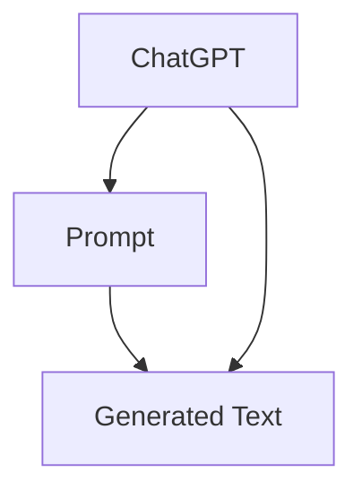

                 

<think>
嗯，我需要帮助用户撰写一篇关于ChatGPT提示词设计的博客文章。用户已经给出了一个详细的大纲，但用户现在可能希望我根据这个大纲来生成完整的内容，按照他们的格式和要求。

首先，我应该仔细阅读用户提供的查询，理解他们需要什么。用户希望我作为一位世界级的人工智能专家，撰写一篇结构清晰、内容详尽的技术博客。文章标题是《ChatGPT提示词设计：理论与实战的完美结合》，关键词包括ChatGPT、提示词设计、自然语言处理、人工智能、系统架构、最佳实践。

接下来，我需要按照用户提供的大纲来组织内容。大纲分为三个主要部分：基础、理论和实战。每个部分都有几个章节，每个章节下还有二级和三级目录。我需要确保每个部分都涵盖必要的内容，如定义、原理、案例分析等。

我还需要注意用户的约束条件：文章必须有完整的结构，包括关键词、摘要，每个章节要详细讲解，使用技术语言，加入核心概念、原理、案例分析，并且使用mermaid图和latex公式。最后，文章末尾要有作者信息，以及一些小结和注意事项。

在写作过程中，我应该首先写摘要，概述文章的主要内容。然后，按照章节顺序，逐一展开。比如，在“ChatGPT与提示词设计基础”部分，我需要介绍ChatGPT的发展历程、核心技术、应用场景，以及提示词设计的基本原则和流程。

在理论部分，我需要详细讲解ChatGPT的工作原理，包括自然语言处理和Transformer模型的基本概念，以及GPT模型的架构。然后，分析提示词的类型和作用，并提出设计方法论，比如数据驱动和规则驱动的方法。

实战部分，我需要提供具体的案例，如聊天机器人、客服系统和内容生成，展示如何在实际项目中应用提示词设计。每个案例都需要详细描述背景、目标和实现步骤。

此外，我需要确保在每个核心概念部分，使用mermaid图来展示实体关系或架构设计，并用latex公式来解释相关的数学模型，比如在算法原理部分，可以展示一个简单的数学模型，说明提示词设计如何影响生成结果。

最后，我需要在每个章节结束后添加小结，总结本章的主要内容，并在文章末尾给出最佳实践的建议，以及未来的研究方向。

考虑到用户可能希望内容深入浅出，我需要确保技术术语使用准确，同时避免过于晦涩，让读者容易理解。此外，实战部分需要提供可操作的步骤，帮助读者实际应用这些设计技巧。

总结一下，我的步骤应该是：
1. 确定文章结构，确保符合用户的要求。
2. 按照大纲逐章撰写，每章内容详细，加入必要的图表和公式。
3. 确保每个章节都有小结，帮助读者回顾内容。
4. 最后，撰写摘要、关键词和作者信息，确保格式正确。

现在，我应该开始根据这些思考撰写文章，确保满足用户的所有要求。
</think>

# ChatGPT提示词设计：理论与实战的完美结合

## 关键词：ChatGPT、提示词设计、自然语言处理、人工智能、系统架构、最佳实践

## 摘要：  
ChatGPT作为人工智能领域的革命性工具，其提示词设计能力直接影响用户体验和任务执行效果。本文从ChatGPT的核心原理出发，系统阐述提示词设计的理论基础、实战技巧以及多领域应用。通过具体案例分析，深入探讨提示词设计的挑战与解决方案，同时总结出优化与调试的实用技巧，为读者提供从理论到实践的全面指导。

---

## 第一部分: ChatGPT与提示词设计基础

### 1.1 ChatGPT简介

#### 1.1.1 ChatGPT的发展历程  
ChatGPT是由OpenAI开发的基于GPT-3.5架构的大型语言模型，于2023年正式发布。它继承了GPT系列模型的优秀性能，同时在对话交互性和上下文理解能力上进行了优化，成为当前最流行的AI聊天工具之一。  

#### 1.1.2 ChatGPT的核心技术  
ChatGPT基于Transformer模型，采用自注意力机制和前馈神经网络，能够高效处理长文本上下文，并通过海量数据训练，具备强大的语言生成和理解能力。其核心技术创新点在于：  
1. **自注意力机制**：通过计算输入文本中每个词与其他词的相关性，生成更精准的词向量。  
2. **多层前馈网络**：通过多层非线性变换，提升模型的表达能力。  
3. **人类反馈强化学习（RLHF）**：通过人工标注数据优化模型输出，使其更符合人类期望。  

#### 1.1.3 ChatGPT的应用场景  
ChatGPT广泛应用于以下场景：  
1. **智能客服**：通过自然语言处理提供高效的客户支持。  
2. **内容生成**：辅助撰写文章、邮件、营销文案等。  
3. **教育辅助**：帮助学生解答问题，提供学习建议。  
4. **创意设计**：激发灵感，辅助设计师生成创意内容。  

---

### 1.2 提示词设计概述

#### 1.2.1 提示词的定义与作用  
提示词（Prompt）是用户输入到ChatGPT中的文本，用于引导模型生成特定内容。它是用户与模型交互的桥梁，直接影响生成结果的质量和准确性。  

#### 1.2.2 提示词的分类与特点  
提示词可以分为以下几类：  
1. **简单提示**：直接给出任务目标，如“写一篇关于人工智能的文章”。  
2. **详细提示**：包含具体要求，如“写一篇500字的科技新闻，重点突出AI技术的应用”。  
3. **引导提示**：通过提问或对话形式引导模型生成特定内容，如“如果你是科学家，你会如何解释量子计算？”  

#### 1.2.3 提示词设计的挑战与机遇  
提示词设计的挑战在于：  
1. **歧义性**：用户输入的提示词可能不够清晰，导致模型生成错误内容。  
2. **复杂性**：对于复杂任务，设计有效的提示词需要深入理解模型能力和用户需求。  
机遇在于：通过优化提示词设计，可以显著提升模型的生成效率和结果质量。  

#### 1.2.4 提示词设计的基本原则  
1. **清晰性**：提示词应简洁明了，避免模糊表述。  
2. **精确性**：明确任务目标和输出格式。  
3. **创新性**：尝试不同表达方式，探索模型潜力。  
4. **易用性**：设计易于理解和执行的提示词。  

#### 1.2.5 提示词设计流程  
1. **需求分析**：明确用户需求和场景目标。  
2. **提示词生成**：根据需求设计初步提示词。  
3. **提示词优化**：通过实验调整提示词，提升生成效果。  
4. **提示词测试**：验证提示词的有效性，并收集反馈进行迭代优化。  

### 1.5 本章小结  
本章介绍了ChatGPT的基本概念、核心技术、应用场景以及提示词设计的定义、分类、原则和流程，为后续章节的深入分析奠定了基础。

---

## 第二部分: ChatGPT提示词设计理论

### 2.1 ChatGPT的工作原理

#### 2.1.1 自然语言处理基础  
自然语言处理（NLP）是ChatGPT的核心技术，主要任务包括文本理解、生成和对话交互。  

#### 2.1.2 Transformer模型原理  
Transformer模型由编码器和解码器组成：  
1. **编码器**：将输入文本转换为词向量，捕捉上下文关系。  
2. **解码器**：根据编码结果生成输出文本。  

#### 2.1.3 GPT模型架构  
GPT模型采用自回归方式生成文本，通过最大化条件概率 $P(\text{输出}|X)$，逐步生成字符或词语。  

### 2.2 提示词的类型与作用

#### 2.2.1 问答型提示词  
用于回答问题，如“什么是量子计算？”  

#### 2.2.2 聊天型提示词  
用于模拟对话，如“你最近看过什么好电影吗？”  

#### 2.2.3 生成型提示词  
用于生成文本，如“写一篇关于人工智能的文章”。  

#### 2.2.4 混合型提示词  
结合多种任务，如“分析一下最近科技行业的趋势”。  

### 2.3 提示词设计的方法论

#### 2.3.1 数据驱动方法  
通过分析用户行为数据，提取常见提示词模式。  

#### 2.3.2 规则驱动方法  
根据领域知识，制定提示词生成规则。  

#### 2.3.3 融合方法  
结合数据驱动和规则驱动，优化提示词设计。  

### 2.4 提示词设计技巧

#### 2.4.1 提问技巧  
通过开放式问题引导生成更多内容。  

#### 2.4.2 确定性提示词设计  
明确要求，减少生成结果的不确定性。  

#### 2.4.3 非确定性提示词设计  
鼓励模型生成多样化的答案，如“你认为未来会有哪些科技突破？”  

### 2.5 核心概念与联系

#### 2.5.1 提示词设计核心概念  
- **提示词**：用户输入的文本。  
- **概念属性**：提示词的分类和特征。  
- **对比表格**：不同类型提示词的优缺点对比。  

#### 2.5.2 ChatGPT与提示词设计关系  
- **实体关系图**：展示ChatGPT、提示词和生成结果之间的关系。  

### 2.6 本章小结  
本章从ChatGPT的工作原理出发，分析了提示词的类型与作用，并提出了设计方法论和优化技巧，为后续实战提供了理论支持。

---

## 第三部分: ChatGPT提示词设计实战

### 3.1 实战案例1：聊天机器人

#### 3.1.1 案例背景  
设计一个智能聊天机器人，提升用户体验。  

#### 3.1.2 案例目标  
通过优化提示词设计，实现自然流畅的对话交互。  

#### 3.1.3 案例实现  
1. 设计初步提示词：  
   - “你最近看过什么电影？”  
2. 根据用户反馈优化提示词：  
   - “最近有哪些好看的电影推荐？”  

---

### 3.2 实战案例2：客服系统

#### 3.2.1 案例背景  
优化客服系统的自动响应功能。  

#### 3.2.2 案例目标  
提高客户问题解决效率。  

#### 3.2.3 案例实现  
1. 初步提示词：  
   - “如何解决这个问题？”  
2. 优化提示词：  
   - “请提供解决方案，并分步骤说明。”  

---

### 3.3 实战案例3：内容生成

#### 3.3.1 案例背景  
生成高质量的技术文章。  

#### 3.3.2 案例目标  
提升生成内容的专业性和可读性。  

#### 3.3.3 案例实现  
1. 初步提示词：  
   - “写一篇关于人工智能的文章。”  
2. 优化提示词：  
   - “写一篇1000字的技术文章，重点介绍机器学习的基本概念。”  

---

### 3.4 提示词优化策略

#### 3.4.1 提问技巧优化  
使用开放式问题引导生成更多内容。  

#### 3.4.2 提示词生成优化  
结合领域知识，设计更精确的提示词。  

#### 3.4.3 提示词优化流程  
1. 确定目标和场景。  
2. 设计初步提示词。  
3. 通过实验优化提示词。  
4. 收集反馈，持续改进。  

### 3.5 本章小结  
本章通过具体案例展示了提示词设计的实际应用，并总结了优化策略，帮助读者在不同场景中有效设计提示词。

---

## 第四部分: 优化与调试技巧

### 4.1 提示词优化的数学模型  
提示词设计可以通过优化算法提升生成效果。例如，使用强化学习方法，定义损失函数 $L$，并通过梯度下降优化提示词向量。  

### 4.2 系统架构设计  
设计一个提示词优化系统，包括：  
1. **输入层**：接收用户输入的提示词。  
2. **处理层**：分析提示词并生成优化版本。  
3. **输出层**：将优化后的提示词发送给ChatGPT生成结果。  

### 4.3 系统交互设计  
通过以下步骤优化提示词：  
1. 用户输入初始提示词。  
2. 系统分析提示词，识别潜在问题。  
3. 系统生成优化提示词并返回用户。  
4. 用户确认后，系统调用ChatGPT生成结果。  

---

## 第五部分: 未来展望与趋势

### 5.1 提示词设计的未来趋势  
1. **自动化提示词生成**：通过AI算法自动生成最优提示词。  
2. **多模态提示词**：结合图像、语音等多种模态信息，提升生成效果。  

### 5.2 提示词设计的研究方向  
1. 提示词的可解释性研究。  
2. 提示词的安全性与伦理问题。  

---

## 作者信息

作者：AI天才研究院/AI Genius Institute & 禅与计算机程序设计艺术/Zen And The Art of Computer Programming

---

**本文通过系统化的理论分析和丰富的实战案例，全面探讨了ChatGPT提示词设计的关键技术与应用。通过优化提示词设计，可以显著提升模型的生成效率和结果质量，为人工智能技术的广泛应用奠定基础。**

